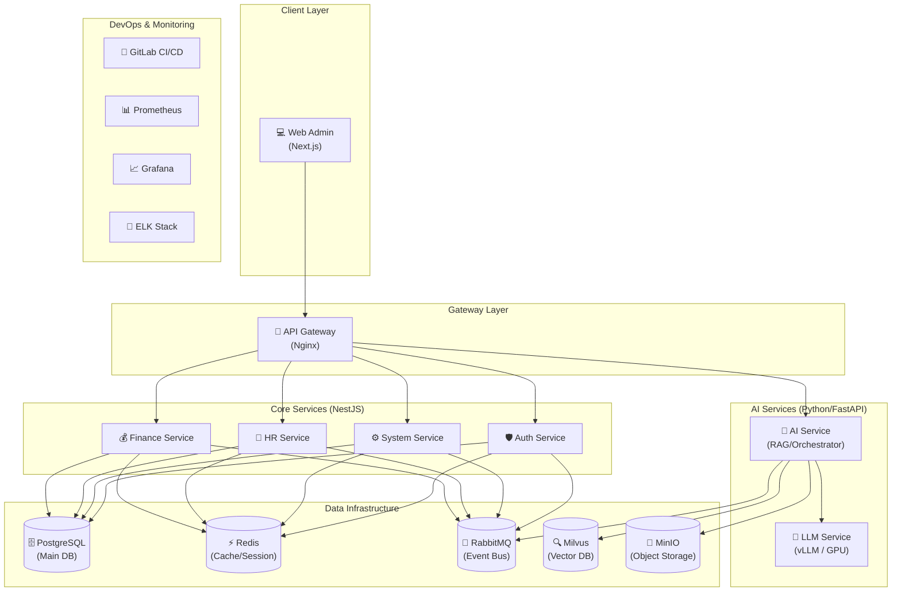

# ALL-ERP: 차세대 AI 기반 통합 ERP 시스템

**ALL-ERP**는 최신 클라우드 네이티브 기술과 인공지능(AI)을 결합한 차세대 전사적 자원 관리(ERP) 플랫폼입니다. 마이크로서비스 아키텍처(MSA)를 기반으로 유연성과 확장성을 보장하며, 자체 호스팅 LLM과 RAG 기술을 통해 업무 효율성을 극대화합니다.

## 🌟 핵심 가치

1.  **AI-First ERP**: 단순 자동화를 넘어, LLM 기반의 질의응답, 문서 분석(OCR), 이상 탐지 등 지능형 서비스를 핵심 기능으로 제공합니다.
2.  **Cloud-Native MSA**: 도메인별(인사, 재무, 시스템 등)로 독립적인 서비스가 구성되어 있어, 비즈니스 변화에 민첩하게 대응하고 무중단 확장이 가능합니다.
3.  **Data Privacy**: 민감한 기업 데이터를 보호하기 위해 외부 API 의존도를 최소화하고, 온프레미스 GPU 서버에서 자체 LLM(vLLM)을 운영합니다.
4.  **Developer Experience**: WSL2 Ubuntu 기반의 최적화된 로컬 개발 환경과 자동화된 DevOps 파이프라인(GitLab CI/CD)을 제공합니다.

---

## 🏗️ 시스템 아키텍처 (System Architecture)

ALL-ERP는 **API Gateway**를 단일 진입점으로 하여, 프론트엔드와 백엔드 마이크로서비스가 통신하는 구조입니다. AI 서비스는 별도의 고성능 GPU 인프라에서 구동되며, Vector DB와 연동되어 RAG 기능을 수행합니다.



---

## 🛠️ 기술 스택 (Technology Stack)

| 영역 | 기술 | 설명 |
|---|---|---|
| **Frontend** | **Next.js 15**, React, TypeScript | App Router 기반의 모놀리식 프론트엔드 (초기 생산성 최적화) |
| | Tailwind CSS, Shadcn/UI | 모던하고 일관된 UI 디자인 시스템 |
| | Zustand, TanStack Query | 효율적인 상태 관리 및 서버 데이터 동기화 |
| **Backend (Core)** | **NestJS**, TypeScript, Prisma | 안정적이고 구조화된 비즈니스 로직 처리 |
| **Backend (AI)** | **FastAPI**, Python, LangChain | AI 모델 서빙 및 RAG 파이프라인 구축에 최적화 |
| **AI / ML** | **vLLM**, Hugging Face | 오픈소스 LLM(Llama 3, Mistral) 자체 호스팅 및 고속 추론 |
| | **Milvus**, pymilvus | 대규모 벡터 검색 및 지식 베이스 관리 |
| **Infrastructure** | **Docker Compose** | 개발 및 운영 환경의 컨테이너 오케스트레이션 |
| | PostgreSQL, Redis | 신뢰성 높은 데이터 저장소 및 고성능 캐시 |
| | RabbitMQ | 서비스 간 비동기 통신을 위한 메시지 브로커 |
| **DevOps** | **GitLab**, GitLab CI/CD | 소스 코드 관리, CI/CD 자동화, 컨테이너 레지스트리 |
| | Prometheus, Grafana, ELK | 풀 스택 모니터링 및 로그 분석 |

---

## 🚀 시작하기 (Getting Started)

ALL-ERP는 **WSL2 Ubuntu** 환경에서 Docker Compose를 사용하여 실행하는 것을 권장합니다.

### 1. 필수 요구사항
- Windows 11 (WSL2 지원)
- Docker (WSL2 백엔드 사용)
- 최소 16GB RAM (AI 서비스 구동 시 32GB+ 및 NVIDIA GPU 권장)

### 2. 설치 및 실행
상세한 설치 가이드는 **[dev-environment/GETTING-STARTED.md](dev-environment/GETTING-STARTED.md)** 문서를 참고하세요.

```bash
# 1. 저장소 클론 (WSL 환경 권장)
git clone <repository-url>
cd all-erp

# 2. 개발 환경 설정 디렉토리로 이동
cd dev-environment

# 3. 인프라 서비스 시작 (DB, Redis, Milvus 등)
./start-dev.sh

# 4. 애플리케이션 실행 (루트 디렉토리에서)
pnpm install
pnpm nx serve auth-service
```

---

## 📚 문서 (Documentation)

프로젝트의 모든 문서는 `docs/` 디렉토리에서 관리됩니다.

- **[📂 docs/ai/](docs/ai/)**: AI 어시스턴트 및 개발자를 위한 컨텍스트 문서
    - `README.md`: 프로젝트 개요 및 AI 협업 가이드
    - `project_context.md`: 상세 기술 스택 및 아키텍처 설명
- **[📂 docs/infrastructure/](docs/infrastructure/)**: 인프라 정책 및 가이드
    - `service_catalog.md`: 마이크로서비스 목록 및 포트 정보
    - `environment_variables.md`: 환경 변수 관리 정책
- **[📂 docs/human/](docs/human/)**: 개발자 가이드
    - `api_design_guide.md`: API 설계 원칙
    - `db_design_guide.md`: 데이터베이스 설계 원칙
- **[📂 dev-environment/](dev-environment/)**: 로컬 개발 환경 설정
    - `GETTING-STARTED.md`: 개발 환경 구축 전체 가이드

---

## 🤝 기여 (Contribution)

1.  이 저장소를 포크(Fork)합니다.
2.  새로운 기능 브랜치를 생성합니다 (`git checkout -b feature/AmazingFeature`).
3.  변경 사항을 커밋합니다 (`git commit -m 'Add some AmazingFeature'`).
4.  브랜치에 푸시합니다 (`git push origin feature/AmazingFeature`).
5.  Pull Request를 생성합니다.

---

**ALL-ERP Team** | Powered by AI & Cloud Native Technology
