# ALL-ERP

> 🏢 **MSA 기반 멀티테넌트 ERP 시스템**  
> 도메인별 마이크로서비스 아키텍처로 구축된 차세대 전사적 자원 관리 시스템

## 📋 목차

- [프로젝트 개요](#-프로젝트-개요)
- [시스템 아키텍처](#-시스템-아키텍처)
- [기술 스택](#-기술-스택)
- [서비스 목록](#-서비스-목록)
- [빠른 시작](#-빠른-시작)
- [코드 품질 검사](#-코드-품질-검사)
- [배포 방법](#-배포-방법)
- [프로젝트 구조](#-프로젝트-구조)
- [문서](#-문서)

---

## 🎯 프로젝트 개요

ALL-ERP는 공공기관 및 중소기업을 위한 **마이크로서비스 아키텍처(MSA) 기반 멀티테넌트 ERP 시스템**입니다.

### 주요 특징

- **도메인별 마이크로서비스**: System, HR, Finance, General, AI 도메인 분리
- **멀티테넌시 지원**: SaaS 방식으로 여러 기관/조직 동시 운영
- **Nx 모노레포**: 효율적인 코드 공유 및 빌드 최적화
- **Docker Compose 우선 개발**: 로컬부터 운영까지 일관된 환경
- **AI 통합**: LLM 기반 업무 자동화 및 RAG 시스템

---

## 🏗️ 시스템 아키텍처

### 전체 시스템 구성도

```mermaid
flowchart TB
    subgraph Frontend["🖥️ Frontend Layer"]
        WebAdmin["Web Admin<br/>(Next.js)<br/>:4200"]
    end

    subgraph Gateway["🌐 API Gateway"]
        NGINX["Nginx<br/>Load Balancer"]
    end

    subgraph SystemDomain["🔐 System Domain"]
        AuthService["Auth Service<br/>:3001"]
        SystemService["System Service<br/>:3002"]
        TenantService["Tenant Service<br/>:3006"]
    end

    subgraph HRDomain["👥 HR Domain"]
        PersonnelService["Personnel Service<br/>:3011"]
        PayrollService["Payroll Service<br/>:3012"]
        AttendanceService["Attendance Service<br/>:3013"]
    end

    subgraph FinanceDomain["💰 Finance Domain"]
        BudgetService["Budget Service<br/>:3021"]
        AccountingService["Accounting Service<br/>:3022"]
        SettlementService["Settlement Service<br/>:3023"]
    end

    subgraph GeneralDomain["📦 General Domain"]
        AssetService["Asset Service<br/>:3031"]
        SupplyService["Supply Service<br/>:3032"]
        GeneralAffairsService["General Affairs Service<br/>:3033"]
    end

    subgraph AIDomain["🤖 AI Domain"]
        AIService["AI Service<br/>:3007"]
    end

    subgraph Infrastructure["🗄️ Infrastructure Layer"]
        PostgreSQL["PostgreSQL<br/>:5432"]
        Redis["Redis<br/>:6379"]
        RabbitMQ["RabbitMQ<br/>:5672"]
        Milvus["Milvus<br/>(Vector DB)<br/>:19530"]
        MinIO["MinIO<br/>(Object Storage)<br/>:9000"]
    end

    WebAdmin --> NGINX
    NGINX --> AuthService
    NGINX --> SystemService
    NGINX --> TenantService
    NGINX --> PersonnelService
    NGINX --> PayrollService
    NGINX --> AttendanceService
    NGINX --> BudgetService
    NGINX --> AccountingService
    NGINX --> SettlementService
    NGINX --> AssetService
    NGINX --> SupplyService
    NGINX --> GeneralAffairsService
    NGINX --> AIService

    AuthService --> PostgreSQL
    AuthService --> Redis
    SystemService --> PostgreSQL
    SystemService --> RabbitMQ
    TenantService --> PostgreSQL
    TenantService --> RabbitMQ

    PersonnelService --> PostgreSQL
    PayrollService --> PostgreSQL
    AttendanceService --> PostgreSQL

    BudgetService --> PostgreSQL
    AccountingService --> PostgreSQL
    SettlementService --> PostgreSQL

    AssetService --> PostgreSQL
    SupplyService --> PostgreSQL
    GeneralAffairsService --> PostgreSQL

    AIService --> Milvus
    AIService --> MinIO
    AIService --> PostgreSQL
```



### 도메인별 책임

| 도메인      | 책임                                | 서비스                                                 |
| ----------- | ----------------------------------- | ------------------------------------------------------ |
| **System**  | 인증/인가, 시스템 설정, 테넌트 관리 | auth-service, system-service, tenant-service           |
| **HR**      | 인사정보, 급여, 근태 관리           | personnel-service, payroll-service, attendance-service |
| **Finance** | 예산, 회계, 결산 관리               | budget-service, accounting-service, settlement-service |
| **General** | 자산, 물품, 총무 관리               | asset-service, supply-service, general-affairs-service |
| **AI**      | LLM 연동, RAG, 업무 자동화          | ai-service                                             |

---

## 🛠️ 기술 스택

### Backend

- **Framework**: NestJS 11.x (Node.js 22 LTS)
- **Language**: TypeScript 5.9
- **ORM**: Prisma 7.x
- **Validation**: class-validator, class-transformer
- **API Documentation**: Swagger (OpenAPI 3.0)

### Frontend

- **Framework**: Next.js 16.x (App Router)
- **UI Library**: React 19.x
- **Styling**: TailwindCSS 4.x
- **State Management**: Zustand, React Query
- **UI Components**: Radix UI, Lucide Icons

### Infrastructure

- **Database**: PostgreSQL 16
- **Cache**: Redis 7
- **Message Queue**: RabbitMQ 3.13
- **Vector DB**: Milvus 2.5 (AI/RAG)
- **Object Storage**: MinIO
- **Container**: Docker & Docker Compose
- **CI/CD**: GitLab CI/CD

### Development Tools

- **Monorepo**: Nx 22.x
- **Package Manager**: pnpm 9.x
- **Linting**: ESLint 9.x
- **Testing**: Jest 30.x, Playwright

---

## 📦 서비스 목록

### 백엔드 서비스

| 서비스                    | 포트 | 도메인  | 설명                      |
| ------------------------- | ---- | ------- | ------------------------- |
| `auth-service`            | 3001 | System  | 인증/인가 (JWT, Passport) |
| `system-service`          | 3002 | System  | 시스템 설정 및 공통 기능  |
| `tenant-service`          | 3006 | System  | 테넌트/구독 관리          |
| `personnel-service`       | 3011 | HR      | 인사정보 관리             |
| `payroll-service`         | 3012 | HR      | 급여 계산 및 관리         |
| `attendance-service`      | 3013 | HR      | 근태 관리                 |
| `budget-service`          | 3021 | Finance | 예산 관리                 |
| `accounting-service`      | 3022 | Finance | 재무회계 관리             |
| `settlement-service`      | 3023 | Finance | 회계결산 관리             |
| `asset-service`           | 3031 | General | 자산 관리                 |
| `supply-service`          | 3032 | General | 물품 관리                 |
| `general-affairs-service` | 3033 | General | 총무 관리                 |
| `ai-service`              | 3007 | AI      | LLM/RAG 연동              |

### 프론트엔드

| 서비스      | 포트 | 설명                     |
| ----------- | ---- | ------------------------ |
| `web-admin` | 4200 | 관리자 웹 콘솔 (Next.js) |

### 인프라 서비스

| 서비스     | 포트        | 접속 정보                 |
| ---------- | ----------- | ------------------------- |
| PostgreSQL | 5432        | postgres / devpassword123 |
| Redis      | 6379        | -                         |
| RabbitMQ   | 5672, 15672 | admin / admin             |
| Milvus     | 19530       | -                         |
| MinIO      | 9000, 9001  | minioadmin / minioadmin   |

---

## 🚀 빠른 시작

### 사전 요구사항

- **Docker Desktop**: 20.10 이상 (WSL2 백엔드 권장)
- **Node.js**: 22.x LTS
- **pnpm**: 9.x 이상

```bash
# Node.js 버전 확인
node -v  # v22.x.x

# pnpm 설치
# Corepack을 사용하여 pnpm 활성화
corepack enable
corepack prepare pnpm@latest --activate
pnpm -v  # 9.x.x
```

### 개발 환경 시작

#### 1. 저장소 클론 및 의존성 설치

```bash
git clone <repository-url>
cd all-erp
pnpm install
```

#### 2. 환경 변수 설정

```bash
cp .env.example .env
# 필요시 .env 파일 수정
```

#### 3. 인프라 서비스 시작 (Docker Compose)

```bash
cd dev-environment
./start-dev.sh

# 또는 수동 실행
docker compose -f docker-compose.infra.yml up -d
```

#### 4. Prisma 설정

```bash
cd ..
cd ..
pnpm add -D dotenv
pnpm prisma generate
pnpm prisma migrate dev
```

#### 5. 서비스 실행

```bash
# 특정 서비스 실행 (개발 모드)
pnpm nx serve auth-service

# Swagger 접속
# http://localhost:3001/api/docs
```

#### 6. 프론트엔드 실행

```bash
pnpm nx serve web-admin
# http://localhost:4200
```

### Docker Compose로 전체 서비스 실행 (선택)

```bash
cd dev-environment

# 특정 도메인 실행 (프로필 사용)
docker compose -f docker-compose.infra.yml -f docker-compose.dev.yml --profile system up -d
docker compose -f docker-compose.infra.yml -f docker-compose.dev.yml --profile hr up -d
docker compose -f docker-compose.infra.yml -f docker-compose.dev.yml --profile finance up -d

# 여러 도메인 동시 실행
docker compose -f docker-compose.infra.yml -f docker-compose.dev.yml --profile system --profile hr up -d
```

---

## ✅ 코드 품질 검사

### ESLint 설정

프로젝트는 **ESLint 9.x** 및 **Nx ESLint Plugin**을 사용합니다.

- **설정 파일**: `eslint.config.mjs`
- **주요 규칙**:
  - Nx 모듈 경계 강제 (`@nx/enforce-module-boundaries`)
  - TypeScript/JavaScript 표준 규칙

### Lint 실행

```bash
# 전체 프로젝트 Lint
pnpm nx run-many --target=lint --all

# 특정 서비스 Lint
pnpm nx lint auth-service

# 변경된 파일만 Lint (Nx Affected)
pnpm nx affected:lint --base=main --head=HEAD
```

### 테스트 실행

```bash
# 전체 테스트
pnpm nx run-many --target=test --all

# 특정 서비스 테스트
pnpm nx test auth-service

# 변경된 서비스만 테스트
pnpm nx affected:test --base=main --head=HEAD
```

### GitLab CI 파이프라인

프로젝트는 **GitLab CI/CD**를 통해 자동화된 품질 검사를 수행합니다.

**파이프라인 구성** (`.gitlab-ci.yml`):

1. **Setup Stage**: 의존성 설치

   ```bash
   pnpm install --frozen-lockfile
   ```

2. **Test Stage**: Lint 및 Unit Test (Merge Request 시)

   ```bash
   pnpm nx affected:lint --base=${NX_BASE} --head=${NX_HEAD}
   pnpm nx affected:test --base=${NX_BASE} --head=${NX_HEAD}
   ```

3. **Build Stage**: Docker 이미지 빌드 (main 브랜치)

   ```bash
   docker build -f Dockerfile.prod -t $IMAGE_TAG .
   ```

4. **Push Stage**: Container Registry에 이미지 푸시
   ```bash
   docker push $IMAGE_TAG
   docker push $LATEST_TAG
   ```

**Nx Affected 전략**: Merge Request에서 변경된 서비스만 선택적으로 Lint/Test하여 CI 시간을 최적화합니다.

---

## 🚢 배포 방법

### GitLab CI/CD 파이프라인

#### 파이프라인 트리거

- **Merge Request**: Setup → Test (Lint/Test)
- **Main 브랜치 Push**: Setup → Test → Build → Push

#### 환경별 배포 전략

##### 개발 환경 (Development)

```bash
cd dev-environment
docker compose -f docker-compose.dev.yml up -d
```

- **특징**: 볼륨 마운트, Hot Reload 지원
- **용도**: 로컬 개발

##### 운영 환경 (Production)

```bash
cd dev-environment
docker compose -f docker-compose.prod.yml up -d
```

- **특징**: 빌드된 이미지 사용, 운영 최적화
- **이미지 출처**: GitLab Container Registry

#### Docker 이미지 빌드

**개발용 이미지** (`Dockerfile.dev`):

```bash
docker build -f Dockerfile.dev -t all-erp-dev .
```

**운영용 이미지** (`Dockerfile.prod`):

```bash
docker build -f Dockerfile.prod -t all-erp-prod .
```

운영 이미지는 Multi-stage 빌드를 사용하여 최적화됩니다:

1. **Build Stage**: 의존성 설치 및 빌드
2. **Production Stage**: 최소한의 런타임 환경

#### Container Registry

GitLab CI/CD는 빌드된 이미지를 자동으로 Container Registry에 푸시합니다:

```bash
$CI_REGISTRY_IMAGE:$CI_COMMIT_SHA  # Git SHA 태그
$CI_REGISTRY_IMAGE:latest          # latest 태그
```

---

## 📂 프로젝트 구조

```
all-erp/
├── apps/                      # 애플리케이션 서비스
│   ├── system/                # System 도메인 (auth, system, tenant)
│   ├── hr/                    # HR 도메인 (personnel, payroll, attendance)
│   ├── finance/               # Finance 도메인 (budget, accounting, settlement)
│   ├── general/               # General 도메인 (asset, supply, general-affairs)
│   ├── ai/                    # AI 도메인 (ai-service)
│   └── frontend/              # Frontend (web-admin)
├── libs/                      # 공유 라이브러리
│   └── shared/
│       ├── config/            # 설정 유틸리티
│       ├── domain/            # 도메인 모델
│       ├── infra/             # 인프라 계층 (DB, Redis, RabbitMQ)
│       ├── util/              # 공통 유틸리티
│       └── util-tenancy/      # 테넌시 유틸리티
├── dev-environment/           # Docker Compose 개발 환경
│   ├── docker-compose.infra.yml
│   ├── docker-compose.dev.yml
│   ├── docker-compose.prod.yml
│   └── README.md
├── docs/                      # 문서
│   ├── ai/                    # AI 개발 가이드
│   ├── architecture/          # 아키텍처 문서
│   ├── guides/                # 개발 가이드
│   ├── human/                 # 개발자 문서
│   └── tasks/                 # PRD 및 작업 문서
├── .gitlab-ci.yml             # GitLab CI/CD 파이프라인
├── Dockerfile.dev             # 개발용 Dockerfile
├── Dockerfile.prod            # 운영용 Dockerfile
├── nx.json                    # Nx 설정
├── package.json               # 프로젝트 의존성
└── README.md                  # 본 문서
```

### Nx 모노레포 구조

- **apps/**: 각 마이크로서비스 및 프론트엔드 애플리케이션
- **libs/shared/**: 서비스 간 공유 코드
  - **config**: 환경 설정, 데이터베이스 설정
  - **domain**: 공통 도메인 모델 (DTO, Entity)
  - **infra**: 인프라 추상화 (Prisma, Redis, RabbitMQ)
  - **util**: 공통 유틸리티 함수
  - **util-tenancy**: 멀티테넌시 관련 유틸리티

### 코드 공유 전략

Nx의 **enforce-module-boundaries** 규칙을 사용하여 의존성을 관리합니다:

- 각 서비스는 `libs/shared/*`의 공유 라이브러리만 사용 가능
- 서비스 간 직접 의존성 금지 (이벤트 기반 통신 권장)

---

## 📚 문서

### 개발 가이드

- **[개발 환경 가이드](./dev-environment/README.md)**: Docker Compose 상세 설명
- **[프로젝트 시작 가이드](./dev-environment/GETTING-STARTED.md)**: 전체 환경 구축 절차
- **[Docker Compose 워크플로우](./docs/guides/docker-compose-workflow.md)**: 개발 워크플로우 가이드

### 설계 문서

- **[API 설계 가이드](./docs/human/api_design_guide.md)**: RESTful API 설계 원칙
- **[DB 설계 가이드](./docs/human/db_design_guide.md)**: 데이터베이스 설계 규칙
- **[멀티테넌시 아키텍처](./docs/architecture/multitenancy.md)**: 테넌트 격리 전략

### AI 개발 가이드

- **[AI 개발 가이드](./docs/ai/README.md)**: AI 에이전트 협업 가이드
- **[Vibe Coding](./docs/ai/vibe_coding.md)**: AI 페르소나 및 코딩 스타일
- **[프로젝트 컨텍스트](./docs/ai/project_context.md)**: 아키텍처 및 기술 스택
- **[작업 워크플로우](./docs/ai/task_workflow.md)**: PRD 기반 작업 방법

### 프로젝트 계획

- **[프로젝트 로드맵](./docs/project_roadmap.md)**: MSA ERP 구축 전체 계획

---

## 🤝 기여 가이드

### 개발 워크플로우

1. **Feature 브랜치 생성**

   ```bash
   git checkout -b feature/your-feature-name
   ```

2. **코드 작성 및 테스트**

   ```bash
   pnpm nx lint your-service
   pnpm nx test your-service
   ```

3. **커밋 및 Push**

   ```bash
   git add .
   git commit -m "feat: your feature description"
   git push origin feature/your-feature-name
   ```

4. **Merge Request 생성**
   - GitLab에서 MR 생성
   - CI 파이프라인 통과 확인
   - 코드 리뷰 진행

### 커밋 메시지 규칙

- `feat`: 새로운 기능
- `fix`: 버그 수정
- `docs`: 문서 변경
- `refactor`: 리팩토링
- `test`: 테스트 추가/수정
- `chore`: 빌드 설정 등

---

## 📝 라이선스

MIT License

---

## 🙋 문의

프로젝트 관련 문의사항은 이슈 트래커를 이용해 주세요.
