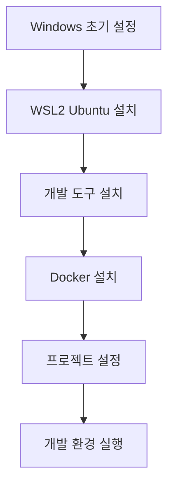

# ALL-ERP 개발 환경 구축 가이드

> 🎯 **목표**: Windows PC에서 WSL2 Ubuntu를 설치하고 Docker Compose 기반 개발 환경을 구축합니다.

## 📋 전체 프로세스



---

## 🚀 단계별 가이드

### 1단계: antigravity 및 확장 프로그램 설치

1.  **antigravity 설치**: [https://antigravity.google/](https://antigravity.google/)
2.  **WSL 연결**: VS Code 실행 후 `F1` > `WSL: Connect to WSL` 선택

#### 🧩 필수 및 권장 확장 프로그램 (Extensions)

VS Code 마켓플레이스(`Ctrl+Shift+X`)에서 **ID**로 검색하여 설치하세요.

| 카테고리     | 확장 프로그램 이름            | ID (검색용)                         | 용도                        |
| ------------ | ----------------------------- | ----------------------------------- | --------------------------- |
| **필수**     | **WSL**                       | `ms-vscode-remote.remote-wsl`       | Windows에서 WSL 환경 개발   |
| **필수**     | **Korean Language Pack**      | `MS-CEINTL.vscode-language-pack-ko` | VS Code 한국어 메뉴         |
| **필수**     | **Docker**                    | `ms-azuretools.vscode-docker`       | Docker 컨테이너 관리        |
| **Frontend** | **ESLint**                    | `dbaeumer.vscode-eslint`            | 자바스크립트 문법 검사      |
|              | **Prettier - Code formatter** | `esbenp.prettier-vscode`            | 코드 포맷팅 자동화          |
|              | **Tailwind CSS IntelliSense** | `bradlc.vscode-tailwindcss`         | Tailwind CSS 자동 완성      |
| **Backend**  | **Prisma**                    | `Prisma.prisma`                     | Prisma 스키마 하이라이팅    |
|              | **Nx Console**                | `nrwl.angular-console`              | Nx 모노레포 관리 도구       |
| **AI/Data**  | **Python**                    | `ms-python.python`                  | Python 개발 지원            |
|              | **YAML**                      | `redhat.vscode-yaml`                | YAML 파일 검증 및 자동 완성 |
| **Docs**     | **Markdown All in One**       | `yzhang.markdown-all-in-one`        | 마크다운 작성 보조          |


---

### 2단계: WSL2 Ubuntu 24.04 설치

**재부팅 후 PowerShell**:

```powershell
# Ubuntu 24.04 설치
wsl --install -d Ubuntu-24.04

# 기본 배포판 설정
wsl --set-default Ubuntu-24.04

# Ubuntu 실행
wsl
```

**Ubuntu 첫 실행 시** 사용자명/비밀번호 설정

---

### 3단계: 개발 도구 설치 (WSL Ubuntu)

```bash
# 시스템 업데이트
sudo apt update && sudo apt upgrade -y

# 1. sudo 비밀번호 묻지 않기 설정
echo "$USER ALL=(ALL) NOPASSWD:ALL" | sudo tee /etc/sudoers.d/$USER

# 2. 언어 및 시간 설정 (한국어/서울)
sudo apt install -y language-pack-ko
sudo locale-gen ko_KR.UTF-8
sudo update-locale LANG=ko_KR.UTF-8 LC_MESSAGES=ko_KR.UTF-8
sudo timedatectl set-timezone Asia/Seoul

# 필수 패키지
sudo apt install -y build-essential curl wget git ca-certificates gnupg lsb-release vim nano

# Node.js 22 LTS
curl -fsSL https://deb.nodesource.com/setup_22.x | sudo -E bash -
sudo apt install -y nodejs

sudo npm install -g npm
# pnpm
sudo npm install -g pnpm

# 확인
node -v  # v22.x.x
pnpm -v

```

---

### 4단계: Docker 설치 (WSL 네이티브)

> ⚠️ **Docker Desktop은 설치하지 마세요**

```bash
# Docker GPG 키 추가
sudo install -m 0755 -d /etc/apt/keyrings
curl -fsSL https://download.docker.com/linux/ubuntu/gpg | sudo gpg --dearmor -o /etc/apt/keyrings/docker.gpg
sudo chmod a+r /etc/apt/keyrings/docker.gpg

# Repository 추가
echo \
  "deb [arch=$(dpkg --print-architecture) signed-by=/etc/apt/keyrings/docker.gpg] https://download.docker.com/linux/ubuntu \
  $(lsb_release -cs) stable" | sudo tee /etc/apt/sources.list.d/docker.list > /dev/null

# Docker 설치
sudo apt update
sudo apt install -y docker-ce docker-ce-cli containerd.io docker-buildx-plugin docker-compose-plugin

# 사용자 권한 추가
sudo usermod -aG docker $USER
newgrp docker

# WSL 재시작
exit
```

**Windows PowerShell**:
```powershell
wsl --shutdown
wsl
```

**WSL Ubuntu**:
```bash
# Docker 서비스 시작 및 확인
sudo systemctl start docker
sudo systemctl enable docker
docker --version
docker compose version
```

---

### 5단계: 작업 디렉토리 설정

```bash
# /data 디렉토리 생성
sudo mkdir -p /data
sudo chown -R $USER:$USER /data

# 프로젝트 디렉토리
mkdir -p /data/allerp
cd /data/allerp

# Git 설정
git config --global user.name "s99606931"
git config --global user.email "99606931@gmail.com"
git config --global core.autocrlf input
git config --global core.eol lf
```

---

### 6단계: 프로젝트 복사

**Git 클론**:
```bash
git clone https://github.com/s99606931/all-erp.git /data/allerp
cd /data/allerp
```

---

### 7단계: 개발 환경 실행

```bash
cd /data/all-erp/dev-environment

# 환경 변수 설정
cp .env.example .env
nano .env  # 필요 시 수정

# 실행 권한 부여
chmod +x start-dev.sh stop-dev.sh

# 인프라 서비스 시작
./start-dev.sh

# (선택) 권한 문제로 서비스가 시작되지 않는 경우 실행
sudo chown -R 1000:1000 volumes/elasticsearch volumes/logstash volumes/kibana
sudo chown -R 472:472 volumes/grafana
sudo chown -R 65534:65534 volumes/prometheus
```

---

### 8단계: 애플리케이션 개발 시작

```bash
cd /data/all-erp

# 의존성 설치
pnpm install

# Prisma 설정
pnpm prisma generate
pnpm prisma migrate dev

# 서비스 실행
pnpm nx serve auth-service
```

---

## 🪟 Windows에서 접근하기

### 방법 1: 심볼릭 링크 (권장)

**PowerShell (관리자 권한)**:
```powershell
New-Item -ItemType SymbolicLink -Path "D:\wsl-all-erp" -Target "\\wsl$\Ubuntu-24.04\data\all-erp"
```

### 방법 2: 직접 UNC 경로

Windows 탐색기 주소창:
```
\\wsl$\Ubuntu-24.04\data\all-erp
```

---

## 📌 일일 워크플로우

### 시작 시

```bash
wsl                                   # WSL 실행
cd /data/all-erp/dev-environment     # 디렉토리 이동
./start-dev.sh                        # 인프라 시작
cd .. && pnpm nx serve auth-service   # 개발 시작
```

### 종료 시

```bash
cd /data/all-erp/dev-environment
./stop-dev.sh
```

---

## 🔧 서비스 접속 정보

### 기본 인프라

| 서비스 | 주소 | 계정 |
|---------|------|------|
| PostgreSQL | `localhost:5432` | postgres/devpassword123 |
| Redis | `localhost:6379` | - |
| RabbitMQ | `http://localhost:15672` | admin/admin |
| MinIO | `http://localhost:9001` | minioadmin/minioadmin |

### DevOps 도구 (선택적)

```bash
docker compose --profile devops up -d
```

| 서비스 | 주소 | 계정 |
|---------|------|------|
| GitLab | `http://localhost:8980` | root/changeme123! |
| Prometheus | `http://localhost:9090` | - |
| Grafana | `http://localhost:3000` | admin/admin |
| Kibana | `http://localhost:5601` | - |

---

## 🐛 트러블슈팅

### Docker 시작 안 됨

```bash
sudo systemctl status docker
sudo systemctl start docker
```

### 권한 오류

```bash
sudo usermod -aG docker $USER
newgrp docker
```

### WSL 메모리 부족

Windows에서 `C:\Users\<Username>\.wslconfig`:
```ini
[wsl2]
memory=8GB
processors=4
```

적용:
```powershell
wsl --shutdown
wsl
```

### Milvus 컨테이너 재시작 문제
`docker-compose.yml`에 실행 명령어가 누락된 경우 발생합니다.
```yaml
milvus:
  command: milvus run standalone
```

### Nginx Gateway 시작 실패
연결된 백엔드 서비스(`erp-auth` 등)가 실행 중이지 않으면 Nginx가 시작되지 않을 수 있습니다.
이를 방지하려면 `nginx.conf`에서 `upstream` 블록 대신 변수와 `resolver`를 사용해야 합니다.
```nginx
resolver 127.0.0.11 valid=30s;
set $upstream_endpoint http://erp-auth:3001;
proxy_pass $upstream_endpoint;
```

---

## 📚 추가 문서

- [WSL2 상세 설정](./WSL2-UBUNTU-SETUP.md)
- [DevOps 도구 가이드](./DEVOPS-SETUP.md)
- [폴더 구조](./FOLDER-STRUCTURE.md)
