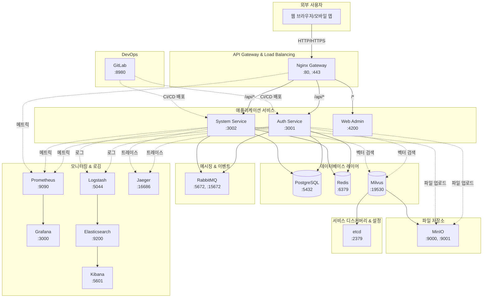
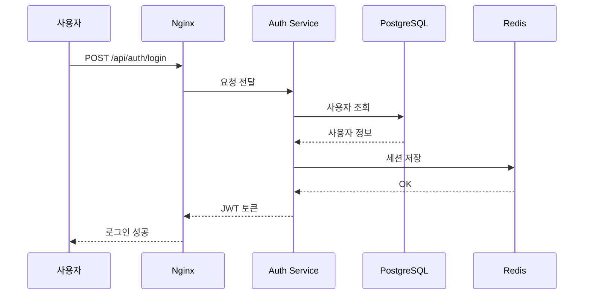
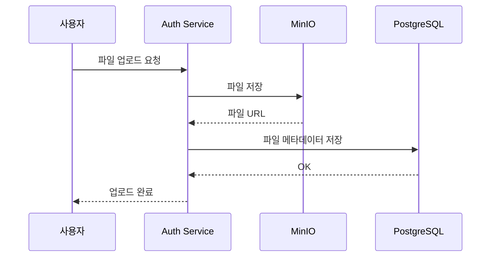
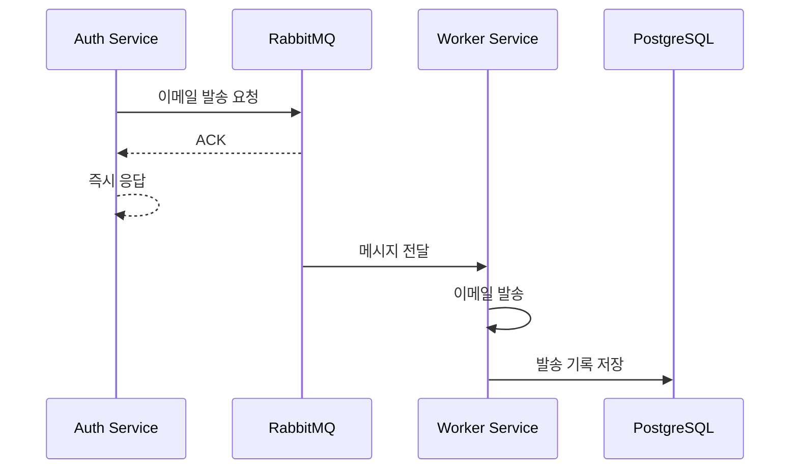

# ALL-ERP 시스템 아키텍처

## 전체 시스템 구성도

## 서비스 역할별 분류

### 🎯 API Gateway
- **Nginx**: 외부 요청을 내부 서비스로 라우팅

### 💼 애플리케이션 서비스
- **Auth Service**: 인증/인가 처리
- **System Service**: 시스템 관리
- **Web Admin**: 관리자 웹 인터페이스

### 💾 데이터 저장소
- **PostgreSQL**: 메인 관계형 데이터베이스
- **Redis**: 캐시 및 세션 저장소
- **Milvus**: 벡터 데이터베이스 (AI/ML)

### 📨 메시징
- **RabbitMQ**: 서비스 간 비동기 메시지 전달

### 📁 파일 저장소
- **MinIO**: S3 호환 객체 스토리지

### ⚙️ 인프라 지원
- **etcd**: 서비스 디스커버리 및 설정 관리 (Milvus 의존성)

### 📊 모니터링 & 로깅
- **Prometheus**: 메트릭 수집
- **Grafana**: 메트릭 시각화
- **Elasticsearch**: 로그 저장 및 검색
- **Kibana**: 로그 시각화
- **Logstash**: 로그 수집 파이프라인
- **Jaeger**: 분산 트레이싱

### 🔧 DevOps
- **GitLab**: 소스 코드 관리 및 CI/CD

## 데이터 흐름 예시

### 1. 사용자 로그인 플로우

### 2. 파일 업로드 플로우

### 3. 비동기 작업 플로우

## 위치별 파일 경로
- 각 서비스별 상세 문서: `dev-environment/docs/<서비스명>/README.md`
- Docker 설정: `dev-environment/docker-compose.yml`
- 서비스 시작: `./dev-environment/start-dev.sh`
