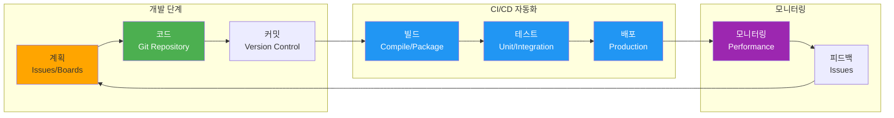
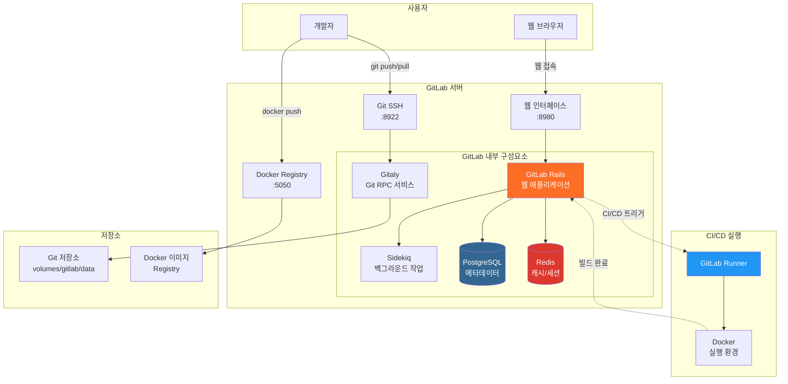
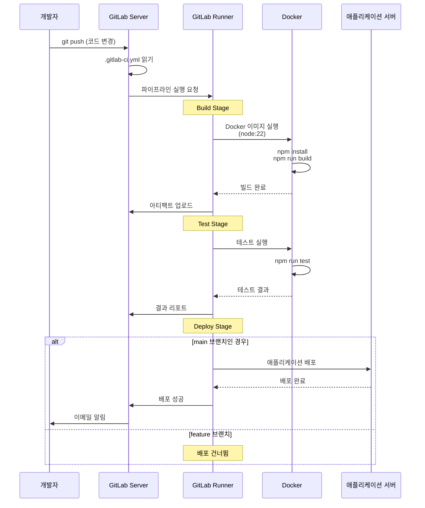
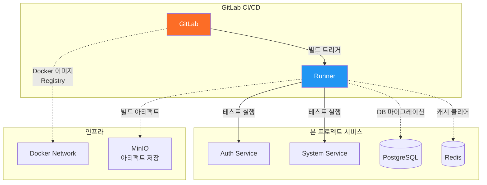

# GitLab (ops-gitlab)

## 1. 서비스 역할 (Service Role)
**GitLab**은 **소스 코드 저장소 및 CI/CD 파이프라인** 도구입니다.
- 프로젝트 소스 코드 관리 (Git)
- 자동화된 빌드, 테스트, 배포 (CI/CD)
- 이슈 트래킹 및 프로젝트 관리

### GitLab 작동 원리

GitLab은 **DevOps 라이프사이클 전체**를 지원하는 올인원 플랫폼입니다.



### GitLab 아키텍처



### CI/CD 파이프라인 작동 원리



### 주요 구성 요소 설명

#### 1. GitLab Rails (웹 애플리케이션)
- Ruby on Rails 기반 웹 인터페이스
- 사용자 인증, 프로젝트 관리, 이슈 트래킹 등 처리
- REST API 제공

#### 2. Gitaly (Git RPC 서비스)
- Git 저장소에 대한 고성능 접근 제공
- Git 명령어 처리를 최적화

#### 3. Sidekiq (백그라운드 작업)
- 이메일 발송, 통계 계산 등 비동기 작업 처리
- Redis를 작업 큐로 사용

#### 4. GitLab Runner
- CI/CD 파이프라인을 실제로 실행하는 에이전트
- Docker, Shell, Kubernetes 등 다양한 실행 환경 지원

#### 5. Docker Registry
- 빌드된 Docker 이미지를 저장
- 프로젝트별로 격리된 이미지 저장소 제공

### GitLab과 다른 서비스의 연동



### 데이터 저장 구조

GitLab 데이터는 `dev-environment/volumes/gitlab`에 저장됩니다:

```
volumes/gitlab/
├── config/          # 설정 파일
│   └── gitlab.rb   # GitLab 메인 설정
├── logs/           # 로그 파일
│   ├── gitlab-rails/
│   ├── nginx/
│   └── sidekiq/
└── data/           # 실제 데이터
    ├── git-data/   # Git 저장소
    ├── registry/   # Docker 이미지
    └── backups/    # 백업 파일
```


## 2. 정상 작동 확인 (Verification)

### 웹 접속
- 브라우저에서 접속: [http://localhost:8980](http://localhost:8980)
- **초기 계정**: `root`
- **초기 비밀번호**: `changeme123!`

### 상태 확인
```bash
docker ps | grep ops-gitlab
# (healthy) 상태가 될 때까지 시간이 꽤 걸립니다 (3~5분)
```

## 3. 사용 가이드 (Usage Guide)

### 접속 정보
- **Web Port**: `8980`
- **SSH Port**: `8922`
- **Registry Port**: `5050` (Docker 이미지 저장소)

### 초기 설정

#### 1. 로그인 및 비밀번호 변경
1. http://localhost:8980 접속
2. Username: `root`, Password: `changeme123!`
3. 로그인 후 프로필 설정에서 비밀번호 변경

#### 2. 프로젝트 생성
1. 상단 메뉴에서 **New project** 클릭
2. **Create blank project** 선택
3. 프로젝트 이름 입력 (예: `my-application`)
4. **Visibility Level**: Private 선택
5. **Create project** 클릭

### Git 연동

#### SSH 키 등록
```bash
# SSH 키 생성 (이미 있다면 생략)
ssh-keygen -t ed25519 -C "your_email@example.com"

# 공개 키 확인
cat ~/.ssh/id_ed25519.pub
```

GitLab에서:
1. 프로필 아이콘 > **Preferences** > **SSH Keys**
2. 공개 키 붙여넣기
3. **Add key** 클릭

#### Git 저장소 클론
```bash
# SSH 방식 (권장)
git clone ssh://git@localhost:8922/root/my-application.git

# HTTPS 방식
git clone http://localhost:8980/root/my-application.git
```

### GitLab CI/CD 사용

#### .gitlab-ci.yml 예시
```yaml
# .gitlab-ci.yml
stages:
  - build
  - test
  - deploy

variables:
  NODE_VERSION: "22"

build:
  stage: build
  image: node:${NODE_VERSION}
  script:
    - npm install
    - npm run build
  artifacts:
    paths:
      - dist/
    expire_in: 1 hour

test:
  stage: test
  image: node:${NODE_VERSION}
  script:
    - npm install
    - npm run test
  coverage: '/All files[^|]*\|[^|]*\s+([\d\.]+)/'

deploy:
  stage: deploy
  script:
    - echo "Deploying application..."
    - ./deploy.sh
  only:
    - main
```

#### GitLab Runner 설정
```bash
# GitLab Runner 컨테이너 실행
docker run -d --name gitlab-runner --restart always \
  -v /var/run/docker.sock:/var/run/docker.sock \
  -v /srv/gitlab-runner/config:/etc/gitlab-runner \
  gitlab/gitlab-runner:latest

# Runner 등록
docker exec -it gitlab-runner gitlab-runner register \
  --non-interactive \
  --url "http://ops-gitlab:8980/" \
  --registration-token "YOUR_TOKEN" \
  --executor "docker" \
  --docker-image "alpine:latest" \
  --description "docker-runner"
```

### Docker Registry 사용

#### 이미지 푸시
```bash
# GitLab Registry 로그인
docker login localhost:5050 -u root -p changeme123!

# 이미지 태그
docker tag my-app:latest localhost:5050/root/my-application:latest

# 이미지 푸시
docker push localhost:5050/root/my-application:latest
```

### 이슈 관리

#### 이슈 생성
1. 프로젝트 페이지 > **Issues** > **New issue**
2. 제목과 설명 입력
3. 담당자(Assignee), 라벨(Labels) 설정
4. **Create issue** 클릭

#### 이슈를 코드 커밋과 연결
```bash
git commit -m "Fix login bug, closes #42"
# #42 이슈가 자동으로 닫힘
```

### 문제 해결

#### 로그인할 수 없을 때
```bash
# GitLab이 완전히 시작될 때까지 기다리기
docker logs ops-gitlab --tail 100

# 비밀번호 초기화 (컨테이너 내부)
docker exec -it ops-gitlab gitlab-rake "gitlab:password:reset[root]"
```

#### 성능이 느릴 때
GitLab은 리소스를 많이 사용합니다. `docker-compose.yml`에서 메모리 제한을 조정할 수 있습니다.
