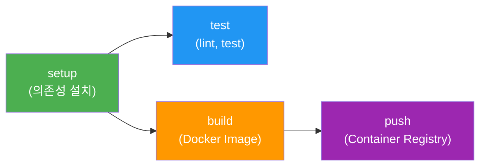

# GitLab 사용자 가이드

## 개요
이 문서는 Docker Compose DevOps 환경에서 GitLab CE를 설치하고, CI/CD 파이프라인을 구축하는 전체 과정을 안내합니다.

## 사전 요구사항
- Docker 및 Docker Compose 설치
- `/data/all-erp` 프로젝트 디렉토리

---

## 1. GitLab 및 DevOps 환경 실행

### 1.1 DevOps 환경 시작
```bash
cd /data/all-erp/dev-environment

# GitLab 및 DevOps 도구 실행 (인프라 포함)
docker compose -f docker-compose.infra.yml -f docker-compose.devops.yml up -d

# GitLab 준비 확인 (1-2분 소요, healthy 상태 확인)
docker logs -f all-erp-gitlab
```

**실행되는 서비스**:
- GitLab CE (Git 저장소 + CI/CD)
- Container Registry (Docker 이미지)
- Prometheus + Grafana (모니터링)
- ELK Stack (로깅)
- Jaeger (분산 추적)

### 1.2 GitLab 웹 UI 접속
- **URL**: http://localhost:8980
- **초기 계정**: `root`
- **초기 비밀번호**: `changeme123!`

**첫 로그인**:
1. 브라우저에서 `http://localhost:8980` 접속
2. Username: `root`, Password: `changeme123!`
3. **Sign in** 클릭
4. (권장) 첫 로그인 후 비밀번호 변경

---

## 2. GitLab Runner 설치 및 등록

### 2.1 GitLab Runner 컨테이너 실행
```bash
cd /data/all-erp/dev-environment

# GitLab Runner 자동 설치 스크립트
./scripts/gitlab-runner.sh
```

위 스크립트는 다음을 수행합니다:
- `all-erp-network`에 연결된 GitLab Runner 컨테이너 시작
- Docker 소켓 마운트로 DinD(Docker-in-Docker) 활성화
- Runner 등록 명령어 안내

### 2.2 Registration Token 확인
1. GitLab 웹 UI에서 **Admin Area** (상단 좌측 렌치 아이콘) 클릭
2. **CI/CD** > **Runners** 메뉴 이동
3. **Register an instance runner** 섹션에서 **registration token** 복사

### 2.3 Runner 등록 명령어 실행
```bash
# <YOUR_TOKEN>을 위에서 복사한 토큰으로 교체
docker exec -it gitlab-runner gitlab-runner register \
  --non-interactive \
  --url http://all-erp-gitlab:8980 \
  --registration-token <YOUR_TOKEN> \
  --executor docker \
  --description 'ALL-ERP Docker Runner' \
  --docker-image 'node:22-alpine' \
  --docker-volumes /var/run/docker.sock:/var/run/docker.sock \
  --docker-network-mode all-erp-network
```

### 2.4 Runner 등록 확인
```bash
# Runner 목록 확인
docker exec gitlab-runner gitlab-runner list

# GitLab 웹 UI에서도 확인 가능
# Admin Area > CI/CD > Runners에서 등록된 Runner 확인
```

---

## 3. 프로젝트 생성 및 코드 Push

### 3.1 GitLab에서 프로젝트 생성
1. **Projects** > **Create new project** 클릭
2. **Create blank project** 선택
3. 프로젝트 정보 입력:
   - **Project name**: `all-erp`
   - **Visibility Level**: `Private`
4. **Create project** 클릭

### 3.2 로컬 Git Remote 설정
```bash
cd /data/all-erp

# GitLab 원격 저장소 추가
git remote add gitlab http://localhost:8980/root/all-erp.git

# 또는 기존 origin을 변경
git remote set-url origin http://localhost:8980/root/all-erp.git
```

### 3.3 코드 Push
```bash
# main 브랜치로 push
git push -u gitlab main

# 로그인 정보 입력 (필요시)
# Username: root
# Password: changeme123!
```

---

## 4. CI/CD 파이프라인 이해

### 4.1 파이프라인 구조
프로젝트에 포함된 `.gitlab-ci.yml`은 다음과 같은 4단계 파이프라인을 정의합니다:



**단계별 설명**:
1. **setup**: pnpm으로 의존성 설치, node_modules 캐싱
2. **test**: Nx Affected로 변경된 프로젝트만 lint 및 test (MR 시에만 실행)
3. **build**: Dockerfile.prod로 Docker 이미지 빌드 (main 브랜치만)
4. **push**: Container Registry에 이미지 푸시 (main 브랜치만)

### 4.2 파이프라인 확인
1. GitLab 웹 UI에서 프로젝트 > **Build** > **Pipelines** 클릭
2. 실행 중인 파이프라인 확인
3. 각 Job 클릭하여 로그 확인

### 4.3 주요 환경 변수
`.gitlab-ci.yml`에서 사용되는 환경 변수:

| 변수 | 설명 | 기본값 |
|------|------|--------|
| `NX_BASE` | Nx Affected 기준 커밋 | `origin/main` |
| `NX_HEAD` | Nx Affected 대상 커밋 | `HEAD` |
| `DATABASE_URL` | PostgreSQL 연결 URL | `postgresql://...@all-erp-postgres:5432/erp_dev` |
| `REDIS_URL` | Redis 연결 URL | `redis://all-erp-redis:6379` |
| `CI_REGISTRY_IMAGE` | Container Registry 이미지 경로 | GitLab 자동 설정 |

---

## 5. Merge Request 기반 개발 워크플로우

### 5.1 Feature 브랜치 개발
```bash
# 새 브랜치 생성
git checkout -b feature/test-pipeline

# 코드 수정
echo "# Test" >> README.md
git add README.md
git commit -m "Test CI/CD pipeline"

# GitLab에 Push
git push -u gitlab feature/test-pipeline
```

### 5.2 Merge Request 생성
1. GitLab 웹 UI에서 **Merge Requests** > **New merge request** 클릭
2. Source branch: `feature/test-pipeline`
3. Target branch: `main`
4. **Create merge request** 클릭

### 5.3 자동 테스트 실행 확인
- MR 생성 시 자동으로 `lint`와 `test` Job 실행
- Nx Affected로 변경된 프로젝트만 테스트
- 테스트 통과 후 병합 가능

---

## 6. Container Registry 사용

### 6.1 Registry 로그인
```bash
# GitLab Container Registry에 로그인
docker login localhost:5050
# Username: root
# Password: changeme123!
```

### 6.2 Push된 이미지 확인
1. GitLab 웹 UI에서 프로젝트 > **Packages & Registries** > **Container Registry** 클릭
2. Push된 이미지 목록 확인 (main 브랜치 병합 후)

### 6.3 로컬에서 이미지 Pull
```bash
# 최신 이미지 Pull
docker pull localhost:5050/root/all-erp:latest

# 특정 커밋 이미지 Pull
docker pull localhost:5050/root/all-erp:<commit-sha>
```

---

## 7. 트러블슈팅

### 7.1 GitLab이 응답하지 않을 때
```bash
# GitLab 컨테이너 상태 확인
docker ps -a | grep gitlab

# GitLab 서비스 상태 확인
docker exec all-erp-gitlab gitlab-ctl status

# GitLab 로그 확인
docker logs all-erp-gitlab
```

### 7.2 Runner가 작동하지 않을 때
```bash
# Runner 상태 확인
docker exec gitlab-runner gitlab-runner list

# Runner 로그 확인
docker logs -f gitlab-runner

# Runner 재시작
docker restart gitlab-runner

# 네트워크 확인
docker network inspect all-erp-network
```

### 7.3 파이프라인이 실행되지 않을 때
**원인 1: Runner가 등록되지 않음**
- Admin Area > CI/CD > Runners에서 Runner 상태 확인
- 녹색 원이 표시되어야 정상

**원인 2: `.gitlab-ci.yml` 문법 오류**
- GitLab 웹 UI에서 CI/CD > Editor로 이동하여 Validate 클릭

**원인 3: Docker 소켓 권한 문제**
```bash
# Runner가 Docker 소켓에 접근할 수 있는지 확인
docker exec gitlab-runner ls -la /var/run/docker.sock
```

### 7.4 Docker Build 실패
```bash
# GitLab Runner 로그에서 상세 오류 확인
docker logs gitlab-runner

# 네트워크 연결 확인
docker network inspect all-erp-network

# 수동으로 빌드 테스트
docker build -f Dockerfile.prod -t test-image .
```

### 7.5 Nx Affected 오류
- `NX_BASE` 변수가 제대로 설정되지 않으면 모든 프로젝트를 빌드시도할 수 있습니다.
- `.gitlab-ci.yml`에서 `--base=origin/main` 기본값 사용

### 7.6 Container Registry Push 실패
```bash
# Docker 로그인 상태 확인
cat ~/.docker/config.json

# Registry 포트 바인딩 확인
docker ps | grep 5050

# Registry 로그 확인
docker logs all-erp-gitlab | grep registry
```

---

## 8. 기본 예제: 간단한 테스트 프로젝트

GitLab CI/CD를 처음 사용한다면 간단한 테스트 프로젝트로 시작하세요:

### 8.1 테스트 프로젝트 생성
```bash
# 새 프로젝트 디렉토리 생성
mkdir test-project
cd test-project
git init

# README 파일 생성
echo "# Test Project" > README.md

# 간단한 .gitlab-ci.yml 작성
cat > .gitlab-ci.yml << 'EOF'
stages:
  - test
  - build

hello-job:
  stage: test
  script:
    - echo "Hello, GitLab CI/CD!"
    - node --version
    - npm --version

build-job:
  stage: build
  script:
    - echo "빌드 작업 시작..."
    - echo "빌드 완료!"
EOF

# Git commit
git add .
git commit -m "Initial commit"
```

### 8.2 GitLab에 Push
```bash
# GitLab 원격 저장소 추가
git remote add origin http://localhost:8980/root/test-project.git

# Push
git push -u origin main
```

### 8.3 파이프라인 확인
GitLab 웹 UI에서 프로젝트 > Build > Pipelines로 이동하여 실행 결과 확인

---

## 9. 참고 자료

### 내부 문서
- [GitLab 아키텍처 문서](./README.md)
- [Docker Compose Workflow](../../docs/docker-compose-workflow.md)

### 외부 문서
- [GitLab CE 공식 문서](https://docs.gitlab.com/ee/install/docker.html)
- [Container Registry 가이드](https://docs.gitlab.com/ee/user/packages/container_registry/)
- [GitLab CI/CD 가이드](https://docs.gitlab.com/ee/ci/)
- [Nx Affected 문서](https://nx.dev/ci/features/affected)

---

## 부록: 빠른 참조

### 주요 접속 정보
| 서비스 | URL | 계정 |
|--------|-----|------|
| GitLab | http://localhost:8980 | root / changeme123! |
| Container Registry | http://localhost:5050 | root / changeme123! |
| Grafana | http://localhost:3000 | admin / admin |
| Kibana | http://localhost:5601 | - |

### 자주 사용하는 명령어
```bash
# Runner 상태 확인
docker exec gitlab-runner gitlab-runner list

# GitLab 로그 확인
docker logs -f all-erp-gitlab

# 파이프라인 재실행 (GitLab 웹 UI에서)
# Build > Pipelines > 파이프라인 선택 > "Retry" 버튼 클릭
```
