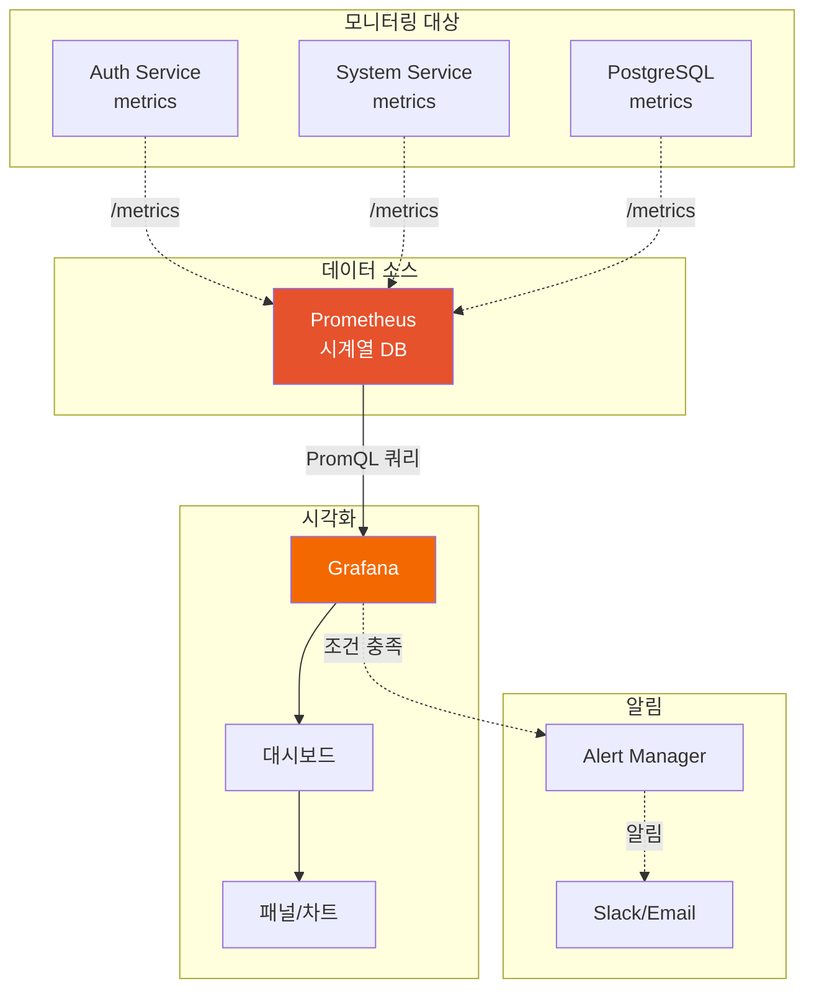

# Grafana (ops-grafana)

## 1 서비스 역할 (Service Role)
**Grafana**는 **메트릭 분석 및 시각화 플랫폼**입니다.
- Prometheus 등 다양한 데이터 소스를 연결하여 대시보드를 구성합니다.
- 시스템 상태를 한눈에 파악할 수 있는 아름다운 UI를 제공합니다.

### 아키텍처 다이어그램




## 2. 정상 작동 확인 (Verification)

### 웹 접속
- 브라우저에서 접속: [http://localhost:3000](http://localhost:3000)
- **계정**: `admin` / `admin`

### 상태 확인
```bash
docker ps | grep ops-grafana
```

## 3. 사용 가이드 (Usage Guide)

### 접속 정보
- **Port**: `3000`
- **초기 계정**: `admin` / `admin`

### 초기 설정

#### 1. 데이터 소스 추가 (Prometheus)
1. 왼쪽 메뉴에서 **⚙️ Configuration** > **Data Sources** 클릭
2. **Add data source** 버튼 클릭
3. **Prometheus** 선택
4. 설정:
   - Name: `Prometheus`
   - URL: `http://ops-prometheus:9090`
5. **Save & Test** 클릭

### 대시보드 생성

#### 방법 1: 새 대시보드 만들기
1. 왼쪽 메뉴에서 **+** > **Dashboard** 클릭
2. **Add a new panel** 클릭
3. 쿼리 입력 (예: `up`)
4. Visualization 타입 선택 (Graph, Gauge, Table 등)
5. **Apply** 클릭

#### 방법 2: 기존 대시보드 Import
1. **+** > **Import** 클릭
2. Grafana.com Dashboard URL 또는 ID 입력
   - Node Exporter: `1860`
   - Docker 모니터링: `893`
3. **Load** 클릭
4. 데이터 소스 선택
5. **Import** 클릭

### 패널 만들기

#### 시계열 그래프 (Time Series)
```
Query:
  rate(http_requests_total[5m])

Legend:
  {{method}} {{route}}

Panel Title:
  HTTP Request Rate
```

#### 게이지 (Gauge)
```
Query:
  100 - (avg(rate(node_cpu_seconds_total{mode="idle"}[5m])) * 100)

Panel Title:
  CPU Usage %

Thresholds:
  - 0-70: Green
  - 70-85: Yellow
  - 85-100: Red
```

#### 테이블 (Table)
```
Query:
  up

Transformations:
  - Organize fields
  - Rename fields

Panel Title:
  Service Status
```

### 변수 사용

#### 변수 정의
1. Dashboard 설정 (⚙️) > **Variables** > **Add variable**
2. 설정:
   - Name: `instance`
   - Type: `Query`
   - Query: `label_values(up, instance)`
3. **Add** 클릭

#### 패널에서 변수 사용
```promql
up{instance="$instance"}
```

### Alert 설정

#### Alert 규칙 생성
1. 패널 편집 모드
2. **Alert** 탭 클릭
3. **Create alert rule from this panel** 클릭
4. 조건 설정:
   ```
   WHEN avg() OF query(A, 5m, now) IS ABOVE 80
   ```
5. **Save** 클릭

#### Notification Channel 설정
1. **Alerting** > **Contact points** > **New contact point**
2. 타입 선택 (Email, Slack, Webhook 등)
3. 설정 입력
4. **Test** > **Save contact point**

### 대시보드 예시

#### 시스템 모니터링 대시보드
```json
{
  "title": "System Monitoring",
  "panels": [
    {
      "title": "CPU Usage",
      "targets": [{
        "expr": "100 - (avg(rate(node_cpu_seconds_total{mode=\"idle\"}[5m])) * 100)"
      }],
      "type": "gauge"
    },
    {
      "title": "Memory Usage",
      "targets": [{
        "expr": "(node_memory_MemTotal_bytes - node_memory_MemAvailable_bytes) / node_memory_MemTotal_bytes * 100"
      }],
      "type": "gauge"
    },
    {
      "title": "HTTP Request Rate",
      "targets": [{
        "expr": "rate(http_requests_total[5m])",
        "legendFormat": "{{method}} {{route}}"
      }],
      "type": "timeseries"
    }
  ]
}
```

### 실전 팁

#### 1. 시간 범위 설정
- 오른쪽 상단에서 시간 범위 선택 (Last 5 minutes, Last 1 hour 등)
- 자동 새로고침 활성화 가능

#### 2. 대시보드 공유
- **Share** 버튼 > **Export** > **Save to file**
- JSON 파일을 팀원과 공유

#### 3. 플레이리스트
여러 대시보드를 자동으로 순환 표시
1. **Playlists** > **New playlist**
2. 대시보드 추가
3. 간격 설정

### Provisioning (자동 설정)

#### 데이터 소스 자동 추가
`dev-environment/config/grafana/provisioning/datasources/prometheus.yml`:
```yaml
apiVersion: 1

datasources:
  - name: Prometheus
    type: prometheus
    access: proxy
    url: http://ops-prometheus:9090
    isDefault: true
```

#### 대시보드 자동 추가
`dev-environment/config/grafana/provisioning/dashboards/dashboard.yml`:
```yaml
apiVersion: 1

providers:
  - name: 'default'
    orgId: 1
    folder: ''
    type: file
    options:
      path: /etc/grafana/provisioning/dashboards
```

### 문제 해결

#### 데이터가 표시되지 않을 때
1. 데이터 소스 연결 확인 (**Configuration** > **Data Sources** > **Test**)
2. Prometheus에서 메트릭이 수집되고 있는지 확인
3. 쿼리가 올바른지 확인

#### 권한 문제
```bash
# Grafana 데이터 디렉토리 권한 확인
ls -ld /data/allsharp/dev-environment/volumes/grafana

# 권한 수정
sudo chown -R 472:472 /data/allsharp/dev-environment/volumes/grafana
```
