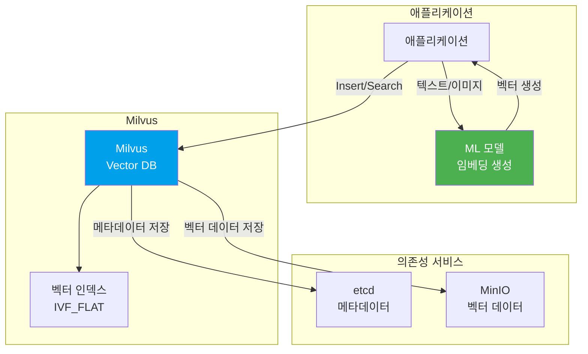
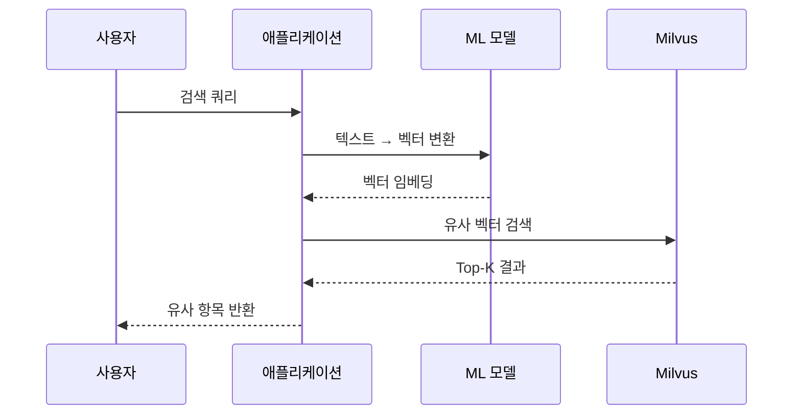

# Milvus (erp-milvus)

## 1. 서비스 역할 (Service Role)
**Milvus**는 대규모 **벡터 데이터베이스(Vector Database)**입니다.
- AI/ML 기능 구현 시 사용 (예: 유사 이미지 검색, 추천 시스템, RAG)
- 텍스트나 이미지를 벡터(임베딩)로 변환하여 저장하고 고속으로 유사도 검색

### 아키텍처 다이어그램



### 유사도 검색 흐름




## 2. 정상 작동 확인 (Verification)

### 상태 확인
```bash
docker ps | grep erp-milvus
```
*주의: Milvus는 `etcd`와 `minio`가 먼저 실행되어 있어야 정상 작동합니다.*

### 로그 확인
```bash
docker logs erp-milvus --tail 20
```

## 3. 사용 가이드 (Usage Guide)

### 접속 정보
- **Port**: `19530` (gRPC), `9091` (HTTP)
- **Host**: `localhost`

### 주요 개념

#### Collection (컬렉션)
관계형 DB의 테이블과 유사합니다. 벡터 데이터를 저장하는 단위입니다.

#### Field (필드)
컬렉션 내의 데이터 필드입니다.
- **Primary Key**: 고유 식별자
- **Vector Field**: 벡터 데이터
- **Scalar Field**: 일반 데이터 (문자열, 숫자 등)

#### Index (인덱스)
벡터 검색 속도를 높이기 위한 인덱스입니다.

### 애플리케이션에서 사용하기

#### Python (pymilvus)
```python
from pymilvus import connections, Collection, CollectionSchema, FieldSchema, DataType

# Milvus 연결
connections.connect("default", host="localhost", port="19530")

# 컬렉션 스키마 정의
fields = [
    FieldSchema(name="id", dtype=DataType.INT64, is_primary=True, auto_id=True),
    FieldSchema(name="title", dtype=DataType.VARCHAR, max_length=200),
    FieldSchema(name="embedding", dtype=DataType.FLOAT_VECTOR, dim=128)
]
schema = CollectionSchema(fields, description="Product embeddings")

# 컬렉션 생성
collection = Collection(name="products", schema=schema)

# 데이터 삽입
data = [
    ["상품A", "상품B", "상품C"],  # title
    [
        [0.1] * 128,  # embedding for 상품A
        [0.2] * 128,  # embedding for 상품B
        [0.3] * 128,  # embedding for 상품C
    ]
]

collection.insert(data)

# 인덱스 생성
index_params = {
    "metric_type": "L2",
    "index_type": "IVF_FLAT",
    "params": {"nlist": 128}
}
collection.create_index("embedding", index_params)

# 컬렉션 로드 (검색 가능 상태로)
collection.load()

# 벡터 검색
search_vector = [[0.15] * 128]  # 검색할 벡터
search_params = {"metric_type": "L2", "params": {"nprobe": 10}}

results = collection.search(
    data=search_vector,
    anns_field="embedding",
    param=search_params,
    limit=5,  # 상위 5개 결과
    output_fields=["title"]
)

for hits in results:
    for hit in hits:
        print(f"ID: {hit.id}, Title: {hit.entity.get('title')}, Distance: {hit.distance}")

# 연결 종료
connections.disconnect("default")
```

#### Node.js (@zilliz/milvus2-sdk-node)
```javascript
const { MilvusClient, DataType } = require('@zilliz/milvus2-sdk-node');

const client = new MilvusClient({
  address: 'localhost:19530',
});

// 컬렉션 스키마 정의
const collectionName = 'products';
const schema = {
  fields: [
    { name: 'id', data_type: DataType.Int64, is_primary_key: true, autoID: true },
    { name: 'title', data_type: DataType.VarChar, max_length: 200 },
    { name: 'embedding', data_type: DataType.FloatVector, dim: 128 },
  ],
};

// 컬렉션 생성
await client.createCollection({
  collection_name: collectionName,
  fields: schema.fields,
});

// 데이터 삽입
const data = [
  { title: '상품A', embedding: Array(128).fill(0.1) },
  { title: '상품B', embedding: Array(128).fill(0.2) },
  { title: '상품C', embedding: Array(128).fill(0.3) },
];

await client.insert({
  collection_name: collectionName,
  data,
});

// 인덱스 생성
await client.createIndex({
  collection_name: collectionName,
  field_name: 'embedding',
  index_type: 'IVF_FLAT',
  metric_type: 'L2',
  params: { nlist: 128 },
});

// 컬렉션 로드
await client.loadCollection({ collection_name: collectionName });

// 벡터 검색
const searchResults = await client.search({
  collection_name: collectionName,
  vector: Array(128).fill(0.15),
  limit: 5,
  output_fields: ['title'],
});

console.log('Search results:', searchResults.results);
```

### 실전 예제: 상품 추천 시스템

#### 1. 상품 데이터 임베딩 및 저장
```python
from sentence_transformers import SentenceTransformer

# 임베딩 모델 로드
model = SentenceTransformer('all-MiniLM-L6-v2')

# 상품 데이터
products = [
    {"id": 1, "title": "무선 이어폰", "description": "고음질 블루투스 이어폰"},
    {"id": 2, "title": "노이즈 캔슬링 헤드폰", "description": "소음 차단 헤드폰"},
    {"id": 3, "title": "스마트 워치", "description": "건강 추적 스마트 워치"},
]

# 텍스트를 벡터로 변환
texts = [f"{p['title']} {p['description']}" for p in products]
embeddings = model.encode(texts)

# Milvus에 저장
data = [
    [p["id"] for p in products],
    [p["title"] for p in products],
    embeddings.tolist()
]

collection.insert(data)
```

#### 2. 유사 상품 검색
```python
# 사용자 검색 쿼리
query = "블루투스 헤드셋"
query_embedding = model.encode([query])[0]

# 유사 상품 검색
results = collection.search(
    data=[query_embedding.tolist()],
    anns_field="embedding",
    param={"metric_type": "L2", "params": {"nprobe": 10}},
    limit=3,
    output_fields=["id", "title"]
)

print("검색 결과:", [hit.entity.get('title') for hit in results[0]])
```

### 주요 작업

#### 컬렉션 목록 확인
```python
from pymilvus import utility

collections = utility.list_collections()
print("Collections:", collections)
```

#### 컬렉션 삭제
```python
utility.drop_collection("products")
```

#### 데이터 개수 확인
```python
print(f"Total entities: {collection.num_entities}")
```

### 관리 도구
- 별도의 GUI 도구인 **Attu**를 연결하여 데이터를 시각적으로 관리할 수 있습니다.
- 설치: `docker run -p 8000:3000 -e MILVUS_URL=localhost:19530 zilliz/attu:latest`

### 문제 해결

#### 컬렉션이 로드되지 않을 때
```python
# 컬렉션 상태 확인
print(f"Load state: {utility.load_state('products')}")

# 강제 로드
collection.load()
```

#### etcd/MinIO 연결 오류
Milvus는 etcd와 MinIO에 의존하므로, 두 서비스가 먼저 실행되어야 합니다.
```bash
docker ps | grep -E "erp-etcd|erp-minio"
```
