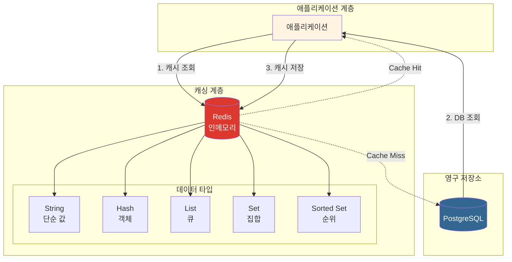
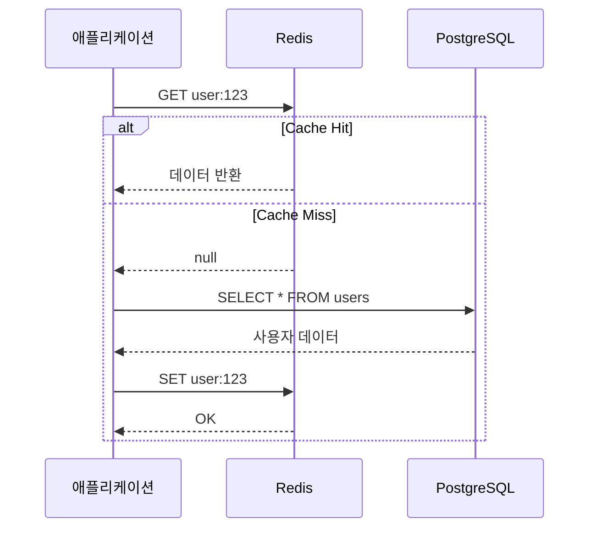

# Redis (erp-redis)

## 1. 서비스 역할 (Service Role)
**Redis**는 **인메모리 데이터 저장소**로, 주로 캐싱과 세션 관리에 사용됩니다.
- 자주 조회되는 데이터의 캐싱 (성능 향상)
- 분산 환경에서의 세션 저장
- 실시간 순위, 카운터 등의 기능 구현

### 아키텍처 다이어그램



### Cache-Aside 패턴




## 2. 정상 작동 확인 (Verification)

### 상태 확인
```bash
docker ps | grep erp-redis
```

### 접속 테스트
```bash
# Redis CLI 접속
docker exec -it erp-redis redis-cli

# 접속 후 ping 테스트
# 127.0.0.1:6379> ping
# PONG
```

## 3. 사용 가이드 (Usage Guide)

### 접속 정보
- **Host**: `localhost` (외부), `redis` (컨테이너 내부)
- **Port**: `6379`
- **Password**: 없음 (개발 환경)

### Redis CLI 기본 명령어

#### 문자열 (String) 작업
```bash
# 값 저장
SET user:1000:name "홍길동"

# 값 조회
GET user:1000:name

# 만료 시간과 함께 저장 (초 단위)
SETEX session:abc123 3600 "user_data"

# 값 증가 (카운터)
INCR page_views
INCRBY page_views 10
```

#### 해시 (Hash) 작업
```bash
# 해시 설정
HSET user:1000 name "홍길동" email "hong@example.com" age 30

# 해시 조회
HGET user:1000 name
HGETALL user:1000

# 여러 필드 동시 설정
HMSET user:1001 name "김철수" email "kim@example.com"
```

#### 리스트 (List) 작업
```bash
# 리스트에 추가
LPUSH notifications "새 메시지가 도착했습니다"
RPUSH queue:tasks "task1" "task2" "task3"

# 리스트 조회
LRANGE notifications 0 -1

# 리스트에서 꺼내기
LPOP queue:tasks
```

#### 셋 (Set) 작업
```bash
# 셋에 추가
SADD tags:article:1 "javascript" "nodejs" "redis"

# 셋 조회
SMEMBERS tags:article:1

# 셋 간 연산
SINTER tags:article:1 tags:article:2  # 교집합
SUNION tags:article:1 tags:article:2  # 합집합
```

#### 정렬된 셋 (Sorted Set) - 순위 구현
```bash
# 점수와 함께 추가
ZADD leaderboard 100 "player1"
ZADD leaderboard 200 "player2"
ZADD leaderboard 150 "player3"

# 순위 조회 (높은 점수부터)
ZREVRANGE leaderboard 0 9 WITHSCORES

# 특정 플레이어 순위
ZREVRANK leaderboard "player1"
```

### 애플리케이션에서 연결하기

#### Node.js (ioredis)
```javascript
const Redis = require('ioredis');

const redis = new Redis({
  host: 'localhost',
  port: 6379,
});

// 값 저장
await redis.set('key', 'value');

// 값 조회
const value = await redis.get('key');

// 만료 시간 설정 (초)
await redis.setex('session:123', 3600, 'user_data');

// 해시 저장
await redis.hset('user:1000', {
  name: '홍길동',
  email: 'hong@example.com'
});
```

#### Python (redis-py)
```python
import redis

r = redis.Redis(host='localhost', port=6379, decode_responses=True)

# 값 저장
r.set('key', 'value')

# 값 조회
value = r.get('key')

# 만료 시간 설정
r.setex('session:123', 3600, 'user_data')

# 해시 저장
r.hset('user:1000', mapping={
    'name': '홍길동',
    'email': 'hong@example.com'
})
```

### 캐싱 패턴 예시

#### Cache-Aside 패턴
```javascript
async function getUserData(userId) {
  const cacheKey = `user:${userId}`;
  
  // 1. 캐시 확인
  let user = await redis.get(cacheKey);
  
  if (user) {
    return JSON.parse(user);
  }
  
  // 2. 캐시 미스 - DB 조회
  user = await db.query('SELECT * FROM users WHERE id = ?', [userId]);
  
  // 3. 캐시 저장 (1시간)
  await redis.setex(cacheKey, 3600, JSON.stringify(user));
  
  return user;
}
```

### 데이터 관리

#### 전체 키 조회 (개발 환경에서만 사용)
```bash
KEYS *
# 또는 패턴 매칭
KEYS user:*
```

#### 특정 키 삭제
```bash
DEL user:1000
```

#### 전체 데이터 삭제 (주의!)
```bash
FLUSHALL
```

#### 메모리 사용량 확인
```bash
INFO memory
```

### 문제 해결

#### Redis에 연결할 수 없을 때
```bash
# Redis가 실행 중인지 확인
docker exec erp-redis redis-cli ping

# 로그 확인
docker logs erp-redis --tail 20
```

#### 메모리 부족 시
```bash
# 메모리 사용량 확인
docker exec erp-redis redis-cli INFO memory

# 만료된 키 정리
docker exec erp-redis redis-cli --scan --pattern * | xargs docker exec erp-redis redis-cli DEL
```
