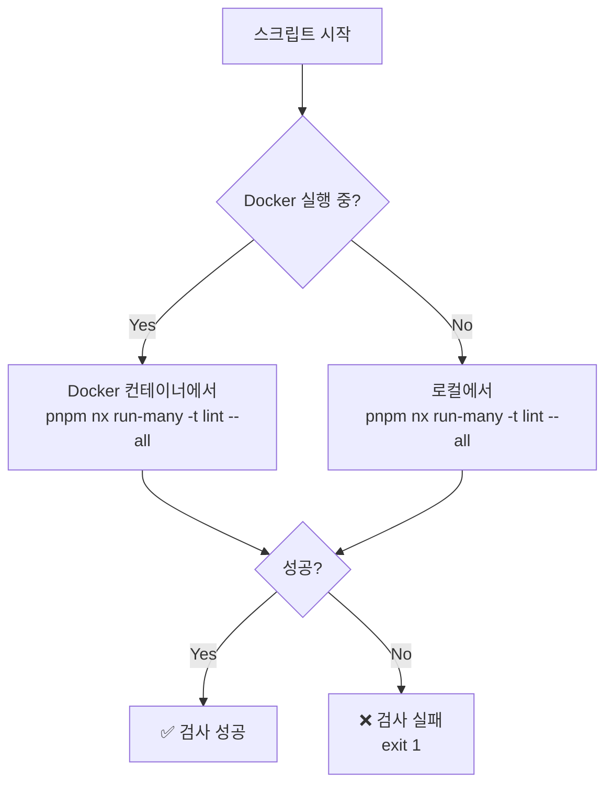
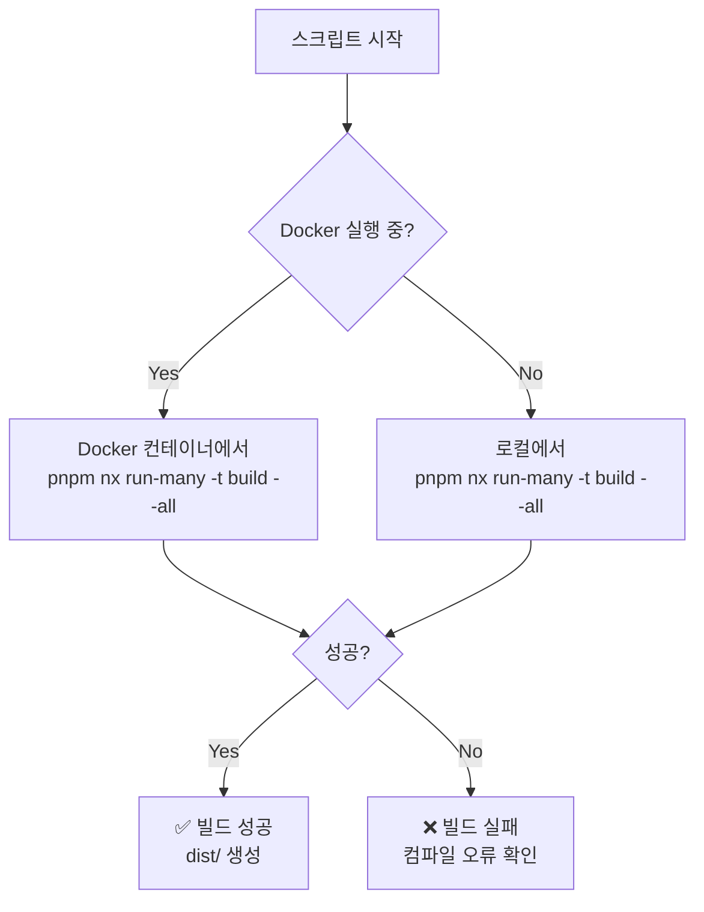
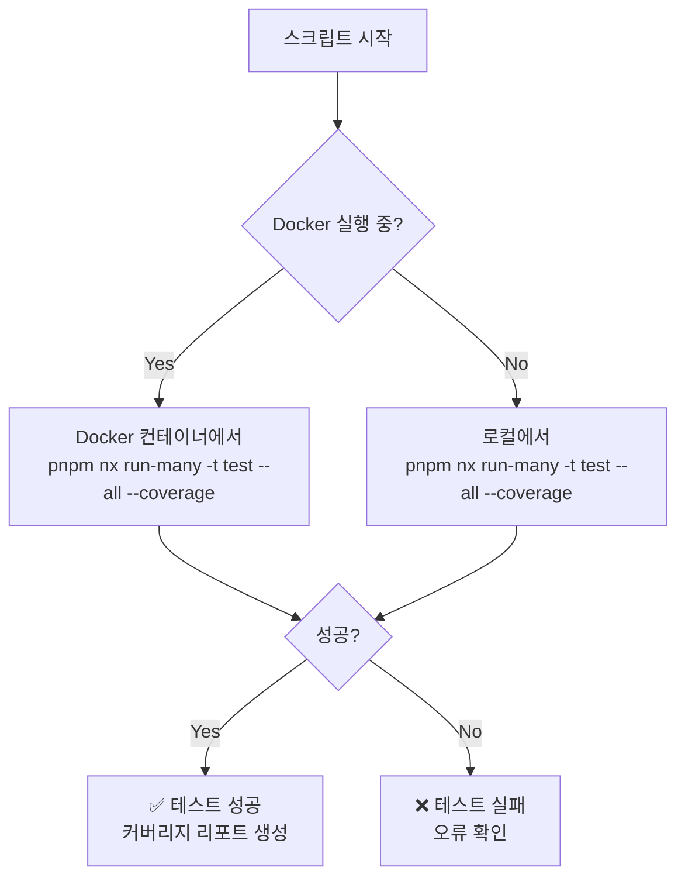
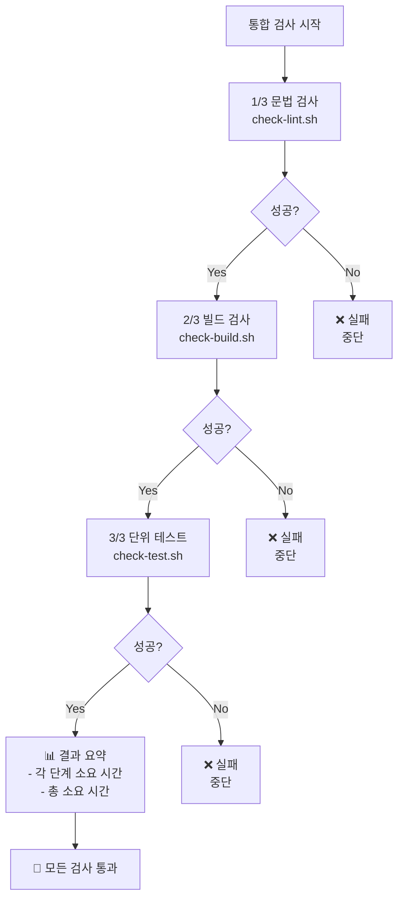

# 코드 품질 검사 스크립트 가이드

이 문서는 현재 디렉토리 (`dev-environment/scripts`)에 있는 코드 품질 검사 스크립트의 사용 방법을 설명합니다.

## 📁 스크립트 목록

현재 프로젝트에는 다음 4개의 검사 스크립트가 제공됩니다:

| 스크립트 | 설명 | 실행 시간 |
|---------|------|----------|
| `check-lint.sh` | ESLint를 사용한 문법 검사 | ~1분 |
| `check-build.sh` | TypeScript 컴파일 검사 | ~3-5분 |
| `check-test.sh` | Jest 단위 테스트 실행 (커버리지 포함) | ~2-4분 |
| `check-all.sh` | 위 3가지 검사를 순차 실행 | ~6-10분 |

## 🚀 사용 방법

### 개별 스크립트 실행

```bash
# 이 디렉토리에서 직접 실행
cd /data/all-erp/dev-environment/scripts

# 문법 검사만 실행
./check-lint.sh

# 빌드 검사만 실행
./check-build.sh

# 단위 테스트만 실행
./check-test.sh
```

또는 프로젝트 루트에서 실행:

```bash
cd /data/all-erp

./dev-environment/scripts/check-lint.sh
./dev-environment/scripts/check-build.sh
./dev-environment/scripts/check-test.sh
```

### 통합 검사 실행

```bash
# 현재 디렉토리에서 실행
cd /data/all-erp/dev-environment/scripts
./check-all.sh

# 또는 프로젝트 루트에서 실행
cd /data/all-erp
./dev-environment/scripts/check-all.sh
```

## 🐳 Docker 환경 요구사항

### Docker 컨테이너 실행 중인 경우

스크립트는 자동으로 실행 중인 Docker 컨테이너를 감지하여 컨테이너 내부에서 검사를 실행합니다.

```bash
# 1. 개발 환경 시작
cd dev-environment
./start-dev.sh --profile system

# 2. 검사 스크립트 실행
cd ..
./dev-environment/scripts/check-lint.sh
```

### Docker 컨테이너 미실행 시

Docker 컨테이너가 실행되지 않은 경우, 스크립트는 로컬 환경(호스트)에서 직접 검사를 실행합니다.

> ⚠️ **주의**: 로컬 실행 시 `node_modules`가 설치되어 있어야 합니다.

```bash
# 의존성이 설치되지 않은 경우
pnpm install

# 검사 스크립트 실행
./dev-environment/scripts/check-lint.sh
```

## 📊 스크립트 동작 방식

### 1. 문법 검사 (`check-lint.sh`)



**검사 대상**:
- 모든 서비스 (`apps/*`)
- 모든 공유 라이브러리 (`libs/*`)

**검사 내용**:
- ESLint 규칙 준수 여부
- 코드 스타일 일관성
- 잠재적 버그 패턴

### 2. 빌드 검사 (`check-build.sh`)



**검사 대상**:
- TypeScript 컴파일 오류
- 타입 정합성
- 의존성 해결 문제

**출력**:
- `dist/` 디렉토리에 컴파일된 JavaScript 파일 생성

### 3. 단위 테스트 (`check-test.sh`)



**검사 대상**:
- 모든 `*.spec.ts` 파일
- 단위 테스트 통과 여부
- 코드 커버리지 측정

**출력**:
- 테스트 결과 요약
- 코드 커버리지 리포트

### 4. 통합 검사 (`check-all.sh`)



**실행 순서**:
1. 문법 검사 → 실패 시 즉시 중단
2. 빌드 검사 → 실패 시 즉시 중단
3. 단위 테스트 → 실패 시 즉시 중단
4. 결과 요약 출력

## 🎯 Why This Matters (왜 중요한가?)

### 1. **조기 오류 발견**
   - 커밋 전에 문법 오류와 타입 오류를 발견하여 CI/CD 파이프라인 실패를 방지합니다.

### 2. **코드 품질 보장**
   - 일관된 코드 스타일과 베스트 프랙티스를 유지합니다.
   - 잠재적 버그를 사전에 제거합니다.

### 3. **Docker-First 전략 준수**
   - 모든 검사를 Docker 환경에서 실행하여 로컬 환경과의 차이를 최소화합니다.
   - "내 컴퓨터에서는 되는데" 문제를 원천 차단합니다.

### 4. **개발 생산성 향상**
   - 자동화된 검사로 수동 리뷰 시간을 단축합니다.
   - 실패한 검사만 선택적으로 재실행할 수 있습니다.

## 💡 팁 & 베스트 프랙티스

### Git Hook에 통합

`.git/hooks/pre-commit` 파일을 생성하여 커밋 전 자동 검사를 실행할 수 있습니다:

```bash
#!/bin/bash
# .git/hooks/pre-commit

echo "🔍 커밋 전 코드 품질 검사 실행 중..."
./dev-environment/scripts/check-all.sh

if [ $? -ne 0 ]; then
    echo "❌ 검사 실패! 커밋이 취소되었습니다."
    exit 1
fi

echo "✅ 검사 성공! 커밋을 진행합니다."
```

### CI/CD 파이프라인에 통합

GitLab CI에서 사용하는 예시:

```yaml
# .gitlab-ci.yml
quality-check:
  stage: test
  script:
    - cd dev-environment
    - ./scripts/check-all.sh
  only:
    - merge_requests
    - develop
    - main
```

### 특정 프로젝트만 검사

개별 서비스나 라이브러리만 검사하고 싶을 때:

```bash
# Docker 컨테이너 내에서
docker exec all-erp-auth-service-dev pnpm nx lint auth-service
docker exec all-erp-auth-service-dev pnpm nx build auth-service
docker exec all-erp-auth-service-dev pnpm nx test auth-service
```

## 🐛 문제 해결

### "Docker 컨테이너를 찾을 수 없습니다" 오류

**원인**: 개발 환경이 실행되지 않음

**해결**:
```bash
cd dev-environment
./start-dev.sh --profile system
```

### "Permission denied" 오류

**원인**: 스크립트에 실행 권한이 없음

**해결**:
```bash
chmod +x dev-environment/scripts/*.sh
```

### 빌드/테스트가 너무 느림

**원인**: Docker 볼륨 마운트 성능 이슈

**해결**:
- 로컬에서 직접 실행 (Docker 컨테이너를 중지)
- 또는 특정 프로젝트만 선택적으로 빌드

```bash
# 특정 서비스만 빌드
docker exec all-erp-auth-service-dev pnpm nx build auth-service
```

## 📚 관련 문서

- [Docker Compose 워크플로우](../../docs/guides/docker-compose-workflow.md)
- [프로젝트 컨텍스트](../../docs/ai/project_context.md)
- [개발 환경 시작 가이드](../GETTING-STARTED.md)
- [개발 환경 README](../README.md)

---

**작성일**: 2025-12-03  
**버전**: 1.0.0
