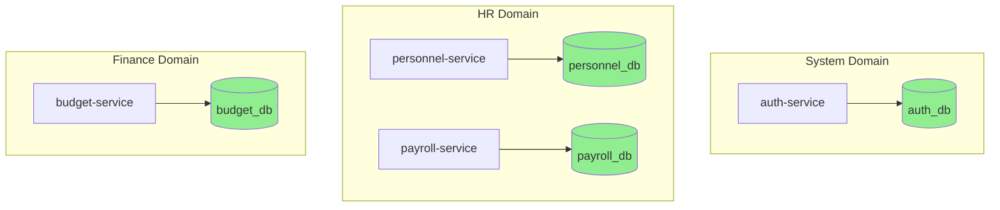
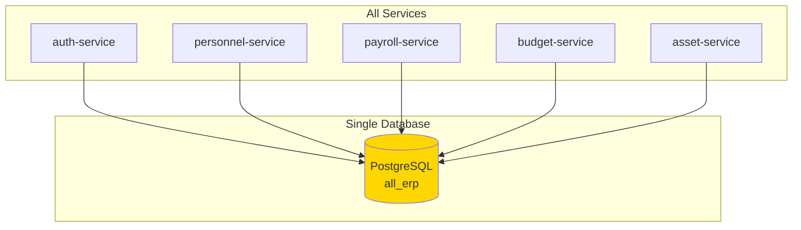
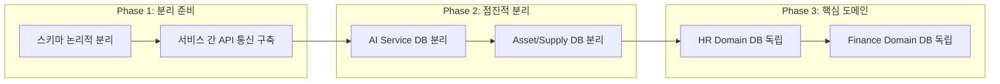
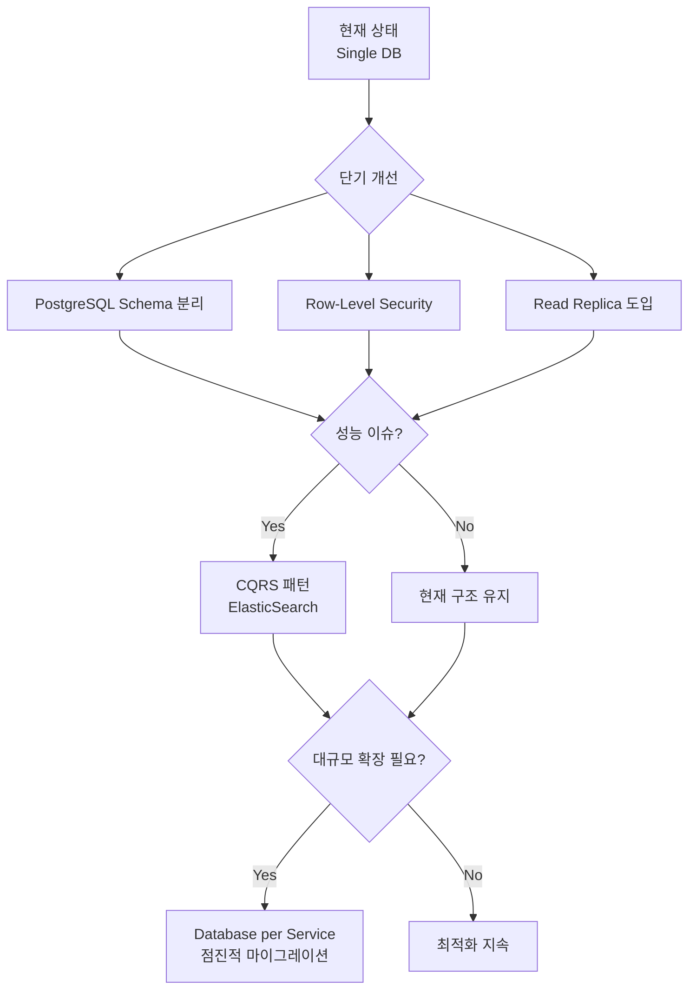

# All-ERP 마이크로서비스 아키텍처 검토 보고서

## 📋 검토 개요

**검토 일자**: 2025-12-04  
**검토 대상**: All-ERP 마이크로서비스 아키텍처  
**핵심 질문**: 단일 PostgreSQL DB 사용이 마이크로서비스 Best Practice에 부합하는가?

## 🏗️ 현재 아키텍처 분석

### 1. 서비스 구성

현재 시스템은 **10개의 마이크로서비스**로 구성되어 있습니다:

| 도메인 | 서비스 | 포트 | 주요 기능 |
|--------|--------|------|-----------|
| **System** | auth-service | 3001 | 인증/인가 |
| **System** | system-service | 3002 | 공통코드, 부서 관리 |
| **System** | tenant-service | 3006 | 멀티테넌시 관리 |
| **HR** | personnel-service | 3011 | 인사 정보 관리 |
| **HR** | payroll-service | 3012 | 급여 계산/관리 |
| **HR** | attendance-service | 3013 | 근태 관리 |
| **Finance** | budget-service | 3021 | 예산 관리 |
| **Finance** | accounting-service | 3022 | 회계 관리 |
| **Finance** | settlement-service | 3023 | 결산 관리 |
| **General** | asset-service | 3031 | 자산 관리 |
| **General** | supply-service | 3032 | 비품 관리 |
| **General** | general-affairs-service | 3033 | 총무 관리 |
| **AI** | ai-service | 3007 | AI/LLM 기능 |

---

### 2. 데이터베이스 구조

#### 현재 상태: **Shared Database 패턴**

모든 서비스가 **단일 PostgreSQL 인스턴스 (`all_erp`)** 를 공유합니다:

```yaml
# docker-compose.dev.yml (모든 서비스 동일)
environment:
  DB_HOST: postgres
  DB_PORT: 5432
  DB_DATABASE: all_erp  # ← 모든 서비스가 동일한 DB 사용
```

#### Prisma Schema 분석

[schema.prisma](file:///data/all-erp/libs/shared/infra/prisma/schema.prisma) (307줄, 24개 모델):

```prisma
// 공통 스키마 파일 (libs/shared/infra/prisma/schema.prisma)
datasource db {
    provider = "postgresql"
}

model User { ... }           // auth-service
model Tenant { ... }         // tenant-service
model Department { ... }     // system-service
model Employee { ... }       // personnel-service
model Attendance { ... }     // attendance-service
model Payroll { ... }        // payroll-service
model Budget { ... }         // budget-service
model Asset { ... }          // asset-service
// ... 총 24개 모델
```

**특징**:
- ✅ 모든 테이블에 `tenantId` 컬럼 (멀티테넌시 지원)
- ✅ 인덱스 최적화 (`@@index([tenantId])`)
- ⚠️ 서비스 경계가 명확하지 않음 (하나의 스키마 파일)

---

## ⚖️ 마이크로서비스 패턴 비교

### **Pattern 1: Database per Service** (이상적)



**장점**:
- ✅ 서비스 독립성: 각 서비스가 자신의 DB 스키마 완전 제어
- ✅ 기술 다양성: 서비스별 최적 DB 선택 (PostgreSQL, MongoDB, Redis 등)
- ✅ 확장성: 서비스별 독립적 스케일링
- ✅ 장애 격리: 한 서비스 DB 장애가 다른 서비스에 미치는 영향 최소화

**단점**:
- ❌ 데이터 일관성 보장 어려움 (분산 트랜잭션)
- ❌ 조인 불가: 서비스 간 데이터 조인 시 API 호출 필요
- ❌ 운영 복잡도 증가: DB 인스턴스 10개 이상 관리

---

### **Pattern 2: Shared Database** (현재 구조)



**장점**:
- ✅ 데이터 일관성: ACID 트랜잭션으로 강력한 일관성 보장
- ✅ SQL 조인 가능: 서비스 간 데이터 조인이 간단 (JOIN)
- ✅ 운영 단순: 하나의 DB만 관리
- ✅ 개발 속도: 초기 개발이 빠름 (스키마 공유)

**단점**:
- ❌ 서비스 결합도: 스키마 변경 시 여러 서비스에 영향
- ❌ 확장성 제한: 한 서비스의 DB 부하가 전체에 영향
- ❌ 단일 장애점 (SPOF): DB 장애 시 모든 서비스 중단
- ❌ 권한 관리 복잡: 서비스별 테이블 접근 제어 필요

---

## 🎯 현재 구조 적합성 평가

### ERP 시스템의 특성

| 특성 | 설명</ | 패턴 적합성 |
|----|------|-----------|
| **데이터 일관성 중요** | 급여, 회계, 예산은 정확성이 생명 | ✅ Shared DB 유리 |
| **도메인 간 연관성 높음** | Employee → Payroll → Budget 의존 | ✅ Shared DB 유리 |
| **트랜잭션 경계 명확** | 급여 계산 시 여러 테이블 동시 업데이트 | ✅ Shared DB 유리 |
| **초기 단계** | 아직 대규모 트래픽 없음 | ✅ Shared DB 합리적 |
| **멀티테넌시** | 모든 테이블에 `tenantId` 필요 | 🟡 패턴 무관 |

### 마이크로서비스 원칙 준수 여부

| 원칙 | 준수 여부 | 평가 |
|------|----------|------|
| **서비스 독립성** | ⚠️ 부분 준수 | API는 독립적이나 DB 스키마는 공유 |
| **자율성 (Autonomy)** | ⚠️ 제한적 | 스키마 변경 시 다른 서비스 고려 필요 |
| **장애 격리** | ❌ 미준수 | DB 장애 시 모든 서비스 영향 |
| **독립 배포** | ✅ 준수 | 서비스별 Docker 컨테이너로 독립 배포 |
| **기술 다양성** | ❌ 미준수 | 모든 서비스가 PostgreSQL 고정 |

---

## 💡 개선 방안

### 옵션 1: 현재 구조 유지 + 개선 (권장)

**현실적이고 점진적인 접근**

#### 단기 개선 (즉시 적용 가능)

1. **스키마 논리적 분리**
   ```sql
   -- PostgreSQL Schema (Namespace)로 분리
   CREATE SCHEMA auth;
   CREATE SCHEMA hr;
   CREATE SCHEMA finance;
   CREATE SCHEMA general;
   
   -- 테이블 이동
   ALTER TABLE "User" SET SCHEMA auth;
   ALTER TABLE "Employee" SET SCHEMA hr;
   ALTER TABLE "Budget" SET SCHEMA finance;
   ```
   
   **효과**: 서비스 경계 명확화, 권한 관리 용이

2. **Database View로 읽기 최적화**
   ```sql
   -- personnel-service용 읽기 전용 뷰
   CREATE VIEW hr.employee_summary AS
   SELECT e.id, e.name, d.name as department
   FROM hr."Employee" e
   LEFT JOIN system."Department" d ON e.departmentId = d.id;
   ```

3. **Row-Level Security (RLS)**
   ```sql
   -- tenant 격리 강화
   ALTER TABLE hr."Employee" ENABLE ROW LEVEL SECURITY;
   CREATE POLICY employee_tenant_isolation ON hr."Employee"
   USING (tenantId = current_setting('app.tenant_id')::text);
   ```

#### 중기 개선 (3-6개월)

4. **읽기 전용 복제본 (Read Replica)**
   ```yaml
   # 조회가 많은 서비스는 Read Replica 사용
   reporting-service:
     environment:
       DB_HOST: postgres-readonly  # Read Replica
   ```

5. **CQRS 패턴 부분 적용**
   - 쓰기(Command): 메인 DB
   - 읽기(Query): Redis + Elasticsearch

---

### 옵션 2: Database per Service 마이그레이션 (장기)

**대규모 트래픽 대비 (6-12개월 계획)**

#### 마이그레이션 전략



#### 우선순위

1. **AI Service** → MongoDB (문서 저장에 적합)
2. **Asset/Supply** → 독립 PostgreSQL (결합도 낮음)
3. **HR Domain** → 독립 PostgreSQL (트래픽 많음)
4. **Finance** → 마지막 (일관성 중요, 신중히)

---

## 📊 트레이드오프 요약

| 항목 | Shared DB (현재) | Database per Service |
|------|------------------|----------------------|
| **개발 속도** | ⭐⭐⭐⭐⭐ 빠름 | ⭐⭐⭐ 느림 |
| **데이터 일관성** | ⭐⭐⭐⭐⭐ 강력 | ⭐⭐ 약함 (Saga 필요) |
| **서비스 독립성** | ⭐⭐ 낮음 | ⭐⭐⭐⭐⭐ 높음 |
| **확장성** | ⭐⭐⭐ 제한적 | ⭐⭐⭐⭐⭐ 우수 |
| **운영 복잡도** | ⭐⭐⭐⭐ 단순 | ⭐ 복잡 |
| **장애 격리** | ⭐ 취약 | ⭐⭐⭐⭐⭐ 우수 |

---

## ✅ 최종 권장사항

### 현재 단계: **Shared Database 패턴 유지 + 점진적 개선**

**이유**:
1. ✅ **ERP 특성**: 데이터 일관성과 트랜잭션 무결성이 매우 중요
2. ✅ **초기 단계**: 아직 대규모 트래픽이 없어 확장성 문제 미발생
3. ✅ **개발 효율성**: 빠른 기능 개발이 현 단계에서 더 중요
4. ✅ **운영 부담**: 소규모 팀에서 10개 이상의 DB 관리 부담 과도

### 즉시 적용해야 할 개선 사항



### 마이그레이션 시기

다음 조건이 **2개 이상** 충족될 때 Database per Service 고려:

- 📊 일일 활성 사용자 10,000명 이상
- ⚡ DB CPU 사용률 지속적으로 70% 초과
- 🚀 특정 서비스 독립 스케일링 필요
- 💰 서비스별 다른 SLA 요구 (예: 급여는 99.9%, AI는 95%)

---

## 🎓 Why This Matters (초급자를 위한 설명)

### 마이크로서비스와 DB의 관계

마이크로서비스는 **레고 블록**처럼 독립적이어야 하는데, Shared Database는 **모든 블록이 하나의 접착제**로 붙어있는 상태입니다.

```
[이상적] Database per Service
🧱 인사 서비스 + 🗄️ 인사 DB (독립)
🧱 급여 서비스 + 🗄️ 급여 DB (독립)
→ 급여 DB 장애 시에도 인사 서비스는 정상 작동!

[현재] Shared Database
🧱 인사 서비스 ─┐
🧱 급여 서비스 ─┤── 🗄️ 하나의 DB
🧱 예산 서비스 ─┘
→ DB 장애 시 모든 서비스 중단!
```

### ERP에서는 Shared DB가 더 나을 수 있는 이유

```
급여 계산 시나리오:
1. Employee 테이블에서 직원 정보 조회
2. Attendance 테이블에서 근무 시간 확인
3. Budget 테이블에서 예산 확인
4. Payroll 테이블에 급여 저장

Database per Service라면:
→ 4번의 API 호출 필요
→ 트랜잭션 롤백 복잡 (Saga 패턴 필요)

Shared Database라면:
→ 하나의 SQL JOIN
→ BEGIN; ... COMMIT; (간단한 트랜잭션)
```

---

## 📚 참고 자료

- [Microservices Patterns: Database per Service](https://microservices.io/patterns/data/database-per-service.html)
- [Shared Database Anti-Pattern](https://microservices.io/patterns/data/shared-database.html)
- [Martin Fowler - Microservices](https://martinfowler.com/articles/microservices.html)

---

**결론**: 현재 All-ERP의 Shared Database 패턴은 **초기 단계 ERP 시스템에 합리적인 선택**입니다. 점진적 개선을 통해 확장성을 확보하고, 추후 필요시 Database per Service로 마이그레이션하는 전략을 권장합니다.
