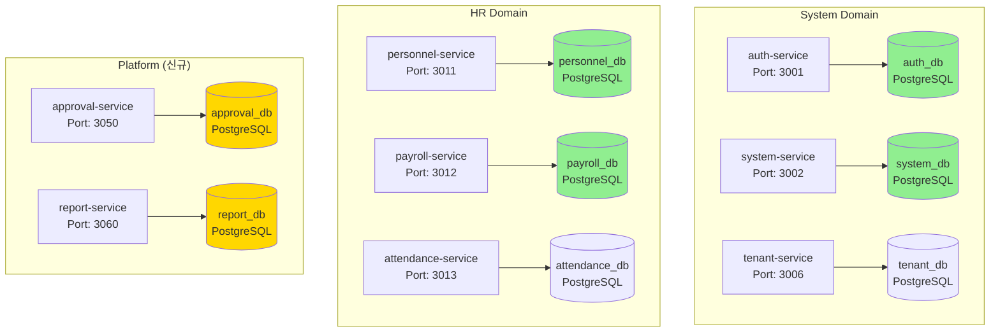
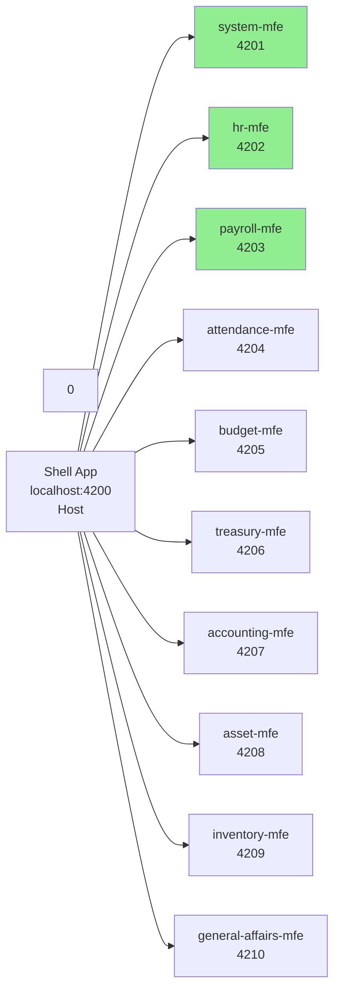

# All-ERP 마이크로서비스 아키텍처 v2.0

## 📋 문서 개요

**버전**: 2.0  
**작성 일자**: 2025-12-04  
**핵심 전략**: Database per Service + Micro Frontend

---

## 🏗️ 아키텍처 개요

### 최종 결정: Database per Service 채택

사용자 피드백을 반영하여 **완전한 서비스 독립성**을 위해 Database per Service 패턴을 채택했습니다.



---

## 📊 서비스 구성 (17개)

### 현재 서비스 (13개 유지)

| 도메인 | 서비스 | 포트 | DB | 주요 기능 |
|--------|--------|------|----|-----------| 
| **System** | auth-service | 3001 | auth_db | 인증/인가 |
| **System** | system-service | 3002 | system_db | 공통코드, 부서 |
| **System** | tenant-service | 3006 | tenant_db | 멀티테넌시 |
| **HR** | personnel-service | 3011 | personnel_db | 인사정보 |
| **HR** | payroll-service | 3012 | payroll_db | 급여 |
| **HR** | attendance-service | 3013 | attendance_db | 근태 |
| **Finance** | budget-service | 3021 | budget_db | 예산 |
| **Finance** | accounting-service | 3022 | accounting_db | 회계 |
| **Finance** | settlement-service | 3023 | settlement_db | 결산 |
| **General** | asset-service | 3031 | asset_db | 자산 |
| **General** | supply-service | 3032 | supply_db | 비품 |
| **General** | general-affairs-service | 3033 | general_affairs_db | 총무 |
| **AI** | ai-service | 3007 | ai_db (MongoDB) | AI/LLM |

### 신규 서비스 (4개)

| 도메인 | 서비스 | 포트 | DB | 주요 기능 |
|--------|--------|------|----|-----------| 
| **Platform** | approval-service | 3050 | approval_db | 전자결재 |
| **Platform** | report-service | 3060 | report_db | 통합 보고서 (CQRS) |
| **Platform** | notification-service | 3070 | notification_db | 알림 |
| **Platform** | file-service | 3080 | file_db | 파일 관리 |

---

## 💾 Database per Service 전략

### DB 인스턴스 구성 (17개)

```yaml
# docker-compose.infra.yml

services:
  # PostgreSQL 인스턴스 (16개)
  postgres-auth:
    image: postgres:17
    environment:
      POSTGRES_DB: auth_db
    ports: ["5432:5432"]
  
  postgres-personnel:
    image: postgres:17
    environment:
      POSTGRES_DB: personnel_db
    ports: ["5441:5432"]
  
  # ... (총 16개 PostgreSQL)
  
  # MongoDB (1개)
  mongo-ai:
    image: mongo:8
    environment:
      MONGO_INITDB_DATABASE: ai_db
    ports: ["27017:27017"]
```

### 서비스 간 데이터 공유

**원칙**: 직접 DB 접근 금지, API 또는 이벤트 사용

**방법 1: API 호출**
```typescript
// payroll-service
async calculatePayroll(empId: string) {
  // 직원 정보 조회 (personnel-service API)
  const employee = await this.httpService.get(
    `http://personnel-service:3011/api/employees/${empId}`
  ).toPromise();
  
  // 근태 정보 조회 (attendance-service API)
  const attendance = await this.httpService.get(
    `http://attendance-service:3013/api/attendances/${empId}`
  ).toPromise();
  
  // 급여 계산
  return this.calculate(employee.data, attendance.data);
}
```

**방법 2: 이벤트 기반 동기화**
```typescript
// personnel-service: 이벤트 발행
@Post()
async updateEmployee(id: string, dto: UpdateEmployeeDto) {
  const employee = await this.prisma.employee.update({...});
  
  // 이벤트 발행
  await this.eventBus.publish('employee.updated', {
    id: employee.id,
    name: employee.name,
    departmentId: employee.departmentId,
  });
  
  return employee;
}

// payroll-service: 이벤트 구독
@RabbitSubscribe('employee.updated')
async handleEmployeeUpdated(event: EmployeeUpdatedEvent) {
  // Redis 캐시 업데이트
  await this.cache.set(`employee:${event.id}`, event);
}
```

---

## 🎨 Micro Frontend 아키텍처

### Module Federation 기반 (11개 앱)



### Webpack 설정 예시

```typescript
// apps/frontend/shell/webpack.config.ts
new ModuleFederationPlugin({
  name: 'shell',
  remotes: {
    systemMfe: 'systemMfe@http://localhost:4201/remoteEntry.js',
    hrMfe: 'hrMfe@http://localhost:4202/remoteEntry.js',
    // ... 10개
  },
  shared: {
    react: { singleton: true, requiredVersion: '^19.0.0' },
    'react-dom': { singleton: true },
    'react-router-dom': { singleton: true },
  },
});
```

---

## ��️ 장단점 분석

### v2.0 장점 ✅

- **서비스 독립성 극대화**: 각 서비스 완전 독립
- **장애 격리 우수**: 한 DB 장애가 다른 서비스에 미치는 영향 최소화
- **기술 다양성**: PostgreSQL, MongoDB 혼용
- **확장성**: 서비스별 독립 스케일링
- **팀별 소유권**: 명확한 책임 분리

### v2.0 단점 ⚠️

- **운영 복잡도 ↑↑↑**: 17개 DB 관리
- **데이터 일관성**: Saga 패턴 필요
- **트랜잭션 복잡**: 분산 트랜잭션 구현
- **네트워크 오버헤드**: API 호출 증가
- **개발 기간 증가**: 초기 설정 복잡

---

## 🔄 서비스 간 통신 패턴

### 동기 통신 (REST API)

```typescript
// libs/shared/http/service-clients.ts
export class PersonnelServiceClient {
  constructor(private http: HttpService) {}
  
  async getEmployee(id: string): Promise<EmployeeDto> {
    const response = await this.http.get(
      `http://personnel-service:3011/api/employees/${id}`
    ).toPromise();
    return response.data;
  }
}
```

### 비동기 통신 (RabbitMQ)

```typescript
// 이벤트 정의
export enum DomainEvent {
  EMPLOYEE_CREATED = 'personnel.employee.created',
  EMPLOYEE_UPDATED = 'personnel.employee.updated',
  PAYROLL_CALCULATED = 'payroll.payroll.calculated',
  LEAVE_APPROVED = 'attendance.leave.approved',
}

// Exchange 설정
exchanges:
  - name: erp.events
    type: topic
  - name: erp.approval
    type: topic
```

---

## 📘 권장사항

### 초기 단계 팀을 위한 조언

1. **단계적 접근**: 한 번에 모든 DB를 분리하지 말고 단계적으로 진행
2. **핵심 서비스 우선**: Finance, HR 등 트랜잭션이 중요한 서비스는 나중에
3. **모니터링 강화**: Jaeger, Grafana로 분산 추적 필수
4. **문서화**: 서비스 간 의존성 맵 작성

### 적용 시기

다음 조건 **2개 이상** 충족 시 적용:
- 활성 사용자 10,000명 이상
- 서비스별 독립 스케일링 필요
- 팀이 3개 이상으로 분리됨
- 운영 인력 확보됨

---

## 📚 참조 문서

- [마이크로서비스 전환 계획 v2.0](../README-MICROSERVICES-PLAN.md)
- [Database per Service 가이드](./database-per-service-guide.md)
- [Micro Frontend 가이드](./micro-frontend-guide.md)
- [서비스 간 통신 가이드](./service-communication-guide.md)

---

**문서 버전**: 2.0  
**최종 업데이트**: 2025-12-04  
**작성자**: Architecture Team
