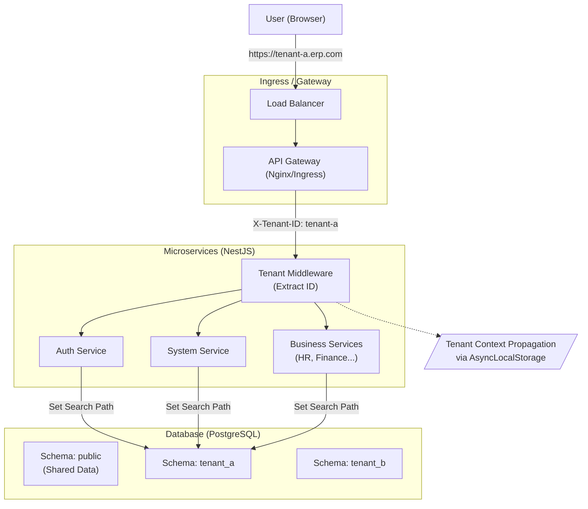

# SaaS Multitenancy Architecture

> **Version**: 1.0
> **Date**: 2025-11-30
> **Status**: Approved

## 1. 개요 (Overview)

본 문서는 ERP 시스템의 **멀티테넌시(Multi-tenancy)** 구현 전략을 정의합니다.
핵심 목표는 **데이터의 완벽한 격리**와 **효율적인 리소스 공유**를 동시에 달성하는 것입니다.

### 핵심 결정 사항 (Key Decisions)
- **데이터 격리**: **Schema per Tenant** (PostgreSQL)
- **테넌트 식별**: **Subdomain** (진입점) + **Header** (내부 통신)

---

## 2. 아키텍처 다이어그램 (Architecture Diagram)



---

## 3. 상세 설계 (Detailed Design)

### 3.1 테넌트 식별 (Tenant Identification)

요청이 들어왔을 때 어떤 테넌트의 요청인지 식별하는 전략입니다.

| 단계 | 식별 방법 | 예시 | 설명 |
|---|---|---|---|
| **1. 클라이언트 진입** | **Subdomain** | `https://samsung.erp.com` | 사용자는 서브도메인을 통해 자신의 테넌트 환경에 접속합니다. |
| **2. 게이트웨이/프록시** | **Header 변환** | `X-Tenant-ID: samsung` | 게이트웨이(또는 프론트엔드 서버)에서 서브도메인을 파싱하여 헤더로 변환합니다. |
| **3. 내부 서비스 통신** | **Header 유지** | `X-Tenant-ID: samsung` | 마이크로서비스 간 통신 시에는 항상 헤더를 포함하여 컨텍스트를 전파합니다. |

### 3.2 데이터 격리 (Data Isolation)

**Schema per Tenant** 전략을 사용합니다.

- **물리적 DB**: 하나의 PostgreSQL 인스턴스(또는 클러스터)를 공유합니다.
- **논리적 격리**: 각 테넌트는 별도의 **Schema**를 가집니다.
    - 예: `tenant_a`, `tenant_b`, `tenant_c`
- **공통 데이터**: 모든 테넌트가 공유하는 데이터(예: 국가 코드, 시스템 설정)는 `public` 스키마에 저장합니다.

#### Prisma 구현 전략
Prisma는 기본적으로 단일 스키마를 타겟팅하지만, PostgreSQL의 `search_path` 기능을 활용하여 동적으로 스키마를 전환할 수 있습니다.

```typescript
// 예시 코드 (개념)
const tenantId = Context.getTenantId();
await prisma.$executeRaw(`SET search_path TO "${tenantId}", "public"`);
```

### 3.3 요청 처리 흐름 (Request Flow)

1.  **Request In**: 클라이언트가 `tenant-a.erp.com/api/users` 호출.
2.  **Middleware**:
    -   `X-Tenant-ID` 헤더 확인.
    -   없으면 `Host` 헤더에서 서브도메인 파싱.
    -   유효한 Tenant ID인지 검증 (Redis 캐시 등 활용).
    -   `AsyncLocalStorage`에 Tenant ID 저장.
3.  **Guard**:
    -   `TenantGuard`가 실행되어 Tenant ID가 없는 요청 차단.
4.  **Service/Repository**:
    -   DB 쿼리 실행 직전, 현재 Context의 Tenant ID를 사용하여 DB 세션 설정 (또는 클라이언트 전환).
5.  **Response**: 결과 반환.

---

## 4. 마이그레이션 관리 (Migration Management)

Schema per Tenant 전략의 가장 큰 과제는 **스키마 변경 관리**입니다.

- **마이그레이션 스크립트**: Prisma Migrate를 사용하여 `migrations/` 생성.
- **배포 파이프라인**:
    1.  `public` 스키마 마이그레이션 실행.
    2.  등록된 모든 활성 테넌트 목록 조회.
    3.  각 테넌트 스키마에 대해 순차적(또는 병렬)으로 마이그레이션 실행.

> **Note**: 초기 단계에서는 스크립트로 관리하며, 추후 `Tenant Manager Service`가 이를 자동화하도록 고도화합니다.
