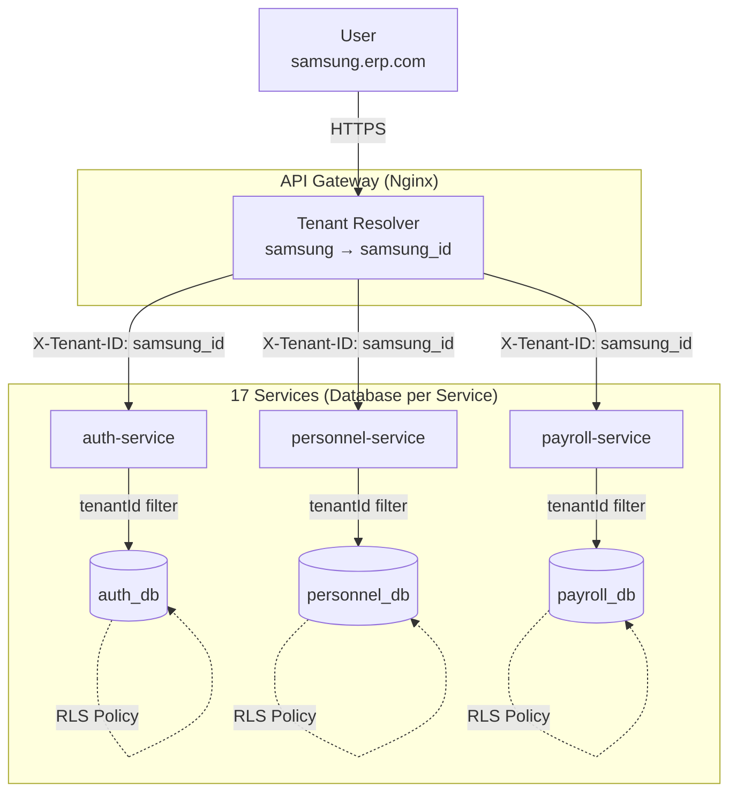

# SaaS Multitenancy Architecture v2.0

> **Version**: 2.0  
> **Date**: 2025-12-04  
> **Status**: Approved  
> **Architecture**: Database per Service

## 1. 개요 (Overview)

본 문서는 **Database per Service 아키텍처**에서의 멀티테넌시 구현 전략을 정의합니다.  
핵심 목표는 **서비스 독립성 유지**와 **데이터 완벽 격리**를 동시에 달성하는 것입니다.

### 핵심 결정 사항 (Key Decisions)

- **데이터 격리**: **Row-Level Security (RLS)** + tenantId 필드
- **테넌트 식별**: **Subdomain** + **X-Tenant-ID Header**
- **아키텍처**: Database per Service (17개 독립 DB)

---

## 2. Architecture v2.0 다이어그램



---

## 3. Database per Service 환경에서의 멀티테넌시

### 3.1 각 DB에 tenantId 필드 적용

모든 서비스의 모든 테이블에 `tenantId` 컬럼을 포함합니다.

```prisma
// libs/shared/database/personnel/schema.prisma
model Employee {
  id           String   @id @default(uuid())
  tenantId     String                          // 필수!
  name         String
  email        String
  departmentId String
  createdAt    DateTime @default(now())
  
  @@index([tenantId])                          // 성능 최적화
  @@unique([tenantId, email])                  // 테넌트 내 유일성
}
```

### 3.2 Row-Level Security (RLS) 적용

PostgreSQL의 RLS 기능으로 DB 레벨에서 데이터 격리를 강제합니다.

```sql
-- personnel_db에 RLS 적용
ALTER TABLE "Employee" ENABLE ROW LEVEL SECURITY;

CREATE POLICY employee_tenant_isolation ON "Employee"
  USING (tenantId = current_setting('app.tenant_id')::text);

-- 읽기 정책
CREATE POLICY employee_select_policy ON "Employee"
  FOR SELECT
  USING (tenantId = current_setting('app.tenant_id')::text);

-- 쓰기 정책
CREATE POLICY employee_insert_policy ON "Employee"
  FOR INSERT
  WITH CHECK (tenantId = current_setting('app.tenant_id')::text);
```

### 3.3 Prisma Middleware로 tenantId 자동 주입

```typescript
// libs/shared/database/personnel/client.ts
import { PrismaClient } from '@prisma/client';
import { AsyncLocalStorage } from 'async_hooks';

const tenantContext = new AsyncLocalStorage<string>();

const prisma = new PrismaClient();

// Middleware: 모든 쿼리에 tenantId 자동 추가
prisma.$use(async (params, next) => {
  const tenantId = tenantContext.getStore();
  
  if (!tenantId) {
    throw new Error('Tenant context not set');
  }
  
  // SELECT, UPDATE, DELETE에 tenantId 필터 자동 추가
  if (['findMany', 'findFirst', 'findUnique', 'update', 'delete'].includes(params.action)) {
    params.args.where = {
      ...params.args.where,
      tenantId,
    };
  }
  
  // INSERT에 tenantId 자동 주입
  if (params.action === 'create') {
    params.args.data = {
      ...params.args.data,
      tenantId,
    };
  }
  
  // PostgreSQL session 설정 (RLS용)
  await prisma.$executeRaw`SET app.tenant_id = ${tenantId}`;
  
  return next(params);
});

// Context 저장 헬퍼
export function runInTenantContext<T>(tenantId: string, fn: () => T): T {
  return tenantContext.run(tenantId, fn);
}

export { prisma };
```

---

## 4. 테넌트 식별 흐름

### 4.1 요청 처리 Flow

```
1. User → samsung.erp.com/api/employees
2. Nginx → Subdomain 파싱 → X-Tenant-ID: samsung_id
3. NestJS Middleware → Header 추출 → AsyncLocalStorage 저장
4. Controller → Service → Repository
5. Prisma Middleware → tenantId 필터 자동 적용
6. PostgreSQL RLS → 추가 검증
7. Response → Client
```

### 4.2 NestJS Middleware 구현

```typescript
// libs/shared/infra/src/middleware/tenant.middleware.ts
import { Injectable, NestMiddleware } from '@nestjs/common';
import { Request, Response, NextFunction } from 'express';
import { AsyncLocalStorage } from 'async_hooks';

export const tenantContext = new AsyncLocalStorage<string>();

@Injectable()
export class TenantMiddleware implements NestMiddleware {
  use(req: Request, res: Response, next: NextFunction) {
    // 1. Header에서 Tenant ID 추출
    let tenantId = req.headers['x-tenant-id'] as string;
    
    // 2. Header가 없으면 Subdomain에서 파싱
    if (!tenantId) {
      const host = req.headers.host || '';
      const subdomain = host.split('.')[0];
      tenantId = this.resolveSubdomain(subdomain);  // DB 조회
    }
    
    // 3. 검증
    if (!tenantId) {
      throw new UnauthorizedException('Tenant not found');
    }
    
    // 4. AsyncLocalStorage에 저장
    tenantContext.run(tenantId, () => {
      (req as any).tenantId = tenantId;
      next();
    });
  }
  
  private resolveSubdomain(subdomain: string): string {
    // Redis 캐시에서 조회
    return this.cache.get(`subdomain:${subdomain}`);
  }
}
```

---

## 5. 서비스 간 통신 시 Tenant Context 전파

### 5.1 HTTP 호출 시 Header 전달

```typescript
// payroll-service에서 personnel-service 호출
async getEmployeeInfo(empId: string) {
  const tenantId = tenantContext.getStore();
  
  const response = await this.httpService.get(
    `http://personnel-service:3011/api/employees/${empId}`,
    {
      headers: {
        'X-Tenant-ID': tenantId,  // Context 전파
      },
    }
  ).toPromise();
  
  return response.data;
}
```

### 5.2 RabbitMQ Event 시 Payload에 포함

```typescript
// 이벤트 발행
await this.eventBus.publish('employee.updated', {
  tenantId: tenantContext.getStore(),  // 이벤트에 포함
  employeeId: '...',
  name: '...',
});

// 이벤트 구독
@RabbitSubscribe('employee.updated')
async handleEmployeeUpdated(event: EmployeeUpdatedEvent) {
  return tenantContext.run(event.tenantId, async () => {
    // 올바른 Tenant Context에서 실행
    await this.cache.set(`employee:${event.employeeId}`, event);
  });
}
```

---

## 6. 마이그레이션 관리

### 6.1 각 DB별 독립 마이그레이션

```bash
# 각 서비스 DB 마이그레이션
cd libs/shared/database/auth
pnpm prisma migrate dev --name add_tenant_id

cd ../personnel
pnpm prisma migrate dev --name add_tenant_id

# ... 17개 반복
```

### 6.2 RLS 정책 자동 적용 스크립트

```sql
-- scripts/apply-rls.sql
DO $$
DECLARE
  tbl RECORD;
BEGIN
  FOR tbl IN 
    SELECT tablename 
    FROM pg_tables 
    WHERE schemaname = 'public'
  LOOP
    EXECUTE format('ALTER TABLE %I ENABLE ROW LEVEL SECURITY', tbl.tablename);
    
    EXECUTE format('
      CREATE POLICY %I_tenant_isolation ON %I
      USING (tenantId = current_setting(''app.tenant_id'')::text)
    ', tbl.tablename, tbl.tablename);
  END LOOP;
END $$;
```

---

## 7. 보안 고려사항

### 7.1 Tenant ID 위조 방지

- API Gateway에서만 Tenant ID 설정
- 서비스 내부에서는 Context에서만 읽기
- 절대 클라이언트 입력으로 받지 않음

### 7.2 Cross-Tenant Access 차단

```typescript
// Guard로 추가 검증
@Injectable()
export class TenantGuard implements CanActivate {
  canActivate(context: ExecutionContext): boolean {
    const request = context.switchToHttp().getRequest();
    const tenantId = tenantContext.getStore();
    
    // Request의 tenantId와 Context가 일치하는지 검증
    if (request.body?.tenantId && request.body.tenantId !== tenantId) {
      throw new ForbiddenException('Cross-tenant access denied');
    }
    
    return true;
  }
}
```

---

## 8. 모니터링

### 8.1 Tenant별 메트릭

```typescript
// Prometheus 메트릭
const requestCounter = new Counter({
  name: 'erp_requests_total',
  help: 'Total requests by tenant',
  labelNames: ['tenant_id', 'service', 'endpoint'],
});

// Middleware에서 기록
requestCounter.labels(tenantId, 'personnel-service', req.path).inc();
```

---

## 9. 장단점

### 장점 ✅

- **강력한 격리**: DB 레벨 + 애플리케이션 레벨 이중 보호
- **서비스 독립성**: 각 서비스가 자신의 DB 완전 제어
- **확장성**: Tenant별, 서비스별 독립 스케일링

### 단점 ⚠️

- **복잡도 증가**: Context 전파 로직 필수
- **성능 오버헤드**: RLS 정책 평가 비용
- **운영 부담**: 17개 DB × N개 Tenant 관리

---

## 10. 참조 문서

- [마이크로서비스 아키텍처 v2.0](./microservices-architecture-review.md)
- [Database per Service 가이드](./database-per-service-guide.md)

---

**문서 버전**: 2.0  
**최종 업데이트**: 2025-12-04
