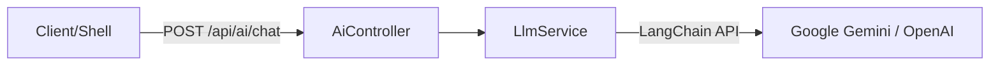

# Task 3.1: AI Service Setup & LLM Integration 결과 보고서

## 1. 개요

`ai-service` 구축 및 LLM 연동 작업을 완료하였습니다. 이제 `apps/ai/ai-service`는 NestJS 기반의 독립 마이크로서비스로서 LLM(Google Gemini, OpenAI)과 통신할 수 있는 기반을 갖추었습니다.

## 2. 수행 내용

### 2.1 LangChain 도입

- **Dependencies**: `@langchain/core`, `@langchain/google-genai`, `@langchain/openai` 등의 패키지를 Root Workspace에 추가했습니다.
- **Provider Agnostic**: `LlmService` 내부에서 Google Gemini와 OpenAI를 환경변수(`LLM_PROVIDER`)에 따라 전환할 수 있도록 구현했습니다.

### 2.2 서비스 아키텍처

### 2.3 주요 구현 코드

- **`LlmService`**: LangChain `ChatModel`을 초기화하고, `chat()` 메서드를 통해 텍스트 응답을 처리합니다.
- **`AiController`**: REST API 엔드포인트(`/ai/chat`)를 제공하며 Swagger 문서화가 적용되었습니다.
- **`AiModule`**: AI 관련 기능을 캡슐화하고 `AppModule`에 통합했습니다.

## 3. 검증 결과

- **Build**: `nx build ai-service` 명령이 성공적으로 완료되었습니다.
- **Configuration**: `SharedInfraModule` 및 `SharedDomainModule`과의 의존성 연결이 정상적으로 확인되었습니다.

## 4. Why This Matters?

이 작업은 향후 모든 ERP 모듈(인사, 재무 등)에서 AI 기능을 활용할 수 있는 **중앙 허브**를 구축한 것입니다.

- 예: "이번 달 급여 대장 요약해줘" -> `ai-service`가 RAG를 통해 데이터 조회 후 LLM으로 요약 반환.

## 5. 향후 계획

- **RAG 구현**: Vector DB(Milvus)와 연동하여 기업 데이터 기반 답변 기능 추가.
- **Tools 연동**: LangChain Tool을 사용하여 DB 조회 등의 Action 수행 기능 추가.
