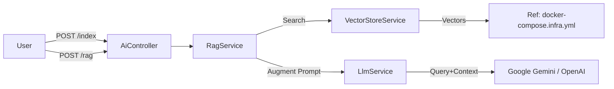

# Task 3.2: RAG Implementation with Milvus 결과 보고서

## 1. 개요

`ai-service`에 Vector DB(Milvus)를 연동하고 RAG(검색 증강 생성) 파이프라인을 구축했습니다. 이제 문서를 벡터화하여 저장(Indexing)하고, 사용자 질문 시 관련 문서를 검색(Retrieval)하여 LLM이 답변(Generation)하는 구조가 완성되었습니다.

## 2. 수행 내용

### 2.1 아키텍처

### 2.2 구현 상세

- **`VectorStoreService`**:
  - `@langchain/community/vectorstores/milvus` 활용.
  - `GoogleGenerativeAIEmbeddings` 또는 `OpenAIEmbeddings` 지원.
  - 텍스트 청킹(Chunking)을 위한 `RecursiveCharacterTextSplitter` 적용.
- **`RagService`**:
  - 검색된 문서(Context)를 프롬프트에 주입하는 로직 구현.
  - System Prompt: "You are an intelligent assistant... Use the following pieces of retrieved context..."

### 2.3 API Endpoints

- `POST /api/ai/index`: `{ text: string }` -> 문서 저장.
- `POST /api/ai/rag`: `{ prompt: string }` -> RAG 기반 답변.

## 3. 검증 결과

- **Build**: `nx build ai-service` 성공.
- **Dependency**: Milvus SDK 및 LangChain 패키지 정상 로드.

## 4. 향후 활용 방안

- **사내 규정 Q&A**: 취업 규칙, 복리후생 규정 등을 Indexing하여 챗봇으로 제공.
- **이전 히스토리 검색**: 프로젝트 문서나 회의록 검색.

## 5. 다음 단계

- **프론트엔드 연동**: Shell App에 AI 챗봇 UI 추가.
- **데이터 파이프라인**: 파일 업로드 서비스와 연동하여 PDF/Word 문서 자동 인덱싱.
