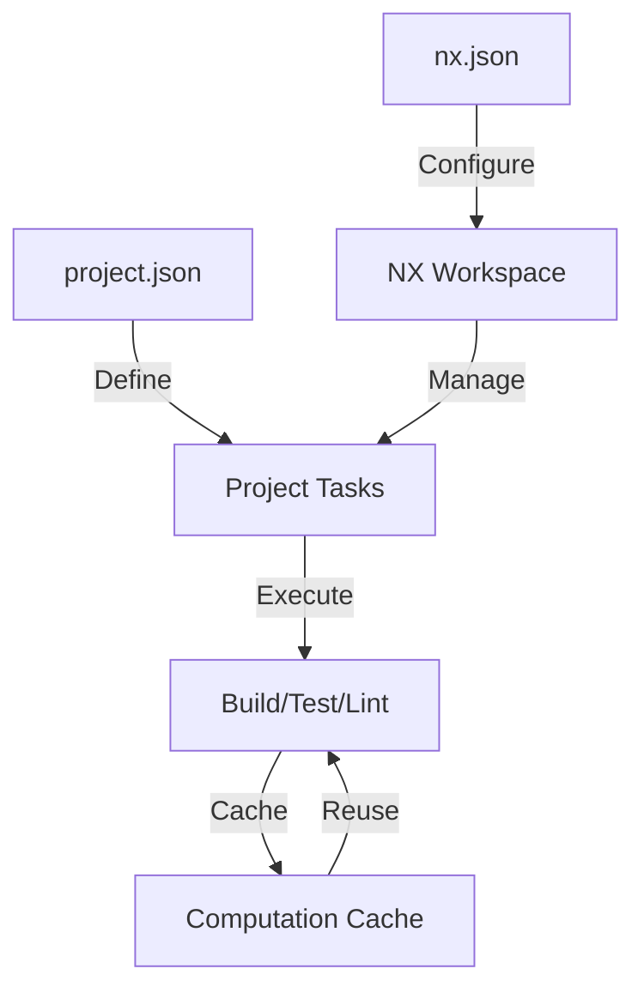
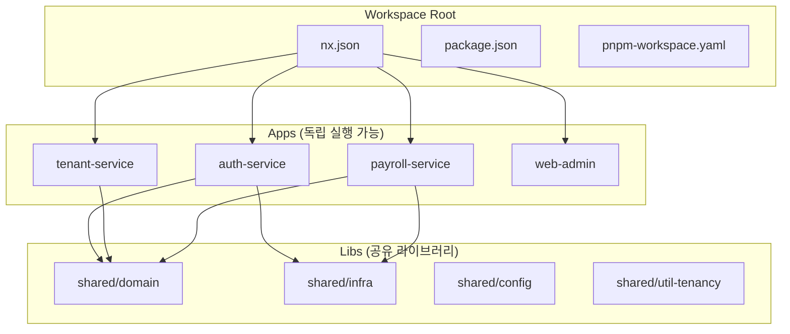
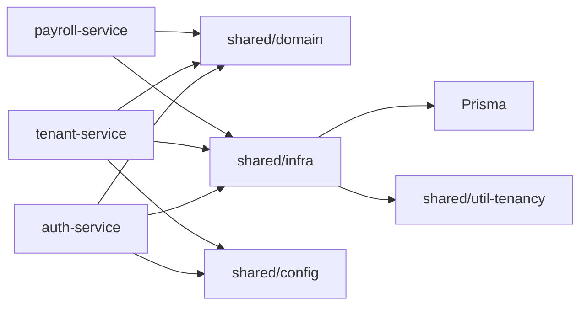
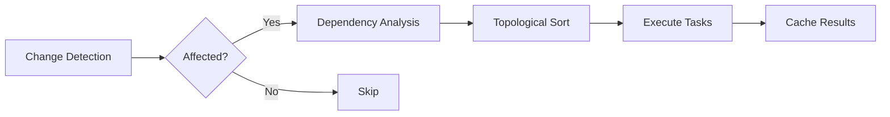
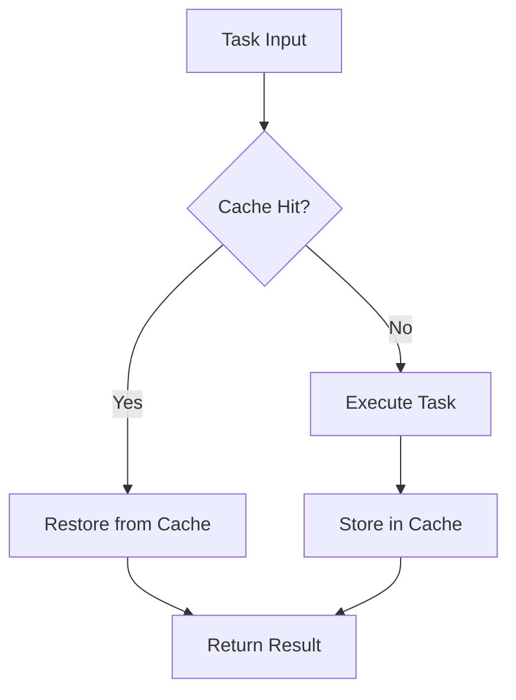
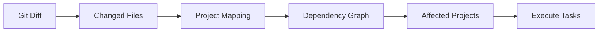
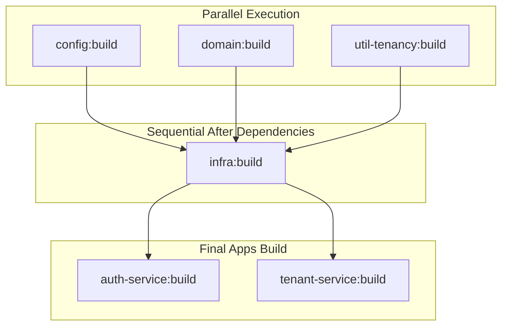
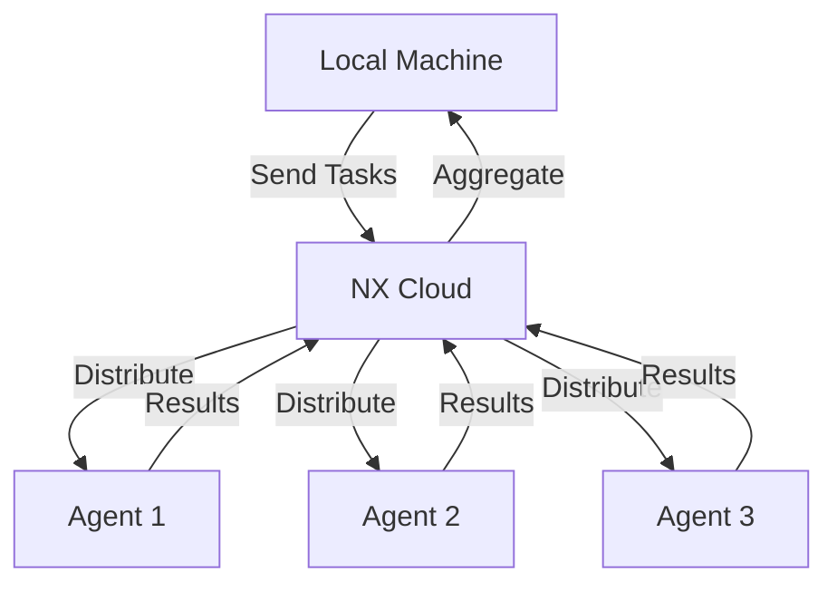

# NX 아키텍처 가이드

이 문서는 All-ERP 프로젝트에서 NX를 어떻게 사용하는지에 대한 아키텍처 가이드입니다.

## 📖 목차

- [NX란?](#nx란)
- [모노레포 아키텍처](#모노레포-아키텍처)
- [프로젝트 구조](#프로젝트-구조)
- [의존성 관리](#의존성-관리)
- [빌드 시스템](#빌드-시스템)
- [캐싱 전략](#캐싱-전략)

---

## NX란?

NX는 모노레포(Monorepo)를 위한 **스마트하고 확장 가능한 빌드 시스템**입니다.

### 핵심 특징

1. **Computation Caching**: 이전 빌드 결과를 캐싱하여 불필요한 재빌드 방지
2. **Affected Analysis**: 변경사항에 영향받는 프로젝트만 선택적으로 빌드/테스트
3. **Task Orchestration**: 의존성 그래프를 기반으로 작업을 최적 순서로 실행
4. **Distributed Execution**: 여러 머신에서 작업을 병렬 실행 (NX Cloud)

### 주요 구성요소



---

## 모노레포 아키텍처

### All-ERP 모노레포 구조



### 모노레포의 장점

1. **코드 공유**: 공통 로직을 라이브러리로 분리하여 재사용
2. **일관성**: 모든 프로젝트가 동일한 버전의 의존성 사용
3. **Atomic Changes**: 여러 프로젝트를 한 번의 커밋으로 동시에 변경
4. **의존성 추적**: 프로젝트 간 의존성을 명확하게 관리

---

## 프로젝트 구조

### 디렉토리 레이아웃

```
all-erp/
├── apps/                      # 애플리케이션 (독립 실행)
│   ├── auth-service/
│   │   ├── src/
│   │   ├── project.json       # NX 프로젝트 설정
│   │   └── tsconfig.json
│   ├── tenant-service/
│   ├── payroll-service/
│   └── web-admin/
│
├── libs/                      # 공유 라이브러리
│   └── shared/
│       ├── domain/            # 비즈니스 로직
│       ├── infra/             # 인프라 (Prisma 등)
│       ├── config/            # 설정
│       └── util-tenancy/      # 테넌시 유틸리티
│
├── nx.json                    # NX workspace 설정
├── package.json               # Root package.json
└── pnpm-workspace.yaml        # pnpm workspace 설정
```

### 프로젝트 타입

#### Apps (애플리케이션)

독립적으로 실행 가능한 서비스 또는 앱입니다.

```json
// apps/auth-service/project.json
{
  "name": "auth-service",
  "targets": {
    "build": { "executor": "@nx/webpack:webpack" },
    "serve": { "executor": "@nx/js:node" },
    "test": { "executor": "@nx/jest:jest" },
    "lint": { "executor": "@nx/eslint:lint" }
  }
}
```

#### Libs (라이브러리)

여러 앱에서 공유하는 코드입니다.

```json
// libs/shared/domain/project.json
{
  "name": "domain",
  "targets": {
    "lint": { "executor": "@nx/eslint:lint" },
    "test": { "executor": "@nx/jest:jest" }
  }
}
```

---

## 의존성 관리

### 의존성 그래프



### 의존성 규칙

1. **Apps → Libs**: 앱은 라이브러리에 의존할 수 있음
2. **Libs → Libs**: 라이브러리 간 의존 가능 (순환 참조 금지)
3. **Libs ↛ Apps**: 라이브러리는 앱에 의존할 수 없음

### Dependency Constraints

`nx.json`에서 의존성 규칙을 강제합니다:

```json
{
  "namedInputs": {
    "default": ["{projectRoot}/**/*"]
  },
  "targetDefaults": {
    "build": {
      "dependsOn": ["^build"]
    }
  }
}
```

---

## 빌드 시스템

### Task Pipeline



### Task 실행 순서

NX는 의존성 그래프를 기반으로 최적의 실행 순서를 결정합니다.

```bash
# auth-service를 빌드하면
pnpm nx build auth-service

# 실제 실행 순서:
# 1. shared/config:build
# 2. shared/domain:build
# 3. shared/util-tenancy:build
# 4. shared/infra:build (domain, util-tenancy에 의존)
# 5. auth-service:build (모든 libs 빌드 완료 후)
```

### Executor

각 task는 executor를 통해 실행됩니다.

| Executor              | 설명              | 사용 예            |
| --------------------- | ----------------- | ------------------ |
| `@nx/webpack:webpack` | Webpack 빌드      | NestJS 서비스 빌드 |
| `@nx/jest:jest`       | Jest 테스트       | 단위 테스트        |
| `@nx/eslint:lint`     | ESLint            | 코드 품질 검사     |
| `@nx/js:tsc`          | TypeScript 컴파일 | 라이브러리 빌드    |

---

## 캐싱 전략

### Computation Cache

NX는 작업 결과를 캐싱하여 성능을 향상시킵니다.



### Cache Input

다음 항목들이 변경되면 캐시가 무효화됩니다:

1. **소스 코드**: 프로젝트 파일
2. **의존성**: `package.json`, `pnpm-lock.yaml`
3. **설정 파일**: `tsconfig.json`, `project.json`
4. **환경 변수**: 빌드에 영향을 주는 환경 변수

### Cache 위치

```
.nx/cache/                # 로컬 캐시
node_modules/.cache/nx/   # 보조 캐시
```

### Cache 제어

```bash
# 캐시 무시하고 실행
pnpm nx build auth-service --skip-nx-cache

# 캐시 초기화
pnpm nx reset
```

---

## Affected 명령어

### 변경 영향 분석



### 사용 예제

```bash
# main 브랜치와 비교하여 영향받은 프로젝트만 린트
pnpm nx affected -t lint --base=main

# 영향받은 프로젝트만 테스트
pnpm nx affected -t test --base=main --head=HEAD

# 영향받은 프로젝트만 빌드
pnpm nx affected -t build
```

### Affected 그래프 시각화

```bash
# 웹 브라우저에서 영향받은 프로젝트 확인
pnpm nx affected:graph
```

---

## Task Orchestration

### 병렬 실행

```bash
# 최대 3개 프로젝트 동시 실행
pnpm nx run-many -t build --all --parallel=3

# 모든 CPU 코어 사용
pnpm nx run-many -t build --all --parallel
```

### 의존성 기반 실행



---

## NX Cloud (선택사항)

### Distributed Task Execution



### Remote Caching

여러 개발자와 CI 머신이 캐시를 공유합니다.

```bash
# NX Cloud 연결 (선택사항)
npx nx connect-to-nx-cloud
```

---

## Best Practices

### 1. 작은 라이브러리 선호

```
❌ 나쁜 예:
libs/shared/everything/

✅ 좋은 예:
libs/shared/domain/
libs/shared/infra/
libs/shared/config/
```

### 2. 순환 의존성 방지

```typescript
// ❌ 나쁜 예
// lib-a imports lib-b
// lib-b imports lib-a

// ✅ 좋은 예
// lib-a imports lib-common
// lib-b imports lib-common
```

### 3. Affected 활용

```bash
# CI에서 변경된 부분만 검증
pnpm nx affected -t lint,test,build --base=origin/main
```

### 4. 적절한 프로젝트 분리

- **Apps**: 실행 가능한 서비스
- **Libs**: 재사용 가능한 코드
- **E2E**: E2E 테스트 전용 프로젝트

---

## 참고 자료

- [NX 공식 문서](https://nx.dev)
- [NX 명령어 가이드](./README.md)
- [프로젝트 컨텍스트](../../ai/project_context.md)

---

**작성일**: 2025-12-03  
**버전**: 1.0.0
