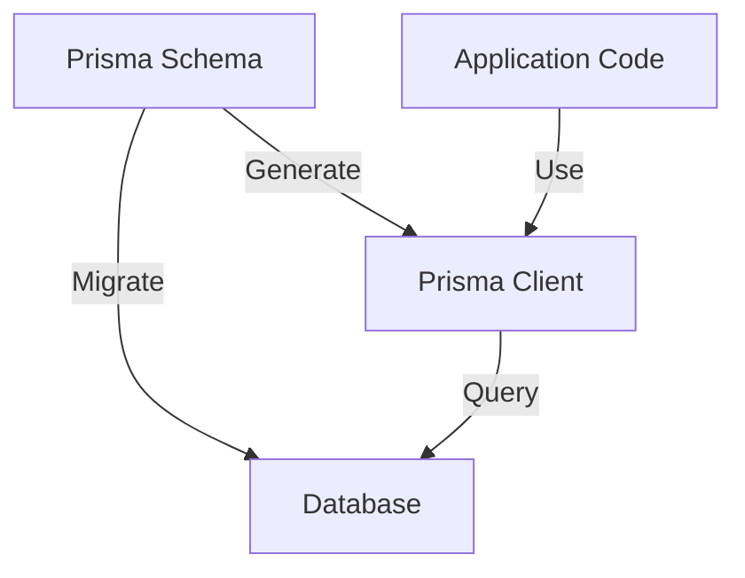
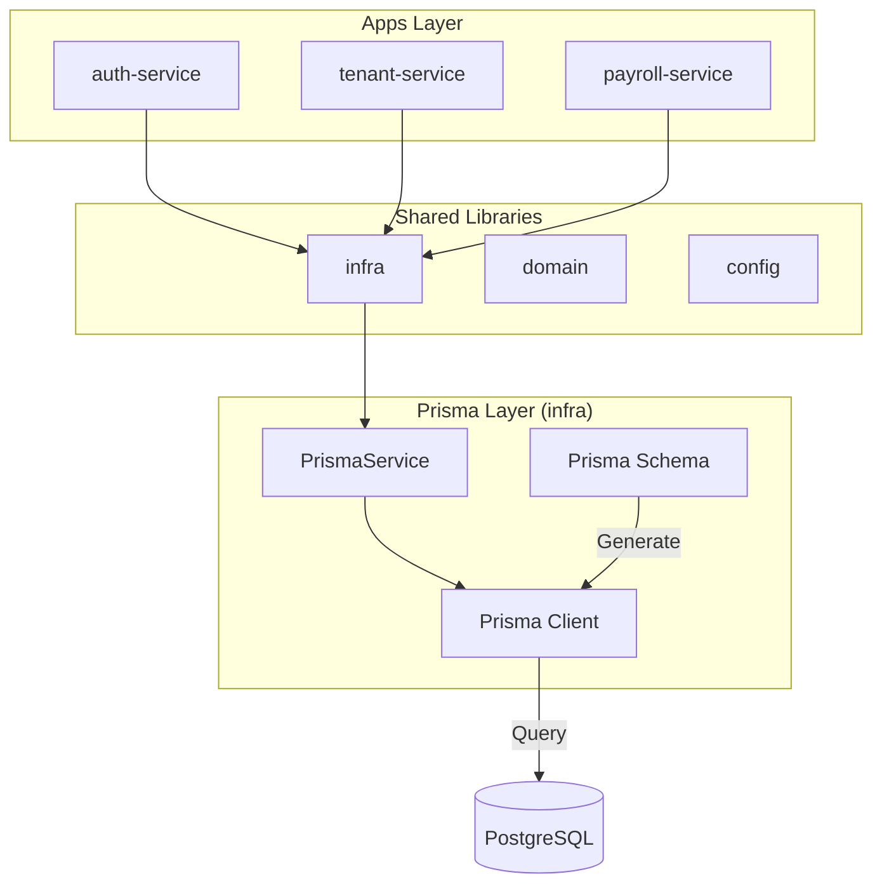
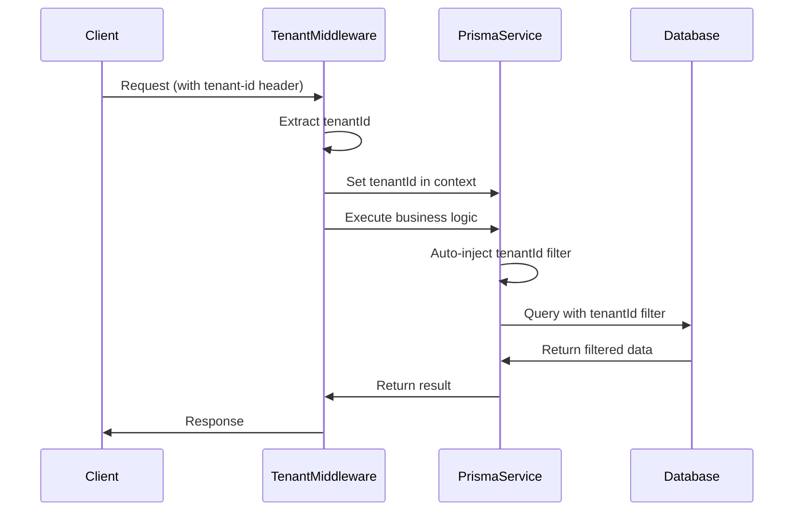
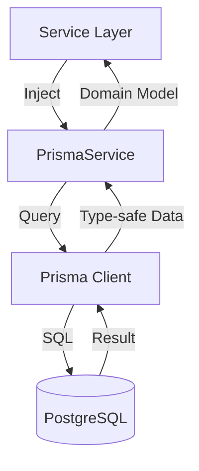

# Prisma 아키텍처 가이드

이 문서는 All-ERP 프로젝트에서 Prisma를 어떻게 사용하는지에 대한 아키텍처 가이드입니다.

## 📖 목차

- [Prisma란?](#prisma란)
- [프로젝트 아키텍처](#프로젝트-아키텍처)
- [디렉토리 구조](#디렉토리-구조)
- [핵심 구성요소](#핵심-구성요소)
- [Multi-Tenancy 구현](#multi-tenancy-구현)
- [데이터 흐름](#데이터-흐름)

---

## Prisma란?

Prisma는 TypeScript와 Node.js를 위한 **차세대 ORM(Object-Relational Mapping)**입니다.

### 핵심 특징

1. **타입 안전성**: TypeScript와 완벽하게 통합되어 컴파일 타임에 오류를 감지합니다
2. **자동 생성**: Schema에서 TypeScript 타입을 자동으로 생성합니다
3. **직관적인 API**: 읽기 쉽고 작성하기 쉬운 쿼리 API를 제공합니다
4. **마이그레이션**: 데이터베이스 스키마 변경을 안전하게 관리합니다

### 주요 구성요소



1. **Prisma Schema**: 데이터 모델 정의 (`.prisma` 파일)
2. **Prisma Client**: 자동 생성된 타입 안전 데이터베이스 클라이언트
3. **Prisma Migrate**: 데이터베이스 마이그레이션 도구

---

## 프로젝트 아키텍처

### All-ERP에서의 Prisma 위치



### 레이어 설명

1. **Apps Layer**: 개별 마이크로서비스 (auth, tenant, payroll 등)
2. **Shared Libraries**: 공통 라이브러리
   - `infra`: PrismaService 등 인프라 코드
   - `domain`: 비즈니스 로직
   - `config`: 설정 관리
3. **Prisma Layer**: 데이터베이스 접근 계층
4. **Database**: PostgreSQL 데이터베이스

---

## 디렉토리 구조

```
all-erp/
├── libs/
│   └── shared/
│       └── infra/
│           ├── prisma/
│           │   └── schema.prisma          # Prisma 스키마 정의
│           └── src/
│               └── lib/
│                   └── prisma/
│                       └── prisma.module.ts  # PrismaService 구현
└── node_modules/
    └── @prisma/
        └── client/                          # 생성된 Prisma Client
```

### 파일 설명

- **`schema.prisma`**: 모든 데이터 모델과 관계 정의
- **`prisma.module.ts`**: NestJS용 PrismaService 래퍼
- **`@prisma/client`**: 자동 생성된 TypeScript 타입 및 클라이언트

---

## 핵심 구성요소

### 1. Prisma Schema (`schema.prisma`)

데이터베이스 모델을 선언적으로 정의합니다.

```prisma
// 데이터베이스 연결 설정
datasource db {
    provider = "postgresql"
}

// Client 생성 설정
generator client {
    provider = "prisma-client-js"
}

// 데이터 모델 정의
model User {
    id        String   @id @default(uuid())
    email     String   @unique
    password  String
    role      Role     @default(USER)
    tenantId  String?
    createdAt DateTime @default(now())
    updatedAt DateTime @updatedAt

    @@index([tenantId])
}

enum Role {
    USER
    ADMIN
    MANAGER
}
```

### 2. PrismaService (`prisma.module.ts`)

NestJS에서 Prisma Client를 사용하기 위한 서비스입니다.

```typescript
@Injectable()
export class PrismaService extends PrismaClient implements OnModuleInit, OnModuleDestroy {
  async onModuleInit() {
    await this.$connect(); // 모듈 초기화 시 DB 연결
  }

  async onModuleDestroy() {
    await this.$disconnect(); // 모듈 종료 시 DB 연결 해제
  }
}
```

### 3. Prisma Client

자동 생성된 타입 안전 클라이언트입니다.

```typescript
// 자동 생성된 타입
import { User, Role } from '@prisma/client';

// PrismaService 사용
constructor(private prisma: PrismaService) {}

// 타입 안전한 쿼리
const user = await this.prisma.user.findUnique({
  where: { email: 'user@example.com' }
});
```

---

## Multi-Tenancy 구현

All-ERP는 **Multi-tenancy**를 지원합니다. 각 테넌트의 데이터를 자동으로 격리합니다.

### 아키텍처



### 구현 방식

#### 1. Schema에 tenantId 추가

```prisma
model User {
    id       String @id
    email    String
    tenantId String?  // Multi-tenancy 지원

    @@index([tenantId])  // 성능 최적화
}
```

#### 2. Middleware에서 자동 필터링

```typescript
// PrismaService의 constructor에서
this.$use(async (params, next) => {
  const tenantId = (global as any).currentTenantId;

  if (tenantId && params.model) {
    // Read 쿼리에 tenantId 필터 추가
    if (['findMany', 'findFirst', 'findUnique'].includes(params.action)) {
      params.args.where = params.args.where || {};
      params.args.where.tenantId = tenantId;
    }

    // Create 쿼리에 tenantId 자동 추가
    if (params.action === 'create') {
      params.args.data.tenantId = tenantId;
    }
  }

  return next(params);
});
```

#### 3. TenantMiddleware에서 tenantId 설정

```typescript
export class TenantMiddleware implements NestMiddleware {
  use(req: Request, res: Response, next: NextFunction) {
    const tenantId = req.headers['x-tenant-id'];

    if (tenantId) {
      this.prisma.setTenantId(tenantId as string);
    }

    next();
  }
}
```

---

## 데이터 흐름

### 일반적인 CRUD 작업



### 예제: 사용자 조회

```typescript
// 1. Service Layer에서 요청
@Injectable()
export class AuthService {
  constructor(private prisma: PrismaService) {}

  async findUser(email: string) {
    // 2. PrismaService 사용
    const user = await this.prisma.user.findUnique({
      where: { email },
      // 3. tenantId 자동 필터링 (Middleware)
    });

    // 4. 타입 안전한 결과 반환
    return user; // Type: User | null
  }
}
```

---

## Best Practices

### 1. 항상 index 사용

```prisma
model User {
    email    String  @unique
    tenantId String?

    @@index([tenantId])        // 테넌트별 조회 최적화
    @@index([email, tenantId]) // 복합 조회 최적화
}
```

### 2. 관계 정의 활용

```prisma
model Employee {
    id           String      @id
    userId       String      @unique
    user         User        @relation(fields: [userId], references: [id])
    departmentId String?
    department   Department? @relation(fields: [departmentId], references: [id])
}
```

### 3. Transaction 사용

```typescript
await this.prisma.$transaction(async (tx) => {
  const user = await tx.user.create({ data: userData });
  const employee = await tx.employee.create({
    data: { ...employeeData, userId: user.id },
  });
  return { user, employee };
});
```

### 4. Select로 필요한 필드만 조회

```typescript
const user = await this.prisma.user.findUnique({
  where: { id },
  select: {
    id: true,
    email: true,
    name: true,
    // password는 제외
  },
});
```

---

## 참고 자료

- [Prisma 공식 문서](https://www.prisma.io/docs)
- [Prisma 사용자 가이드](./user-guide.md)
- [프로젝트 Schema](file:///data/all-erp/libs/shared/infra/prisma/schema.prisma)

---

**작성일**: 2025-12-03  
**버전**: 1.0.0
