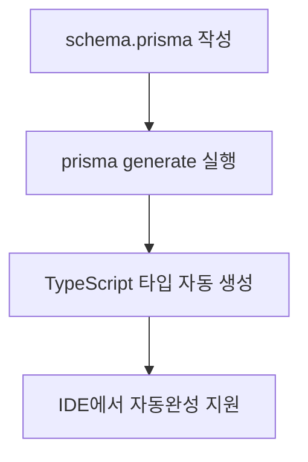
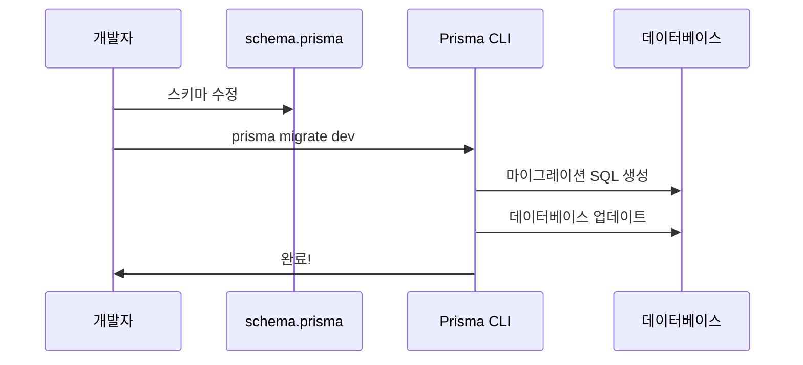
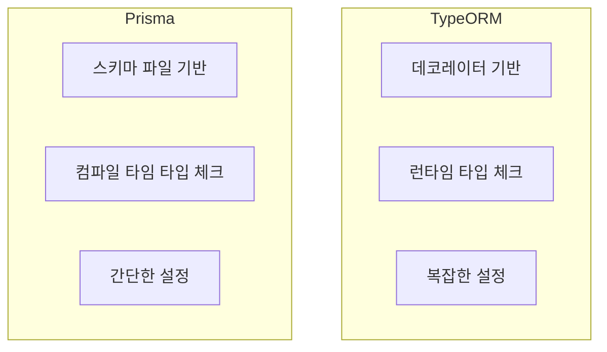
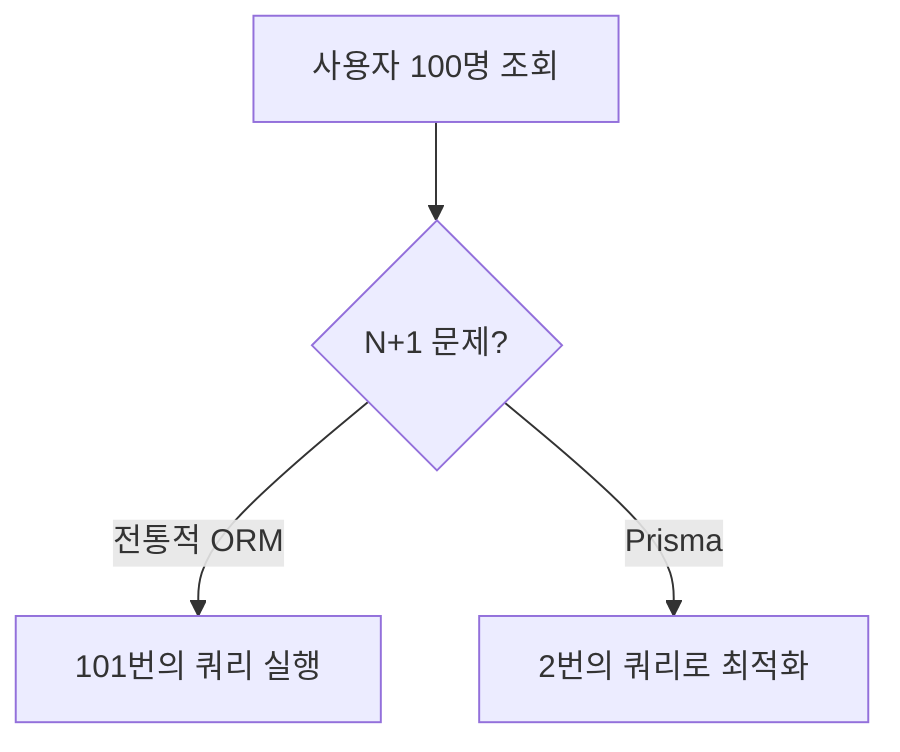
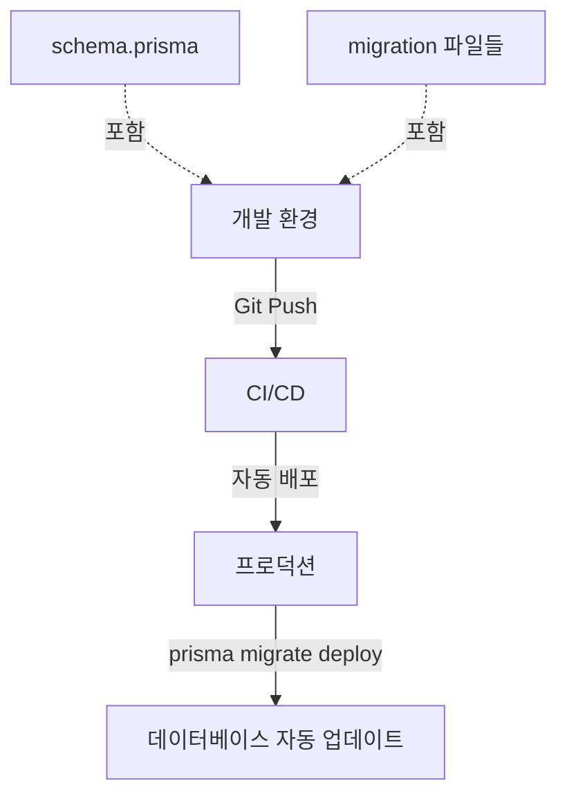
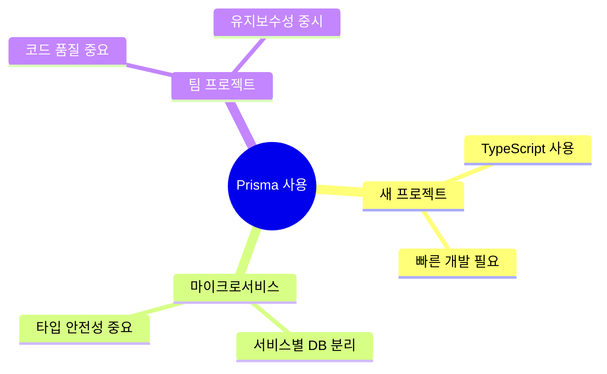
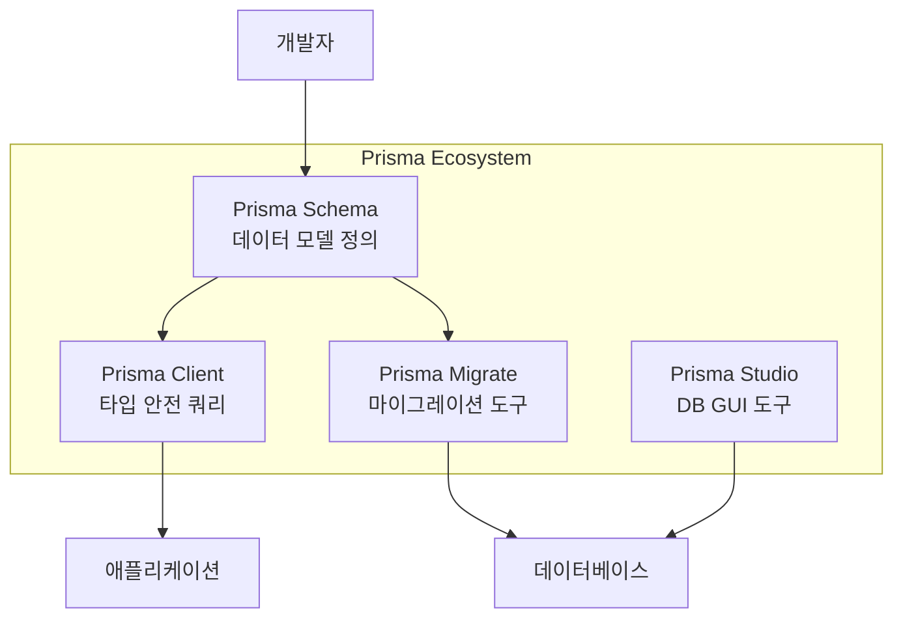
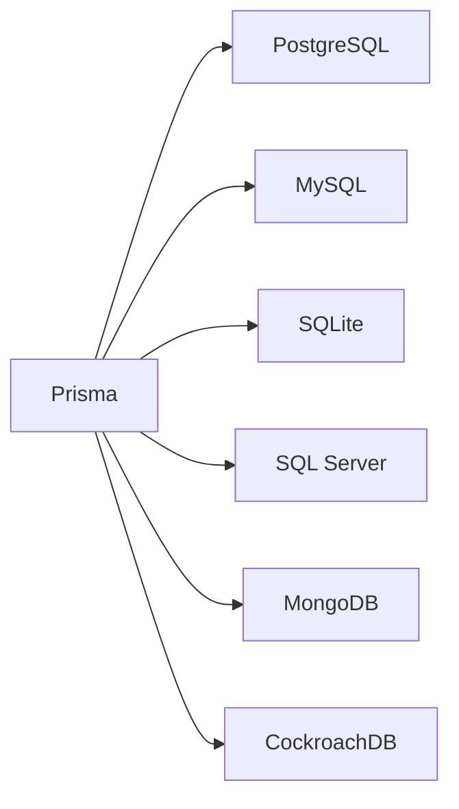
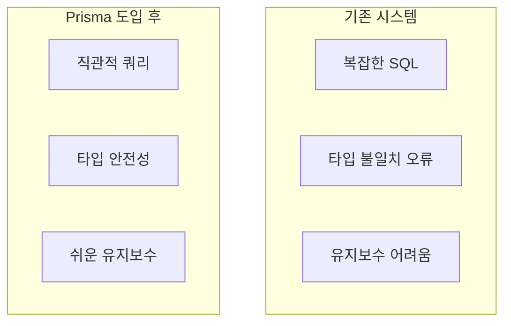

# Prisma 학습 가이드 - 01. Prisma 소개

## 📖 학습 목표
- Prisma가 무엇인지 이해하기
- 전통적인 ORM과의 차이점 파악하기
- Prisma의 주요 장점 알아보기

---

## 1. Prisma란 무엇인가요?

**Prisma**는 Node.js와 TypeScript를 위한 차세대 ORM(Object-Relational Mapping) 도구입니다.

### 🤔 ORM이 뭔가요?
ORM은 **객체와 데이터베이스를 연결해주는 다리** 역할을 합니다.


**ORM 없이 데이터베이스를 사용하면:**
```javascript
// SQL을 직접 작성해야 합니다
const result = await db.query(
  'SELECT * FROM users WHERE email = $1', 
  ['user@example.com']
)
```

**Prisma를 사용하면:**
```javascript
// 타입 안전한 자바스크립트 코드로 작성
const user = await prisma.user.findUnique({
  where: { email: 'user@example.com' }
})
```

---

## 2. Prisma의 핵심 특징

### ✅ 타입 안전성 (Type Safety)

Prisma는 데이터베이스 스키마를 기반으로 **TypeScript 타입을 자동 생성**합니다.



**실제 예제:**
```typescript
// Prisma가 자동으로 생성한 타입
const user = await prisma.user.create({
  data: {
    email: 'test@example.com',
    name: 'John',
    age: 'string' // ❌ 에러! age는 숫자여야 합니다
  }
})
```

### ✅ 직관적인 쿼리 API

SQL을 몰라도 데이터를 쉽게 다룰 수 있습니다.

```typescript
// 사용자와 그의 모든 게시글을 가져오기
const userWithPosts = await prisma.user.findUnique({
  where: { id: 1 },
  include: { posts: true }
})
```

### ✅ 자동 마이그레이션

데이터베이스 스키마 변경을 안전하게 관리합니다.



---

## 3. Prisma vs 전통적인 ORM

### TypeORM과 비교



### 📊 상세 비교표

| 특징 | TypeORM | Prisma |
|------|---------|--------|
| **정의 방식** | 데코레이터 (@Entity) | schema.prisma 파일 |
| **타입 안전성** | 제한적 | 완벽한 타입 추론 |
| **학습 곡선** | 가파름 | 완만함 |
| **쿼리 성능** | N+1 문제 발생 가능 | 자동 최적화 |
| **마이그레이션** | 수동 관리 필요 | 자동 생성 |

### TypeORM 예제
```typescript
@Entity()
class User {
  @PrimaryGeneratedColumn()
  id: number;
  
  @Column()
  email: string;
  
  @OneToMany(() => Post, post => post.author)
  posts: Post[];
}
```

### Prisma 예제 (같은 기능)
```prisma
model User {
  id    Int    @id @default(autoincrement())
  email String
  posts Post[]
}
```

**👀 보시다시피 Prisma가 훨씬 간결합니다!**

---

## 4. Prisma의 주요 장점

### 🚀 1. 개발 생산성 향상


**실제 경험:**
- SQL 문법을 외울 필요 없음
- IDE의 자동완성으로 빠르게 코딩
- 타입 오류를 컴파일 시점에 발견

### 🛡️ 2. 버그 감소

```typescript
// ❌ TypeORM: 런타임에 오류 발견
const users = await userRepository.find({
  where: { emial: 'test@example.com' } // 오타! 런타임 에러
})

// ✅ Prisma: 컴파일 시점에 오류 발견
const users = await prisma.user.findMany({
  where: { emial: 'test@example.com' } // 빨간 줄! IDE가 즉시 알려줌
})
```

### ⚡ 3. 성능 최적화

Prisma는 **N+1 쿼리 문제를 자동으로 해결**합니다.



**예제:**
```typescript
// Prisma가 자동으로 최적화
const users = await prisma.user.findMany({
  include: { posts: true }
})
// 실행되는 쿼리:
// 1. SELECT * FROM users
// 2. SELECT * FROM posts WHERE authorId IN (1,2,3,...)
```

### 🔄 4. 안전한 마이그레이션



---

## 5. 언제 Prisma를 사용해야 할까요?

### ✅ Prisma가 적합한 경우



1. **새로운 프로젝트를 시작할 때**
2. **TypeScript를 사용하는 프로젝트**
3. **마이크로서비스 아키텍처**
4. **빠른 프로토타이핑이 필요할 때**
5. **타입 안전성이 중요한 프로젝트**

### ⚠️ Prisma가 적합하지 않은 경우

1. **매우 복잡한 SQL이 필요한 경우**
   - 하지만 Prisma에서도 Raw SQL 사용 가능!
   
2. **NoSQL 데이터베이스를 주로 사용하는 경우**
   - MongoDB는 지원하지만 제한적

---

## 6. Prisma 에코시스템



### 주요 구성 요소

1. **Prisma Client**: 쿼리를 실행하는 자동 생성 라이브러리
2. **Prisma Migrate**: 데이터베이스 스키마 버전 관리
3. **Prisma Studio**: 데이터를 시각적으로 관리하는 GUI
4. **Prisma Schema**: 데이터 모델을 정의하는 파일

---

## 7. 지원하는 데이터베이스



**각 데이터베이스별 특징:**

- **PostgreSQL**: 가장 권장, 모든 기능 지원
- **MySQL**: 널리 사용, 안정적
- **SQLite**: 개발/테스트용으로 적합
- **MongoDB**: NoSQL, 일부 기능 제한
- **SQL Server**: 엔터프라이즈 환경
- **CockroachDB**: 분산 데이터베이스

---

## 8. 실제 사용 사례

### 사례 1: 스타트업의 빠른 MVP 개발


**효과:**
- 개발 시간 50% 단축
- 타입 오류로 인한 버그 90% 감소

### 사례 2: 대규모 마이크로서비스



---

## 🎯 요약

### Prisma를 선택해야 하는 이유

1. **타입 안전성**: 컴파일 시점에 모든 오류 발견
2. **생산성**: SQL 없이 빠른 개발
3. **성능**: 자동 쿼리 최적화
4. **유지보수**: 명확한 스키마 관리
5. **마이그레이션**: 안전한 데이터베이스 변경

### 다음 단계

이제 Prisma가 무엇인지 이해했으니, 다음 장에서는:
- Prisma의 내부 아키텍처
- 각 컴포넌트가 어떻게 동작하는지
- 실제 데이터 흐름

을 자세히 알아보겠습니다!

---

## 💡 팁

> **초보자를 위한 조언:**
> Prisma는 처음에는 새로운 개념이 많아 보일 수 있지만, 
> 한 번 익숙해지면 다른 ORM으로 돌아가기 어려울 정도로 편리합니다!
> 
> 이 가이드를 따라 차근차근 학습하면 2-3일 안에 
> 실전 프로젝트에 적용할 수 있습니다.

---

**다음 장: [02. Prisma 아키텍처](./02-architecture.md)**
