# Prisma 학습 가이드 - 04. Prisma Schema 기초

## 📖 학습 목표
- Prisma Schema 문법 완벽히 이해하기
- 다양한 데이터 타입 활용하기
- 필드 속성과 모델 속성 마스터하기

---

## 1. Schema 파일 구조

### 📋 기본 구성 요소

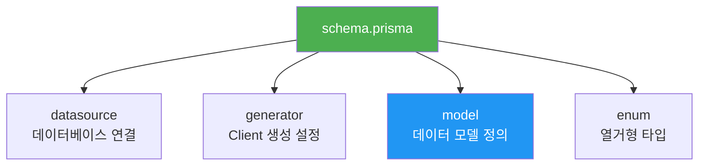

**완전한 Schema 예제:**

```prisma
// 1️⃣ 데이터소스 설정
datasource db {
  provider = "postgresql"
  url      = env("DATABASE_URL")
}

// 2️⃣ 생성기 설정
generator client {
  provider = "prisma-client-js"
}

// 3️⃣ 열거형 정의
enum Role {
  USER
  ADMIN
  MODERATOR
}

// 4️⃣ 모델 정의
model User {
  id        Int      @id @default(autoincrement())
  email     String   @unique
  name      String?
  role      Role     @default(USER)
  posts     Post[]
  createdAt DateTime @default(now())
  
  @@index([email])
  @@map("users")
}

model Post {
  id        Int      @id @default(autoincrement())
  title     String
  content   String?
  published Boolean  @default(false)
  authorId  Int
  author    User     @relation(fields: [authorId], references: [id])
  
  @@index([authorId])
}
```

---

## 2. 데이터 타입 완벽 가이드

### 🔢 기본 스칼라 타입

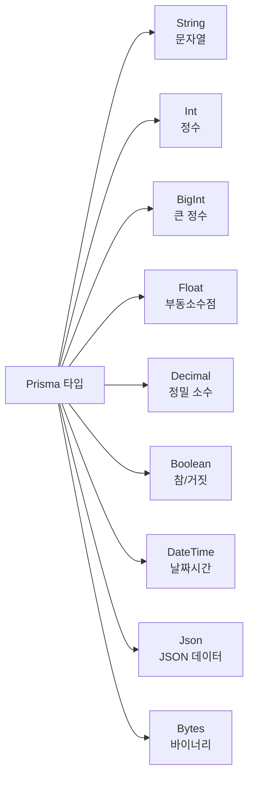

### 📊 타입 매핑 표

| Prisma 타입 | PostgreSQL | MySQL | SQLite | TypeScript |
|------------|-----------|-------|---------|------------|
| `String` | TEXT/VARCHAR | VARCHAR | TEXT | string |
| `Int` | INTEGER | INT | INTEGER | number |
| `BigInt` | BIGINT | BIGINT | INTEGER | bigint |
| `Float` | DOUBLE PRECISION | DOUBLE | REAL | number |
| `Decimal` | DECIMAL(65,30) | DECIMAL(65,30) | - | Decimal |
| `Boolean` | BOOLEAN | BOOLEAN | INTEGER | boolean |
| `DateTime` | TIMESTAMP(3) | DATETIME(3) | NUMERIC | Date |
| `Json` | JSONB | JSON | TEXT | JsonValue |
| `Bytes` | BYTEA | LONGBLOB | BLOB | Buffer |

### 💡 타입 사용 예제

```prisma
model Product {
  // 문자열
  name        String        // 필수
  description String?       // 선택적 (nullable)
  sku         String @unique // 고유값
  
  // 숫자
  price       Decimal @db.Decimal(10, 2)  // 정밀 소수 (10자리, 소수점 2자리)
  stock       Int                          // 정수
  views       BigInt @default(0)           // 큰 정수
  rating      Float                        // 부동소수점
  
  // 불리언
  published   Boolean @default(false)
  featured    Boolean @default(false)
  
  // 날짜/시간
  createdAt   DateTime @default(now())
  updatedAt   DateTime @updatedAt
  publishedAt DateTime?
  
  // JSON (유연한 데이터)
  metadata    Json?
  tags        Json?
  
  // 바이너리
  thumbnail   Bytes?
}
```

### 🎯 타입 선택 가이드

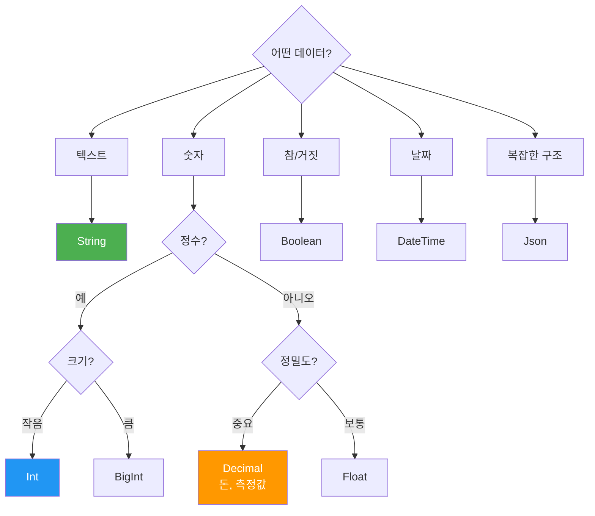

---

## 3. 필드 속성 (Field Attributes)

### 🏷️ 주요 필드 속성

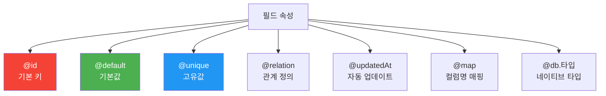

### 1️⃣ @id - 기본 키

```prisma
model User {
  // 자동 증가 정수
  id Int @id @default(autoincrement())
  
  // UUID
  id String @id @default(uuid())
  
  // CUID (더 짧고 정렬 가능한 고유 ID)
  id String @id @default(cuid())
}

// 복합 기본 키
model PostLike {
  userId Int
  postId Int
  
  @@id([userId, postId])
}
```

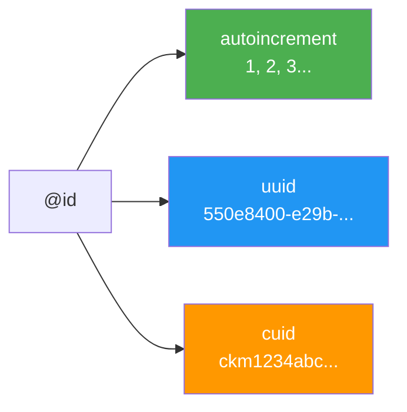

### 2️⃣ @default - 기본값

```prisma
model Post {
  // 상수 기본값
  published Boolean  @default(false)
  views     Int      @default(0)
  status    String   @default("draft")
  
  // 함수 기본값
  id        String   @default(uuid())
  createdAt DateTime @default(now())
  
  // DB 함수 (PostgreSQL)
  sequence  Int      @default(dbgenerated("nextval('post_seq')"))
}
```

### 3️⃣ @unique - 고유값 제약

```prisma
model User {
  id       Int    @id @default(autoincrement())
  email    String @unique          // 단일 컬럼 unique
  username String @unique
  
  // 복합 unique
  @@unique([email, username])
}
```

### 4️⃣ @updatedAt - 자동 업데이트

```prisma
model Post {
  id        Int      @id @default(autoincrement())
  title     String
  createdAt DateTime @default(now())
  updatedAt DateTime @updatedAt  // 자동으로 현재 시간으로 업데이트
}
```

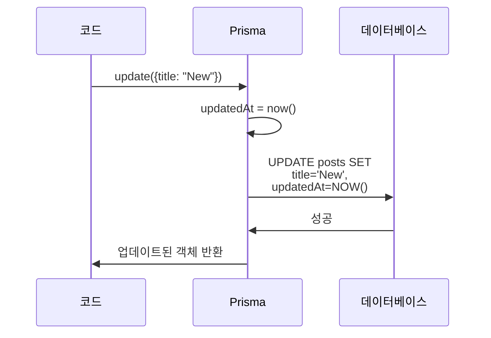

### 5️⃣ @map - 컬럼명 매핑

```prisma
model User {
  id        Int    @id @default(autoincrement())
  firstName String @map("first_name")  // DB에서는 first_name
  lastName  String @map("last_name")   // DB에서는 last_name
  
  // 코드에서는 firstName으로 사용
  // DB에서는 first_name으로 저장
}
```

### 6️⃣ @db - 네이티브 데이터베이스 타입

```prisma
model Product {
  id          Int     @id @default(autoincrement())
  
  // PostgreSQL 네이티브 타입
  name        String  @db.VarChar(255)
  description String  @db.Text
  price       Decimal @db.Decimal(10, 2)
  metadata    Json    @db.JsonB
  
  // MySQL 네이티브 타입
  content     String  @db.LongText
  thumbnail   Bytes   @db.LongBlob
}
```

---

## 4. 모델 속성 (Model Attributes)

### 🔧 블록 레벨 속성

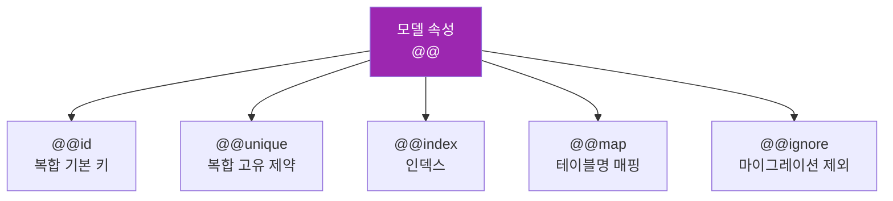

### 1️⃣ @@id - 복합 기본 키

```prisma
model UserRole {
  userId Int
  roleId Int
  
  user   User @relation(fields: [userId], references: [id])
  role   Role @relation(fields: [roleId], references: [id])
  
  @@id([userId, roleId])  // 복합 기본 키
}
```

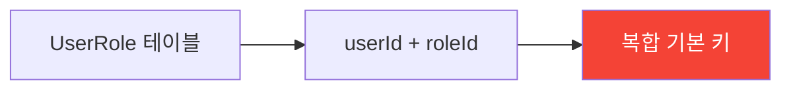

### 2️⃣ @@unique - 복합 고유 제약

```prisma
model Product {
  id       Int    @id @default(autoincrement())
  name     String
  category String
  sku      String
  
  // 같은 카테고리 내에서 이름이 고유해야 함
  @@unique([category, name])
  
  // SKU는 전역적으로 고유
  @@unique([sku])
}
```

### 3️⃣ @@index - 인덱스

```prisma
model Post {
  id        Int      @id @default(autoincrement())
  title     String
  content   String
  published Boolean
  authorId  Int
  createdAt DateTime @default(now())
  
  // 단일 컬럼 인덱스
  @@index([authorId])
  @@index([published])
  
  // 복합 인덱스 (순서 중요!)
  @@index([authorId, published, createdAt])
  
  // 이름 지정
  @@index([title], name: "title_idx")
  
  // 정렬 방향 지정
  @@index([createdAt(sort: Desc)])
}
```

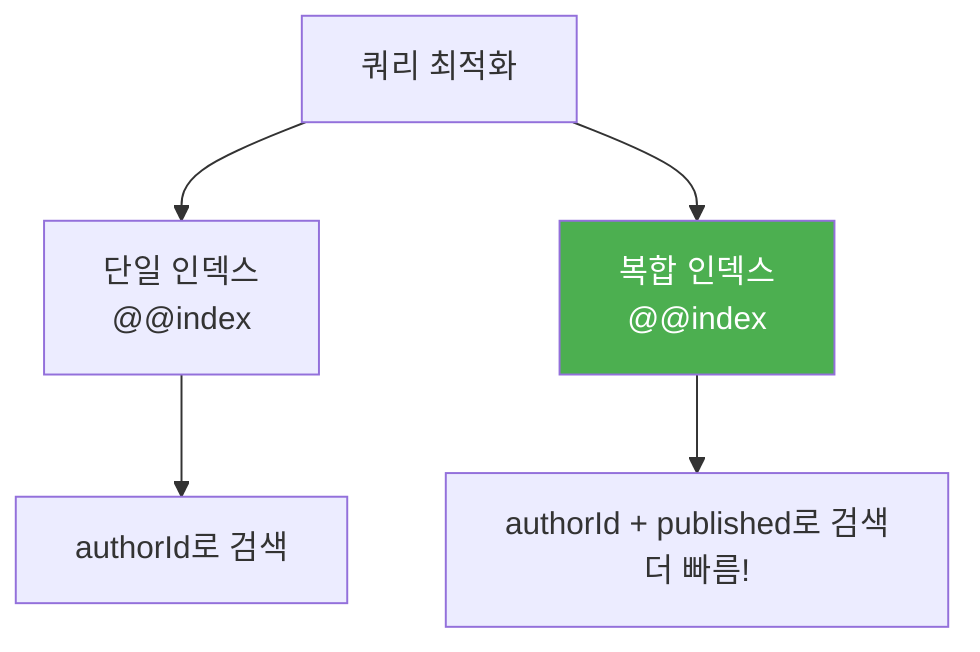

**인덱스 선택 가이드:**

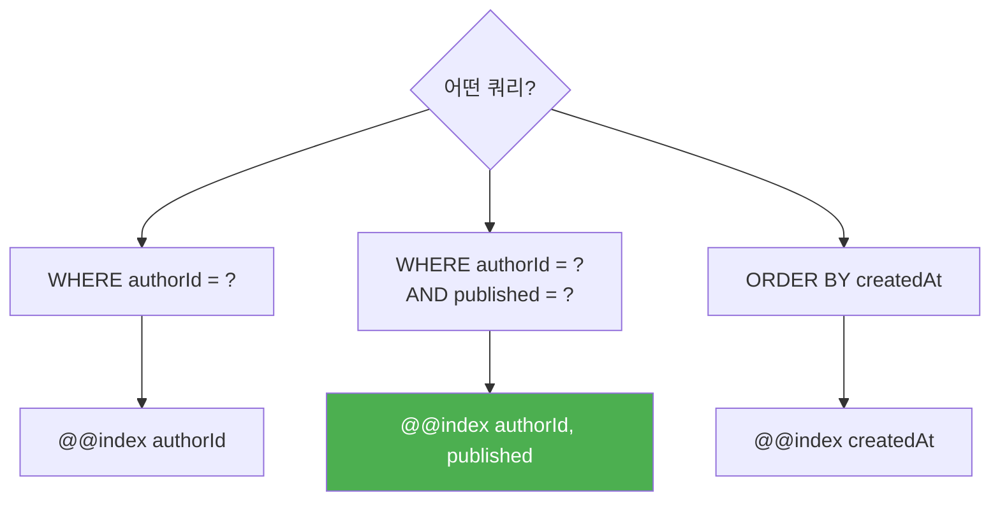

### 4️⃣ @@map - 테이블명 매핑

```prisma
model User {
  id    Int    @id @default(autoincrement())
  email String @unique
  
  @@map("users")  // DB에서는 "users" 테이블
}

// 코드: prisma.user.findMany()
// SQL:  SELECT * FROM users
```

### 5️⃣ @@ignore - 마이그레이션 제외

```prisma
model LegacyUser {
  id    Int    @id
  email String
  
  @@ignore  // Prisma가 이 테이블을 관리하지 않음
}
```

---

## 5. 열거형 (Enum)

### 🎨 Enum 정의와 사용

```prisma
enum Role {
  USER
  ADMIN
  MODERATOR
}

enum OrderStatus {
  PENDING
  PROCESSING
  SHIPPED
  DELIVERED
  CANCELLED
}

model User {
  id   Int  @id @default(autoincrement())
  role Role @default(USER)
}

model Order {
  id     Int         @id @default(autoincrement())
  status OrderStatus @default(PENDING)
}
```

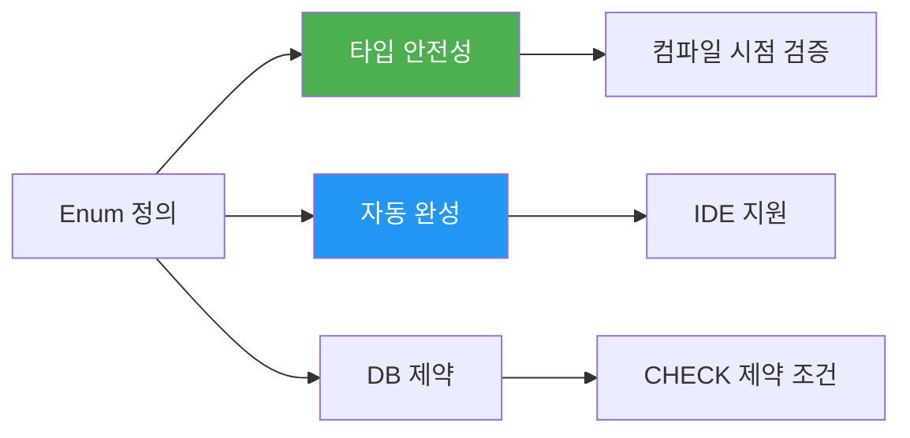

### 💻 TypeScript에서 사용

```typescript
import { Role, OrderStatus } from '@prisma/client'

// 타입 안전하게 사용
const user = await prisma.user.create({
  data: {
    email: 'admin@example.com',
    role: Role.ADMIN  // 자동완성 지원
  }
})

// 잘못된 값은 컴파일 에러
const order = await prisma.order.create({
  data: {
    status: 'INVALID'  // ❌ 타입 에러!
  }
})
```

---

## 6. 선택적 필드와 필수 필드

### ❓ Nullable vs Required

```prisma
model User {
  id       Int     @id @default(autoincrement())
  
  // 필수 필드 (NOT NULL)
  email    String  @unique
  
  // 선택적 필드 (NULL 허용)
  name     String?
  bio      String?
  avatar   String?
  
  // 기본값이 있는 필수 필드
  active   Boolean @default(true)
  role     Role    @default(USER)
}
```

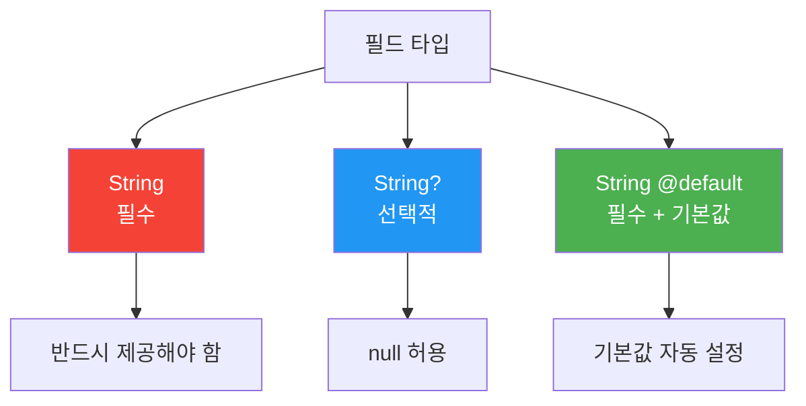

### 💡 언제 Optional을 사용하나요?

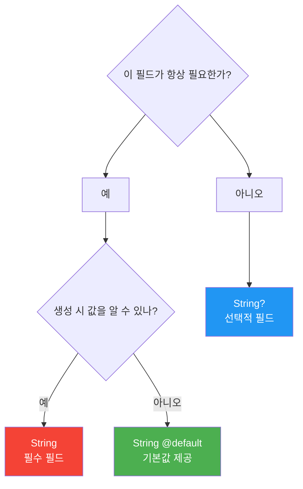

**실제 예제:**

```typescript
// 필수 필드만
await prisma.user.create({
  data: {
    email: 'user@example.com'  // ✅ name은 선택적
  }
})

// 선택적 필드 포함
await prisma.user.create({
  data: {
    email: 'user@example.com',
    name: 'John Doe',  // ✅ 제공 가능
    bio: 'Developer'
  }
})
```

---

## 7. 실전 Schema 예제

### 🛒 이커머스 Schema

```prisma
generator client {
  provider = "prisma-client-js"
}

datasource db {
  provider = "postgresql"
  url      = env("DATABASE_URL")
}

// 열거형
enum UserRole {
  CUSTOMER
  SELLER
  ADMIN
}

enum OrderStatus {
  PENDING
  PAID
  SHIPPED
  DELIVERED
  CANCELLED
}

// 사용자
model User {
  id            String    @id @default(uuid())
  email         String    @unique
  name          String
  passwordHash  String    @map("password_hash")
  role          UserRole  @default(CUSTOMER)
  emailVerified Boolean   @default(false) @map("email_verified")
  
  // 관계
  profile       Profile?
  orders        Order[]
  reviews       Review[]
  
  createdAt     DateTime  @default(now()) @map("created_at")
  updatedAt     DateTime  @updatedAt @map("updated_at")
  
  @@index([email])
  @@map("users")
}

// 프로필
model Profile {
  id          String    @id @default(uuid())
  userId      String    @unique @map("user_id")
  user        User      @relation(fields: [userId], references: [id], onDelete: Cascade)
  
  phone       String?
  avatar      String?
  bio         String?   @db.Text
  dateOfBirth DateTime? @map("date_of_birth") @db.Date
  
  @@map("profiles")
}

// 상품
model Product {
  id          String   @id @default(uuid())
  name        String   @db.VarChar(255)
  description String?  @db.Text
  price       Decimal  @db.Decimal(10, 2)
  stock       Int      @default(0)
  sku         String   @unique @db.VarChar(50)
  
  published   Boolean  @default(false)
  featured    Boolean  @default(false)
  
  // JSON 메타데이터
  metadata    Json?    @db.JsonB
  
  // 관계
  images      Image[]
  reviews     Review[]
  orderItems  OrderItem[]
  
  createdAt   DateTime @default(now()) @map("created_at")
  updatedAt   DateTime @updatedAt @map("updated_at")
  
  @@index([sku])
  @@index([published, featured])
  @@map("products")
}

// 상품 이미지
model Image {
  id        String  @id @default(uuid())
  productId String  @map("product_id")
  product   Product @relation(fields: [productId], references: [id], onDelete: Cascade)
  
  url       String
  alt       String?
  order     Int     @default(0)
  
  @@index([productId])
  @@map("images")
}

// 주문
model Order {
  id           String      @id @default(uuid())
  orderNumber  String      @unique @map("order_number")
  userId       String      @map("user_id")
  user         User        @relation(fields: [userId], references: [id])
  
  status       OrderStatus @default(PENDING)
  total        Decimal     @db.Decimal(10, 2)
  
  items        OrderItem[]
  
  createdAt    DateTime    @default(now()) @map("created_at")
  updatedAt    DateTime    @updatedAt @map("updated_at")
  
  @@index([userId])
  @@index([orderNumber])
  @@map("orders")
}

// 주문 항목
model OrderItem {
  id        String  @id @default(uuid())
  orderId   String  @map("order_id")
  order     Order   @relation(fields: [orderId], references: [id], onDelete: Cascade)
  
  productId String  @map("product_id")
  product   Product @relation(fields: [productId], references: [id])
  
  quantity  Int
  price     Decimal @db.Decimal(10, 2)
  
  @@index([orderId])
  @@index([productId])
  @@map("order_items")
}

// 리뷰
model Review {
  id        String   @id @default(uuid())
  productId String   @map("product_id")
  product   Product  @relation(fields: [productId], references: [id], onDelete: Cascade)
  
  userId    String   @map("user_id")
  user      User     @relation(fields: [userId], references: [id])
  
  rating    Int      // 1-5
  comment   String?  @db.Text
  
  createdAt DateTime @default(now()) @map("created_at")
  
  @@index([productId])
  @@index([userId])
  @@map("reviews")
}
```

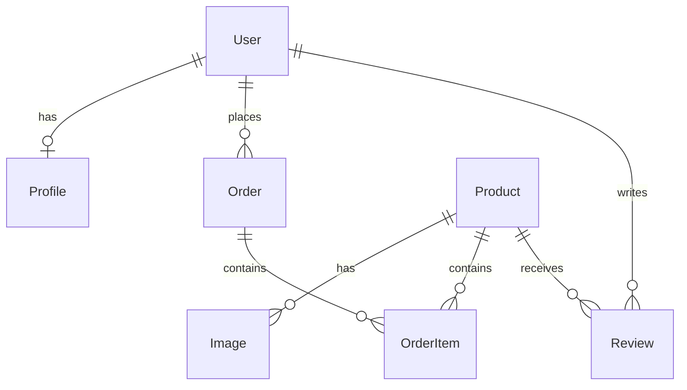

---

## 8. Schema 작성 모범 사례

### ✅ 권장 사항

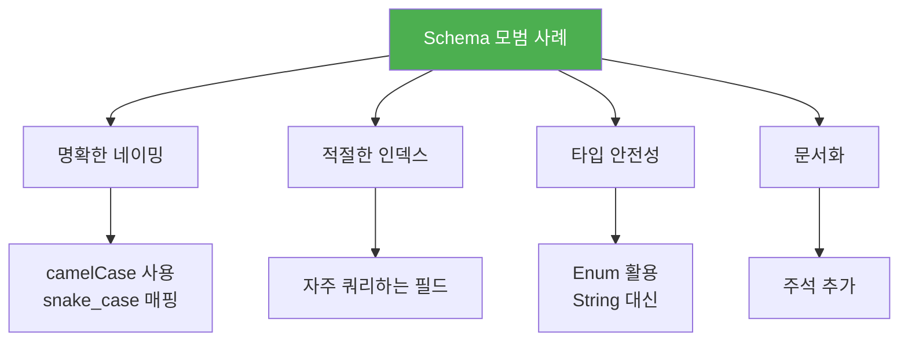

### 1️⃣ 명확한 네이밍

```prisma
// ❌ 나쁜 예
model usr {
  id  Int    @id
  em  String
  nm  String
}

// ✅ 좋은 예
model User {
  id    Int    @id @default(autoincrement())
  email String @unique
  name  String
}
```

### 2️⃣ snake_case 매핑

```prisma
// ✅ 권장: 코드는 camelCase, DB는 snake_case
model User {
  id        Int      @id @default(autoincrement())
  firstName String   @map("first_name")
  lastName  String   @map("last_name")
  createdAt DateTime @default(now()) @map("created_at")
  
  @@map("users")
}
```

### 3️⃣ 주석 활용

```prisma
/// 사용자 모델
/// 시스템의 모든 사용자를 나타냅니다.
model User {
  id    Int    @id @default(autoincrement())
  
  /// 고유한 이메일 주소
  /// @example "user@example.com"
  email String @unique
  
  /// 사용자 표시 이름
  name  String
}
```

---

## 🎯 요약

### Schema 핵심 개념

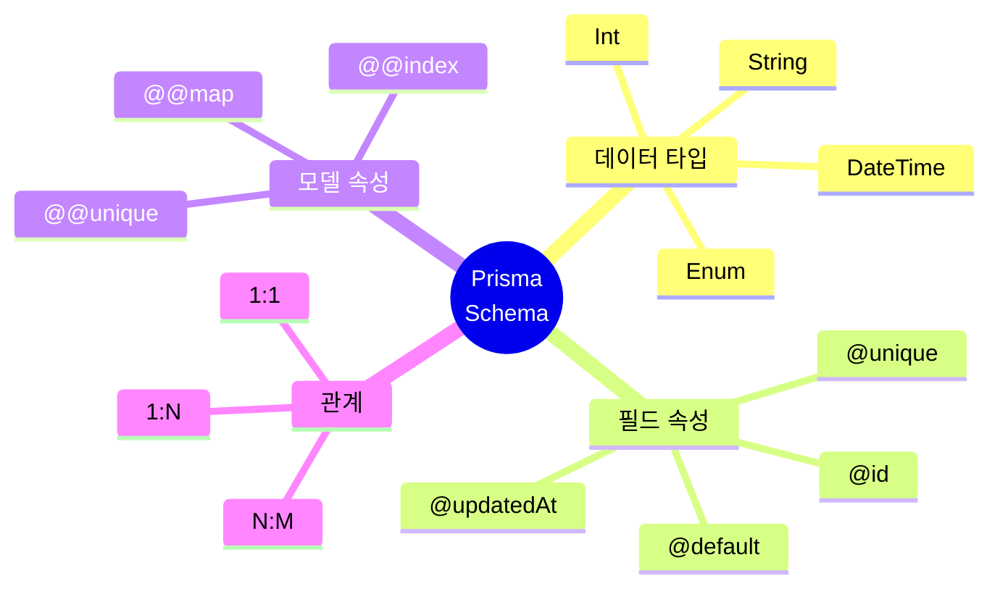

### 기억해야 할 것

1. **Schema는 단일 진실 공급원**: 모든 것이 여기서 시작
2. **타입 안전성**: Enum과 명시적 타입 활용
3. **인덱스**: 쿼리 성능의 핵심
4. **네이밍**: 코드는 camelCase, DB는 snake_case

---

**다음 장: [05. CRUD 작업](./05-crud-operations.md)**
