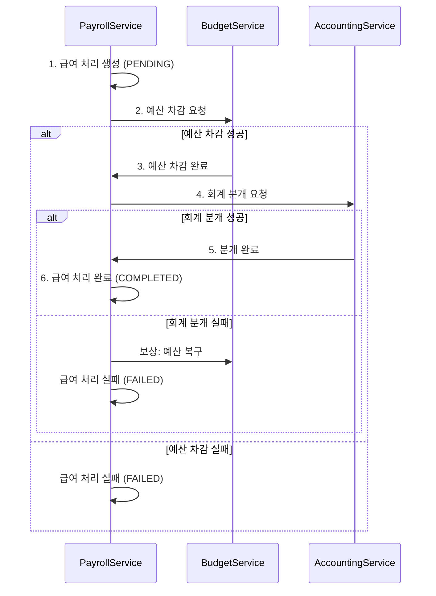

# 마이크로서비스 개발 가이드 (Microservices Development Guide)

> Database per Service 패턴 기반 마이크로서비스 개발 실전 가이드

## 1. 개요

본 문서는 ALL-ERP 프로젝트의 Database per Service 패턴에서 마이크로서비스를 개발할 때 필요한 핵심 원칙과 실전 패턴을 제공합니다.

## 2. 핵심 원칙 (Core Principles)

### 2.1 독립성 (Independence)

각 서비스는 다음을 독립적으로 가집니다:

- **Database**: 17개 독립 DB 인스턴스
- **Build & Deploy**: 다른 서비스와 무관하게 배포
- **Scaling**: 독립적인 수평 확장
- **Failure Isolation**: 한 서비스 장애가 다른 서비스에 영향 최소화

### 2.2 통신 원칙

```typescript
// ❌ 절대 금지: 다른 서비스 DB 직접 접근
import { personnelPrisma } from '@personnel-service/prisma';
const employee = await personnelPrisma.employee.findUnique(...);

// ✅ 권장: HTTP API 호출
const response = await this.httpService.get(
  'http://personnel-service:3011/api/v1/employees/123'
).toPromise();

// ✅ 권장: 이벤트 발행/구독
await this.eventBus.publish('employee.updated', { employeeId, name });
```

---

## 3. 서비스 간 통신 패턴

### 3.1 동기 통신 (HTTP API)

**사용 시나리오**:
- 즉시 응답이 필요한 경우
- 조회(Read) 작업
- 사용자 요청에 대한 즉각적인 피드백 필요

**구현 예시**:
```typescript
// payroll-service/src/modules/salary/salary.service.ts
import { HttpService } from '@nestjs/axios';
import { Injectable } from '@nestjs/common';

@Injectable()
export class SalaryService {
  constructor(private httpService: HttpService) {}

  async calculateSalary(employeeId: number) {
    // 1. 인사 서비스에서 직원 정보 조회
    const { data: employee } = await this.httpService.get(
      `http://personnel-service:3011/api/v1/employees/${employeeId}`,
      { headers: { 'X-Tenant-ID': this.getTenantId() } }
    ).toPromise();

    // 2. 급여 계산 로직
    const baseSalary = employee.baseSalary;
    const allowance = this.calculateAllowance(employee);
    
    return {
      employeeId,
      baseSalary,
      allowance,
      totalSalary: baseSalary + allowance,
    };
  }
}
```

**에러 처리**:
```typescript
async getEmployeeInfo(employeeId: number) {
  try {
    const { data } = await this.httpService.get(
      `http://personnel-service:3011/api/v1/employees/${employeeId}`
    ).toPromise();
    return data;
  } catch (error) {
    if (error.response?.status === 404) {
      throw new NotFoundException('직원을 찾을 수 없습니다');
    }
    throw new ServiceUnavailableException('인사 서비스와 통신 실패');
  }
}
```

### 3.2 비동기 통신 (RabbitMQ Event)

**사용 시나리오**:
- 데이터 변경 알림
- 여러 서비스에 동시 알림 필요
- 느슨한 결합(Loose Coupling) 필요
- 성능이 일관성보다 중요

**이벤트 발행**:
```typescript
// personnel-service/src/modules/employee/employee.service.ts
import { EventEmitter2 } from '@nestjs/event-emitter';

@Injectable()
export class EmployeeService {
  constructor(private eventBus: EventEmitter2) {}

  async updateEmployee(id: number, dto: UpdateEmployeeDto) {
    // 1. DB 업데이트
    const employee = await this.prisma.employee.update({
      where: { id },
      data: dto,
    });

    // 2. 이벤트 발행
    await this.eventBus.emit('employee.updated', {
      eventId: uuidv4(),  // 멱등성 보장
      eventType: 'employee.updated',
      timestamp: new Date(),
      tenantId: employee.tenantId,
      data: {
        employeeId: employee.id,
        name: employee.name,
        departmentId: employee.departmentId,
      },
    });

    return employee;
  }
}
```

**이벤트 수신**:
```typescript
// payroll-service/src/modules/employee-cache/employee-cache.service.ts
import { EventPattern } from '@nestjs/microservices';

@Injectable()
export class EmployeeCacheService {
  @EventPattern('employee.updated')
  async handleEmployeeUpdated(event: EmployeeUpdatedEvent) {
    // 멱등성 확인
    const processed = await this.prisma.processedEvent.findUnique({
      where: { eventId: event.eventId },
    });

    if (processed) {
      console.log(`이벤트 이미 처리됨: ${event.eventId}`);
      return;
    }

    // 로컬 캐시 업데이트
    await this.prisma.employeeCache.upsert({
      where: { employeeId: event.data.employeeId },
      create: {
        employeeId: event.data.employeeId,
        name: event.data.name,
        departmentId: event.data.departmentId,
        tenantId: event.tenantId,
      },
      update: {
        name: event.data.name,
        departmentId: event.data.departmentId,
      },
    });

    // 처리 완료 기록
    await this.prisma.processedEvent.create({
      data: { eventId: event.eventId },
    });
  }
}
```

---

## 4. 분산 트랜잭션 (Saga Pattern)

### 4.1 Saga 패턴 개념

여러 서비스에 걸친 트랜잭션을 순차적인 로컬 트랜잭션과 보상 트랜잭션(Compensating Transaction)으로 분해합니다.

**예시: 급여 지급 프로세스**



### 4.2 Saga 구현 예시

```typescript
// payroll-service/src/modules/salary/saga/salary.saga.ts
import { Injectable } from '@nestjs/common';
import { EventEmitter2, OnEvent } from '@nestjs/event-emitter';

@Injectable()
export class SalarySaga {
  constructor(
    private prisma: PrismaClient,
    private eventBus: EventEmitter2,
  ) {}

  // Step 1: 급여 처리 생성
  async startPayrollProcess(employeeId: number, amount: number) {
    const payroll = await this.prisma.payroll.create({
      data: {
        employeeId,
        amount,
        status: 'PENDING',
      },
    });

    // Step 2: 예산 차감 요청
    await this.eventBus.emit('budget.deduct.requested', {
      eventId: uuidv4(),
      payrollId: payroll.id,
      amount,
      tenantId: payroll.tenantId,
    });

    return payroll;
  }

  // Step 3: 예산 차감 성공 처리
  @OnEvent('budget.deduct.success')
  async handleBudgetDeducted(event: BudgetDeductedEvent) {
    // 회계 분개 요청
    await this.eventBus.emit('accounting.entry.requested', {
      eventId: uuidv4(),
      payrollId: event.payrollId,
      amount: event.amount,
      tenantId: event.tenantId,
    });
  }

  // Step 4: 회계 분개 성공 처리
  @OnEvent('accounting.entry.success')
  async handleAccountingSuccess(event: AccountingEntrySuccessEvent) {
    // 급여 처리 완료
    await this.prisma.payroll.update({
      where: { id: event.payrollId },
      data: { status: 'COMPLETED' },
    });
  }

  // 보상 트랜잭션 1: 예산 차감 실패
  @OnEvent('budget.deduct.failed')
  async handleBudgetDeductFailed(event: BudgetDeductFailedEvent) {
    await this.prisma.payroll.update({
      where: { id: event.payrollId },
      data: { status: 'FAILED', failureReason: '예산 부족' },
    });
  }

  // 보상 트랜잭션 2: 회계 분개 실패
  @OnEvent('accounting.entry.failed')
  async handleAccountingFailed(event: AccountingEntryFailedEvent) {
    // 예산 복구 요청
    await this.eventBus.emit('budget.restore.requested', {
      eventId: uuidv4(),
      payrollId: event.payrollId,
      amount: event.amount,
      tenantId: event.tenantId,
    });

    // 급여 처리 실패
    await this.prisma.payroll.update({
      where: { id: event.payrollId },
      data: { status: 'FAILED', failureReason: '회계 분개 실패' },
    });
  }
}
```

---

## 5. 데이터 일관성 전략

### 5.1 Eventual Consistency (최종 일관성)

마이크로서비스 환경에서는 강한 일관성 대신 **최종 일관성**을 추구합니다.

**전략**:
1. **이벤트 발행**: 데이터 변경 시 이벤트 발행
2. **이벤트 수신**: 관련 서비스가 이벤트를 받아 로컬 데이터 업데이트
3. **재시도 메커니즘**: 실패 시 자동 재시도
4. **멱등성 보장**: 같은 이벤트를 여러 번 처리해도 결과 동일

### 5.2 CQRS (Command Query Responsibility Segregation)

명령(쓰기)과 조회(읽기)를 분리합니다.

**구현 예시**:
```typescript
// personnel-service에서 직원 정보 수정 (Command)
async updateEmployee(id: number, dto: UpdateEmployeeDto) {
  const employee = await this.prisma.employee.update({ where: { id }, data: dto });
  
  // 이벤트 발행 -> payroll-service에 전파
  await this.eventBus.emit('employee.updated', { employeeId: id, ...dto });
  
  return employee;
}

// payroll-service에서 직원 정보 조회 (Query)
// 로컬 캐시에서 읽기 (personnel-service DB 직접 접근 X)
async getEmployeeForPayroll(employeeId: number) {
  return this.prisma.employeeCache.findUnique({ where: { employeeId } });
}
```

---

## 6. 모니터링 및 로깅

### 6.1 분산 추적 (Distributed Tracing)

각 요청에 고유한 `correlationId`를 부여하여 추적합니다.

```typescript
// libs/shared/infra/src/lib/logging/correlation.interceptor.ts
import { Injectable, NestInterceptor, ExecutionContext, CallHandler } from '@nestjs/common';
import { v4 as uuidv4 } from 'uuid';

@Injectable()
export class CorrelationInterceptor implements NestInterceptor {
  intercept(context: ExecutionContext, next: CallHandler) {
    const request = context.switchToHttp().getRequest();
    const correlationId = request.headers['x-correlation-id'] || uuidv4();
    
    request.correlationId = correlationId;
    
    return next.handle();
  }
}
```

### 6.2 구조화된 로깅

```typescript
import { Logger } from '@nestjs/common';

const logger = new Logger('SalaryService');

logger.log({
  message: '급여 계산 시작',
  correlationId: request.correlationId,
  employeeId,
  tenantId,
});
```

---

## 7. 테스트 전략

### 7.1 단위 테스트 (Unit Test)

서비스 로직만 독립적으로 테스트합니다.

```typescript
// salary.service.spec.ts
describe('SalaryService', () => {
  let service: SalaryService;
  let httpService: HttpService;

  beforeEach(async () => {
    const module = await Test.createTestingModule({
      providers: [
        SalaryService,
        { provide: HttpService, useValue: mockHttpService },
      ],
    }).compile();

    service = module.get<SalaryService>(SalaryService);
    httpService = module.get<HttpService>(HttpService);
  });

  it('급여를 정확히 계산해야 함', async () => {
    // Given
    jest.spyOn(httpService, 'get').mockReturnValue(of({
      data: { baseSalary: 3000000 },
    }));

    // When
    const result = await service.calculateSalary(1);

    // Then
    expect(result.baseSalary).toBe(3000000);
  });
});
```

### 7.2 통합 테스트 (Integration Test)

실제 DB와 메시지 브로커를 사용하여 테스트합니다.

```typescript
// salary.integration.spec.ts
describe('Salary Integration Test', () => {
  let app: INestApplication;

  beforeAll(async () => {
    const module = await Test.createTestingModule({
      imports: [AppModule],
    }).compile();

    app = module.createNestApplication();
    await app.init();
  });

  it('급여 처리 Saga가 정상 동작해야 함', async () => {
    // Given: 테스트 데이터 생성
    const employee = await createTestEmployee();

    // When: 급여 처리 시작
    const response = await request(app.getHttpServer())
      .post('/api/v1/payroll/process')
      .send({ employeeId: employee.id, amount: 3000000 });

    // Then: 급여 처리 완료 확인
    expect(response.status).toBe(201);
    
    // 이벤트 처리 대기
    await new Promise(resolve => setTimeout(resolve, 1000));
    
    const payroll = await prisma.payroll.findUnique({ where: { id: response.body.id } });
    expect(payroll.status).toBe('COMPLETED');
  });
});
```

---

## 8. 체크리스트

### 신규 서비스 개발 시

- [ ] 독립 DB 인스턴스 생성 및 연결
- [ ] `bootstrapService` 사용하여 표준 초기화
- [ ] SharedInfraModule, SharedDomainModule import
- [ ] Health Check 엔드포인트 구현
- [ ] Swagger 문서화 추가
- [ ] 로깅 및 에러 처리 구현

### 서비스 간 통신 구현 시

- [ ] 다른 서비스 DB 직접 접근 금지 확인
- [ ] HTTP API 또는 이벤트 선택 (시나리오에 맞게)
- [ ] 에러 처리 및 재시도 로직 구현
- [ ] 타임아웃 설정 (CircuitBreaker 고려)
- [ ] 멱등성 보장 (이벤트의 경우)
- [ ] correlationId를 통한 분산 추적

---

## 9. 참고 문서

- [Database per Service 가이드](file:///data/all-erp/docs/architecture/database-per-service-guide.md)
- [이벤트 기반 아키텍처 가이드](file:///data/all-erp/docs/human/event_driven_guide.md)
- [API 설계 가이드](file:///data/all-erp/docs/human/api_design_guide.md)
- [코딩 컨벤션](file:///data/all-erp/docs/human/coding_convention.md)
