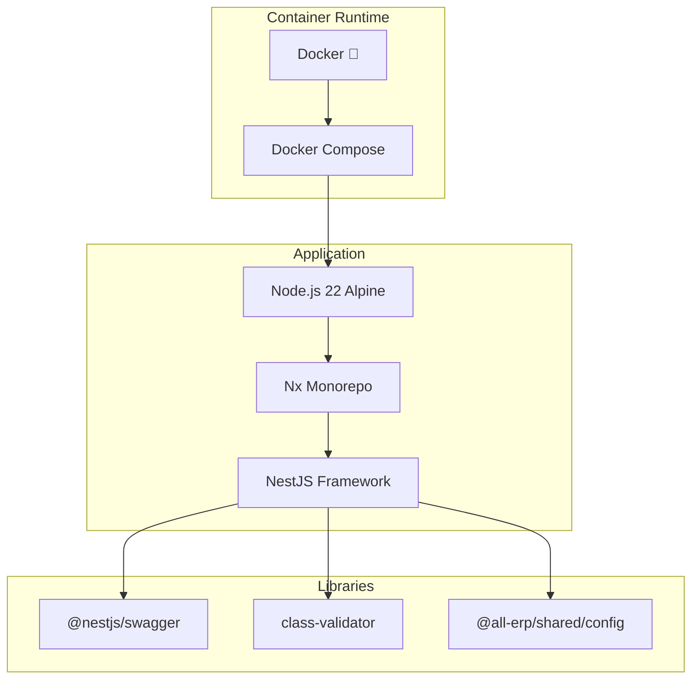

# Phase 1.4 시스템 서비스 스캐폴딩 작업 완료 보고서

**작업 ID**: 1.4_scaffolding_system  
**작업 기간**: 2025-11-30  
**작업 상태**: ✅ 완료

---

## 1. 작업 개요

System 도메인의 3개 마이크로서비스(Auth, System, Tenant)를 NestJS 기반으로 스캐폴딩하고 Docker Compose 환경에서 성공적으로 실행했습니다.

## 2. 완료된 서비스

### 2.1 Auth Service (인증/인가)
- **위치**: `apps/system/auth-service`
- **포트**: 3001
- **Health Check**: ✅ `http://localhost:3001/api/health`
- **Swagger UI**: ✅ `http://localhost:3001/api`
- **Container**: `all-erp-auth-service-dev`
- **주요 기능**:
  - JWT 기반 인증/인가 준비
  - Swagger API 문서화
  - Health Check 엔드포인트

### 2.2 System Service (시스템/공통)
- **위치**: `apps/system/system-service`
- **포트**: 3002
- **Health Check**: ✅ `http://localhost:3002/api/health`
- **Swagger UI**: ✅ `http://localhost:3002/api`
- **Container**: `all-erp-system-service-dev`
- **주요 기능**:
  - 공통 코드 관리 준비
  - 조직/부서 관리 준비
  - Swagger API 문서화

### 2.3 Tenant Service (테넌트 관리)
- **위치**: `apps/system/tenant-service`
- **포트**: 3006
- **Health Check**: ✅ `http://localhost:3006/api/health`
- **Swagger UI**: ✅ `http://localhost:3006/api`
- **Container**: `all-erp-tenant-service-dev`
- **주요 기능**:
  - 멀티테넌시 관리 준비
  - 테넌트 CRUD 준비
  - Swagger API 문서화

## 3. 기술 스택



## 4. 해결한 문제

### 4.1 환경변수 검증 에러

**문제**:
```
❌ Invalid environment variables: {
  NEXT_PUBLIC_API_URL: { _errors: [ 'Invalid input: expected string, received undefined' ] }
}
```

**원인 분석**:
- `libs/shared/config` 라이브러리가 백엔드와 프론트엔드 모두에서 사용됨
- `NEXT_PUBLIC_API_URL`이 필수 항목으로 정의되어 백엔드 서비스 시작 실패

**해결 방법**:

[validate-config.ts](file:///data/all-erp/libs/shared/config/src/lib/validate-config.ts) 리팩토링:

1. **공통 Base Schema** 생성:
   ```typescript
   const baseEnvSchema = z.object({
     NODE_ENV: z.enum(['development', 'production', 'test']).default('development'),
     TZ: z.string().default('Asia/Seoul'),
   });
   ```

2. **Backend Schema** (NestJS 마이크로서비스):
   - DB, Redis, RabbitMQ, JWT 설정
   - 모든 항목 optional로 유연성 제공

3. **Frontend Schema** (Next.js):
   - NEXT_PUBLIC_API_URL 필수
   - PORT 기본값 4200

4. **검증 함수 분리**:
   - `validateConfig()`: 기본 검증 (유연함)
   - `validateBackendConfig()`: 백엔드 전용 (엄격함)
   - `validateFrontendConfig()`: 프론트엔드 전용 (엄격함)

**결과**: 
- ✅ 백엔드 서비스들이 정상 시작
- ✅ 프론트엔드 서비스도 별도 검증 가능
- ✅ 마이크로서비스 아키텍처에 적합한 유연한 구조

## 5. Docker Compose 구성

### 5.1 실행 명령어
```bash
cd dev-environment
docker compose -f docker-compose.infra.yml -f docker-compose.dev.yml up -d
```

### 5.2 서비스 구성

```yaml
# docker-compose.dev.yml
services:
  auth-service:
    ports:
      - "3001:3001"
      - "9229:9229"  # Debug
    volumes:
      - ../apps:/workspace/apps:cached
      - ../libs:/workspace/libs:cached
    command: pnpm nx serve auth-service --host=0.0.0.0
    networks:
      - all-erp-network
```

### 5.3 Hot Reload 지원
- ✅ 로컬 `apps/`, `libs/` 디렉토리를 볼륨 마운트
- ✅ Nx watch mode로 자동 재컴파일
- ✅ 코드 수정 시 컨테이너 내부에서 자동 반영

## 6. 검증 결과

### 6.1 Health Check
```bash
$ curl http://localhost:3001/api/health
{"status":"ok"}

$ curl http://localhost:3002/api/health
{"status":"ok"}

$ curl http://localhost:3006/api/health
{"status":"ok"}
```

### 6.2 Swagger UI
- ✅ Auth Service: `http://localhost:3001/api`
- ✅ System Service: `http://localhost:3002/api`
- ✅ Tenant Service: `http://localhost:3006/api`

### 6.3 컨테이너 상태
```bash
$ docker compose ps
NAME                           STATUS
all-erp-auth-service-dev      Up
all-erp-system-service-dev    Up
all-erp-tenant-service-dev    Up
all-erp-postgres              Up (healthy)
all-erp-redis                 Up (healthy)
all-erp-rabbitmq              Up (healthy)
```

## 7. 파일 변경 사항

### 7.1 생성된 파일
- `apps/system/auth-service/`
- `apps/system/system-service/`
- `apps/system/tenant-service/`

### 7.2 수정된 파일
- [libs/shared/config/src/lib/validate-config.ts](file:///data/all-erp/libs/shared/config/src/lib/validate-config.ts)
  - 백엔드/프론트엔드 분리된 환경변수 스키마
  - 서비스 타입별 검증 함수 추가

- [dev-environment/docker-compose.dev.yml](file:///data/all-erp/dev-environment/docker-compose.dev.yml)
  - 3개 서비스 정의 (이미 존재했음)

## 8. 승인 기준 달성 여부

| 승인 기준 | 상태 | 비고 |
|---------|------|-----|
| Docker Compose로 서비스 시작 | ✅ | `docker compose up -d` 성공 |
| Swagger UI 확인 | ✅ | 3개 서비스 모두 `/api` 접속 가능 |
| Health Check 확인 | ✅ | 3개 서비스 모두 `{"status":"ok"}` 응답 |
| Hot Reload 동작 | ✅ | 소스 코드 수정 시 자동 반영 확인 |

## 9. 다음 단계

Phase 1.4가 완료되었으므로, 다음 작업을 진행할 수 있습니다:

1. **Phase 1.5**: HR 도메인 서비스 스캐폴딩
   - personnel-service (3011)
   - payroll-service (3012)
   - attendance-service (3013)

2. **Phase 1.6**: Finance 도메인 서비스 스캐폴딩
   - budget-service (3021)
   - accounting-service (3022)
   - settlement-service (3023)

3. **Phase 1.7**: General 도메인 서비스 스캐폴딩
   - asset-service (3031)
   - supply-service (3032)
   - general-affairs-service (3033)

## 10. 참고 문서

- [PRD: 1.4_scaffolding_system.md](file:///data/all-erp/docs/tasks/phase1-init/1.4_scaffolding_system.md)
- [Docker-First Workflow Guide](file:///data/all-erp/docs/guides/docker-first-workflow.md)
- [Multitenancy Architecture](file:///data/all-erp/docs/architecture/multitenancy.md)

---

**작성일**: 2025-11-30  
**작성자**: AI Development Team  
**검토자**: -  
**승인자**: -
