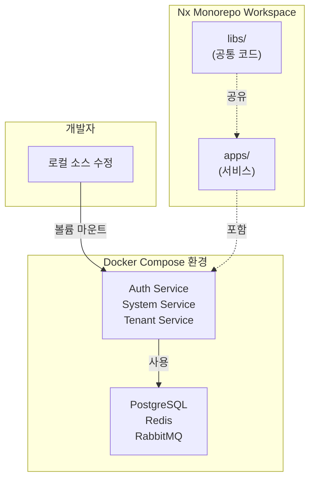

# Phase 1: 프로젝트 초기화 완료 보고서

> 최종 업데이트: 2025-11-30

## 📋 전체 요약

Phase 1에서는 **Docker Compose 기반의 통합 개발 환경**을 구축했습니다. Nx Monorepo 워크스페이스를 생성하고, 환경 변수 관리 시스템을 구현하며, 모든 개발/테스트/운영이 Docker Compose로 통일되도록 설정했습니다.

### 핵심 성과
- ✅ Nx Monorepo 워크스페이스 (`pnpm` + Nx 22.1.3)
- ✅ 환경 변수 검증 시스템 (`Zod` 기반)
- ✅ Docker Compose 기반 개발 환경 (볼륨 마운트 + Hot Reload)
- ✅ 역할별 Docker Compose 파일 분리 (infra, devops, dev, prod)

---

## 1. Nx Workspace 구축

### 1.1 완료 내용
- **Nx Monorepo 생성**: `apps` preset 기반, `pnpm` 패키지 매니저
- **필수 플러그인 설치**:
  - `@nx/nest`: 22.1.3 (백엔드)
  - `@nx/next`: 22.1.3 (프론트엔드)
  - `@nx/js`: 22.1.3 (공통 라이브러리)
- **설정 파일**:
  - `tsconfig.base.json`: TypeScript 기본 설정
  - `.prettierrc`: 코드 포맷터
  - `nx.json`: Nx 빌드 캐싱 전략

### 1.2 구조
```
all-erp/
├── apps/          # 애플리케이션 (서비스)
├── libs/          # 공통 라이브러리
│   └── shared/
│       └── config/  # 환경 변수 검증
├── nx.json
├── tsconfig.base.json
└── package.json
```

### 1.3 효과
- **일관성**: Monorepo로 모든 서비스를 하나의 저장소에서 관리
- **속도**: Nx 캐싱으로 빌드/테스트 속도 향상
- **확장성**: 새 서비스 추가가 용이한 구조

---

## 2. 환경 변수 관리

### 2.1 완료 내용
- **`.env.example`**: Docker 서비스명 기반 템플릿
- **`libs/shared/config`**: Zod를 이용한 검증 라이브러리
- **`.gitignore`**: `.env*` 파일 제외 (`.env.example` 제외)

### 2.2 검증 시스템
```typescript
// libs/shared/config/src/lib/validate-config.ts
export const envSchema = z.object({
  DB_HOST: z.string(),          // Docker: postgres
  REDIS_HOST: z.string(),       // Docker: redis
  JWT_SECRET: z.string(),
  // ...
});

export function validateConfig(config: Record<string, unknown>): EnvConfig {
  const result = envSchema.safeParse(config);
  if (!result.success) {
    throw new Error('Invalid environment variables');
  }
  return result.data;
}
```

### 2.3 환경 변수 템플릿
```bash
# .env.example (Docker Compose 기반)
DB_HOST=postgres          # Docker 서비스 이름
REDIS_HOST=redis
RABBITMQ_HOST=rabbitmq
```

---

## 3. Docker Compose 통합 환경

### 3.1 파일 구조
```
dev-environment/
├── docker-compose.infra.yml   # 인프라 (필수)
├── docker-compose.devops.yml  # DevOps 도구 (선택)
├── docker-compose.dev.yml     # 개발 환경
├── docker-compose.prod.yml    # 운영 환경
├── start-dev.sh               # 시작 스크립트
└── stop-dev.sh                # 중지 스크립트
```

### 3.2 역할 분리

| 파일 | 용도 | 포함 서비스 |
|------|------|------------|
| `infra.yml` | 인프라 기반 | PostgreSQL, Redis, RabbitMQ, Milvus |
| `devops.yml` | DevOps 도구 | GitLab, Prometheus, Grafana, ELK |
| `dev.yml` | 개발 환경 | auth, system, tenant (볼륨 마운트) |
| `prod.yml` | 운영 환경 | auth, system, tenant (빌드 이미지) |

### 3.3 개발 워크플로우
```bash
# 개발 시작
cd dev-environment
./start-dev.sh
# 또는
docker compose -f docker-compose.infra.yml -f docker-compose.dev.yml up -d

# 소스 수정 → 자동 반영 (볼륨 마운트)
# Hot Reload → 자동 재시작

# 종료
./stop-dev.sh
```

---

## 4. 초급자를 위한 이해

### 4.1 왜 Nx Monorepo?
**비유**: 여러 건물(서비스)을 하나의 단지로 관리

- **Before**: 프로젝트 A, B, C가 각각 별도 저장소
- **After**: 하나의 Monorepo에서 apps/로 분리 관리
- **장점**: 공통 코드(libs/) 공유, 의존성 관리 일관성

### 4.2 왜 Docker Compose?
**비유**: 모든 제품을 동일한 공장 라인에서 생산

- **Before**: 로컬 환경마다 다른 설정 (OS, Node 버전 등)
- **After**: Docker Compose로 환경 통일
- **장점**: "내 컴퓨터에서는 되는데" 문제 해결

### 4.3 도식화: 전체 구조



---

## 5. 주요 파일 및 명령어

### 5.1 핵심 파일
- **프로젝트 설정**:
  - [`package.json`](file:///data/all-erp/package.json) - Nx 및 의존성
  - [`nx.json`](file:///data/all-erp/nx.json) - 빌드 캐싱 전략
  - [`tsconfig.base.json`](file:///data/all-erp/tsconfig.base.json) - TypeScript 설정
  
- **환경 변수**:
  - [`.env.example`](file:///data/all-erp/.env.example) - 템플릿
  - [`envs/development.env`](file:///data/all-erp/envs/development.env) - 개발용
  
- **Docker Compose**:
  - [`docker-compose.infra.yml`](file:///data/all-erp/dev-environment/docker-compose.infra.yml)
  - [`docker-compose.dev.yml`](file:///data/all-erp/dev-environment/docker-compose.dev.yml)

### 5.2 주요 명령어
```bash
# 개발 환경 시작
cd dev-environment && ./start-dev.sh

# 로그 확인
docker compose -f docker-compose.dev.yml logs -f auth-service

# 서비스 재시작
docker compose -f docker-compose.dev.yml restart auth-service

# 종료
./stop-dev.sh
```

---

## 6. 다음 단계 (Phase 2)

Phase 1에서 구축한 환경을 기반으로:

1. **서비스 스캐폴딩**: Auth, System, Tenant 서비스 생성
2. **DB 스키마 설계**: Prisma 도입 및 마이그레이션
3. **API 개발**: NestJS 기반 REST API 구현
4. **프론트엔드**: Next.js 기반 관리자 페이지

---

## 7. 참고 문서

- **개발 가이드**:
  - [Docker Compose 워크플로우](file:///data/all-erp/docs/guides/docker-compose-workflow.md)
  - [GEMINI 개발 지침](file:///data/all-erp/.gemini/GEMINI.md)
  
- **개별 작업 결과**:
  - [1.1 Workspace Setup](file:///data/all-erp/docs/tasks/phase1-init/1.1_workspace_setup_result.md)
  - [1.2 Environment Strategy](file:///data/all-erp/docs/tasks/phase1-init/1.2_env_strategy_result.md)
  - [1.4 Docker Compose Restructuring](file:///data/all-erp/docs/tasks/phase1-init/1.4_docker_compose_restructuring_result.md)
