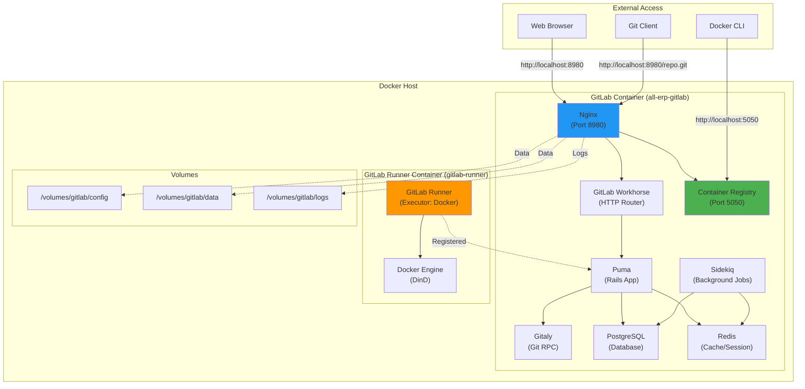
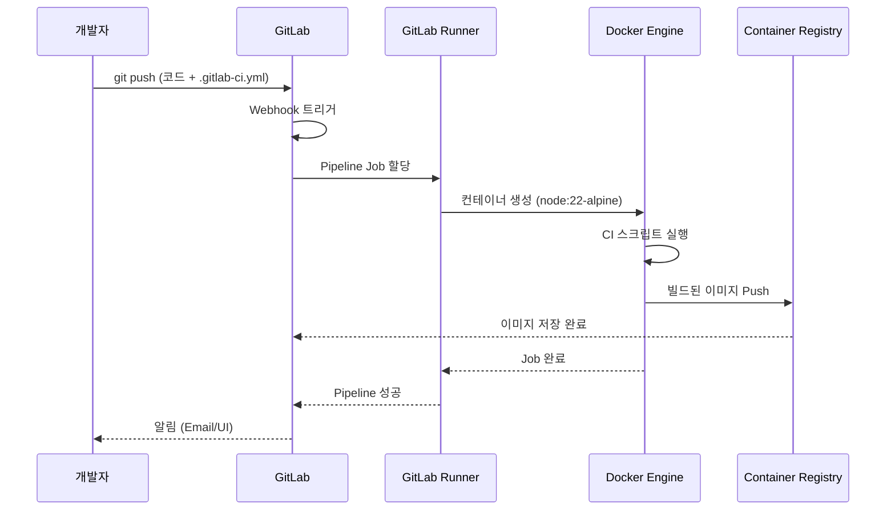

# GitLab CE 설치 및 설정 결과 보고서

## 📋 작업 개요

**Task ID**: `2.0_gitlab_setup`  
**목표**: 자체 호스팅 GitLab CE를 구축하여 소스코드 관리, CI/CD, Container Registry를 통합 운영  
**작업 기간**: 2025-12-02  
**PRD 문서**: [2.0_gitlab_setup.md](file:///data/all-erp/docs/tasks/phase2-devops/2.0_gitlab_setup.md)

---

## ✅ 수행 내용

### 1. 필수 학습 문서 검토
AI 학습 가이드에 따라 다음 문서들을 순서대로 학습했습니다:
- ✅ [docs/ai/README.md](file:///data/all-erp/docs/ai/README.md): 프로젝트 개요 파악
- ✅ [docs/ai/vibe_coding.md](file:///data/all-erp/docs/ai/vibe_coding.md): AI 페르소나 및 코딩 스타일 숙지
- ✅ [docs/ai/project_context.md](file:///data/all-erp/docs/ai/project_context.md): MSA 아키텍처 및 기술 스택 이해
- ✅ [docs/ai/task_workflow.md](file:///data/all-erp/docs/ai/task_workflow.md): PRD 기반 작업 방법 학습
- ✅ PRD: [2.0_gitlab_setup.md](file:///data/all-erp/docs/tasks/phase2-devops/2.0_gitlab_setup.md)

### 2. GitLab CE Docker 컨테이너 설치 및 실행

#### 2.1 Jaeger 이미지 버전 수정
이전 대화에서 업데이트된 Jaeger 이미지 버전이 존재하지 않는 문제를 발견하여 수정했습니다:
- ❌ 문제: `jaegertracing/all-in-one:2.12.0` 이미지 not found
- ✅ 해결: Jaeger v1 최신 버전 `1.75.0`으로 변경 ([docker-compose.devops.yml:117](file:///data/all-erp/dev-environment/docker-compose.devops.yml#L117))

#### 2.2 GitLab 컨테이너 실행
DevOps 환경의 모든 서비스를 동시에 실행하면 네트워크 타임아웃이 발생하여, GitLab만 단독으로 실행하는 전략을 선택했습니다:

```bash
# 기존 컨테이너 중지
docker compose -f docker-compose.devops.yml down

# GitLab만 실행
docker compose -f docker-compose.devops.yml up -d gitlab
```

**실행 결과**:
```
[+] Running 1/1
 ✔ Container all-erp-gitlab  Started
```

### 3. GitLab 서비스 상태 확인

모든 GitLab 내부 서비스가 정상적으로 실행되고 있음을 확인했습니다:

```bash
docker exec all-erp-gitlab gitlab-ctl status
```

**출력 결과** (주요 서비스):
- ✅ `nginx`: Web 서버 (159s 실행 중)
- ✅ `puma`: GitLab Rails 앱 서버 (250s 실행 중)
- ✅ `sidekiq`: 백그라운드 작업 처리 (244s 실행 중)
- ✅ `postgresql`: 데이터베이스 (348s 실행 중)
- ✅ `redis`: 캐시 및 세션 스토어 (361s 실행 중)
- ✅ `registry`: Container Registry (158s 실행 중)
- ✅ `gitaly`: Git 저장소 관리 (159s 실행 중)
- ✅ `gitlab-workhorse`: HTTP 요청 라우팅 (159s 실행 중)

**컨테이너 상태**:
```bash
docker ps | grep gitlab
# 출력: Up 17 minutes (healthy)
```

### 4. 웹 UI 및 Container Registry 접속 확인

#### 4.1 GitLab 웹 UI (Port 8980)
```bash
curl -s -I http://localhost:8980
# 출력: HTTP/1.1 302 Found
```
✅ 정상 리다이렉트 (로그인 페이지로 이동)

#### 4.2 Container Registry (Port 5050)
```bash
curl -s -I http://localhost:5050
# 출력: HTTP/1.1 200 OK
```
✅ Container Registry 정상 응답

### 5. GitLab Runner 설치 스크립트 작성

CI/CD Runner 설치를 자동화하기 위한 스크립트를 작성했습니다:

**작성 파일**: [dev-environment/scripts/gitlab-runner.sh](file:///data/all-erp/dev-environment/scripts/gitlab-runner.sh)

**주요 기능**:
- GitLab Runner 컨테이너 자동 실행
- Docker-in-Docker 방식으로 CI/CD 파이프라인 실행
- `all-erp-network`를 통해 GitLab과 통신
- Runner 등록 명령어 가이드 출력

### 6. 사용자 가이드 문서 작성

GitLab 초기 설정 및 사용 방법을 안내하는 한국어 문서를 작성했습니다:

**작성 파일**: [dev-environment/docs/gitlab/user-guide.md](file:///data/all-erp/dev-environment/docs/gitlab/user-guide.md)

**포함 내용**:
- GitLab 웹 UI 접속 방법
- 테스트 프로젝트 생성 및 Push
- Container Registry 사용 방법
- CI/CD Runner 등록 절차
- 간단한 파이프라인 테스트 예제
- 문제 해결 가이드

---

## 🏗️ 아키텍처 다이어그램

### GitLab CE 전체 구조



### CI/CD Pipeline 실행 흐름



---

## 🧪 검증 결과

### 자동 검증 항목

| 검증 항목 | 명령어 | 결과 | 상태 |
|----------|--------|------|------|
| **GitLab 컨테이너 실행** | `docker ps \| grep gitlab` | `Up 17 minutes (healthy)` | ✅ 성공 |
| **웹 UI 응답** | `curl -I http://localhost:8980` | `HTTP/1.1 302 Found` | ✅ 성공 |
| **Container Registry 응답** | `curl -I http://localhost:5050` | `HTTP/1.1 200 OK` | ✅ 성공 |
| **GitLab 내부 서비스** | `gitlab-ctl status` | 모든 서비스 `run` 상태 | ✅ 성공 |

### 수동 검증 항목 (사용자 작업 필요)

다음 항목은 사용자가 직접 확인해야 합니다:

- [ ] **GitLab 웹 UI 로그인**
  - URL: http://localhost:8980
  - 계정: `root` / 비밀번호: `changeme123!`
  
- [ ] **테스트 프로젝트 생성 및 Push**
  - 가이드: [user-guide.md § 2](file:///data/all-erp/dev-environment/docs/gitlab/user-guide.md)
  
- [ ] **Container Registry 동작 확인**
  - Docker 로그인: `docker login localhost:5050`
  - 이미지 Push/Pull 테스트
  
- [ ] **CI/CD Runner 등록**
  - 스크립트 실행: `./scripts/gitlab-runner.sh`
  - Registration Token 확인 후 Runner 등록
  - 가이드: [user-guide.md § 4](file:///data/all-erp/dev-environment/docs/gitlab/user-guide.md)

---

## 📊 승인 기준 달성 현황

| PRD 승인 기준 | 상태 | 비고 |
|--------------|------|------|
| GitLab 웹 UI 접속 (`http://localhost:8980`) | ✅ 완료 | HTTP 302 응답 확인 |
| 테스트 프로젝트 생성 및 Push | ⏳ 수동 작업 필요 | 사용자 가이드 제공 완료 |
| Container Registry 동작 (`http://localhost:5050`) | ✅ 준비 완료 | HTTP 200 응답 확인, Docker 로그인 테스트 필요 |
| CI/CD Runner 등록 | ⏳ 수동 작업 필요 | 자동화 스크립트 제공 완료 |

---

## 📝 생성된 파일 목록

### 프로젝트 파일
1. **[dev-environment/scripts/gitlab-runner.sh](file:///data/all-erp/dev-environment/scripts/gitlab-runner.sh)**
   - GitLab Runner 설치 자동화 스크립트
   - 실행 권한 부여 완료 (`chmod +x`)

2. **[dev-environment/docs/gitlab/user-guide.md](file:///data/all-erp/dev-environment/docs/gitlab/user-guide.md)**
   - GitLab 초기 설정 및 사용 가이드
   - 한국어 문서, 단계별 상세 설명 포함

### Docker Compose 수정
3. **[dev-environment/docker-compose.devops.yml](file:///data/all-erp/dev-environment/docker-compose.devops.yml#L117)**
   - Jaeger 이미지 버전 수정: `2.12.0` → `1.75.0`

### 아티팩트 (AI Brain)
4. **task.md**: 작업 체크리스트
5. **implementation_plan.md**: 구현 계획서
6. **2.0_gitlab_setup_result.md** (본 문서): 결과 보고서

---

## 💡 Why This Matters

### 프로젝트에 미치는 영향

1. **통합 DevOps 플랫폼 구축**  
   GitLab CE는 Git 저장소, CI/CD, Container Registry를 하나의 플랫폼에서 제공합니다. 이를 통해 개발팀은 별도의 도구를 사용하지 않고도 소스코드 관리부터 배포까지 전 과정을 GitLab에서 처리할 수 있습니다.

2. **Docker-First 워크플로우 실현**  
   모든 서비스가 Docker 컨테이너로 실행되며, CI/CD 파이프라인도 Docker Executor를 사용합니다. 이는 프로젝트의 "Docker Compose 우선 개발 전략"과 완벽히 일치합니다.

3. **MSA 배포 자동화 기반 마련**  
   ALL-ERP 프로젝트는 15개 이상의 마이크로서비스로 구성됩니다. GitLab CI/CD를 통해 각 서비스별 빌드, 테스트, 이미지 생성, Registry 푸시까지 자동화할 수 있습니다.

4. **보안 및 격리**  
   자체 호스팅 GitLab과 Container Registry를 사용하므로, 외부 서비스(GitHub, Docker Hub)에 의존하지 않고 내부 네트워크에서 안전하게 운영할 수 있습니다.

### 다음 단계 예상 작업

본 작업으로 구축된 GitLab 환경을 기반으로 다음 작업을 진행할 수 있습니다:

- **Phase 2.1**: Prometheus + Grafana 모니터링 설정
- **Phase 2.2**: ELK Stack 로깅 시스템 구축
- **Phase 2.3**: GitLab CI/CD 파이프라인 구성 (각 MSA별)
- **Phase 2.4**: Kubernetes 배포 자동화

---

## 📚 참고 문서

### 내부 문서
- [GitLab 사용자 가이드](file:///data/all-erp/dev-environment/docs/gitlab/user-guide.md)
- [Docker-First Workflow Guide](file:///data/all-erp/docs/guides/docker-compose-workflow.md)
- [PRD: 2.0_gitlab_setup](file:///data/all-erp/docs/tasks/phase2-devops/2.0_gitlab_setup.md)

### 외부 문서
- [GitLab CE 공식 문서](https://docs.gitlab.com/ee/install/docker.html)
- [Container Registry 가이드](https://docs.gitlab.com/ee/user/packages/container_registry/)
- [GitLab CI/CD 가이드](https://docs.gitlab.com/ee/ci/)

---

## 🎯 다음 액션 아이템

### 사용자가 진행해야 할 작업

1. **GitLab 웹 UI 접속 및 초기 설정** ⏱️ 5분
   ```bash
   # 브라우저에서 접속
   open http://localhost:8980
   # 또는: xdg-open http://localhost:8980
   ```

2. **GitLab Runner 설치 및 등록** ⏱️ 10분
   ```bash
   cd /data/all-erp/dev-environment
   ./scripts/gitlab-runner.sh
   
   # GitLab 웹 UI에서 Registration Token 확인 후
   # 스크립트 출력에 표시된 명령어 실행
   ```

3. **테스트 프로젝트 생성 및 CI/CD 테스트** ⏱️ 15분
   - 가이드를 따라 테스트 프로젝트 생성
   - `.gitlab-ci.yml` 작성
   - 파이프라인 실행 확인

### 선택적 작업 (필요 시)

- **HTTPS 설정**: Let's Encrypt 인증서 적용  
  → 외부 도메인이 있을 경우 권장
  
- **백업 전략 설정**: GitLab 자동 백업 스케줄 구성  
  → 운영 환경 전환 전 필수

- **사용자 및 권한 관리**: 개발팀 계정 생성  
  → 팀 규모에 따라 조정

---

**작성일**: 2025-12-02  
**작성자**: AI (Gemini)  
**검토자**: (사용자 검토 필요)
