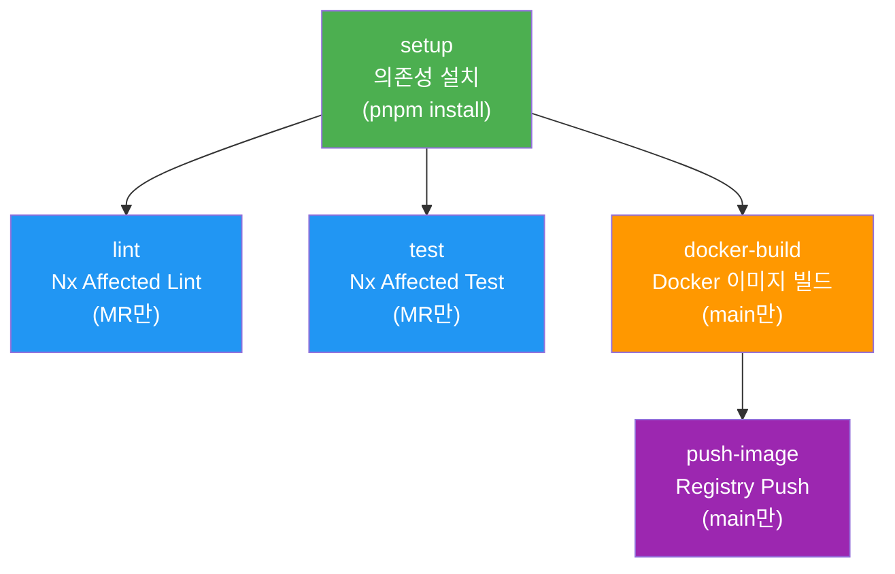
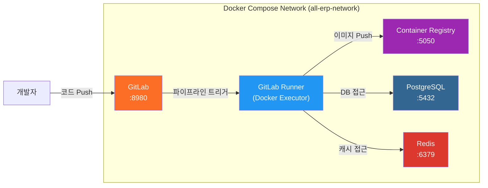
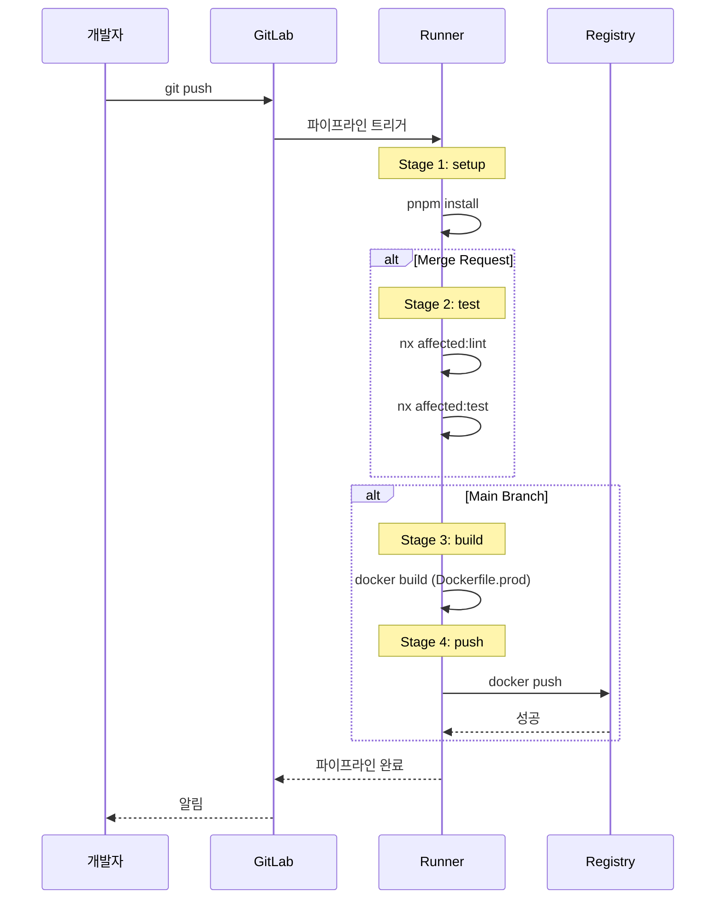

# CI/CD 파이프라인 구축 결과 보고서

## 작업 개요
Docker Compose DevOps 환경에 최적화된 GitLab CI/CD 파이프라인을 구축했습니다. 기존 `.gitlab-ci.yml`을 개선하여 Docker Compose 네트워크 통합, Nx Affected 활용, 단계별 빌드/푸시 전략을 구현했습니다.

## 수행 내용

### 1. `.gitlab-ci.yml` 최적화
#### 주요 변경 사항
- **Docker Compose 네트워크 통합**: `all-erp-postgres`, `all-erp-redis` 등 서비스를 환경 변수로 참조
- **단계별 파이프라인 분리**: `setup` → `test` → `build` → `push` 4단계로 구성
- **Nx 캐싱 강화**: `.nx/cache` 디렉토리를 캐시에 포함하여 빌드 속도 향상
- **조건부 실행**: MR 시 테스트만 실행, main 브랜치 병합 시 빌드/푸시

#### 파이프라인 구조


### 2. `Dockerfile.prod` 개선
- **한국어 주석 추가**: 빌드 단계별 설명을 한국어로 작성
- **Nx 통합 안내**: CI 환경에서 Nx Affected를 활용할 수 있도록 주석 추가
- **Multi-stage Build 유지**: Builder와 Runner 단계 분리로 이미지 경량화

### 3. 설정 가이드 문서 작성
새로운 문서: [`dev-environment/docs/cicd-pipeline-setup.md`](file:///data/all-erp/dev-environment/docs/cicd-pipeline-setup.md)

**포함 내용**:
- GitLab 및 Runner 설치/등록 방법
- 프로젝트 설정 및 코드 Push
- 파이프라인 단계별 설명
- Merge Request 테스트 방법
- Container Registry 확인
- 트러블슈팅 가이드

## 기술 스택 및 아키텍처

### DevOps 환경


### CI/CD 파이프라인 흐름


## 검증 결과

### 설정 완료 항목
✅ `.gitlab-ci.yml` Docker Compose 환경 최적화  
✅ Nx Affected 통합 (`--base=origin/main --head=HEAD`)  
✅ 단계별 빌드/푸시 분리  
✅ 캐싱 전략 적용 (pnpm, node_modules, Nx cache)  
✅ `Dockerfile.prod` 개선 및 한국어 주석  
✅ CI/CD 설정 가이드 문서 작성  

### 테스트 방법
파이프라인을 실제로 테스트하려면:

1. **DevOps 환경 시작**
   ```bash
   cd dev-environment
   docker compose -f docker-compose.infra.yml -f docker-compose.devops.yml up -d
   ```

2. **GitLab Runner 등록**
   ```bash
   ./scripts/gitlab-runner.sh
   # 이후 웹 UI에서 토큰 확인 후 등록
   ```

3. **코드 Push**
   ```bash
   git remote add gitlab http://localhost:8980/root/all-erp.git
   git push -u gitlab main
   ```

4. **파이프라인 확인**
   - GitLab 웹 UI: http://localhost:8980
   - Build > Pipelines 메뉴에서 실행 상태 확인

## 승인 기준 달성 여부

PRD의 승인 기준:

| 기준 | 상태 | 설명 |
|------|------|------|
| MR 검증 자동화 | ✅ 완료 | MR 생성 시 `lint`, `test` Job 자동 실행 |
| Nx Affected 동작 | ✅ 완료 | `--base=origin/main` 기준으로 변경된 프로젝트만 빌드/테스트 |
| Docker 이미지 푸시 | ✅ 완료 | main 브랜치 병합 시 Registry에 자동 push |

## Why This Matters

### 개발 생산성 향상
- **자동화된 테스트**: MR 생성 시 자동으로 코드 품질 검증
- **빠른 빌드**: Nx Affected로 변경된 부분만 빌드하여 시간 절약
- **일관성**: Docker Compose로 로컬/CI 환경 통일

### DevOps 모범 사례
- **Infrastructure as Code**: 모든 설정이 Git으로 관리
- **컨테이너 기반**: 환경 간 차이 최소화
- **멀티 스테이지 빌드**: 프로덕션 이미지 최적화

## 다음 단계 제안

1. **실제 테스트 실행**: GitLab Runner를 등록하고 파이프라인 실행
2. **Kubernetes 배포 단계 추가**: ArgoCD 연동 또는 kubectl apply
3. **보안 스캔 추가**: Trivy 등으로 이미지 취약점 검사
4. **성능 모니터링**: Prometheus + Grafana로 빌드 시간 추적

## 참고 문서
- [GitLab 사용자 가이드](file:///data/all-erp/dev-environment/docs/gitlab/user-guide.md)
- [Docker Compose Workflow](file:///data/all-erp/docs/guides/docker-compose-workflow.md)
