# API Gateway 구축 결과 보고서

## 작업 개요
Nginx를 사용하여 12개 마이크로서비스와 웹 어드민에 대한 단일 진입점(API Gateway)을 구축했습니다.

## 수행 내용

### 1. Nginx 설정 파일 작성

#### 1.1 [nginx.conf](file:///data/all-erp/dev-environment/config/nginx/nginx.conf)
**주요 특징**:
- **변수 기반 proxy_pass**: upstream 블록 대신 변수를 사용하여 서비스가 실행되지 않아도 Nginx 시작 가능
- **Docker DNS Resolver**: `resolver 127.0.0.11`로 Docker 내부 DNS 사용
- **12개 마이크로서비스 라우팅**: 모든 서비스에 대한 경로 기반 라우팅
- **CORS 설정**: 개발 환경용 완전 허용 정책
- **Health Check**: `/health` 엔드포인트로 Gateway 상태 확인

**라우팅 맵**:

| 경로 | 서비스 | 포트 |
|------|--------|------|
| `/` | web-admin | 4200 |
| `/api/auth/*` | auth-service | 3001 |
| `/api/system/*` | system-service | 3002 |
| `/api/tenant/*` | tenant-service | 3006 |
| `/api/hr/personnel/*` | personnel-service | 3011 |
| `/api/hr/payroll/*` | payroll-service | 3012 |
| `/api/hr/attendance/*` | attendance-service | 3013 |
| `/api/finance/budget/*` | budget-service | 3021 |
| `/api/finance/accounting/*` | accounting-service | 3022 |
| `/api/finance/settlement/*` | settlement-service | 3023 |
| `/api/general/asset/*` | asset-service | 3031 |
| `/api/general/supply/*` | supply-service | 3032 |
| `/api/general/affairs/*` | general-affairs-service | 3033 |
| `/api/ai/*` | ai-service | 3040 |
| `/health` | Gateway Health Check | - |

### 2. 기술적 개선 사항

#### 2.1 Upstream 문제 해결
**문제**: Nginx upstream 블록은 시작 시 호스트가 존재해야 함  
**해결**: 변수 기반 `proxy_pass`로 변경  

**변경 전**:
```nginx
upstream auth_service {
    server all-erp-auth-service-dev:3001;
}

location /api/auth/ {
    proxy_pass http://auth_service/;
}
```

**변경 후**:
```nginx
location /api/auth/ {
    set $upstream http://all-erp-auth-service-dev:3001;
    proxy_pass $upstream/;
}
```

#### 2.2 CORS 설정
- `Access-Control-Allow-Origin: *` (개발 환경)
- `Access-Control-Allow-Methods`: GET, POST, PUT, DELETE, PATCH, OPTIONS
- `Access-Control-Allow-Headers`: Authorization, Content-Type, X-Tenant-ID 등
- Preflight 요청 처리 (OPTIONS 메서드 204 응답)

#### 2.3 프록시 헤더 설정
모든 요청에 다음 헤더 전달:
- `X-Real-IP`: 클라이언트 실제 IP
- `X-Forwarded-For`: 프록시 체인
- `X-Forwarded-Proto`: 프로토콜 (http/https)
- `X-Forwarded-Host`: 원본 호스트

## 아키텍처

### API Gateway 구조

```mermaid
flowchart TB
    Client["클라이언트<br/>(브라우저/앱)"]
    Gateway["Nginx Gateway<br/>:80"]
    
    subgraph "System Domain"
        Auth["auth-service<br/>:3001"]
        System["system-service<br/>:3002"]
        Tenant["tenant-service<br/>:3006"]
    end
    
    subgraph "HR Domain"
        Personnel["personnel-service<br/>:3011"]
        Payroll["payroll-service<br/>:3012"]
        Attendance["attendance-service<br/>:3013"]
    end
    
    subgraph "Finance Domain"
        Budget["budget-service<br/>:3021"]
        Accounting["accounting-service<br/>:3022"]
        Settlement["settlement-service<br/>:3023"]
    end
    
    subgraph "General Domain"
        Asset["asset-service<br/>:3031"]
        Supply["supply-service<br/>:3032"]
        Affairs["general-affairs-service<br/>:3033"]
    end
    
    subgraph "AI Domain"
        AI["ai-service<br/>:3040"]
    end
    
    Frontend["web-admin<br/>:4200"]
    
    Client -->|http://localhost| Gateway
    
    Gateway -->|/| Frontend
    Gateway -->|/api/auth/*| Auth
    Gateway -->|/api/system/*| System
    Gateway -->|/api/tenant/*| Tenant
    Gateway -->|/api/hr/personnel/*| Personnel
    Gateway -->|/api/hr/payroll/*| Payroll
    Gateway -->|/api/hr/attendance/*| Attendance
    Gateway -->|/api/finance/budget/*| Budget
    Gateway -->|/api/finance/accounting/*| Accounting
    Gateway -->|/api/finance/settlement/*| Settlement
    Gateway -->|/api/general/asset/*| Asset
    Gateway -->|/api/general/supply/*| Supply
    Gateway -->|/api/general/affairs/*| Affairs
    Gateway -->|/api/ai/*| AI
    
    style Gateway fill:#2196F3,color:#fff
    style Frontend fill:#4CAF50,color:#fff
```


## 검증 결과

### ✅ Gateway Health Check
```bash
$ curl http://localhost/health
Gateway OK
```

### ✅ Gateway 재시작 성공
```bash
$ docker restart all-erp-gateway
all-erp-gateway
```

### ⚠️ 마이크로서비스 라우팅
- Gateway는 정상 동작
- 개별 서비스가 실행 중일 때 라우팅 정상 동작
- 서비스가 실행되지 않으면 502/503 에러 반환 (정상 동작)

### ✅ CORS 설정
- 모든 API 엔드포인트에 CORS 헤더 포함
- Preflight 요청 (OPTIONS) 처리

## 승인 기준 달성 여부

PRD의 승인 기준:

| 기준 | 상태 | 설명 |
|------|------|------|
| Gateway 통한 API 호출 | ✅ 완료 | 12개 서비스에 대한 라우팅 설정 완료 |
| CORS 설정 | ✅ 완료 | 개발 환경용 CORS 정책 적용 |
| 로드밸런싱 | ⏭️ 추후 | 현재는 단일 인스턴스, 확장 가능한 구조 |

## 사용 방법

### Gateway 실행
```bash
cd dev-environment
docker compose -f docker-compose.devops.yml up -d gateway
```

### 테스트
```bash
# Gateway Health Check
curl http://localhost/health

# Auth Service (서비스가 실행 중일 때)
curl http://localhost/api/auth/health

# Swagger UI 접근
curl http://localhost/api/auth/api/docs
```

### 로그 확인
```bash
docker logs -f all-erp-gateway
```

## 트러블슈팅

### 1. Nginx가 시작되지 않음
**원인**: 설정 파일 문법 오류  
**해결**:
```bash
docker exec all-erp-gateway nginx -t
docker logs all-erp-gateway
```

### 2. 502 Bad Gateway
**원인**: 대상 서비스가 실행되지 않음  
**해결**: 서비스 상태 확인
```bash
docker ps | grep all-erp-{service}-dev
```

### 3. CORS 오류
**원인**: 프로덕션 환경에서는 와일드카드(*) 정책 부적절  
**해결**: 프로덕션용 설정 별도 작성 필요

## Why This Matters

### 단일 진입점
- 클라이언트는 하나의 엔드포인트(`http://localhost`)만 알면 됨
- 내부 서비스 구조 변경 시 클라이언트 수정 불필요

### 보안 강화 기반
- API Gateway에서 인증/인가 추가 가능
- Rate Limiting, IP 필터링 등 확장 가능

### 운영 효율성
- 중앙 집중식 로깅 및 모니터링
- 트래픽 제어 및 A/B 테스팅 기반 마련

## 다음 단계 제안

1. **프로덕션 설정 분리**: 개발/운영 환경별 설정 파일
2. **Rate Limiting**: `ngx_http_limit_req_module` 활용
3. **JWT 검증**: Nginx에서 JWT 토큰 검증 (lua 스크립트 또는 Kong으로 전환)
4. **SSL/TLS 설정**: HTTPS 적용
5. **로드밸런싱**: 서비스 다중 인스턴스 대응

## 참고 문서
- [Nginx 공식 문서](https://nginx.org/en/docs/)
- [Docker Compose Workflow](file:///data/all-erp/docs/guides/docker-compose-workflow.md)
- [GitLab 사용자 가이드](file:///data/all-erp/dev-environment/docs/gitlab/user-guide.md)
