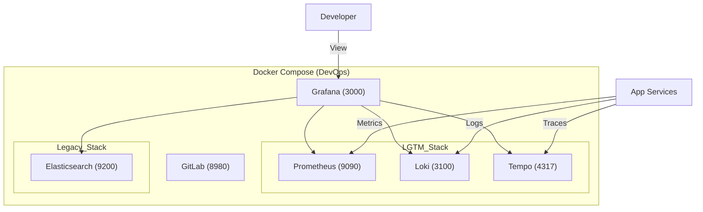

# Result: 관측성 인프라 구축 (Setup Observability)

## 1. 개요 (Overview)
**Task**: `docs/tasks/phase2-optimization/2.1_setup_observability.md`
**Status**: ✅ 완료 (Completed)
**Date**: 2025-12-07

All-ERP 프로젝트의 통합 관측성(Observability)을 위한 **LGTM Stack** 구축을 완료했습니다. 기존 DevOps 도구(GitLab, ELK)와 새로운 관측성 도구를 **`docker-compose.devops.yml`** 하나로 통합하여 관리 효율성을 높였습니다.

## 2. 변경 사항 (Changes)

### 2.1 🐳 Docker Compose DevOps 통합
`dev-environment/docker-compose.devops.yml`에 **LGTM Stack**을 추가하고 기존 도구와 병합했습니다.

| 서비스 | 이미지 | 포트 | 역할 | 상태 |
|---|---|---|---|---|
| **Grafana** | `grafana/grafana:12.3.0` | 3000 | 통합 대시보드 | 🔄 포트 변경 (3200 → 3000) |
| **Prometheus** | `prom/prometheus:v3.7.3` | 9090 | 메트릭 수집 | ✅ 신규 추가 |
| **Loki** | `grafana/loki:2.9.6` | 3100 | 로그 수집 | ✅ 신규 추가 |
| **Tempo** | `grafana/tempo:2.4.1` | 3200, 4317 | 분산 트레이싱 | ✅ 신규 추가 |
| **Elasticsearch** | `elasticsearch:9.2.1` | 9200 | 레거시 로그 저장소 | ⏹️ 유지 |
| **GitLab** | `gitlab-ce:18.6.1` | 8980 | 소스 관리 | ⏹️ 유지 |

### 2.2 🛠️ 설정 파일 및 프로비저닝 (Provisioning)
수동 설정 없이 실행 즉시 사용할 수 있도록 프로비저닝을 구성했습니다.

- **Datasources** (`config/grafana/provisioning/datasources/datasources.yml`)
  - LGTM(Loki, Prometheus, Tempo) 및 Legacy(Elasticsearch) 데이터소스 통합 설정.
  - 중복 파일 제거 및 정리 완료.
- **Dashboards** (`config/grafana/provisioning/dashboards/dashboards.yml`)
  - 대시보드 파일 자동 로드 설정 (`/etc/grafana/dashboards` 마운트).
- **기본 대시보드 탑재**
  1. **NestJS Application Metrics**: CPU, Memory 등 시스템 메트릭 모니터링.
  2. **Loki Logs**: 중앙 로그 볼륨 및 실시간 로그 뷰어.

## 3. 아키텍처 다이어그램 (Architecture)



## 4. 검증 및 실행 방법 (Run & Verify)

### 1️⃣ 실행
```bash
cd dev-environment
# 인프라 + DevOps 통합 스택 실행
docker compose -f docker-compose.infra.yml -f docker-compose.devops.yml up -d
```

### 2️⃣ 검증
1. **Grafana 접속**: http://localhost:3000 (admin / admin)
2. **Datasources 확인**: Configuration > Data Sources > Prometheus, Loki, Tempo, Elasticsearch 연결 확인.
3. **Dashboards 확인**: Dashboards 메뉴에서 'NestJS Application Metrics' 및 'Loki Logs' 확인.

### 3️⃣ 다음 단계
현재 관측성 서버는 준비되었으나, 애플리케이션이 데이터를 전송하지 않고 있습니다.
**Task 2.2 애플리케이션 연동**을 통해 실제 데이터를 수집해야 합니다.
