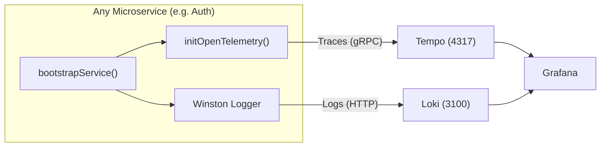

# Result: 애플리케이션 관측성 적용 (Apply Observability to Apps)

## 1. 개요 (Overview)
**Task**: `docs/tasks/phase2-optimization/2.2_apply_observability_app.md`
**Status**: ✅ 완료 (Completed)
**Date**: 2025-12-07

모든 마이크로서비스가 별도의 코드 수정 없이 **자동으로 관측성 데이터(Log, Trace)를 전송**하도록 `libs/shared/infra`를 수정했습니다. 이제 앱을 실행하면 자동으로 OpenTelemetry가 초기화되고 Loki로 로그가 전송됩니다.

## 2. 변경 사항 (Changes)

### 2.1 📦 패키지 설치
`package.json`에 다음 의존성을 추가했습니다.
- **OpenTelemetry**: `@opentelemetry/sdk-node`, `@opentelemetry/auto-instrumentations-node` 등
- **NestJS**: `nestjs-otel`
- **Logging**: `winston-loki`

### 2.2 🛡️ Shared Infra 고도화
1.  **OpenTelemetry SDK 구현** (`libs/shared/infra/src/lib/observability/otel.sdk.ts`)
    - NodeSDK를 통해 트레이싱 자동 시작.
    - OTLP Exporter를 통해 **Tempo(4317)**로 트레이스 데이터 전송.
2.  **Loki Transport 추가** (`libs/shared/infra/src/lib/logger/winston.config.ts`)
    - `winston-loki`를 사용하여 **Loki(3100)**로 로그 전송.
    - 로그에 `service` 레이블 자동 추가.
3.  **Bootstrap 자동화** (`libs/shared/infra/src/lib/bootstrap/bootstrap.ts`)
    - 서비스 시작 시 `initOpenTelemetry(serviceName)` 자동 호출.
    - 개발자가 별도로 설정할 필요 없이 `bootstrapService`만 쓰면 적용됨.

## 3. 데이터 흐름 (Data Flow)



## 4. 검증 및 확인 (Verification)

### 1️⃣ 서비스 실행
```bash
./erp start auth-service
```
서비스가 시작될 때 로그에 `📡 [OpenTelemetry] Started for service: auth-service`가 찍히는지 확인합니다.

### 2️⃣ Grafana 확인
- **Loki**: Explore > Loki > `{service="auth-service"}` 쿼리로 로그 확인.
- **Tempo**: Explore > Tempo > Service Graph 또는 Trace ID로 검색.
