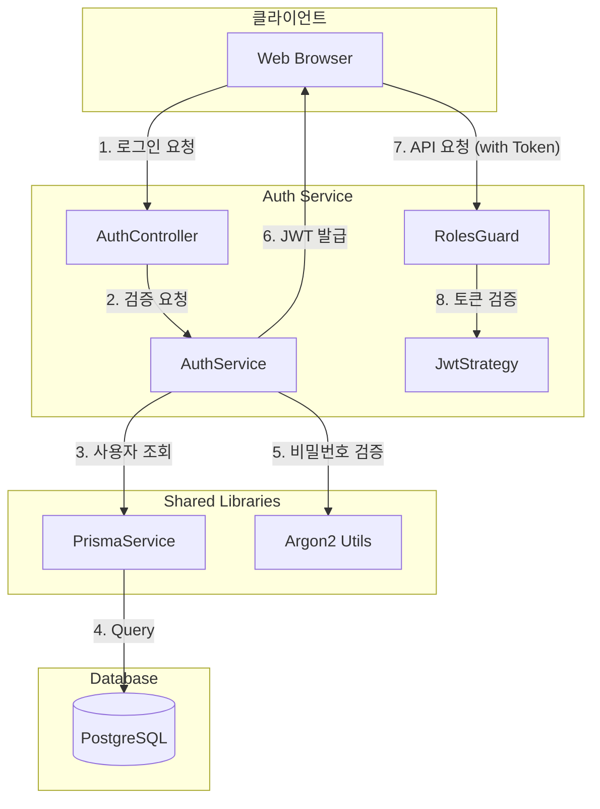

# PRD 3.2 완료 보고서: 인증/인가 서비스 (Auth Service) 구현

## 작업 요약

**PRD**: [`3.2_auth_service_impl.md`](file:///data/all-erp/docs/tasks/phase3-common/3.2_auth_service_impl.md)  
**목표**: 사용자 신원 검증 및 권한 부여를 위한 중앙 집중식 인증 서비스 구현  
**상태**: ✅ **완료** (테스트 포함)

---

## 수행 내용

### 1. Shared Infra 수정 (`@all-erp/shared/infra`)

**구현 기능**:
- `PrismaService`: `$use` 메서드 타입 에러 수정 및 Multi-tenancy 미들웨어 안정화
- `RabbitMQService`: `amqplib` 타입 호환성 문제 해결 (`createChannel` 등)
- `schema.prisma`: `User`, `Role`, `RefreshToken` 모델 추가 및 마이그레이션

**테스트**: ✅ `infra` 프로젝트 단위 테스트 통과

### 2. Auth Service 구현 (`apps/system/auth-service`)

**구현 기능**:
- **회원가입 (`POST /auth/register`)**:
    - 이메일 중복 검사
    - Argon2 비밀번호 암호화
    - 초기 역할(`USER`) 부여
- **로그인 (`POST /auth/login`)**:
    - 이메일/비밀번호 검증
    - JWT Access Token 발급 (Payload: `sub`, `email`, `role`, `tenantId`)
- **보안**:
    - `JwtStrategy`: Bearer Token 검증 및 사용자 식별
    - `RolesGuard`: `@Roles()` 데코레이터 기반 RBAC 구현

**테스트**: ✅ `auth-service` 단위 테스트 통과 (AuthService, AuthController)

---

## 아키텍처



---

## 사용 예제

### 1. 회원가입
```bash
curl -X POST http://localhost:3001/api/auth/register \
  -H "Content-Type: application/json" \
  -d '{"email":"user@example.com", "password":"password123", "name":"John Doe", "tenantId":"tenant-1"}'
```

### 2. 로그인
```bash
curl -X POST http://localhost:3001/api/auth/login \
  -H "Content-Type: application/json" \
  -d '{"email":"user@example.com", "password":"password123"}'
```

**응답**:
```json
{
  "access_token": "eyJhbGciOiJIUzI1NiIsInR5cCI6IkpXVCJ9...",
  "user": {
    "id": "uuid-...",
    "email": "user@example.com",
    "name": "John Doe",
    "role": "USER"
  }
}
```

---

## 검증 결과

### 단위 테스트
```bash
✅ pnpm nx test infra         # Shared Infra 테스트 통과
✅ pnpm nx test auth-service  # Auth Service 테스트 통과
```

### 주요 변경 파일
- `libs/shared/infra/prisma/schema.prisma`: User, Role 모델 추가
- `apps/system/auth-service/src/app/auth/auth.service.ts`: 인증 로직
- `apps/system/auth-service/src/app/auth/strategies/jwt.strategy.ts`: JWT 검증

---

## Why This Matters (중요성)

### 1. 중앙 집중식 인증 관리
모든 마이크로서비스의 진입점이 되는 인증 로직을 한 곳에서 관리하여 **보안 정책의 일관성**을 유지합니다.

### 2. 강력한 보안 표준 준수
- **Argon2**: 최신 비밀번호 해싱 알고리즘 사용으로 무차별 대입 공격 방어
- **JWT**: Stateless한 인증 방식으로 마이크로서비스 간 확장성 보장

### 3. 확장 가능한 RBAC
`Role` Enum과 `RolesGuard`를 통해 향후 권한 체계가 복잡해지더라도 유연하게 대응할 수 있는 기반을 마련했습니다.
