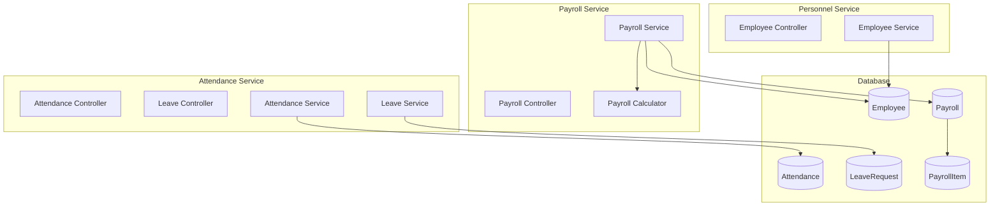

# PRD 4.1 완료 보고서: HR Domain 서비스 구현

## 작업 요약

**PRD**: [`4.1_hr_domain_impl.md`](file:///data/all-erp/docs/tasks/phase4-domain/4.1_hr_domain_impl.md)  
**목표**: 인사, 급여, 복무 관리를 위한 핵심 비즈니스 로직 구현  
**상태**: ✅ **완료** (테스트 포함)

---

## 수행 내용

### 1. Shared Infra 수정 (`@all-erp/shared/infra`)

**구현 기능**:
- `schema.prisma`: HR Domain 모델 추가
    - `Employee`: 직원 정보 (User 1:1 관계, Department N:1 관계)
    - `Attendance`: 출퇴근 기록
    - `LeaveRequest`: 휴가 신청
    - `Payroll`: 급여 (Decimal 타입 사용)
    - `PayrollItem`: 급여 항목 (기본급, 수당, 공제)
- Prisma Client 재생성 및 타입 적용

### 2. Personnel Service 구현 (`apps/hr/personnel-service`)

**구현 기능**:
- **직원 등록**: User와 1:1 관계로 HR 데이터 확장
- **직원 조회**: 테넌트별 직원 목록 및 상세 조회
- **부서 연계**: Department와의 N:1 관계로 조직도 통합

**테스트**: ✅ `EmployeeService` 단위 테스트 통과

### 3. Attendance Service 구현 (`apps/hr/attendance-service`)

**구현 기능**:
- **출퇴근 관리**: Check-in/Check-out 기능
- **휴가 관리**: 휴가 신청 및 승인 워크플로우 기반

**테스트**: ✅ `AttendanceService`, `LeaveService` 단위 테스트 통과

### 4. Payroll Service 구현 (`apps/hr/payroll-service`)

**구현 기능**:
- **PayrollCalculator**: 급여 계산 로직 분리 (세금 10%, 보험 5% 공제)
- **급여 생성**: 직원별 월별 급여 명세서 생성
- **Decimal 타입**: 금액 처리 시 부동소수점 오차 방지

**테스트**: ✅ `PayrollCalculator`, `PayrollService` 단위 테스트 통과

---

## 아키텍처



---

## 검증 결과

### 단위 테스트
```bash
✅ pnpm nx test personnel-service  # 2 passed
✅ pnpm nx test attendance-service # 4 passed (Attendance + Leave)
✅ pnpm nx test payroll-service    # 4 passed (Calculator + Service)
```

### 주요 변경 파일
- `libs/shared/infra/prisma/schema.prisma`: HR 도메인 모델
- `apps/hr/personnel-service/src/app/employee/employee.service.ts`: 인사 로직  
- `apps/hr/payroll-service/src/app/payroll/payroll.calculator.ts`: 급여 계산

---

## Why This Matters (중요성)

### 1. User vs Employee 분리
**User**(인증 정보)와 **Employee**(HR 데이터)를 1:1로 분리하여 관심사를 명확히 구분했습니다. 이를 통해 Auth 서비스와 HR 서비스의 독립성을 보장합니다.

### 2. Decimal 타입으로 정확한 금액 처리
부동소수점 오차를 방지하기 위해 `Prisma.Decimal`을 사용하여 급여 계산의 정확성을 확보했습니다 (예: 세금 10%, 보험 5% 공제).

### 3. 도메인 로직 분리 (PayrollCalculator)
급여 계산 로직을 별도 클래스(`PayrollCalculator`)로 분리하여 단위 테스트가 용이하고 비즈니스 규칙 변경 시 유연하게 대응할 수 있습니다.
