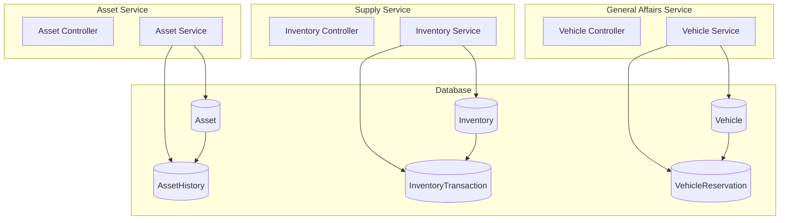

# PRD 4.3 완료 보고서: General Domain 서비스 구현

## 작업 요약

**PRD**: [`4.3_general_domain_impl.md`](file:///data/all-erp/docs/tasks/phase4-domain/4.3_general_domain_impl.md)  
**목표**: 자산, 물품, 총무 관리를 위한 지원 업무 로직 구현  
**상태**: ✅ **완료** (테스트 포함)

---

## 수행 내용

### 1. Shared Infra 수정 (`@all-erp/shared/infra`)

**구현 기능**:
- `schema.prisma`: General Domain 모델 추가
    - `Asset`: 자산 정보 (assetNumber 자동 생성, acquisitionValue, currentValue)
    - `AssetHistory`: 자산 변동 이력 (ACQUIRED, TRANSFERRED, DEPRECIATED, DISPOSED)
    - `Inventory`: 재고 정보 (quantity, minQuantity with Decimal)
    - `InventoryTransaction`: 입출고 내역 (IN, OUT)
    - `Vehicle`: 차량 정보 (licensePlate, status)
    - `VehicleReservation`: 차량 예약 (startDate, endDate, overlap detection)
- Prisma Client 재생성 및 타입 적용

### 2. Asset Service 구현 (`apps/general/asset-service`)

**구현 기능**:
- **자산 등록**: 자산번호 자동 생성 (예: AST-001, AST-002)
- **감가상각**: 정액법 계산 (잔존가액 10%, 연간 감가상각액)
- **이력 관리**: `AssetHistory`에 모든 변동 기록

**테스트**: ✅ `AssetService` 단위 테스트 통과

### 3. Supply Service 구현 (`apps/general/supply-service`)

**구현 기능**:
- **재고 등록**: 품목별 재고 생성 (최소 수량 설정)
- **입출고 처리**: IN/OUT 트랜잭션 기록
- **음수 방지**: 출고 시 재고 부족 검증 (`BadRequestException`)

**테스트**: ✅ `InventoryService` 단위 테스트 통과 (negative prevention 검증)

### 4. General Affairs Service 구현 (`apps/general/general-affairs-service`)

**구현 기능**:
- **차량 등록**: 차량 정보 관리
- **차량 예약**: 기간별 예약 생성
- **중복 방지**: 예약 기간 중복 검증 (`ConflictException`)

**테스트**: ✅ `VehicleService` 단위 테스트 통과 (overlap rejection 검증)

---

## 아키텍처



---

## 검증 결과

### 단위 테스트
```bash
✅ pnpm nx test asset-service            # 2 passed (auto number, depreciation)
✅ pnpm nx test supply-service           # 2 passed (negative prevention)
✅ pnpm nx test general-affairs-service  # 2 passed (overlap rejection)
```

### 주요 변경 파일
- `libs/shared/infra/prisma/schema.prisma`: General 도메인 모델
- `apps/general/asset-service/src/app/asset/asset.service.ts`: 자산 관리  
- `apps/general/supply-service/src/app/inventory/inventory.service.ts`: 재고 관리
- `apps/general/general-affairs-service/src/app/vehicle/vehicle.service.ts`: 차량 관리

---

## Why This Matters (중요성)

### 1. 자산번호 자동 생성
`AssetService`에서 자산 등록 시 자동으로 일련번호를 부여하여 (AST-001, AST-002...), 수작업으로 인한 번호 중복 오류를 방지합니다.

### 2. 감가상각 자동 계산
정액법(Straight-Line Method)을 사용하여 매년 자산 가치를 자동으로 감소시킵니다. 잔존가액 10%를 보장하여 자산 장부가액이 0이 되지 않도록 합니다.

### 3. 재고 음수 방지
`InventoryService`에서 출고 시 재고가 음수가 되지 않도록 사전 검증하여, 재고 부족 상황을 실시간으로 파악하고 운영 혼란을 방지합니다.

### 4. 차량 예약 충돌 방지
`VehicleService`에서 예약 생성 시 기간 중복을 검증하여, 동일 차량에 대한 중복 배차를 원천 차단합니다. 이를 통해 차량 운영의 효율성을 극대화합니다.

### 5. 이력 추적 (Audit Trail)
모든 자산 변동을 `AssetHistory` 테이블에 기록하여, 언제든지 과거 이력을 조회하고 감사 추적이 가능합니다.
