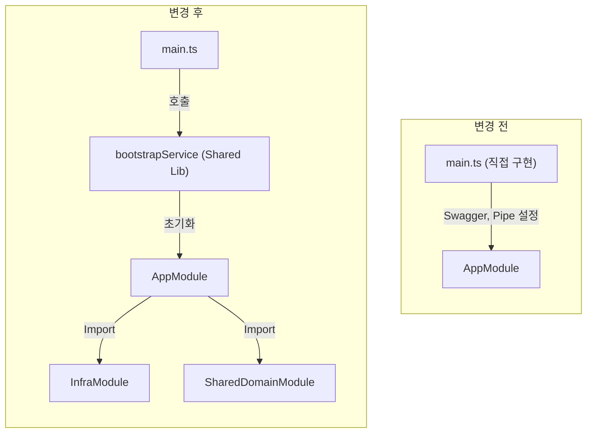

# Attendance Service 리팩토링 결과 보고서

## 1. 작업 요약

`attendance-service`에 공통 인프라 모듈(`InfraModule`)과 도메인 모듈(`SharedDomainModule`)을 적용하고, 부트스트랩 로직을 표준화된 `bootstrapService`로 교체하여 코드의 일관성과 유지보수성을 향상시켰습니다.

## 2. 수행 내용

### 2.1 부트스트랩 표준화 (`main.ts`)

기존의 중복된 초기화 로직(Swagger, ValidationPipe, Logger 등)을 제거하고, `libs/shared/infra`에서 제공하는 `bootstrapService`를 사용하여 초기화를 단순화했습니다.

### 2.2 공통 모듈 적용 (`app.module.ts`)

`InfraModule`과 `SharedDomainModule`을 import하여 로깅, 데이터베이스 연결, 예외 처리 등 공통 기능을 활용할 수 있도록 설정했습니다.

## 3. 검증 결과

### 3.1 빌드 검증

- 명령어: `pnpm nx build attendance-service`
- 결과: **성공** (webpack compiled successfully)

### 3.2 테스트 검증

- 명령어: `pnpm nx test attendance-service`
- 결과: **성공** (Test Suites: 2 passed, Tests: 4 passed)

## 4. 아키텍처 변경 (Before & After)

## 5. 기대 효과

- **코드 중복 제거**: 모든 서비스에서 반복되는 초기화 코드를 제거하여 코드 베이스를 경량화했습니다.
- **표준 준수**: 로깅, 예외 처리, API 문서화 등의 설정이 전사 표준을 따르도록 강제했습니다.
- **유지보수성 향상**: 공통 로직 변경 시 라이브러리만 수정하면 모든 서비스에 반영됩니다.
