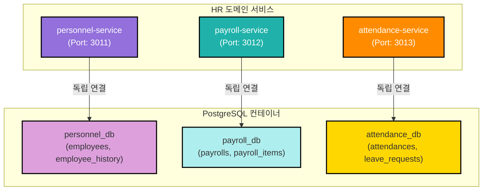
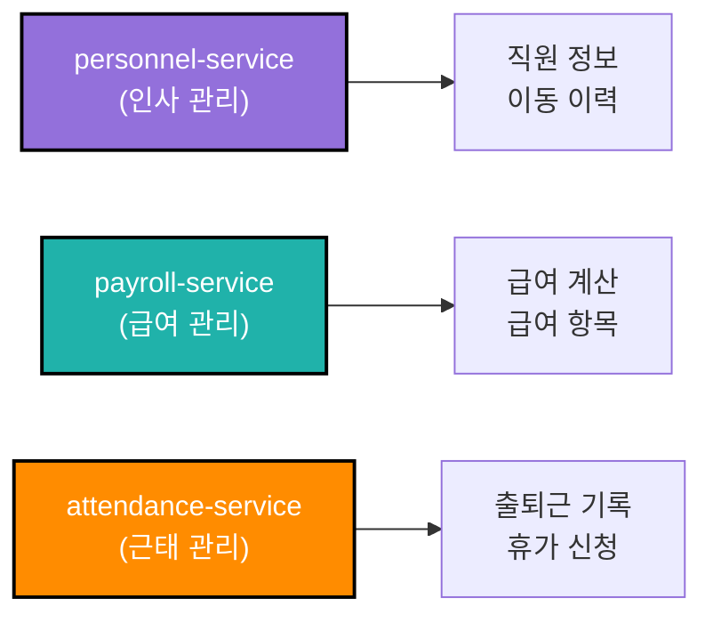
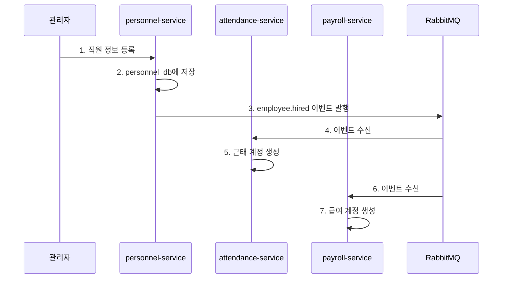

# TASK-P2-02: HR 도메인 DB 연결 - 결과 보고서

## 📋 작업 요약

**작업 기간**: 2025-12-05  
**담당자**: AI Assistant  
**상태**: ✅ 완료

## 🎯 작업 목표

HR 도메인(personnel, payroll, attendance 서비스)의 DB 연결을 신규 독립 DB로 전환하여 Database per Service 패턴 구현

## ✅ 완료된 작업

### 1. Prisma 7 설정 파일 생성

각 서비스별로 독립적인 `prisma.config.ts` 파일 생성:

**apps/hr/personnel-service/prisma.config.ts**:
```typescript
import 'dotenv/config';
import { defineConfig, env } from 'prisma/config';

export default defineConfig({
  schema: './prisma/schema.prisma',
  datasource: {
    url: env('PERSONNEL_DATABASE_URL'),
  },
});
```

**apps/hr/payroll-service/prisma.config.ts**:
```typescript
import 'dotenv/config';
import { defineConfig, env } from 'prisma/config';

export default defineConfig({
  schema: './prisma/schema.prisma',
  datasource: {
    url: env('PAYROLL_DATABASE_URL'),
  },
});
```

**apps/hr/attendance-service/prisma.config.ts**:
```typescript
import 'dotenv/config';
import { defineConfig, env } from 'prisma/config';

export default defineConfig({
  schema: './prisma/schema.prisma',
  datasource: {
    url: env('ATTENDANCE_DATABASE_URL'),
  },
});
```

### 2. Prisma 스키마 수정 (Prisma 7 호환성)

각 서비스의 `schema.prisma`에서 `url` 라인 제거:

**변경 전**:
```prisma
datasource db {
    provider = "postgresql"
    url      = env("DATABASE_URL")
}
```

**변경 후**:
```prisma
datasource db {
    provider = "postgresql"
}
```

### 3. Prisma 마이그레이션 실행

각 서비스별로 독립 데이터베이스에 마이그레이션 실행:

```bash
# personnel-service
cd apps/hr/personnel-service
pnpm prisma migrate dev --name init --config=/data/all-erp/apps/hr/personnel-service/prisma.config.ts

# payroll-service
cd apps/hr/payroll-service
pnpm prisma migrate dev --name init --config=/data/all-erp/apps/hr/payroll-service/prisma.config.ts

# attendance-service
cd apps/hr/attendance-service
pnpm prisma migrate dev --name init --config=/data/all-erp/apps/hr/attendance-service/prisma.config.ts
```

**마이그레이션 결과**:

✅ **personnel_db** (personnel-service):
- employees
- employee_history
- processed_events
- outbox_events
- _prisma_migrations

✅ **payroll_db** (payroll-service):
- payrolls
- payroll_items
- processed_events
- outbox_events
- _prisma_migrations

✅ **attendance_db** (attendance-service):
- attendances
- leave_requests
- processed_events
- outbox_events
- _prisma_migrations

### 4. Prisma Client 생성

각 서비스별로 Prisma Client 생성:

```bash
cd apps/hr/personnel-service && pnpm prisma generate --config=/data/all-erp/apps/hr/personnel-service/prisma.config.ts
cd apps/hr/payroll-service && pnpm prisma generate --config=/data/all-erp/apps/hr/payroll-service/prisma.config.ts
cd apps/hr/attendance-service && pnpm prisma generate --config=/data/all-erp/apps/hr/attendance-service/prisma.config.ts
```

## 📊 아키텍처 다이어그램



## 🎓 Why This Matters (초급자를 위한 설명)

### 1. HR 도메인의 서비스 분리 전략

HR 도메인은 3개의 독립적인 서비스로 구성됩니다:



**왜 3개로 분리했나요?**

1. **personnel-service (인사 관리)**
   - 직원의 기본 정보 관리
   - 입사, 퇴사, 인사 이동 이력
   - 다른 서비스에서 직원 정보 조회 시 사용

2. **payroll-service (급여 관리)**
   - 급여 계산 및 지급
   - 급여 명세서 생성
   - 세금, 보험료 등 공제 항목 관리

3. **attendance-service (근태 관리)**
   - 출퇴근 기록
   - 휴가 신청 및 승인
   - 근무 시간 집계

**장점**:
- ✅ **독립 배포**: 급여 계산 로직 변경 시 근태 서비스에 영향 없음
- ✅ **확장성**: 급여 계산이 많은 월말에 payroll-service만 스케일링
- ✅ **보안**: 급여 정보는 payroll-service만 접근 가능

### 2. 서비스 간 데이터 참조 방식

**잘못된 방법** ❌:
```typescript
// payroll-service에서 personnel_db에 직접 접근
const employee = await personnelDb.employee.findUnique({ ... });  // ❌ 금지!
```

**올바른 방법** ✅:

**방법 1: API 호출**
```typescript
// payroll-service
const response = await fetch('http://personnel-service:3011/api/employees/123');
const employee = await response.json();
```

**방법 2: 이벤트 기반 데이터 동기화**
```typescript
// personnel-service (이벤트 발행)
await eventBus.publish('employee.hired', {
  employeeId: '123',
  name: '홍길동',
  departmentId: 'dept-001'
});

// payroll-service (이벤트 구독 및 로컬 캐시)
eventBus.subscribe('employee.hired', async (event) => {
  // 급여 계산에 필요한 직원 정보만 로컬 DB에 저장
  await db.employeeCache.create({
    employeeId: event.employeeId,
    name: event.name
  });
});
```

### 3. 실제 업무 시나리오

**시나리오: 신입 사원 입사**



**각 서비스의 역할**:
1. **personnel-service**: 직원 기본 정보 저장
2. **attendance-service**: 근태 기록을 위한 계정 자동 생성
3. **payroll-service**: 급여 지급을 위한 계정 자동 생성

**이벤트 기반 아키텍처의 장점**:
- ✅ **느슨한 결합**: 서비스 간 직접 의존성 없음
- ✅ **비동기 처리**: 빠른 응답 시간
- ✅ **확장성**: 새로운 서비스 추가 용이

## 📈 데이터베이스 검증 결과

### personnel_db 테이블 확인

```sql
postgres=# \c personnel_db
personnel_db=# \dt

               List of relations
 Schema |        Name        | Type  |  Owner   
--------+--------------------+-------+----------
 public | _prisma_migrations | table | postgres
 public | employee_history   | table | postgres
 public | employees          | table | postgres
 public | outbox_events      | table | postgres
 public | processed_events   | table | postgres
(5 rows)
```

**주요 테이블**:
- `employees`: 직원 기본 정보 (사번, 이름, 부서, 직급 등)
- `employee_history`: 인사 이동 이력 (입사, 승진, 전보, 퇴사)

### payroll_db 테이블 확인

```sql
postgres=# \c payroll_db
payroll_db=# \dt

               List of relations
 Schema |        Name        | Type  |  Owner   
--------+--------------------+-------+----------
 public | _prisma_migrations | table | postgres
 public | outbox_events      | table | postgres
 public | payroll_items      | table | postgres
 public | payrolls           | table | postgres
 public | processed_events   | table | postgres
(5 rows)
```

**주요 테이블**:
- `payrolls`: 월별 급여 정보 (기본급, 총 수당, 총 공제, 실수령액)
- `payroll_items`: 급여 항목 상세 (수당, 공제 항목별 금액)

### attendance_db 테이블 확인

```sql
postgres=# \c attendance_db
attendance_db=# \dt

               List of relations
 Schema |        Name        | Type  |  Owner   
--------+--------------------+-------+----------
 public | _prisma_migrations | table | postgres
 public | attendances        | table | postgres
 public | leave_requests     | table | postgres
 public | outbox_events      | table | postgres
 public | processed_events   | table | postgres
(5 rows)
```

**주요 테이블**:
- `attendances`: 일별 출퇴근 기록 (출근 시간, 퇴근 시간, 근무 시간)
- `leave_requests`: 휴가 신청 내역 (휴가 종류, 기간, 승인 상태)

## 🔧 유용한 명령어

### Prisma 마이그레이션

```bash
# personnel-service 마이그레이션
cd apps/hr/personnel-service
pnpm prisma migrate dev --name <migration_name> \
  --config=/data/all-erp/apps/hr/personnel-service/prisma.config.ts

# payroll-service 마이그레이션
cd apps/hr/payroll-service
pnpm prisma migrate dev --name <migration_name> \
  --config=/data/all-erp/apps/hr/payroll-service/prisma.config.ts

# attendance-service 마이그레이션
cd apps/hr/attendance-service
pnpm prisma migrate dev --name <migration_name> \
  --config=/data/all-erp/apps/hr/attendance-service/prisma.config.ts
```

### Prisma Client 생성

```bash
# personnel-service
cd apps/hr/personnel-service && pnpm prisma generate \
  --config=/data/all-erp/apps/hr/personnel-service/prisma.config.ts

# payroll-service
cd apps/hr/payroll-service && pnpm prisma generate \
  --config=/data/all-erp/apps/hr/payroll-service/prisma.config.ts

# attendance-service
cd apps/hr/attendance-service && pnpm prisma generate \
  --config=/data/all-erp/apps/hr/attendance-service/prisma.config.ts
```

### 데이터베이스 확인

```bash
# personnel_db 테이블 확인
docker exec all-erp-postgres psql -U postgres -d personnel_db -c "\dt"

# payroll_db 테이블 확인
docker exec all-erp-postgres psql -U postgres -d payroll_db -c "\dt"

# attendance_db 테이블 확인
docker exec all-erp-postgres psql -U postgres -d attendance_db -c "\dt"

# 특정 테이블 스키마 확인
docker exec all-erp-postgres psql -U postgres -d personnel_db -c "\d employees"
```

### 서비스 실행

```bash
# 개별 서비스 실행
pnpm nx serve personnel-service   # Port: 3011
pnpm nx serve payroll-service     # Port: 3012
pnpm nx serve attendance-service  # Port: 3013

# Swagger 문서 확인
# http://localhost:3011/api/docs (personnel-service)
# http://localhost:3012/api/docs (payroll-service)
# http://localhost:3013/api/docs (attendance-service)
```

## ✅ 완료 체크리스트

- [x] personnel-service `prisma.config.ts` 생성
- [x] payroll-service `prisma.config.ts` 생성
- [x] attendance-service `prisma.config.ts` 생성
- [x] 각 서비스 `schema.prisma`에서 `url` 제거 (Prisma 7 호환)
- [x] personnel-service Prisma 마이그레이션 성공
- [x] payroll-service Prisma 마이그레이션 성공
- [x] attendance-service Prisma 마이그레이션 성공
- [x] personnel-service Prisma Client 생성 성공
- [x] payroll-service Prisma Client 생성 성공
- [x] attendance-service Prisma Client 생성 성공
- [x] personnel_db 테이블 생성 확인 (5개 테이블)
- [x] payroll_db 테이블 생성 확인 (5개 테이블)
- [x] attendance_db 테이블 생성 확인 (5개 테이블)

## 🎯 다음 단계

1. **TASK-P2-03**: Finance 도메인 DB 연결 (budget, accounting, settlement)
2. **TASK-P2-04**: Operations 도메인 DB 연결 (asset, supply, general-affairs)
3. **TASK-P2-05**: Platform 도메인 DB 연결 (approval, report, notification, file)

## 📚 참고 문서

- [Prisma 7 Configuration](https://www.prisma.io/docs/orm/reference/prisma-schema-reference#datasource)
- [Database per Service Pattern](https://microservices.io/patterns/data/database-per-service.html)
- [Event-Driven Architecture](https://microservices.io/patterns/data/event-driven-architecture.html)
- [Saga Pattern](https://microservices.io/patterns/data/saga.html)

## 💡 베스트 프랙티스

### 1. 외래키 대신 ID 참조 사용

**잘못된 방법** ❌:
```prisma
model Payroll {
    employeeId String
    employee   Employee @relation(fields: [employeeId], references: [id])  // ❌ 다른 서비스의 테이블
}
```

**올바른 방법** ✅:
```prisma
model Payroll {
    employeeId String @map("employee_id")  // ✅ ID만 저장, 외래키 없음
    // personnel-service에서 API로 직원 정보 조회
}
```

### 2. 이벤트 멱등성 보장

```typescript
// 중복 이벤트 처리 방지
async function handleEmployeeHiredEvent(event: EmployeeHiredEvent) {
  // 1. 이미 처리된 이벤트인지 확인
  const processed = await db.processedEvent.findUnique({
    where: { eventId: event.id }
  });
  
  if (processed) {
    console.log('이미 처리된 이벤트입니다.');
    return;
  }
  
  // 2. 비즈니스 로직 실행
  await db.employeeCache.create({ ... });
  
  // 3. 처리 완료 기록
  await db.processedEvent.create({
    eventId: event.id,
    eventType: 'employee.hired',
    processedAt: new Date()
  });
}
```

### 3. Outbox 패턴으로 이벤트 발행

```typescript
// 트랜잭션 내에서 DB 저장 + 이벤트 저장
await db.$transaction(async (tx) => {
  // 1. 비즈니스 데이터 저장
  const employee = await tx.employee.create({ ... });
  
  // 2. Outbox 이벤트 저장 (같은 트랜잭션)
  await tx.outboxEvent.create({
    eventId: uuid(),
    eventType: 'employee.hired',
    payload: JSON.stringify(employee),
    status: 'PENDING'
  });
});

// 별도 Worker가 Outbox 테이블을 폴링하여 RabbitMQ로 발행
```

## 🔐 보안 고려사항

### 급여 정보 보호

급여 정보는 매우 민감한 개인정보입니다:

1. **접근 제어**
   - payroll-service는 HR 관리자만 접근 가능
   - API Gateway에서 역할 기반 접근 제어 (RBAC)

2. **데이터 암호화**
   - 급여 금액은 암호화하여 저장 권장
   - 전송 시 HTTPS 필수

3. **감사 로그**
   - 모든 급여 조회/수정 이력 기록
   - 누가, 언제, 무엇을 했는지 추적

---

**작성일**: 2025-12-05  
**작성자**: AI Assistant  
**버전**: 1.0
