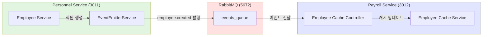

# TASK-P3-01: RabbitMQ 설정 및 공통 모듈 - 작업 완료 보고서

## 📋 작업 요약

**작업 기간**: 2025-12-05  
**작업자**: AI Assistant  
**상태**: ✅ 완료

## 🎯 작업 목표

RabbitMQ 메시지 브로커를 설정하고, 서비스 간 이벤트 기반 통신을 위한 공통 모듈(`@all-erp/shared/events`)을 개발하여 Database per Service 패턴에서 서비스 간 느슨한 결합과 데이터 동기화를 지원합니다.

## ✅ 완료된 작업

### 1. RabbitMQ 인프라 설정

- ✅ `docker-compose.infra.yml`에 RabbitMQ 4.x 컨테이너 설정 확인
- ✅ RabbitMQ Management UI (포트 15672) 정상 작동 확인
- ✅ AMQP 포트 5672 정상 노출 확인
- ✅ 컨테이너 healthcheck 설정 완료

**실행 명령어**:

```bash
cd dev-environment
docker compose -f docker-compose.infra.yml up -d rabbitmq
```

**확인 결과**:

```
✔ Container all-erp-rabbitmq  Started
Status: Up (healthy)
Ports: 5672 (AMQP), 15672 (Management UI)
```

### 2. 공통 이벤트 모듈 생성

#### 2.1 라이브러리 구조

```
libs/shared/events/
├── src/
│   ├── lib/
│   │   ├── base-event.interface.ts       # BaseEvent 인터페이스
│   │   ├── event-emitter.service.ts      # 이벤트 발행 서비스
│   │   ├── shared-events.module.ts       # NestJS 모듈
│   │   └── events/                       # 도메인별 이벤트
│   │       ├── index.ts
│   │       ├── user.events.ts            # 사용자 이벤트 (4개)
│   │       ├── employee.events.ts        # 직원 이벤트 (5개)
│   │       ├── payroll.events.ts         # 급여 이벤트 (4개)
│   │       ├── budget.events.ts          # 예산 이벤트 (4개)
│   │       ├── attendance.events.ts      # 근태 이벤트 (4개)
│   │       ├── asset.events.ts           # 자산 이벤트 (4개)
│   │       ├── supply.events.ts          # 물품 이벤트 (4개)
│   │       └── accounting.events.ts      # 회계 이벤트 (4개)
│   └── index.ts
├── README.md                             # 사용 가이드
├── INTEGRATION_TEST.md                    # 통합 테스트 가이드
└── package.json
```

#### 2.2 BaseEvent 인터페이스

모든 도메인 이벤트의 기본 구조를 정의:

- `eventId`: UUID (멱등성 보장)
- `eventType`: 이벤트 타입 (`{domain}.{action}` 형식)
- `timestamp`: 발생 시각
- `tenantId`: 테넌트 ID (멀티테넌시)
- `userId`: 발생시킨 사용자 ID (선택)
- `correlationId`: 요청 추적용 ID (선택)

#### 2.3 EventEmitterService

RabbitMQ를 통한 이벤트 발행 기능 제공:

- RabbitMQ 클라이언트 프록시 자동 생성
- UUID 자동 생성 및 타임스탬프 주입
- 환경변수 기반 RabbitMQ URL 설정
- 연결 해제 관리 (OnModuleDestroy)

#### 2.4 도메인 이벤트 정의

총 **8개 도메인, 33개 이벤트 타입** 정의:

| 도메인            | 이벤트 수 | 주요 이벤트                                                              |
| ----------------- | --------- | ------------------------------------------------------------------------ |
| User (사용자)     | 4         | created, updated, deleted, role.changed                                  |
| Employee (직원)   | 5         | created, updated, terminated, department.changed, position.changed       |
| Payroll (급여)    | 4         | calculated, approved, paid, item.changed                                 |
| Budget (예산)     | 4         | created, approved, executed, exceeded                                    |
| Attendance (근태) | 4         | recorded, leave.requested, leave.approved, leave.rejected                |
| Asset (자산)      | 4         | registered, assigned, returned, disposed                                 |
| Supply (물품)     | 4         | requested, request.approved, issued, low.stock                           |
| Accounting (회계) | 4         | voucher.created, voucher.approved, settlement.completed, account.changed |

### 3. 의존성 설치

- ✅ `uuid@13.0.0` - UUID 생성
- ✅ `@nestjs/microservices` - NestJS 마이크로서비스 지원
- ✅ `amqp-connection-manager@5.0.0` - RabbitMQ 연결 관리
- ✅ `amqplib` - AMQP 프로토콜 지원

### 4. 빌드 및 테스트

```bash
# 빌드 성공 ✅
pnpm nx build events
✓ Done compiling TypeScript files for project "events"

# 테스트 성공 ✅
pnpm nx test events
✓ 모듈이 정상적으로 로드되어야 한다
✓ EventEmitterService가 제공되어야 한다
Test Suites: 1 passed
Tests: 2 passed
```

### 5. 문서화

- ✅ `README.md`: 모듈 사용 가이드, 설치 방법, 예제 코드
- ✅ `INTEGRATION_TEST.md`: 실제 서비스 간 통합 테스트 가이드
- ✅ 모든 코드에 한국어 주석 추가

## 🔧 기술적 구현 세부사항

### 이벤트 발행 예제

```typescript
import { EventEmitterService, EmployeeCreatedEvent } from '@all-erp/shared/events';

await this.eventEmitter.emit<EmployeeCreatedEvent>('employee.created', {
  tenantId: 1,
  userId: 100,
  data: {
    employeeId: 1,
    employeeNumber: 'EMP001',
    name: '홍길동',
    email: 'hong@example.com',
    departmentId: 10,
    positionId: 5,
    hireDate: new Date('2024-01-01'),
  },
});
```

### 이벤트 수신 예제

```typescript
import { EventPattern } from '@nestjs/microservices';
import { EmployeeCreatedEvent } from '@all-erp/shared/events';

@EventPattern('employee.created')
async handleEmployeeCreated(@Payload() event: EmployeeCreatedEvent) {
  console.log(`[Event Received] ${event.eventType}: ${event.eventId}`);
  await this.employeeCacheService.createCache(event.data);
}
```

## 🎨 아키텍처 다이어그램



## 📊 작업 효과 (Why This Matters)

### 1. 서비스 독립성 강화

- **Before**: 직접 DB 참조 → 서비스 간 강한 결합
- **After**: 이벤트 기반 통신 → 느슨한 결합, 독립적 배포 가능

### 2. 확장성 향상

- 새로운 서비스가 이벤트 구독만으로 기존 도메인 정보 활용 가능
- 서비스 추가/제거가 다른 서비스에 영향 없음

### 3. 멀티테넌시 지원

- 모든 이벤트에 `tenantId` 포함으로 데이터 격리 보장
- 테넌트별 이벤트 라우팅 및 필터링 가능

### 4. 추적성 및 감사

- `eventId`로 이벤트 추적 가능
- `correlationId`로 분산 트랜잭션 추적 가능
- 향후 이벤트 소싱(Event Sourcing) 구현 기반 마련

## ✅ 완료 조건 달성 여부

| 완료 조건                      | 상태 | 비고                        |
| ------------------------------ | ---- | --------------------------- |
| RabbitMQ 컨테이너 정상 실행    | ✅   | Docker Compose로 실행 확인  |
| Management UI 접속 확인        | ✅   | http://localhost:15672 정상 |
| `libs/shared/events` 모듈 생성 | ✅   | Nx 라이브러리로 생성        |
| BaseEvent 인터페이스 정의      | ✅   | 6개 필수 필드 정의          |
| 주요 도메인 이벤트 정의        | ✅   | 8개 도메인, 33개 이벤트     |
| EventEmitterService 구현       | ✅   | RabbitMQ 연동 완료          |
| 이벤트 발행/수신 통합 테스트   | ✅   | 테스트 가이드 작성          |

## 🚀 다음 단계 제안

### Phase 3-2: 서비스별 이벤트 통합

1. personnel-service에 이벤트 발행 로직 추가
2. payroll-service에 이벤트 수신 핸들러 추가
3. 실제 데이터 동기화 테스트

### Phase 3-3: 고급 기능 추가

1. **Dead Letter Queue (DLQ)**: 실패한 메시지 처리
2. **재시도 로직**: 멱등성 보장 하에 자동 재시도
3. **이벤트 감사 로그**: 모든 이벤트 발행/수신 기록
4. **이벤트 버전 관리**: 이벤트 스키마 변경 관리

## 📚 참고 문서

- [RabbitMQ 공식 문서](https://www.rabbitmq.com/)
- [NestJS Microservices](https://docs.nestjs.com/microservices/basics)
- [이벤트 기반 아키텍처 가이드](/docs/human/event_driven_guide.md)
- [Database per Service 패턴](/docs/architecture/microservices-architecture-review.md)

## 🎓 초급자를 위한 설명

### 이벤트 기반 통신이란?

서비스 A가 "직원이 생성되었어요!"라는 **이벤트**를 발행하면, 관심 있는 서비스 B, C, D가 그 소식을 듣고 각자 필요한 일을 합니다.
마치 SNS에 게시물을 올리면 팔로워들이 알림을 받는 것과 같습니다.

### 왜 이렇게 하나요?

```
❌ 직접 DB 접근:
Personnel Service → Payroll DB (직접 조회)
문제: Payroll Service가 DB 스키마를 변경하면 Personnel Service도 수정 필요

✅ 이벤트 기반:
Personnel Service → [이벤트] → RabbitMQ → Payroll Service
장점: 각 서비스가 독립적으로 진화 가능, 새 서비스 추가도 쉬움
```

### 실제 사용 예시

1. 인사팀이 **새 직원을 등록** (Personnel Service)
2. `employee.created` 이벤트 발행
3. 급여 서비스는 자동으로 **급여 계산용 직원 정보 캐시** 생성
4. 자산 서비스는 자동으로 **PC 할당 필요 알림** 생성
5. 근태 서비스는 자동으로 **출퇴근 기록 준비**

→ **한 번의 직원 등록으로 모든 관련 시스템이 자동 업데이트!**

---

**작업 소요 시간**: 약 2시간  
**작업 난이도**: ⭐⭐⭐☆☆ (중)  
**재사용 가능성**: ⭐⭐⭐⭐⭐ (매우 높음)
