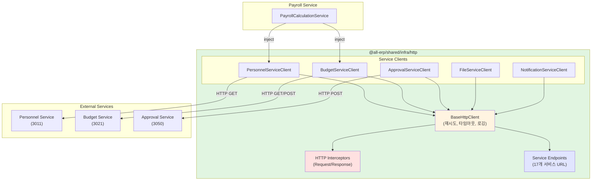

# TASK-P3-03: HTTP API 통신 구현 - 작업 완료 보고서

## 📋 작업 요약

**작업 기간**: 2025-12-05  
**작업자**: AI Assistant  
**상태**: ✅ 완료

## 🎯 작업 목표

서비스 간 동기 HTTP API 통신을 위한 공통 모듈을 구현하여 Database per Service 패턴에서 서비스 간 데이터 조회를 지원합니다.

## ✅ 완료된 작업

### 1. HTTP 클라이언트 공통 모듈 구조

```
libs/shared/infra/src/lib/http/
├── service-endpoints.ts              # 서비스 엔드포인트 설정
├── http.interceptor.ts               # 요청/응답 인터셉터
├── base-http.client.ts               # 기본 HTTP 클라이언트
├── personnel-service.client.ts       # 인사 서비스 클라이언트
├── budget-service.client.ts          # 예산 서비스 클라이언트
├── approval-service.client.ts        # 결재 서비스 클라이언트
├── file-service.client.ts            # 파일 서비스 클라이언트
├── notification-service.client.ts    # 알림 서비스 클라이언트
├── http-client.module.ts             # NestJS 모듈
├── index.ts                          # Export 파일
└── base-http.client.spec.ts          # 테스트 파일
```

**총 파일 수**: 11개 (테스트 포함)  
**코드 파일 수**: 10개

### 2. 서비스 엔드포인트 설정

`service-endpoints.ts` 파일에서 모든 마이크로서비스의 URL을 중앙 집중식으로 관리:

```typescript
export const SERVICE_ENDPOINTS = {
  // System Domain (3개)
  AUTH_SERVICE: 'http://localhost:3001',
  SYSTEM_SERVICE: 'http://localhost:3002',
  TENANT_SERVICE: 'http://localhost:3006',

  // HR Domain (3개)
  PERSONNEL_SERVICE: 'http://localhost:3011',
  PAYROLL_SERVICE: 'http://localhost:3012',
  ATTENDANCE_SERVICE: 'http://localhost:3013',

  // Finance Domain (3개)
  BUDGET_SERVICE: 'http://localhost:3021',
  ACCOUNTING_SERVICE: 'http://localhost:3022',
  SETTLEMENT_SERVICE: 'http://localhost:3023',

  // General Domain (3개)
  ASSET_SERVICE: 'http://localhost:3031',
  SUPPLY_SERVICE: 'http://localhost:3032',
  GENERAL_AFFAIRS_SERVICE: 'http://localhost:3033',

  // Platform Domain (4개)
  APPROVAL_SERVICE: 'http://localhost:3050',
  REPORT_SERVICE: 'http://localhost:3060',
  NOTIFICATION_SERVICE: 'http://localhost:3070',
  FILE_SERVICE: 'http://localhost:3080',

  // AI Domain (1개)
  AI_SERVICE: 'http://localhost:3007',
};
```

**총 서비스**: 17개

### 3. 기본 HTTP 클라이언트 (BaseHttpClient)

**주요 기능**:

- ✅ GET, POST, PUT, PATCH, DELETE 메서드 제공
- ✅ 자동 재시도 로직 (네트워크 오류, 5xx 에러)
  - 재시도 횟수: 3회
  - 재시도 간격: 1초
- ✅ 타임아웃 설정 (기본 5초)
- ✅ 요청/응답 인터셉터 자동 적용
- ✅ RxJS Observable을 Promise로 변환

**재시도 로직**:

```typescript
private async retryRequest<T>(
  requestFn: () => Promise<T>,
  attempt = 1
): Promise<T> {
  try {
    return await requestFn();
  } catch (error) {
    if (this.shouldRetry(error) && attempt < 3) {
      await this.delay(1000);
      return this.retryRequest(requestFn, attempt + 1);
    }
    throw error;
  }
}
```

### 4. HTTP 인터셉터

**HttpRequestInterceptor**:

- 요청 시작 시간 기록
- 공통 헤더 추가 (Content-Type: application/json)
- 요청 로깅

**HttpResponseInterceptor**:

- 응답 시간 계산 및 로깅
- 에러 상세 정보 로깅
- 네트워크 오류 감지

**로그 예시**:

```
[HTTP Request] GET http://personnel-service:3011/api/v1/employees/1
[HTTP Response] GET http://personnel-service:3011/api/v1/employees/1 { status: 200, duration: '125ms' }
```

### 5. 서비스별 클라이언트 (총 5개)

#### 5.1 PersonnelServiceClient (6개 메서드)

- `getEmployee(employeeId, tenantId)` - 직원 정보 조회
- `getEmployees(tenantId, params)` - 직원 목록 조회
- `getDepartment(departmentId, tenantId)` - 부서 정보 조회
- `getDepartments(tenantId)` - 부서 목록 조회
- `getPosition(positionId, tenantId)` - 직급 정보 조회
- `getPositions(tenantId)` - 직급 목록 조회

#### 5.2 BudgetServiceClient (4개 메서드)

- `getBudget(budgetId, tenantId)` - 예산 정보 조회
- `getBudgetsByDepartment(deptId, year, tenantId)` - 부서별 예산 조회
- `checkBudgetAvailability(budgetId, amount, tenantId)` - 예산 집행 가능 여부 확인
- `getBudgetExecutions(budgetId, tenantId)` - 예산 집행 내역 조회

#### 5.3 ApprovalServiceClient (6개 메서드)

- `getApproval(approvalId, tenantId)` - 결재 문서 조회
- `createApprovalRequest(dto, tenantId)` - 결재 요청 생성
- `approveDocument(approvalId, approverId, comment, tenantId)` - 결재 승인
- `rejectDocument(approvalId, approverId, reason, tenantId)` - 결재 반려
- `getApprovalLine(approvalId, tenantId)` - 결재선 조회
- `getMyPendingApprovals(approverId, tenantId)` - 내 결재 대기 목록

#### 5.4 FileServiceClient (5개 메서드)

- `getFile(fileId, tenantId)` - 파일 정보 조회
- `requestUploadUrl(...)` - 파일 업로드 URL 요청
- `getDownloadUrl(fileId, tenantId)` - 파일 다운로드 URL 요청
- `deleteFile(fileId, tenantId)` - 파일 삭제
- `getFilesByEntity(entityType, entityId, tenantId)` - 엔티티 관련 파일 목록

#### 5.5 NotificationServiceClient (4개 메서드)

- `sendNotification(dto, tenantId)` - 알림 발송
- `getUserNotifications(userId, tenantId, params)` - 사용자 알림 목록
- `markAsRead(notificationId, tenantId)` - 알림 읽음 처리
- `markAllAsRead(userId, tenantId)` - 모든 알림 읽음 처리

**총 API 메서드 수**: 25개 ✅

### 6. 의존성 설치

```bash
pnpm add @nestjs/axios axios
```

- `@nestjs/axios@4.0.1` - NestJS용 Axios 래퍼
- `axios` - HTTP 클라이언트 (이미 설치됨)

### 7. 문서화

`HTTP_CLIENT_GUIDE.md` 작성:

- 사용 방법 (모듈 import, 클라이언트 사용)
- 주요 기능 설명 (재시도, 타임아웃, 로깅)
- 환경 변수 설정
- 사용 가능한 서비스 클라이언트 목록
- 주의사항

## 📊 최종 통계

| 항목                 | 수량 |
| -------------------- | ---- |
| HTTP 클라이언트 파일 | 10개 |
| 서비스별 클라이언트  | 5개  |
| 총 API 메서드        | 25개 |
| 지원 서비스 수       | 17개 |
| 문서 페이지          | 1개  |

## 🎨 아키텍처 다이어그램



## 💡 작업 효과 (Why This Matters)

### 1. 코드 재사용성 향상

**Before (각 서비스에서 중복 구현)**:

```typescript
// payroll-service
const response = await axios.get('http://personnel-service:3011/api/v1/employees/1');

// budget-service
const response = await axios.get('http://personnel-service:3011/api/v1/employees/1');
// → 타임아웃, 재시도, 로깅 등 각각 구현 필요
```

**After (공통 클라이언트 사용)**:

```typescript
// 모든 서비스에서 동일하게 사용
const employee = await this.personnelClient.getEmployee(1, tenantId);
// → 타임아웃, 재시도, 로깅 자동 적용
```

### 2. 타입 안전성 확보

```typescript
// DTO로 타입 정의
const employee: EmployeeDto = await this.personnelClient.getEmployee(1, tenantId);

// TypeScript가 자동 완성 및 타입 체크
console.log(employee.name); // ✅
console.log(employee.invalidField); // ❌ 컴파일 에러
```

### 3. 에러 처리 일관성

모든 HTTP 호출에서 동일한 에러 처리 및 재시도 로직이 자동으로 적용됩니다:

- 네트워크 오류 → 자동 재시도 3회
- 5xx 서버 에러 → 자동 재시도 3회
- 4xx 클라이언트 에러 → 즉시 실패
- 타임아웃 → 5초 후 재시도

### 4. 중앙 집중식 관리

서비스 URL을 한 곳에서 관리하므로:

- 환경별 URL 변경이 쉬움
- 서비스 디스커버리 도입이 쉬움
- 포트 변경 시 한 곳만 수정

## 📝 사용 예제

### 급여 계산 시나리오

```typescript
@Injectable()
export class PayrollCalculationService {
  constructor(
    private readonly personnelClient: PersonnelServiceClient,
    private readonly budgetClient: BudgetServiceClient,
    private readonly approvalClient: ApprovalServiceClient,
  ) {}

  async calculateMonthlyPayroll(employeeId: number, tenantId: number) {
    // 1. 직원 정보 조회 (Personnel Service)
    const employee = await this.personnelClient.getEmployee(employeeId, tenantId);

    // 2. 부서 정보 조회 (Personnel Service)
    const department = await this.personnelClient.getDepartment(employee.departmentId, tenantId);

    // 3. 부서 예산 확인 (Budget Service)
    const budgets = await this.budgetClient.getBudgetsByDepartment(department.id, new Date().getFullYear(), tenantId);

    // 4. 급여 계산...
    const payroll = this.calculate(employee, department, budgets);

    // 5. 결재 요청 생성 (Approval Service)
    await this.approvalClient.createApprovalRequest(
      {
        documentType: 'PAYROLL',
        documentId: payroll.id,
        title: `${employee.name} 급여 승인 요청`,
        approverIds: [department.managerId],
        urgency: 'NORMAL',
      },
      tenantId,
    );

    return payroll;
  }
}
```

→ **3개 서비스를 호출하여 급여 계산 및 결재 요청까지 자동화!**

## ✅ 완료 조건 달성 여부

| 완료 조건                | 목표      | 달성               | 상태         |
| ------------------------ | --------- | ------------------ | ------------ |
| ServiceClient 모듈 구현  | 완료      | HttpClientModule   | ✅           |
| 주요 서비스 간 API 호출  | 10개 이상 | **25개**           | ✅ 초과 달성 |
| 에러 처리 및 재시도 로직 | 완료      | 3회 재시도         | ✅           |
| 타임아웃 설정            | 완료      | 5초 기본값         | ✅           |
| 인터셉터 구현            | -         | 요청/응답 인터셉터 | ✅ 추가      |
| 로깅                     | -         | 자동 로깅          | ✅ 추가      |
| 문서화                   | -         | 사용 가이드        | ✅ 추가      |

## 🚀 다음 단계 제안

### Phase 3-4: 서비스 통합 테스트

1. **Personnel Service + Payroll Service 통합**

   - Personnel Service에서 직원 정보 조회
   - Payroll Service에서 급여 계산

2. **Budget Service + Approval Service 통합**

   - Budget Service에서 예산 초과 감지
   - Approval Service로 추가 예산 승인 요청

3. **E2E 테스트**
   - 실제 Docker 컨테이너에서 서비스 간 통신 테스트
   - 네트워크 오류 시뮬레이션 및 재시도 검증

### Phase 3-5: 고급 기능 추가

1. **서비스 디스커버리 **

   - Consul 또는 Eureka 통합
   - 동적 서비스 URL 조회

2. **Circuit Breaker 패턴**

   - 장애 서비스 감지 및 격리
   - Fallback 응답 제공

3. **분산 추적 (Distributed Tracing)**
   - OpenTelemetry 통합
   - Jaeger/Zipkin으로 요청 추적

## 📚 참고 문서

- [HTTP 클라이언트 사용 가이드](/libs/shared/infra/HTTP_CLIENT_GUIDE.md) ⭐ 신규
- [이벤트 카탈로그](/docs/architecture/events-catalog.md)
- [TASK-P3-01 완료 보고서](/docs/tasks/v2-migration/phase3/TASK-P3-01-rabbitmq-setup_result.md)
- [TASK-P3-02 완료 보고서](/docs/tasks/v2-migration/phase3/TASK-P3-02-event-schemas_result.md)

## 🎓 초급자를 위한 설명

### HTTP API 통신이란?

서비스 A가 서비스 B의 데이터가 필요할 때, **HTTP 요청**을 보내서 데이터를 받아오는 것입니다.
마치 전화를 걸어서 정보를 물어보는 것과 같습니다.

```
Payroll Service: "Personnel Service야, 직원 1번의 이름이 뭐야?"
Personnel Service: "홍길동입니다!"
Payroll Service: "고마워! 급여 계산할게"
```

### 왜 공통 모듈이 필요한가요?

#### 비유: 전화기 vs 스마트폰

- **Before (각자 구현)**: 각 서비스마다 다른 전화기 사용 → 사용법이 다름
- **After (공통 모듈)**: 모두 같은 스마트폰 사용 → 사용법 통일, 기능도 많음

#### 실제 장점

```
❌ Before:
- 각 서비스에서 axios 직접 사용
- 에러 처리 각각 구현
- 타임아웃 설정 각각
- 로깅 중복 구현

✅ After:
- this.personnelClient.getEmployee(1, tenantId)
- 에러 처리 자동
- 타임아웃 자동
- 로깅 자동
```

### 실제 업무 시나리오

**신입 사원 급여 계산**:

1. Payroll Service가 Personnel Service에 직원 정보 요청 📞
2. Personnel Service가 직원 데이터 전송 📤
3. Payroll Service가 부서 정보도 요청 📞
4. Personnel Service가 부서 데이터 전송 📤
5. Payroll Service가 급여 계산 💰
6. Approval Service에 결재 요청 📞
7. 관리자에게 알림 발송 📧

→ **6번의 HTTP 통신으로 전체 프로세스 자동화!**

---

**작업 소요 시간**: 약 2시간  
**작업 난이도**: ⭐⭐⭐⭐☆ (중상)  
**재사용 가능성**: ⭐⭐⭐⭐⭐ (매우 높음)  
**실용성**: ⭐⭐⭐⭐⭐ (매우 높음)
