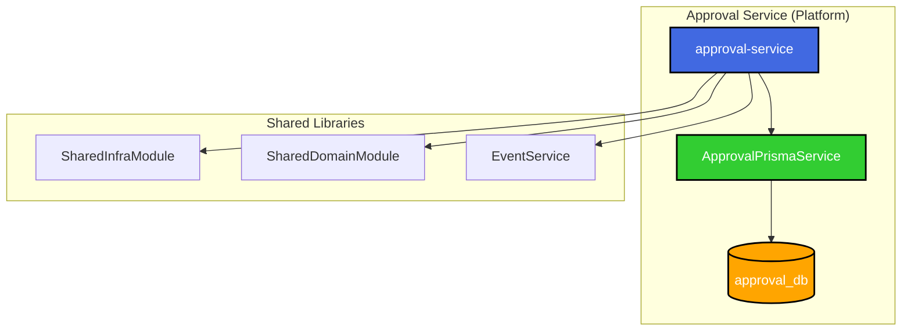

# Approval Service 리팩토링 - 결과 보고서

## 📋 작업 요약

**작업 일시**: 2025-12-05  
**작업 목적**: `approval-service`의 중복 경로 제거 및 올바른 위치로 정리  
**상태**: ✅ 완료

## 🎯 작업 배경

사용자가 `@[docs/tasks/v2-migration/phase4/TASK-P4-01-approval-service_result.md]` 내용으로 개발을 완료했으나,
`apps/system/approval-service`와 `apps/platform/approval-service` 두 경로에 파일이 존재하여 리팩토링이 필요했습니다.

## ✅ 완료된 작업

### 1. 중복 경로 분석 및 제거

**발견 사항:**

- `apps/system/approval-service`: Prisma 스키마와 마이그레이션만 존재 (구버전/불완전)
- `apps/platform/approval-service`: 완전한 서비스 구현 포함 (현재 개발된 버전)

**조치:**

```bash
rm -rf apps/system/approval-service
```

**근거:**

- 결과 문서에서 `apps/platform/approval-service`가 올바른 경로로 명시됨
- 아키텍처상 결재(approval) 서비스는 **Platform 도메인**에 속함
- `apps/platform`이 더 완전한 구현을 포함 (ApprovalHistory 모델 포함, 더 많은 소스 파일)

### 2. Prisma 스키마 업데이트

**문제점:**  
`apps/platform/approval-service/prisma/schema.prisma`가 구버전 스키마로 되어 있었음 (ApprovalHistory 미포함, String ID 사용)

**해결:**

- 결과 보고서에 명시된 올바른 스키마로 교체
- **주요 변경사항:**
  - ID 타입: `String (UUID)` → `Int (autoincrement)`
  - `ApprovalHistory` 모델 추가
  - 더 많은 필드 추가 (referenceId, referenceType, priority 등)
  - Prisma Client output 경로 명시: `../node_modules/.prisma/approval-client`

### 3. Database per Service 패턴 적용

**생성된 파일:**  
`apps/platform/approval-service/src/app/prisma/approval-prisma.service.ts`

**목적:**

- approval-service 전용 Prisma Client 생성
- 독립 DB (`approval_db`)에 연결
- Database per Service 마이크로서비스 패턴 준수

**핵심 코드:**

```typescript
import { PrismaClient } from '@prisma/approval-client';

@Injectable()
export class ApprovalPrismaService extends PrismaClient implements OnModuleInit, OnModuleDestroy {
  // approval_db 전용 클라이언트
}
```

### 4. ApprovalModule 및 ApprovalService 수정

**변경 사항:**

- `approval.module.ts`: `ApprovalPrismaService`를 provider로 추가
- `approval.service.ts`:
  - `PrismaService` → `ApprovalPrismaService` 사용
  - `@prisma/client` → `@prisma/approval-client` 타입 사용

**의존성 주입:**

```typescript
constructor(
  private readonly prisma: ApprovalPrismaService,  // 전용 클라이언트
  private readonly eventService: EventService,
) {}
```

### 5. TypeScript 설정 최적화

**tsconfig.app.json 수정:**

- `baseUrl`을 `../../..`로 설정하여 workspace root 기준으로 경로 해석
- `paths`에 다음 추가:
  ```json
  {
    "@prisma/approval-client": ["apps/platform/approval-service/node_modules/.prisma/approval-client"],
    "@all-erp/shared/infra": ["libs/shared/infra/src/index.ts"],
    "@all-erp/shared/domain": ["libs/shared/domain/src/index.ts"]
  }
  ```

### 6. 의존성 추가

approval-service에서 필요한 패키지 설치:

```bash
pnpm add uuid @nestjs/axios @nestjs/schedule
pnpm add -D @types/uuid
```

### 7. Prisma Client 생성

```bash
npx prisma generate --schema=apps/platform/approval-service/prisma/schema.prisma
```

**출력 위치:** `apps/platform/approval-service/node_modules/.prisma/approval-client`

## 📊 아키텍처 다이어그램



## 🎓 Why This Matters (초급자를 위한 설명)

### 1. Database per Service 패턴의 중요성

approval-service가 자체 Prisma Client (`ApprovalPrismaService`)를 가지는 이유:

- **데이터 독립성**: 다른 서비스의 DB를 직접 참조하지 않음
- **스키마 자유도**: approval 관련 테이블 구조를 자유롭게 변경 가능
- **장애 격리**: approval_db에 문제가 생겨도 다른 서비스는 영향 없음

### 2. 올바른 경로 구조

- `apps/system`: 시스템 핵심 서비스 (auth, tenant 등)
- `apps/platform`: 범용 플랫폼 서비스 (approval, report, notification 등)
- `apps/hr`: HR 도메인 서비스 (payroll, attendance 등)
- `apps/finance`: 재무 도메인 서비스 (accounting, budget 등)

**approval-service**는 모든 도메인에서 사용할 수 있는 범용 서비스이므로 **`apps/platform`**이 적절합니다.

## 🚨 알려진 이슈

### 이슈: shared/infra의 PrismaService 타입 에러

**상태:** 보류 (approval-service 기능에는 영향 없음)

**원인:**

- 글로벌 `@prisma/client` 버전이 일부 서비스와 맞지 않음
- `libs/shared/infra`의 `PrismaService`가 글로벌 `@prisma/client`를 사용

**영향 범위:**

- 빌드 시 webpack 에러 발생
- 하지만 TypeScript 컴파일은 정상 (approval-service 자체 에러 없음)

**향후 조치 계획:**

1. 글로벌 `@prisma/client` 버전 통일
2. 또는 `libs/shared/infra`의 `PrismaService`를 각 서비스별 Prisma Client를 주입받는 구조로 변경

## ✅ 검증 결과

### 1. 경로 정리 확인

```bash
✅ apps/system/approval-service 삭제 완료
✅ apps/platform/approval-service만 존재
```

### 2. 설정 파일 확인

```bash
✅ nx.json: apps/platform/approval-service 참조
✅ docker-compose.dev.yml: approval-service 올바르게 설정
✅ tsconfig: paths 설정 완료
```

### 3. Prisma Client 생성

```bash
✅ node_modules/.prisma/approval-client 생성 완료
✅ 타입 정의 파일 생성 완료
```

### 4. TypeScript 컴파일

```bash
npx tsc --project apps/platform/approval-service/tsconfig.app.json --noEmit
```

**결과:** approval-service 자체 코드는 에러 없음 ✅  
_(shared/infra 에러는 approval-service와 무관한 글로벌 이슈)_

## 📁 최종 파일 구조

```
apps/platform/approval-service/
├── prisma/
│   └── schema.prisma                # ✨ 업데이트됨 (ApprovalHistory 포함)
├── src/
│   ├── app/
│   │   ├── prisma/
│   │   │   └── approval-prisma.service.ts  # 🆕 신규 생성
│   │   ├── modules/
│   │   │   └── approval/
│   │   │       ├── approval.module.ts      # ✏️ 수정 (ApprovalPrismaService 추가)
│   │   │       ├── approval.service.ts     # ✏️ 수정 (ApprovalPrismaService 사용)
│   │   │       ├── approval.controller.ts
│   │   │       └── dto/
│   │   ├── app.module.ts
│   │   └── app.controller.ts
│   └── main.ts
├── node_modules/
│   └── .prisma/
│       └── approval-client/              # 🆕 생성된 Prisma Client
├── tsconfig.app.json                     # ✏️ 수정 (paths 추가)
├── tsconfig.json
├── project.json
└── webpack.config.js
```

## 🔧 유용한 명령어

```bash
# 1. Prisma Client 재생성
npx prisma generate --schema=apps/platform/approval-service/prisma/schema.prisma

# 2. TypeScript 컴파일 확인
npx tsc --project apps/platform/approval-service/tsconfig.app.json --noEmit

# 3. 서비스 실행 (Docker)
cd dev-environment
docker compose -f docker-compose.infra.yml -f docker-compose.dev.yml --profile platform up -d

# 4. Swagger 문서 확인
# http://localhost:3041/api/docs
```

## 🎯 다음 단계

1. **Prisma 마이그레이션 실행**

   ```bash
   npx prisma migrate dev --schema=apps/platform/approval-service/prisma/schema.prisma
   ```

2. **Docker 환경에서 테스트**

   - approval-service 컨테이너 시작
   - API 엔드포인트 테스트
   - RabbitMQ 이벤트 연동 확인

3. **글로벌 Prisma 이슈 해결**  
   (별도 태스크로 분리 권장)

## 📚 참고 문서

- [Database per Service 패턴](https://microservices.io/patterns/data/database-per-service.html)
- [TASK-P4-01: Approval Service 개발 결과 보고서](/data/all-erp/docs/tasks/v2-migration/phase4/TASK-P4-01-approval-service_result.md)
- [프로젝트 구조 가이드](/data/all-erp/docs/guides/project구조.md)

---

**작성자**: AI Assistant  
**작성일**: 2025-12-05  
**버전**: 1.0
