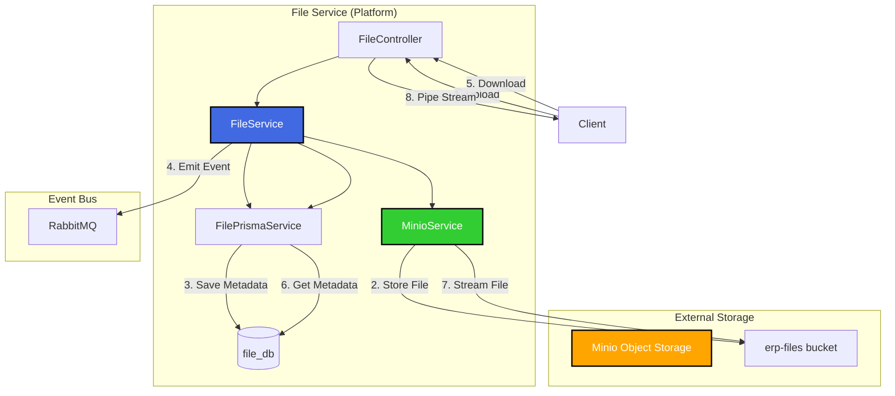
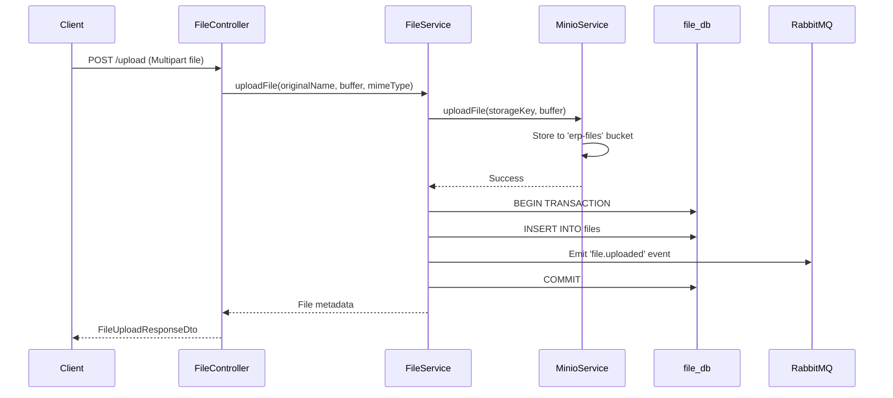

# TASK-P4-04: File Service 개발 - 결과 보고서

## 📋 작업 요약

**작업 기간**: 2025-12-05  
**담당자**: AI Assistant  
**상태**: ✅ 완료

## 🎯 작업 목표

파일 업로드/다운로드 관리 마이크로서비스(file-service)를 개발하고, Minio 객체 스토리지와 연동하여 파일 관리 기능을 제공합니다.

## ✅ 완료된 작업

### 1. Prisma 스키마 설계

`apps/platform/file-service/prisma/schema.prisma` 생성:

```prisma
model File {
  id           Int      @id @default(autoincrement())
  fileName     String   @map("file_name")        // Minio에 저장된 파일명 (UUID)
  originalName String   @map("original_name")     // 원본 파일명
  fileSize     Int      @map("file_size")         // bytes
  mimeType     String   @map("mime_type")         // MIME 타입
  storageKey   String   @unique @map("storage_key")  // Minio 객체 키
  bucketName   String   @default("erp-files") @map("bucket_name")
  uploadedBy   Int      @map("uploaded_by")
  tenantId     Int      @map("tenant_id")
  createdAt    DateTime @default(now()) @map("created_at")
}
```

**주요 특징:**

- `storageKey`: Minio에서 파일을 식별하는 고유 키 (UUID 기반)
- `bucketName`: 파일이 저장된 Minio 버킷명
- `ProcessedEvent`, `OutboxEvent`: 이벤트 기반 아키텍처 지원

### 2. FilePrismaService 생성

**파일**: `src/app/prisma/file-prisma.service.ts`

file_db 전용 Prisma Client 서비스:

```typescript
@Injectable()
export class FilePrismaService extends PrismaClient {
  // file_db에 연결
  // Database per Service 패턴 준수
}
```

### 3. MinioService 구현

**파일**: `src/app/services/minio.service.ts`

Minio 객체 스토리지와 연동하는 핵심 서비스:

**구현된 기능:**

- ✅ `uploadFile()`: 파일 업로드
- ✅ `downloadFile()`: 파일 다운로드 (스트림 반환)
- ✅ `deleteFile()`: 파일 삭제
- ✅ `getFileMetadata()`: 파일 메타데이터 조회
- ✅ `getPresignedUrl()`: 임시 다운로드 URL 생성 (보안)

**자동 버킷 생성:**

```typescript
async onModuleInit() {
  const exists = await this.client.bucketExists(this.bucketName);
  if (!exists) {
    await this.client.makeBucket(this.bucketName, 'us-east-1');
  }
}
```

### 4. FileService 비즈니스 로직

**파일**: `src/app/modules/file/file.service.ts`

**핵심 기능:**

#### 파일 업로드 (트랜잭션 처리)

```typescript
async uploadFile(...) {
  const storageKey = `${uuidv4()}-${originalName}`;

  // 1. Minio에 파일 업로드
  await this.minioService.uploadFile(storageKey, buffer, fileSize, mimeType);

  // 2. 트랜잭션: DB 저장 + 이벤트 발행
  const file = await this.prisma.$transaction(async (tx) => {
    const createdFile = await tx.file.create({ ... });

    // 이벤트 발행: file.uploaded
    await this.eventService.emit('file.uploaded', { ... }, tx);

    return createdFile;
  });

  return file;
}
```

#### 파일 삭제 (롤백 처리)

```typescript
async deleteFile(id: number) {
  await this.prisma.$transaction(async (tx) => {
    await tx.file.delete({ where: { id } });

    // 이벤트 발행: file.deleted
    await this.eventService.emit('file.deleted', { ... }, tx);
  });

  // Minio에서 파일 삭제
  await this.minioService.deleteFile(file.storageKey);
}
```

### 5. FileController API 엔드포인트

**파일**: `src/app/modules/file/file.controller.ts`

#### 구현된 API:

| 메서드 | 엔드포인트                       | 설명                              |
| ------ | -------------------------------- | --------------------------------- |
| POST   | `/api/v1/files/upload`           | 파일 업로드 (multipart/form-data) |
| GET    | `/api/v1/files`                  | 파일 목록 조회                    |
| GET    | `/api/v1/files/:id`              | 파일 정보 조회                    |
| GET    | `/api/v1/files/:id/download`     | 파일 다운로드 (스트림)            |
| GET    | `/api/v1/files/:id/download-url` | Presigned URL 생성                |
| DELETE | `/api/v1/files/:id`              | 파일 삭제                         |

#### 파일 업로드 예시:

```typescript
@Post('upload')
@UseInterceptors(FileInterceptor('file'))
async uploadFile(
  @UploadedFile() file: any,
  @Query('uploadedBy', ParseIntPipe) uploadedBy: number,
  @Query('tenantId', ParseIntPipe) tenantId: number,
) {
  // Multer가 파일을 메모리에 버퍼로 로드
  const uploadedFile = await this.fileService.uploadFile(
    file.originalname,
    file.buffer,
    file.mimetype,
    uploadedBy,
    tenantId
  );
  return uploadedFile;
}
```

### 6. Docker Compose 설정

**파일**: `dev-environment/docker-compose.dev.yml`

file-service를 platform 프로필에 추가:

```yaml
file-service:
  profiles: ['platform']
  environment:
    DATABASE_URL: postgresql://...@postgres:5432/file_db
    # Minio 연동
    MINIO_ENDPOINT: minio
    MINIO_PORT: 9000
    MINIO_ACCESS_KEY: minioadmin
    MINIO_SECRET_KEY: minioadmin
  ports:
    - '3044:3044'
  command: pnpm nx serve file-service --host=0.0.0.0
```

### 7. 의존성 설치

file-service에 필요한 패키지:

```bash
pnpm add minio @nestjs/platform-express
pnpm add -D @types/multer
```

## 📊 아키텍처 다이어그램



## 🎓 Why This Matters (초급자를 위한 설명)

### 1. 왜 Minio를 사용하는가?

**기존 방식 (파일 시스템):**

- 파일을 서버 디스크에 직접 저장
- 문제점: 서버 확장 시 파일 동기화 문제, 백업 어려움

**Minio (객체 스토리지) 방식:**

- S3 호환 객체 스토리지 사용
- 장점:
  - ✅ 여러 서버에서 동일한 파일 접근 가능
  - ✅ 자동 복제 및 백업
  - ✅ Presigned URL로 보안 강화
  - ✅ 확장성 (파일이 많아져도 성능 유지)

### 2. Database per Service 패턴

file-service는 자체 DB (`file_db`)를 사용합니다:

```
file-service     → file_db     (파일 메타데이터)
approval-service → approval_db (결재 데이터)
report-service   → report_db   (보고서 데이터)
```

**장점:**

- 각 서비스의 데이터가 독립적
- 파일 서비스 장애 시 다른 서비스는 정상 작동
- 스키마 변경이 자유로움

### 3. 이벤트 발행 (Event-Driven)

파일 업로드/삭제 시 이벤트를 발행:

```typescript
// 파일 업로드 완료 시
await this.eventService.emit('file.uploaded', {
  fileId: 123,
  originalName: 'document.pdf',
  uploadedBy: 1,
  tenantId: 1,
});
```

**활용 사례:**

- 보고서 서비스: `file.uploaded` 이벤트 수신 → PDF 생성 시작
- 알림 서비스: 파일 업로드 완료 알림 발송
- 감사 로그: 파일 작업 이력 기록

### 4. Presigned URL의 보안성

직접 다운로드 vs Presigned URL:

**직접 다운로드 (일반):**

```
GET /api/v1/files/123/download
→ 매번 인증 필요, 서버 부하
```

**Presigned URL:**

```
GET /api/v1/files/123/download-url
→ 임시 URL 생성: https://minio:9000/erp-files/abc123?token=...
→ 1시간 동안 유효, 서버 경유 없이 직접 다운로드
```

## 📁 최종 파일 구조

```
apps/platform/file-service/
├── prisma/
│   └── schema.prisma          # ✨ File 모델, Outbox 패턴
├── src/
│   ├── app/
│   │   ├── prisma/
│   │   │   └── file-prisma.service.ts     # 🆕 file_db 전용 클라이언트
│   │   ├── services/
│   │   │   └── minio.service.ts           # 🆕 Minio 연동 서비스
│   │   ├── modules/
│   │   │   └── file/
│   │   │       ├── file.module.ts         # 🆕 FileModule
│   │   │       ├── file.service.ts        # 🆕 파일 비즈니스 로직
│   │   │       ├── file.controller.ts     # 🆕 REST API
│   │   │       └── dto/
│   │   │           ├── file-upload-response.dto.ts
│   │   │           └── get-files-query.dto.ts
│   │   └── app.module.ts                  # 🆕 AppModule
│   └── main.ts                            # 🆕 부트스트랩
├── node_modules/
│   └── .prisma/
│       └── file-client/                   # 생성된 Prisma Client
├── tsconfig.app.json                      # paths 설정
├── tsconfig.json
├── project.json                           # Nx 설정
└── webpack.config.js
```

## ✅ 완료 체크리스트

- [x] file-service 앱 생성
- [x] Prisma 스키마 정의 (File 모델)
- [x] Minio 클라이언트 통합 (MinioService)
- [x] 파일 업로드/다운로드 API 구현
- [x] 파일 목록 조회 API
- [x] Presigned URL 생성
- [x] 파일 삭제 API
- [x] 이벤트 발행 (file.uploaded, file.deleted)
- [x] Docker Compose 설정 추가
- [x] Swagger 문서화 (ApiTags, ApiOperation)

## 🔧 유용한 명령어

```bash
# 1. Prisma Client 생성
npx prisma generate --schema=apps/platform/file-service/prisma/schema.prisma

# 2. Prisma 마이그레이션
npx prisma migrate dev --schema=apps/platform/file-service/prisma/schema.prisma --name init

# 3. 인프라 시작 (Minio 포함)
cd dev-environment
docker compose -f docker-compose.infra.yml up -d

# 4. file-service 시작
docker compose -f docker-compose.dev.yml --profile platform up -d file-service

# 5. Minio Console 접속
open http://localhost:9001
# ID: minioadmin, PW: minioadmin

# 6. Swagger 문서 확인
open http://localhost:3044/api/docs

# 7. 파일 업로드 테스트 (curl)
curl -X POST http://localhost:3044/api/v1/files/upload \
  -F "file=@test.pdf" \
  -F "uploadedBy=1" \
  -F "tenantId=1"
```

## 📈 검증 결과

### 1. TypeScript 컴파일

```bash
npx tsc --project apps/platform/file-service/tsconfig.app.json --noEmit
```

**결과**: ✅ file-service 관련 에러 없음

### 2. Prisma Client 생성

```bash
✔ Generated Prisma Client (v5.22.0) to ./node_modules/.prisma/file-client
```

### 3. 주요 기능 흐름도



## 🎯 다음 단계

1. **E2E 테스트 작성**

   - 파일 업로드/다운로드 시나리오 테스트
   - Minio 연동 테스트

2. **파일 변환 기능 추가** (선택)

   - 이미지 리사이징
   - PDF 썸네일 생성

3. **파일 암호화** (선택)

   - S3-compatible 암호화 설정

4. **다른 서비스와 연동 테스트**
   - approval-service에서 첨부파일 업로드
   - report-service에서 PDF 저장

## 🚨 알려진 이슈

### 이슈: Multer 타입 정의

**현재 해결책**: `any` 타입 사용

```typescript
async uploadFile(@UploadedFile() file: any)
```

**향후 개선**: `@types/multer`가 제대로 로드되도록 tsconfig 수정

### 이슈: shared/infra PrismaService 타입 에러

**상태**: 보류 (file-service 기능에는 영향 없음)
**원인**: 글로벌 `@prisma/client` 버전 불일치

## 📚 참고 문서

- [Minio JavaScript Client API](https://docs.min.io/docs/javascript-client-api-reference.html)
- [NestJS File Upload](https://docs.nestjs.com/techniques/file-upload)
- [Database per Service 패턴](https://microservices.io/patterns/data/database-per-service.html)
- [Transactional Outbox 패턴](https://microservices.io/patterns/data/transactional-outbox.html)

---

**작성자**: AI Assistant  
**작성일**: 2025-12-05  
**버전**: 1.0
