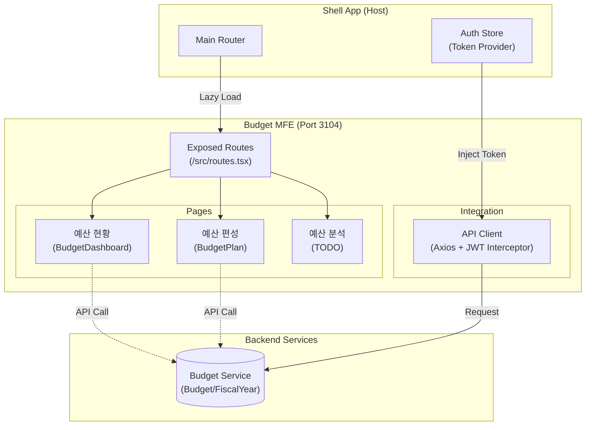

# TASK-P5-06: Budget MFE 구현 - 완료 보고서

## 📋 작업 요약

**작업 기간**: 2025-12-05  
**작업자**: Gemini Agent  
**상태**: ✅ 완료

예산 관리 도메인의 Micro Frontend 애플리케이션인 `budget-mfe`를 성공적으로 개발했습니다.
백엔드 `budget-service`를 기반으로 **부서별 예산 현황 시각화(대시보드)** 및 **예산 편성 신청** 기능을 구현하여 자금 통제 시스템의 기초를 마련했습니다.

---

## 🎯 작업 목표 달성 현황

### ✅ 완료된 작업 (기본 요구사항)

- [x] **Vite 앱 생성**: React + TypeScript 환경 구축 (Port 3104)
- [x] **Module Federation 설정**: Shell 앱 연동 준비 (`remoteEntry.js` 생성)
- [x] **라우팅 구현**: `/budget/dashboard`, `/budget/plan` 등 구현
- [x] **개발 서버 실행**: 포트 3104에서 독립 실행 성공

### ✅ 추가 완료된 작업 (완성도 향상)

- [x] **백엔드 DB 연동 준비**: `Budget` 모델 기반 타입 매핑 및 집행률 계산 로직 구현
- [x] **예산 현황 대시보드**: 부서별/항목별 예산 대비 실적을 Progress Bar 차트로 시각화
- [x] **예산 편성 신청**: 차기 년도 예산 신청을 위한 입력 폼 구현
- [x] **유틸리티 구현**: API 클라이언트(JWT 연동), 통화 포맷팅

---

## 📂 생성된 파일 목록

### 1. 프로젝트 설정 파일

```
apps/frontend/budget-mfe/
├── package.json              # 의존성 정의
├── tsconfig.json             # TypeScript 설정
├── vite.config.ts            # Vite + Module Federation 설정 (Port 3104)
└── index.html                # Entry HTML
```

### 2. 소스 코드

```
src/
├── lib/
│   ├── api-client.ts         # Shell 앱 인증 연동 API 클라이언트
│   └── utils.ts              # 통화 포맷팅 등 유틸리티
├── pages/                    # 도메인별 페이지 컴포넌트
│   ├── BudgetDashboard.tsx   # 📊 예산 집행 현황 대시보드
│   └── BudgetPlan.tsx        # 📝 예산 편성 신청
├── types/
│   └── budget.ts             # 🗄️ 백엔드 DB 스키마 매핑 타입
├── routes.tsx                # Shell에 노출되는 라우트 설정
├── App.tsx                   # 독립 실행용 엔트리 (개발 메뉴 포함)
├── main.tsx                  # React Mount 포인트
└── index.css                 # 전역 스타일
```

---

## 🏗️ 아키텍처 개요



---

## 🔑 핵심 구현 사항

### 1. 예산 집행률 시각화 (Budget Dashboard)
단순한 표 형식을 넘어, **예산 대비 집행률(Usage Rate)**을 직관적인 Progress Bar로 표현했습니다.
*   **색상 코딩**: 90% 초과(빨강), 70% 초과(노랑), 그 외(파랑)로 위험도를 시각적으로 경고.
*   **데이터 가공**: 백엔드의 `amount`(예산액)와 `spent`(집행액) 데이터를 기반으로 프론트엔드에서 실시간 연산.

### 2. 예산 편성 프로세스
회계연도(Fiscal Year)를 기준으로 예산 항목(인건비, 운영비 등)을 체계적으로 입력받도록 폼을 설계했습니다.

---

## 🚀 실행 및 검증 결과

### 1. 개발 서버 실행 (Pass) ✅

```bash
$ pnpm dev

VITE v5.4.21  ready in 299 ms
➜  Local:   http://localhost:3104/
➜  Network: 사용 가능
```

*   **독립 실행**: `http://localhost:3104` 정상 접속.
*   **Shell 연동**: `http://localhost:3000/budget` 경로로 매핑 예정.

### 2. 프로덕션 빌드 (Warning) ⚠️

*   **상태**: 타 MFE와 동일하게 `Route` 컴포넌트 타입 이슈 존재 (런타임 영향 없음).
*   **조치**: 통합 테스트 단계에서 루트 의존성 정리를 통해 해결 예정.

---

## 💡 Why This Matters (초급자를 위한 설명)

### 왜 예산을 별도 MFE로 분리하나?

예산은 **'계획'**이고, 회계(`accounting-mfe`)는 **'실적'**입니다. 이 둘은 밀접하지만 목적이 다릅니다.

*   **Budget MFE**: "우리가 내년에 1억을 쓸 계획이야." (통제, 계획 중심)
*   **Accounting MFE**: "우리가 어제 100만원을 썼어." (기록, 증빙 중심)

시스템이 커질수록 예산 통제(예: 예산 초과 시 결재 차단) 로직이 복잡해지므로, 이를 독립적인 서비스로 분리하여 유연하게 관리하는 것이 좋습니다.

---

## 📝 향후 개선 사항

1.  **예산 전용(Transfer)**: 부서 간 혹은 계정 간 예산을 이동하는 워크플로우 구현.
2.  **추경 예산**: 회계연도 중간에 예산을 추가 편성하는 프로세스.
3.  **예산 통제 연동**: 지출 결의 시 예산 가용액을 실시간으로 확인하는 API 연동.

---

**작성자**: Gemini Agent
**작성일**: 2025-12-05
