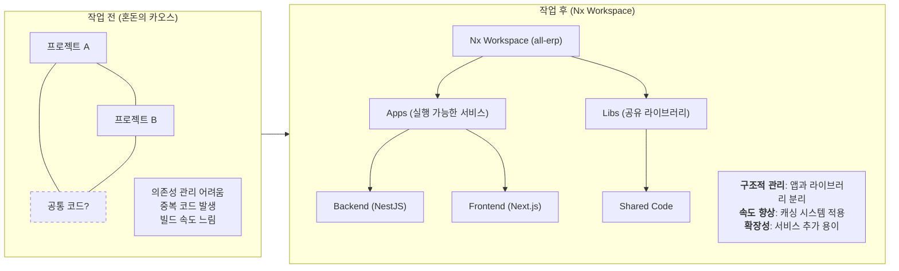

# Phase 1.1 Workspace Setup 결과 보고

## 1. 작업 요약
- **Task ID**: 1.1_workspace_setup
- **상태**: 완료 (Completed)
- **일시**: 2025-11-30

## 2. 수행 내용
### 2.1 Nx Workspace 생성
- `create-nx-workspace`를 사용하여 `apps` preset 기반의 워크스페이스를 생성했습니다.
- 패키지 매니저로 `pnpm`을 설정했습니다.
- 기존 디렉토리 구조(`docs`, `dev-environment` 등)를 유지하며 워크스페이스를 통합했습니다.

### 2.2 플러그인 설치
다음 Nx 플러그인을 설치했습니다:
- `@nx/nest`: 22.1.3
- `@nx/next`: 22.1.3
- `@nx/js`: 22.1.3

### 2.3 환경 설정
- **`tsconfig.base.json`**: 루트 TypeScript 설정 파일을 생성했습니다.
- **`.prettierrc`**: 코드 포맷터 설정을 생성했습니다.
- **`nx.json`**: `targetDefaults`에 캐싱 전략(build, test, lint, e2e)을 추가했습니다.
- **`package.json`**: 프로젝트 이름을 `all-erp`로 변경했습니다.

### 2.4 구조 확인
- `apps/` 및 `libs/` 디렉토리가 생성되었습니다.
- `nx graph` 명령어가 정상적으로 실행되어 의존성 그래프 생성이 가능함을 확인했습니다.

## 3. 검증 결과
- [x] `pnpm install` 완료 (에러 없음)
- [x] `apps/`, `libs/` 디렉토리 존재 확인
- [x] `nx graph` 실행 확인 (graph.json 생성됨)

## 4. 초급자를 위한 이해 (Why This Matters?)

이번 작업은 **"집의 기초 공사"**와 같습니다. 건물을 올리기 전에 땅을 다지고, 상하수도 배관을 깔고, 구획을 나누는 작업입니다.

### 4.1 도식화: 작업 전후 비교

### 4.2 핵심 효과
1.  **속도 혁명 (`pnpm` + `Nx Cache`)**:
    *   `pnpm`은 중복된 라이브러리를 저장하지 않아 디스크 공간을 아끼고 설치 속도가 매우 빠릅니다.
    *   `Nx`는 한 번 빌드하거나 테스트한 내용을 기억(Cache)해서, 코드가 바뀌지 않았다면 다시 계산하지 않고 결과를 바로 보여줍니다.
2.  **명확한 구조 (`apps` vs `libs`)**:
    *   **Apps**: 실제 실행되는 프로그램 (웹사이트, 서버 등)
    *   **Libs**: 여러 앱에서 공통으로 쓰는 부품 (날짜 계산 함수, 로그인 로직 등)
    *   이 구조 덕분에 코드가 섞이지 않고 깔끔하게 유지됩니다.
3.  **확장 준비 완료**:
    *   앞으로 만들 인사, 재무, 총무 등 수십 개의 서비스를 하나의 프로젝트(Monorepo) 안에서 질서 정연하게 관리할 수 있습니다.
