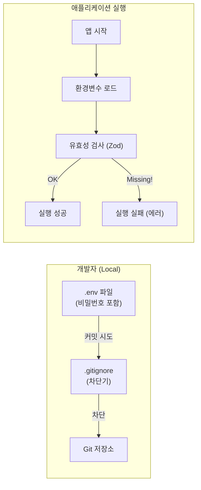
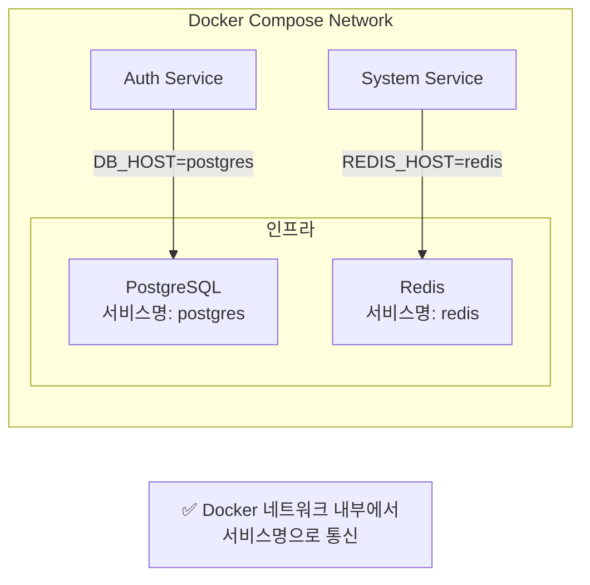

# Phase 1.2 Environment Strategy 결과 보고

## 1. 작업 요약
- **Task ID**: 1.2_env_strategy
- **상태**: 완료 (Completed)
- **일시**: 2025-11-30

## 2. 수행 내용
### 2.1 환경 변수 템플릿 생성
- 루트 디렉토리에 `.env.example`을 생성하여 필수 환경 변수 목록을 정의했습니다.
- DB, Redis, 서비스 포트, 인증 키 등 주요 설정값을 포함했습니다.

### 2.2 보안 설정 (.gitignore)
- `.env` 및 `.env.*` 파일이 Git에 커밋되지 않도록 `.gitignore`를 업데이트했습니다.
- 단, `.env.example`은 템플릿이므로 예외 처리했습니다.

### 2.3 공통 설정 라이브러리 생성
- `libs/shared/config` 라이브러리를 생성했습니다.
- `zod`를 사용하여 환경 변수 유효성 검사 로직(`validateConfig`)을 구현했습니다.
- 필수 변수 누락 시 명확한 에러 메시지를 출력하도록 설정했습니다.

## 3. 검증 결과
- [x] **Git Ignore**: `.env` 파일 생성 후 `git status`로 무시됨을 확인했습니다.
- [x] **유효성 검사 테스트**: `nx test config`를 실행하여 다음 케이스를 통과했습니다.
    - 모든 변수가 유효할 때 정상 반환
    - 필수 변수 누락 시 에러 발생
    - 기본값(Default Value) 적용 확인

## 4. 초급자를 위한 이해 (Why This Matters?)

이번 작업은 **"건물의 전기 배선도와 안전 차단기 설치"**와 같습니다.

### 4.1 도식화: 환경 변수 흐름



### 4.2 핵심 효과
1.  **보안 사고 예방 (`.gitignore`)**:
    *   실수로 DB 비밀번호나 API 키가 GitHub에 올라가는 대참사를 막아줍니다.
2.  **환경 일관성 (Docker 서비스명)**:
    *   `.env.example`이 Docker Compose 기반으로 설정되어 모든 환경에서 동일하게 작동합니다.
3.  **안전한 실행 (`Zod Validation`)**:
    *   앱이 켜질 때 필수 설정이 빠져있으면 명확한 에러 메시지를 출력하고 바로 종료됩니다.

## 5. 최종 구성

### 5.1 환경 변수 파일 구조
```
all-erp/
├── .env.example            # 기본 템플릿 (Docker 서비스명)
├── .env                    # 실제 사용 (Git 제외)
└── envs/
    └── development.env     # 개발 환경 템플릿
```

### 5.2 사용 방법
```bash
# 환경 변수 파일 생성
cp envs/development.env .env

# Docker Compose로 개발 환경 시작
cd dev-environment
docker compose -f docker-compose.infra.yml -f docker-compose.dev.yml up -d
```

### 5.3 네트워크 구성


## 6. 참고 문서
- [Docker Compose 워크플로우](file:///data/all-erp/docs/guides/docker-compose-workflow.md)
- [Phase 1 통합 결과](file:///data/all-erp/docs/tasks/phase1-init/PHASE1_COMPLETE.md)

