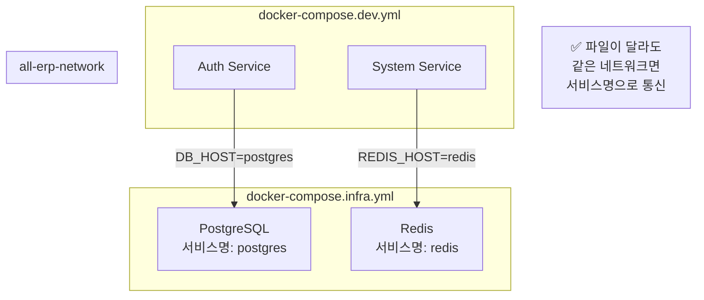
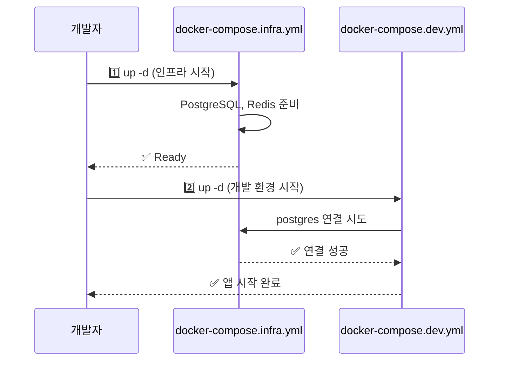

# Docker Compose 구조 개선 결과 보고

## 1. 작업 요약
- **Task ID**: docker_compose_restructuring
- **상태**: 완료 (Completed)
- **일시**: 2025-11-30

## 2. 수행 내용

### 2.1 문제 인식
기존 `docker-compose.yml`은 인프라, DevOps 도구를 profile로 관리했으나, 애플리케이션 서비스가 누락되어 있었습니다.

### 2.2 구조 개선

#### Before (기존)
```
docker-compose.yml  → 인프라 + DevOps (profile 방식)
docker-compose.dev.yml → 개발 (인프라 중복 정의)
```

**문제점**:
- 인프라가 여러 파일에 중복 정의
- 역할 구분이 불명확
- 파일 조합 방식이 복잡

#### After (개선)
```
docker-compose.infra.yml  → 인프라만 (PostgreSQL, Redis 등)
docker-compose.devops.yml → DevOps 도구만 (GitLab, Grafana 등)
docker-compose.dev.yml    → 개발 환경 (앱만, 볼륨 마운트)
docker-compose.prod.yml   → 운영 환경 (앱만, 빌드된 이미지)
```

**장점**:
- ✅ 역할이 명확하게 분리
- ✅ 중복 제거
- ✅ 조합 가능 (`-f` 옵션)
- ✅ 네트워크 공유로 통신 원활

### 2.3 생성/수정된 파일

#### [NEW] `docker-compose.infra.yml`
- PostgreSQL, Redis, RabbitMQ, etcd, MinIO, Milvus
- 모든 환경의 공통 기반
- 네트워크 `all-erp-network` 생성

#### [NEW] `docker-compose.devops.yml`
- GitLab, Prometheus, Grafana, ELK Stack, Jaeger
- 필요시에만 실행
- `all-erp-network` 외부 네트워크 사용

#### [MODIFY] `docker-compose.dev.yml`
- 인프라 제거 (중복 방지)
- 애플리케이션만 포함 (auth, system, tenant)
- 볼륨 마운트 + Hot Reload
- `external: true` 네트워크 설정

#### [MODIFY] `docker-compose.prod.yml`
- 인프라 제거
- 빌드된 이미지 사용
- Health Check 포함

#### [DEPRECATED] `docker-compose.yml`
- 사용 중지 안내 추가
- 삭제 예정

### 2.4 문서 업데이트

#### [MODIFY] `docs/guides/docker-compose-workflow.md`
- 새로운 파일 구조 설명
- 명령어 예제 업데이트
- 일상 워크플로우 개선

## 3. 사용 방법

### 3.1 개발 환경 시작
```bash
cd dev-environment

# 방법 1: 인프라 + 개발 환경 한번에
docker compose -f docker-compose.infra.yml -f docker-compose.dev.yml up -d

# 방법 2: 단계별 실행
docker compose -f docker-compose.infra.yml up -d     # 인프라 먼저
docker compose -f docker-compose.dev.yml up -d       # 개발 환경
```

### 3.2 DevOps 도구 추가
```bash
docker compose -f docker-compose.devops.yml up -d
```

### 3.3 운영 환경
```bash
docker compose -f docker-compose.infra.yml -f docker-compose.prod.yml up -d
```

## 4. 핵심 개념

### 4.1 파일 분리 + 통신 가능?
**✅ 네, 문제 없습니다!**

모든 파일이 동일한 `all-erp-network` 네트워크를 사용하므로, 어떤 파일에서 정의되었든 서비스명으로 통신 가능합니다.



### 4.2 인프라 실행 필수?
**✅ 네, 인프라가 먼저 실행되어야 합니다!**



**자동화 가능**:
```bash
# 한 번의 명령으로 순서 보장
docker compose -f docker-compose.infra.yml -f docker-compose.dev.yml up -d
# → Docker Compose가 의존성 순서 자동 관리
```

## 5. 검증 결과

### 5.1 파일 구조 검증
- [x] `docker-compose.infra.yml` 생성
- [x] `docker-compose.devops.yml` 생성
- [x] `docker-compose.dev.yml` 수정 (중복 제거)
- [x] `docker-compose.prod.yml` 수정
- [x] 네트워크 공유 설정 (`external: true`)

### 5.2 문서 업데이트
- [x] 워크플로우 가이드 갱신
- [x] 명령어 예제 수정
- [x] 기존 docker-compose.yml deprecated 처리

### 5.3 장점 확인
- [x] 역할별 분리로 관리 용이
- [x] 조합 가능 (`-f` 옵션)
- [x] 네트워크 공유로 통신 원활
- [x] 중복 제거

## 6. 참고 문서

- [Docker Compose 워크플로우 가이드](file:///data/all-erp/docs/guides/docker-compose-workflow.md)
- [GEMINI 개발 지침](file:///data/all-erp/.gemini/GEMINI.md)
