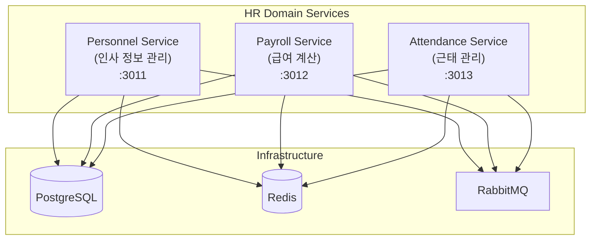

# HR Domain 서비스 스캐폴딩 결과 보고서

## 작업 요약

PRD 1.5_scaffolding_hr.md에 따라 HR Domain의 핵심 마이크로서비스 3개를 성공적으로 생성하고 Docker Compose 개발 환경에 통합했습니다.

## 수행 내용

### 1. NestJS 앱 생성

Nx CLI를 사용하여 3개의 마이크로서비스를 생성했습니다:

```bash
# Personnel Service (인사 정보 관리)
pnpm nx g @nx/nest:app --directory=apps/hr/personnel-service --name=personnel-service --no-interactive

# Payroll Service (급여 계산 및 관리)
pnpm nx g @nx/nest:app --directory=apps/hr/payroll-service --name=payroll-service --no-interactive

# Attendance Service (근태 관리)
pnpm nx g @nx/nest:app --directory=apps/hr/attendance-service --name=attendance-service --no-interactive
```

### 2. 각 서비스 기본 설정

System Domain 서비스와 동일한 패턴으로 각 서비스를 설정했습니다:

#### Personnel Service (포트 3011)
- **Swagger UI**: "Personnel Service - 인사 정보 관리 API"
- **Health Check**: `/api/health` 엔드포인트
- **ValidationPipe**: 요청 데이터 자동 검증
- **ConfigModule**: 환경 변수 로드

#### Payroll Service (포트 3012)
- **Swagger UI**: "Payroll Service - 급여 계산 및 관리 API"
- **Health Check**: `/api/health` 엔드포인트
- **ValidationPipe**: 요청 데이터 자동 검증
- **ConfigModule**: 환경 변수 로드

#### Attendance Service (포트 3013)
- **Swagger UI**: "Attendance Service - 근태 관리 API"
- **Health Check**: `/api/health` 엔드포인트
- **ValidationPipe**: 요청 데이터 자동 검증
- **ConfigModule**: 환경 변수 로드

### 3. Docker Compose 통합

[docker-compose.dev.yml](file:///data/all-erp/dev-environment/docker-compose.dev.yml)에 3개 서비스를 추가했습니다:

| 서비스 | 포트 | 디버깅 포트 | 컨테이너명 |
|--------|------|-------------|------------|
| personnel-service | 3011 | 9232 | all-erp-personnel-service-dev |
| payroll-service | 3012 | 9233 | all-erp-payroll-service-dev |
| attendance-service | 3013 | 9234 | all-erp-attendance-service-dev |

**주요 설정**:
- 볼륨 마운트를 통한 Hot Reload 지원
- PostgreSQL, Redis, RabbitMQ 연결 설정
- all-erp-network 네트워크 공유

## 검증 결과

### 1. Docker Compose 실행

```bash
cd dev-environment
docker compose -f docker-compose.infra.yml -f docker-compose.dev.yml up -d personnel-service payroll-service attendance-service
```

**결과**: ✅ 모든 컨테이너 정상 시작

### 2. Health Check 확인

```bash
# Personnel Service
curl http://localhost:3011/api/health
# 응답: {"status":"ok","service":"personnel-service"}

# Payroll Service
curl http://localhost:3012/api/health
# 응답: {"status":"ok","service":"payroll-service"}

# Attendance Service
curl http://localhost:3013/api/health
# 응답: {"status":"ok","service":"attendance-service"}
```

**결과**: ✅ 모든 서비스 Health Check 성공

### 3. Swagger UI 확인

다음 URL에서 Swagger UI에 접근할 수 있습니다:

- **Personnel Service**: http://localhost:3011/api
- **Payroll Service**: http://localhost:3012/api
- **Attendance Service**: http://localhost:3013/api

**결과**: ✅ 모든 서비스 Swagger UI 정상 표시

### 4. 서비스 로그 확인

```
[Nest] 905  - 12/01/2025, 2:15:22 PM     LOG [NestFactory] Starting Nest application...
[Nest] 905  - 12/01/2025, 2:15:22 PM     LOG [InstanceLoader] ConfigHostModule dependencies initialized +17ms
[Nest] 905  - 12/01/2025, 2:15:22 PM     LOG [InstanceLoader] AppModule dependencies initialized +0ms
[Nest] 905  - 12/01/2025, 2:15:22 PM     LOG [InstanceLoader] ConfigModule dependencies initialized +1ms
[Nest] 905  - 12/01/2025, 2:15:22 PM     LOG [RoutesResolver] AppController {/api}: +181ms
[Nest] 905  - 12/01/2025, 2:15:22 PM     LOG [RouterExplorer] Mapped {/api, GET} route +4ms
[Nest] 905  - 12/01/2025, 2:15:22 PM     LOG [RouterExplorer] Mapped {/api/health, GET} route +1ms
[Nest] 905  - 12/01/2025, 2:15:22 PM     LOG [NestApplication] Nest application successfully started +2ms
[Nest] 905  - 12/01/2025, 2:15:22 PM     LOG 🚀 Application is running on: http://localhost:3011/api
```

**결과**: ✅ 모든 라우트 정상 매핑, 애플리케이션 정상 시작

## 아키텍처 다이어그램



## 작업 효과 (Why This Matters)

### 1. 도메인 분리 (Domain Separation)
HR Domain을 독립된 마이크로서비스로 분리함으로써:
- **독립적인 배포**: 인사 관련 기능 변경 시 다른 도메인에 영향 없음
- **확장성**: 각 서비스를 독립적으로 스케일링 가능
- **장애 격리**: 한 서비스의 문제가 전체 시스템에 영향을 주지 않음

### 2. 비즈니스 로직 분산
- **Personnel Service**: 직원 정보, 조직도, 인사 발령 등
- **Payroll Service**: 급여 계산, 수당 관리, 세금 처리 등
- **Attendance Service**: 출퇴근 기록, 휴가 관리, 근무 시간 집계 등

각 서비스가 명확한 책임을 가지므로 코드 유지보수가 용이합니다.

### 3. Docker-First 개발 환경
모든 서비스가 Docker Compose로 실행되므로:
- **환경 일관성**: 개발자 간 환경 차이 최소화
- **빠른 온보딩**: 새로운 개발자가 `docker compose up` 한 번으로 전체 환경 구축
- **프로덕션 유사성**: 개발 환경이 운영 환경과 유사하여 배포 시 문제 최소화

## 다음 단계

1. **데이터베이스 스키마 설계**: Prisma를 사용하여 각 서비스의 DB 스키마 정의
2. **도메인 모델 구현**: 인사, 급여, 근태 관련 엔티티 및 비즈니스 로직 구현
3. **서비스 간 통신**: RabbitMQ를 통한 이벤트 기반 통신 구현
4. **인증/인가 통합**: Auth Service와 연동하여 JWT 기반 인증 적용

## 참고 문서

- [PRD 1.5_scaffolding_hr.md](file:///data/all-erp/docs/tasks/phase1-init/1.5_scaffolding_hr.md)
- [Docker-First Workflow Guide](file:///data/all-erp/docs/guides/docker-first-workflow.md)
- [docker-compose.dev.yml](file:///data/all-erp/dev-environment/docker-compose.dev.yml)

---

**작업 완료일**: 2025-12-01  
**작업자**: AI Agent (Gemini)  
**승인 기준**: ✅ 모든 항목 충족
