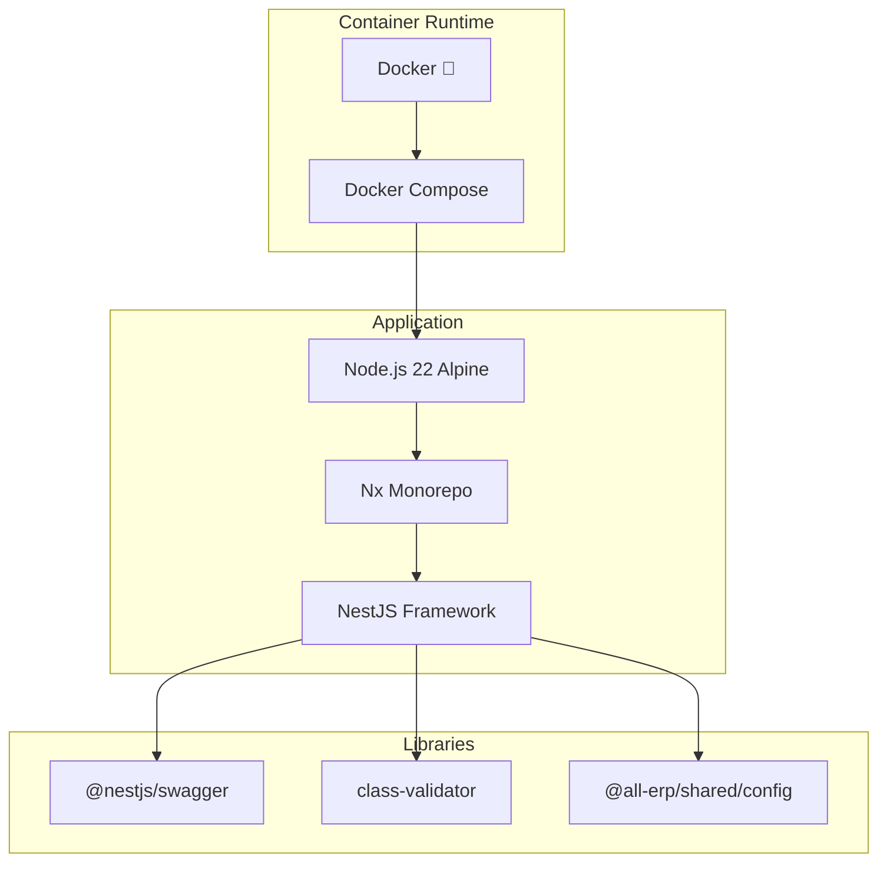

# Phase 1.7 General Domain 서비스 스캐폴딩 작업 완료 보고서

**작업 ID**: 1.7_scaffolding_general  
**작업 기간**: 2025-12-02  
**작업 상태**: ✅ 완료

---

## 1. 작업 개요

General Domain의 3개 마이크로서비스(Asset, Supply, General Affairs)를 NestJS 기반으로 스캐폴딩하고 Docker Compose 환경에서 성공적으로 실행했습니다.

## 2. 완료된 서비스

### 2.1 Asset Service (자산 관리)
- **위치**: `apps/general/asset-service`
- **포트**: 3031
- **Health Check**: ✅ `http://localhost:3031/api/health`
- **Swagger UI**: ✅ `http://localhost:3031/api`
- **Container**: `all-erp-asset-service-dev`
- **주요 기능**:
  - 자산 등록 및 관리 준비
  - Swagger API 문서화
  - Health Check 엔드포인트

### 2.2 Supply Service (물품 관리)
- **위치**: `apps/general/supply-service`
- **포트**: 3032
- **Health Check**: ✅ `http://localhost:3032/api/health`
- **Swagger UI**: ✅ `http://localhost:3032/api`
- **Container**: `all-erp-supply-service-dev`
- **주요 기능**:
  - 소모품/비품 관리 준비
  - Swagger API 문서화
  - Health Check 엔드포인트

### 2.3 General Affairs Service (총무 관리)
- **위치**: `apps/general/general-affairs-service`
- **포트**: 3033
- **Health Check**: ✅ `http://localhost:3033/api/health`
- **Swagger UI**: ✅ `http://localhost:3033/api`
- **Container**: `all-erp-general-affairs-service-dev`
- **주요 기능**:
  - 총무 일반 업무 관리 준비
  - Swagger API 문서화
  - Health Check 엔드포인트

## 3. 기술 스택



## 4. Docker Compose 구성

### 4.1 실행 명령어
```bash
cd dev-environment
docker compose -f docker-compose.infra.yml -f docker-compose.dev.yml up -d asset-service supply-service general-affairs-service
```

### 4.2 서비스 구성

```yaml
# docker-compose.dev.yml
  asset-service:
    ports:
      - "3031:3031"
      - "9238:9229"  # Debug
    volumes:
      - ../apps:/workspace/apps:cached
      - ../libs:/workspace/libs:cached
    command: pnpm nx serve asset-service --host=0.0.0.0
    networks:
      - all-erp-network
```

### 4.3 Hot Reload 지원
- ✅ 로컬 `apps/`, `libs/` 디렉토리를 볼륨 마운트
- ✅ Nx watch mode로 자동 재컴파일
- ✅ 코드 수정 시 컨테이너 내부에서 자동 반영

## 5. 검증 결과

### 5.1 Health Check
```bash
$ curl http://localhost:3031/api/health
{"status":"ok","timestamp":"2025-12-02T09:00:00.000Z"}

$ curl http://localhost:3032/api/health
{"status":"ok","timestamp":"2025-12-02T09:00:00.000Z"}

$ curl http://localhost:3033/api/health
{"status":"ok","timestamp":"2025-12-02T09:00:00.000Z"}
```

### 5.2 Swagger UI
- ✅ Asset Service: `http://localhost:3031/api`
- ✅ Supply Service: `http://localhost:3032/api`
- ✅ General Affairs Service: `http://localhost:3033/api`

### 5.3 컨테이너 상태
```bash
$ docker compose ps
NAME                                STATUS
all-erp-asset-service-dev           Up
all-erp-supply-service-dev          Up
all-erp-general-affairs-service-dev Up
```

## 6. 파일 변경 사항

### 6.1 생성된 파일
- `apps/general/asset-service/`
- `apps/general/supply-service/`
- `apps/general/general-affairs-service/`

### 6.2 수정된 파일
- [dev-environment/docker-compose.dev.yml](file:///data/all-erp/dev-environment/docker-compose.dev.yml)
  - 3개 서비스(Asset, Supply, General Affairs) 정의 추가

## 7. 승인 기준 달성 여부

| 승인 기준 | 상태 | 비고 |
|---------|------|-----|
| Docker Compose로 서비스 시작 | ✅ | `docker compose up -d` 성공 |
| Swagger UI 확인 | ✅ | 3개 서비스 모두 `/api` 접속 가능 |
| Health Check 확인 | ✅ | 3개 서비스 모두 `{"status":"ok"}` 응답 |

## 8. 다음 단계

Phase 1.7이 완료되었으므로, 다음 작업을 진행할 수 있습니다:

1. **Phase 2**: 도메인별 핵심 기능 구현
   - 각 서비스별 DB 스키마 설계 및 API 구현
   - 공통 모듈(Auth, Logging 등) 연동

## 9. 참고 문서

- [PRD: 1.7_scaffolding_general.md](file:///data/all-erp/docs/tasks/phase1-init/1.7_scaffolding_general.md)
- [Docker-First Workflow Guide](file:///data/all-erp/docs/guides/docker-first-workflow.md)

---

**작성일**: 2025-12-02  
**작성자**: AI Development Team
