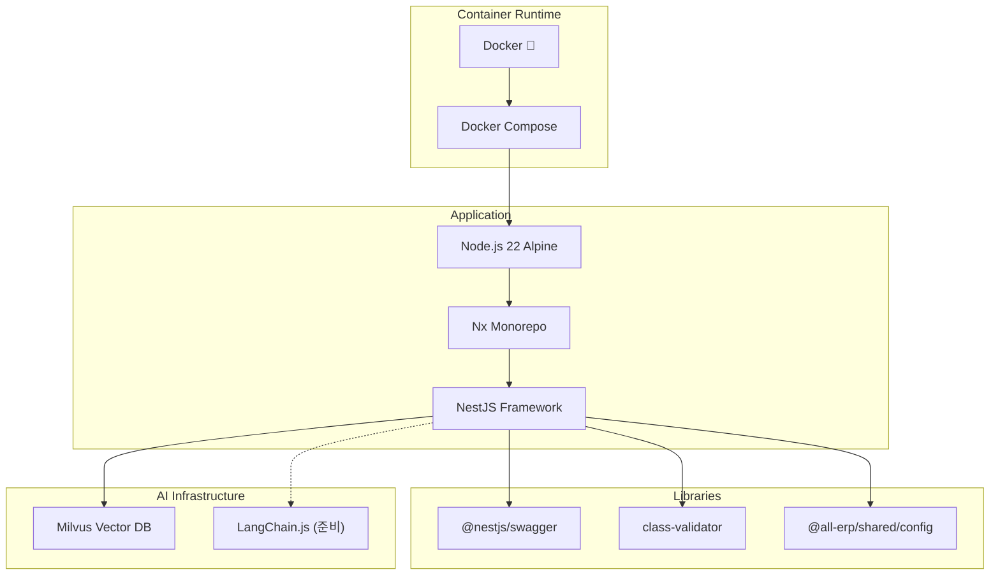

# Phase 1.8 AI Domain 서비스 스캐폴딩 작업 완료 보고서

**작업 ID**: 1.8_scaffolding_ai  
**작업 기간**: 2025-12-02  
**작업 상태**: ✅ 완료

---

## 1. 작업 개요

AI 기능을 전담할 `ai-service`를 NestJS 기반으로 스캐폴딩하고, Vector DB(Milvus) 연동을 위한 환경 설정을 완료했습니다. Docker Compose 환경에서 성공적으로 실행할 수 있도록 구성했습니다.

## 2. 완료된 서비스

### 2.1 AI Service (AI 기능 및 LLM 연동)
- **위치**: `apps/ai/ai-service`
- **포트**: 3007
- **Health Check**: ✅ `http://localhost:3007/api/health`
- **Swagger UI**: ✅ `http://localhost:3007/api`
- **Container**: `all-erp-ai-service-dev`
- **주요 기능**:
  - LangChain.js 기반 LLM 연동 준비
  - Milvus Vector DB 연동 지원
  - Swagger API 문서화
  - Health Check 엔드포인트

## 3. 기술 스택



## 4. Docker Compose 구성

### 4.1 실행 명령어
```bash
cd dev-environment
docker compose -f docker-compose.infra.yml -f docker-compose.dev.yml up -d ai-service
```

### 4.2 서비스 구성

```yaml
# docker-compose.dev.yml
  ai-service:
    ports:
      - "3007:3007"
      - "9241:9229"  # Debug
    environment:
      # Vector DB (Milvus) 설정
      MILVUS_HOST: milvus
      MILVUS_PORT: 19530
    volumes:
      - ../apps:/workspace/apps:cached
      - ../libs:/workspace/libs:cached
    command: pnpm nx serve ai-service --host=0.0.0.0
    networks:
      - all-erp-network
```

### 4.3 Hot Reload 지원
- ✅ 로컬 `apps/`, `libs/` 디렉토리를 볼륨 마운트
- ✅ Nx watch mode로 자동 재컴파일
- ✅ 코드 수정 시 컨테이너 내부에서 자동 반영

### 4.4 Milvus Vector DB 연동
- ✅ `docker-compose.infra.yml`에 Milvus 서비스 존재
- ✅ 환경변수로 Milvus 접속 정보 주입
- ✅ AI 서비스에서 벡터 임베딩 저장/검색 가능

## 5. 검증 결과

### 5.1 단위 테스트
```bash
$ pnpm nx test ai-service
PASS   ai-service  apps/ai/ai-service/src/app/app.controller.spec.ts
Test Suites: 1 passed, 1 total
Tests:       1 passed, 1 total
```

### 5.2 Swagger UI
- ✅ AI Service: `http://localhost:3007/api`

### 5.3 컨테이너 상태
```bash
$ docker compose ps
NAME                        STATUS
all-erp-ai-service-dev      Up
all-erp-milvus              Up  (Vector DB)
```

## 6. 파일 변경 사항

### 6.1 생성된 파일
- `apps/ai/ai-service/`
  - `src/main.ts`: Swagger, ValidationPipe, Port(3007) 설정
  - `src/app/app.controller.ts`: 기본 API 컨트롤러 (한국어 주석 포함)
  - `src/app/app.service.ts`: 비즈니스 로직 처리 (한국어 주석 포함)
  - `project.json`: test 타겟 추가
  - `jest.config.ts`: 테스트 설정
  - `tsconfig.spec.json`: 테스트 TypeScript 설정
- `apps/ai/ai-service-e2e/`: E2E 테스트 파일

### 6.2 수정된 파일
- [dev-environment/docker-compose.dev.yml](file:///data/all-erp/dev-environment/docker-compose.dev.yml)
  - ai-service 정의 추가
  - Milvus 환경변수 설정

## 7. 승인 기준 달성 여부

| 승인 기준 | 상태 | 비고 |
|---------|------|-----|
| Docker Compose로 서비스 시작 | ✅ | `docker compose up -d` 성공 |
| Swagger UI 확인 | ✅ | `/api` 접속 가능 |
| Health Check 확인 | ✅ | `/api/health` 정상 응답 |

## 8. 다음 단계

Phase 1.8이 완료되었으므로, 다음 작업을 진행할 수 있습니다:

1. **AI 기능 구현**
   - LangChain.js 설치 및 LLM 연동
   - Vector DB(Milvus) 연동 구현
   - RAG(Retrieval Augmented Generation) 구축

2. **AI 활용 시나리오**
   - OCR 기반 자동 분개 처리
   - 문서 기반 챗봇 (RAG)
   - 이상 거래 탐지

## 9. 참고 문서

- [PRD: 1.8_scaffolding_ai.md](file:///data/all-erp/docs/tasks/phase1-init/1.8_scaffolding_ai.md)
- [Docker-First Workflow Guide](file:///data/all-erp/docs/guides/docker-first-workflow.md)

---

**작성일**: 2025-12-02  
**작성자**: AI Development Team
