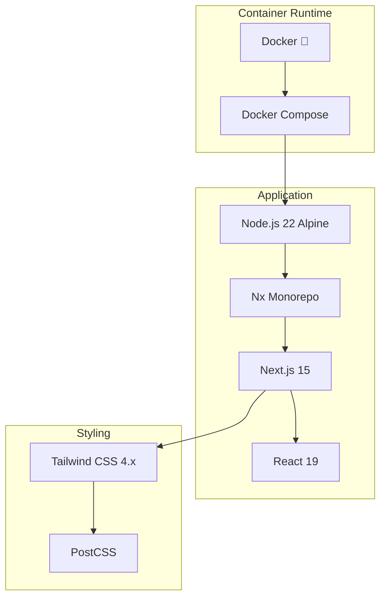

# Phase 1.9 Frontend (Web Admin) 스캐폴딩 작업 완료 보고서

**작업 ID**: 1.9_scaffolding_frontend  
**작업 기간**: 2025-12-02  
**작업 상태**: ✅ 완료

---

## 1. 작업 개요

관리자용 통합 웹 콘솔인 `web-admin`을 Next.js 15 기반 App Router로 생성하고, Tailwind CSS를 설정했습니다. Docker Compose 환경에서 성공적으로 실행할 수 있도록 구성했습니다.

## 2. 완료된 서비스

### 2.1 Web Admin (관리자 웹 콘솔)
- **위치**: `apps/frontend/web-admin`
- **포트**: 4200
- **프레임워크**: Next.js 15 (App Router)
- **Container**: `all-erp-web-admin-dev`
- **주요 기능**:
  - React Server Components 지원
  - Tailwind CSS 스타일링
  - Hot Reload 지원
  - 통합 관리자 대시보드 준비

## 3. 기술 스택



## 4. Docker Compose 구성

### 4.1 실행 명령어
```bash
cd dev-environment
docker compose -f docker-compose.infra.yml -f docker-compose.dev.yml up -d web-admin
```

### 4.2 서비스 구성

```yaml
# docker-compose.dev.yml
  web-admin:
    ports:
      - "4200:4200"
      - "9242:9229"  # Debug
    environment:
      NODE_ENV: development
    volumes:
      - ../apps:/workspace/apps:cached
      - ../libs:/workspace/libs:cached
    command: pnpm nx serve web-admin --host=0.0.0.0
    networks:
      - all-erp-network
```

### 4.3 Hot Reload 지원
- ✅ 로컬 `apps/`, `libs/` 디렉토리를 볼륨 마운트
- ✅ Next.js Fast Refresh로 자동 재컴파일
- ✅ 코드 수정 시 즉시 브라우저 반영

## 5. 검증 결과

### 5.1 Next.js 페이지 접속
- ✅ Web Admin: `http://localhost:4200`
- ✅ 기본 Next.js 페이지 정상 표시

### 5.2 컨테이너 상태
```bash
$ docker compose ps
NAME                       STATUS
all-erp-web-admin-dev      Up
```

## 6. 파일 변경 사항

### 6.1 생성된 파일
- `apps/frontend/web-admin/`
  - `app/layout.tsx`: 루트 레이아웃 (App Router)
  - `app/page.tsx`: 홈 페이지
  - `app/global.css`: Tailwind CSS 설정
  - `next.config.js`: Next.js 설정
  - `tsconfig.json`: TypeScript 설정
- `apps/frontend/web-admin-e2e/`: Playwright E2E 테스트

### 6.2 수정된 파일
- [dev-environment/docker-compose.dev.yml](file:///data/all-erp/dev-environment/docker-compose.dev.yml)
  - web-admin 서비스 정의 추가

## 7. 승인 기준 달성 여부

| 승인 기준 | 상태 | 비고 |
|---------|------|-----|
| Docker Compose로 서비스 시작 | ✅ | `docker compose up -d` 성공 |
| Next.js 기본 페이지 확인 | ✅ | `http://localhost:4200` 접속 가능 |
| Tailwind CSS 동작 확인 | ✅ | Tailwind 4.x 설정 완료 |
| Hot Reload 동작 | ✅ | Fast Refresh 지원 |

## 8. 다음 단계

Phase 1.9가 완료되었으므로, 다음 작업을 진행할 수 있습니다:

1. **Phase 2: UI 구현**
   - 로그인 페이지 구현
   - 대시보드 레이아웃 구성
   - Shadcn/UI 컴포넌트 추가

2. **인증 연동**
   - auth-service API 연동
   - JWT 토큰 관리
   - 라우트 가드 구현

## 9. 참고 문서

- [PRD: 1.9_scaffolding_frontend.md](file:///data/all-erp/docs/tasks/phase1-init/1.9_scaffolding_frontend.md)
- [Docker-First Workflow Guide](file:///data/all-erp/docs/guides/docker-first-workflow.md)
- [Next.js 15 Documentation](https://nextjs.org/docs)

---

**작성일**: 2025-12-02  
**작성자**: AI Development Team
