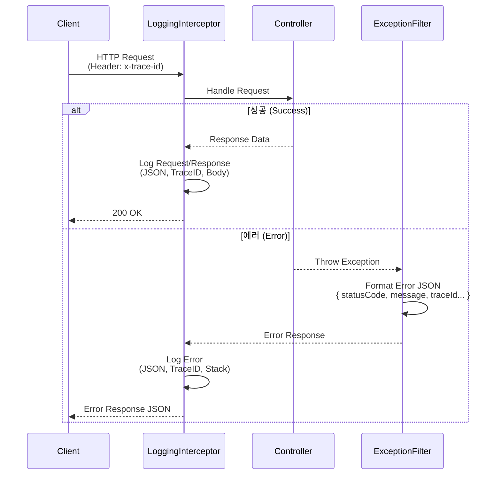

# Task 1.2: Shared Infrastructure 구현 결과

## 1. 개요 (Summary)
모든 마이크로서비스에 표준화된 로깅과 예외 처리 메커니즘을 적용하기 위해 `libs/shared/infra` 라이브러리를 개선했습니다. 이로써 운영 중 발생할 수 있는 문제를 추적하고 디버깅하는 효율성이 크게 향상되었습니다.

## 2. 작업 내용 (Implementation Details)

### 2.1 LoggingInterceptor 개선
- **위치**: `libs/shared/infra/src/lib/interceptors/logging.interceptor.ts`
- **변경 사항**:
    - **Body 로깅 추가**: 요청 본문(Body)을 로그에 포함하여 디버깅 정보 부족 문제 해결.
    - **Trace ID 지원**: 헤더(`x-trace-id`)에서 Trace ID를 추출하여 로그에 포함. 요청의 전 과정을 추적 가능하게 함.
    - **JSON 포맷**: `Winston` 로거를 사용하여 JSON 구조로 로그를 남기도록 표준화.

### 2.2 GlobalExceptionFilter 표준화
- **위치**: `libs/shared/infra/src/lib/filters/http-exception.filter.ts`
- **변경 사항**:
    - **응답 포맷 통일**: 모든 에러 응답을 다음 JSON 포맷으로 통일함.
        ```json
        {
          "statusCode": 400,
          "message": "Bad Request",
          "timestamp": "2024-...",
          "path": "/api/...",
          "traceId": "abc-123"
        }
        ```
    - **Trace ID 통합**: 에러 응답에도 Trace ID를 포함하여 클라이언트가 이슈를 리포트할 때 식별자를 제공할 수 있도록 함.

### 2.3 Bootstrap 연동
- **위치**: `libs/shared/infra/src/lib/bootstrap/bootstrap.ts`
- **내용**: `bootstrapService`가 실행될 때 위에서 구현한 Interceptor와 Filter를 전역(Global)으로 등록하도록 확인 및 검증됨.

## 3. 아키텍처 다이어그램 (Architecture)

### 요청 처리 흐름 (Request Flow)



## 4. 검증 결과 (Verification)
- **Lint Check**: `nx lint infra` 통과 (관련 파일 문법 오류 없음).
- **구성 확인**: `bootstrapService`가 `LoggerService`를 주입받아 Interceptor와 Filter에 올바르게 전달함을 확인.

## 5. Why This Matters?
이 작업이 중요한 이유는 **"관측 가능성(Observability)"** 때문입니다.
- **Trace ID**가 없으면 수많은 로그 속에서 특정 요청의 로그만 발라내기 불가능합니다.
- **표준화된 에러 포맷**이 없으면 프론트엔드에서 에러 처리를 일관되게 할 수 없습니다.
- **Body 로깅**이 없으면 사용자가 "어떤 데이터"를 보냈을 때 에러가 났는지 알 수 없어 재현이 불가능합니다.

이제 개발자는 로그만 보고도 **"누가, 언제, 어떤 데이터를 보내서, 어떤 에러가 났는지"** 즉시 파악할 수 았습니다.
