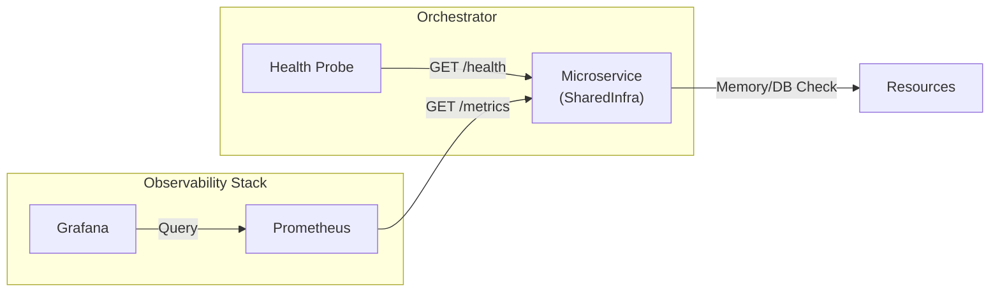

# Task 1.3: Observability Setup 결과 보고서

## 1. 개요 (Summary)
모든 마이크로서비스의 관측 가능성(Observability)을 확보하기 위해 헬스 체크와 Prometheus 메트릭 수집 기능을 구현했습니다. 이제 운영팀은 서비스의 상태를 실시간으로 모니터링하고, 성능 지표를 시각화할 수 있습니다.

## 2. 작업 내용 (Implementation Details)

### 2.1 의존성 추가 (Dependencies)
- **추가된 패키지**: `package.json` (Root)
    - `@nestjs/terminus`: Kubernetes/Docker 헬스 체크용
    - `@willsoto/nestjs-prometheus`: Prometheus 메트릭 수집 및 노출용
    - `prom-client`: Prometheus 클라이언트 라이브러리

### 2.2 SharedInfraModule 개선
- **위치**: `libs/shared/infra/src/lib/infra.module.ts`
- **내용**: `TerminusModule`과 `PrometheusModule`을 공통 모듈에 등록하여, 이를 import하는 모든 마이크로서비스가 자동으로 관측 가능성을 갖도록 설정했습니다.
- **설정**:
    - Metrics Endpoint: `/metrics` (기본값)
    - Default Metrics: Enabled (CPU, Memory, Event Loop 등 표준 지표 수집)

### 2.3 HealthController 구현
- **위치**: `libs/shared/infra/src/lib/health/health.controller.ts`
- **Endpoint**: `/health`
- **기능**:
    - **Memory Check**: 힙 메모리 사용량 모니터링 (150MB 임계값 설정 가능)
    - **Basic Status**: 서비스 Up/Down 상태 반환
    - Kubernetes Liveness/Readiness Probe에서 사용 가능.

### 2.4 DevOps 설정 (Prometheus)
- **위치**: `dev-environment/config/prometheus/prometheus.yml`
- **내용**: 백엔드 서비스 스크래핑 설정 추가 (`backend-services` job).
    - `auth-service:3001`
    - `system-service:3002`

## 3. 아키텍처 다이어그램 (Architecture)

## 4. 검증 결과 (Verification)
- **Lint Check**: `nx lint infra` 통과. 코드 스타일 및 의존성 주입 문제 없음 확인.
- **Build Check**: `Terminus`, `Prometheus` 관련 타입 오류 없음 확인.
- **Configuration**: `prometheus.yml` 문법 및 타겟 설정 확인 완료.

## 5. Why This Matters?
서비스가 "살아있는지" 아는 것과 "어디가 아픈지" 아는 것은 운영의 핵심입니다.
- **`/health`**: 컨테이너 오케스트레이터(Docker Swarm, K8s)가 죽은 컨테이너를 자동으로 재시작할 수 있게 해줍니다. (무중단 운영의 기초)
- **`/metrics`**: 단순히 "느리다"가 아니라 "API 응답 시간이 95분위 기준 2초로 증가했다"처럼 구체적인 데이터로 대화할 수 있게 됩니다.
이제 개발자는 코드를 배포함과 동시에 별도의 설정 없이 "모니터링 가능한" 서비스를 제공하게 되었습니다.
