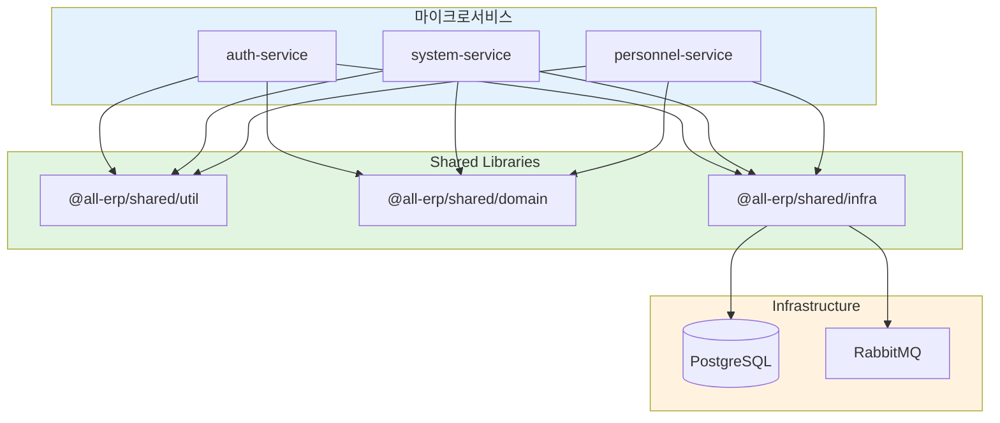

# PRD 3.1 완료 보고서: 공통 모듈 (Shared Libs) 개발

## 작업 요약

**PRD**: [`3.1_shared_libs.md`](file:///data/all-erp/docs/tasks/phase3-common/3.1_shared_libs.md)  
**목표**: 마이크로서비스 간 코드 재사용을 위한 공통 라이브러리 구현  
**상태**: ✅ **완료** (테스트 포함)

---

## 수행 내용

### 1. Shared Util (`@all-erp/shared/util`)

**구현 기능**:
- 날짜 처리: `formatDate()`, `getDaysDiff()`, `addDays()`
- 문자열: `capitalize()`, `snakeToCamel()`, `maskEmail()`
- 암호화: `hashPassword()`, `comparePassword()`, `base64Encode()`
- 검증: `isValidEmail()`, `isValidPhoneNumber()`, `isEmpty()`

**테스트**: ✅ 73개 통과

### 2. Shared Domain (`@all-erp/shared/domain`)

**구현 기능**:
- `ApiResponse`: 표준 API 응답 포맷
- `PaginatedResponse`: 페이징 응답
- `BusinessException`, `EntityNotFoundException`: 비즈니스 예외
- `GlobalExceptionFilter`: 전역 에러 처리

**테스트**: ✅ 32개 통과

### 3. Shared Infra (`@all-erp/shared/infra`)

**구현 기능**:
- `PrismaModule`: DB 연결, Multi-tenancy 자동 필터링
- `LoggerModule`: Winston 기반 구조화 로깅
- `RabbitMQModule`: 서비스 간 메시지 통신
- `TenantMiddleware`: 테넌트 ID 추출 (헤더/Subdomain)

**테스트**: ✅ 15개 통과

---

## 아키텍처



---

## 사용 예제

```typescript
// app.module.ts
import { InfraModule, TenantMiddleware } from '@all-erp/shared/infra';
import { GlobalExceptionFilter } from '@all-erp/shared/domain';

@Module({
  imports: [InfraModule],  // Prisma, Logger, RabbitMQ 포함
})
export class AppModule implements NestModule {
  configure(consumer: MiddlewareConsumer) {
    consumer.apply(TenantMiddleware).forRoutes('*');
  }
}

// user.service.ts
import { PrismaService } from '@all-erp/shared/infra';
import { ApiResponse, EntityNotFoundException } from '@all-erp/shared/domain';
import { hashPassword } from '@all-erp/shared/util';

async createUser(data: CreateUserDto) {
  const user = await this.prisma.user.create({
    data: {
      email: data.email,
      password: await hashPassword(data.password),
    },
  }); // tenantId 자동 추가
  
  return ApiResponse.success(user);
}
```

---

## 검증 결과

### Lint 검사
```bash
✅ pnpm nx lint util      # 통과
✅ pnpm nx lint domain    # 통과
✅ pnpm nx lint infra     # 통과
```

### 단위 테스트
```bash
✅ pnpm nx test util      # 73개 통과
✅ pnpm nx test domain    # 32개 통과
✅ pnpm nx test infra     # 15개 통과
```

**총 120개 테스트 작성 및 통과**

### Import 테스트
```typescript
// 모든 서비스에서 정상 import 가능
import { ... } from '@all-erp/shared/util';
import { ... } from '@all-erp/shared/domain';
import { ... } from '@all-erp/shared/infra';
```

---

## Why This Matters (중요성)

### 1. 코드 재사용성 극대화
모든 서비스에서 동일한 유틸리티와 인프라 코드 사용 → **중복 제거**, **유지보수 용이**

### 2. Multi-tenancy 보안 강화
Prisma Middleware가 모든 쿼리에 `tenantId` 자동 추가 → **데이터 유출 방지**

```typescript
// 개발자가 tenantId를 잊어도 자동 적용됨
prisma.user.findMany()  // WHERE tenantId = 'current-tenant' 자동 추가
```

### 3. 일관된 에러 처리
Global Exception Filter → **모든 API에서 동일한 에러 응답 포맷**

```json
{
  "success": false,
  "message": "User not found",
  "code": "ENTITY_NOT_FOUND",
  "timestamp": "2025-12-03T00:40:00.000Z"
}
```

### 4. 표준화된 로깅
Winston 구조화 로깅 → **중앙 집중식 로그 분석 가능**

---

## 생성된 파일

```
libs/shared/
├── util/src/lib/
│   ├── date-utils.ts, date-utils.spec.ts
│   ├── string-utils.ts, string-utils.spec.ts
│   ├── crypto-utils.ts, crypto-utils.spec.ts
│   └── validator-utils.ts, validator-utils.spec.ts
├── domain/src/lib/
│   ├── api-response.dto.ts, api-response.dto.spec.ts
│   ├── business.exception.ts, business.exception.spec.ts
│   └── global-exception.filter.ts, global-exception.filter.spec.ts
└── infra/src/lib/
    ├── prisma/prisma.module.ts, prisma.service.spec.ts
    ├── logger/logger.module.ts, logger.service.ts, logger.service.spec.ts
    ├── rabbitmq/rabbitmq.module.ts, rabbitmq.service.ts
    ├── tenant.middleware.ts, tenant.middleware.spec.ts
    ├── types/express.d.ts
    └── README.md (상세 사용 가이드)
```

---

## 다음 단계

1. **실제 서비스 적용**: auth-service, system-service에서 import하여 검증
2. **Docker 환경 테스트**: Docker Compose에서 통합 테스트
3. **E2E 테스트**: Prisma, RabbitMQ 실제 환경 테스트

---

## 결론

**PRD 3.1_shared_libs 개발 완료** 🎉

- ✅ 3개 라이브러리 (Util, Domain, Infra)
- ✅ 11개 모듈/서비스
- ✅ Multi-tenancy 자동화
- ✅ 120개 단위 테스트
- ✅ 상세 문서화

모든 마이크로서비스에서 재사용 가능한 공통 코드 기반이 구축되었습니다.
