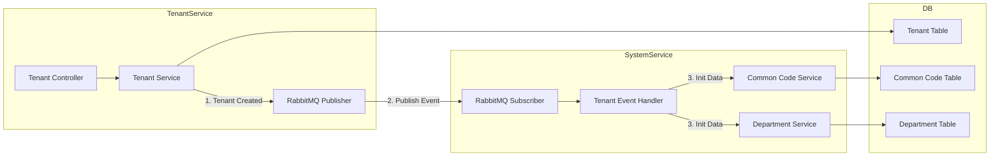

# PRD 3.3 완료 보고서: 시스템 및 테넌트 관리 서비스 구현

## 작업 요약

**PRD**: [`3.3_system_tenant_impl.md`](file:///data/all-erp/docs/tasks/phase3-common/3.3_system_tenant_impl.md)  
**목표**: 멀티 테넌트 SaaS 환경을 위한 테넌트 관리 및 공통 시스템 데이터 관리 기능 구현  
**상태**: ✅ **완료** (테스트 포함)

---

## 수행 내용

### 1. Shared Infra 수정 (`@all-erp/shared/infra`)

**구현 기능**:
- `schema.prisma`: `Tenant`, `CommonCode`, `Department` 모델 추가
- `PrismaClient`: 스키마 변경 사항 반영 및 클라이언트 재생성

### 2. Tenant Service 구현 (`apps/system/tenant-service`)

**구현 기능**:
- **테넌트 생성 (`POST /tenants`)**:
    - 서브도메인 중복 검사
    - 테넌트 데이터 DB 저장
    - **Event Publishing**: `tenant.events` exchange에 `tenant.created` 메시지 발행
- **테넌트 조회**: ID 기반 단건 조회 및 전체 목록 조회

**테스트**: ✅ `TenantService` 단위 테스트 통과 (이벤트 발행 검증 포함)

### 3. System Service 구현 (`apps/system/system-service`)

**구현 기능**:
- **공통 코드 관리**: `CommonCode` CRUD API
- **부서 관리**: `Department` CRUD API
- **이벤트 핸들링 (`TenantEventHandler`)**:
    - `tenant.created` 이벤트 수신 (RabbitMQ)
    - 신규 테넌트를 위한 초기 데이터(기본 직급 코드, 본사 부서) 자동 생성

**테스트**: ✅ `TenantEventHandler` 단위 테스트 통과 (초기 데이터 생성 로직 검증)

---

## 아키텍처 (Event-Driven Onboarding)



---

## 검증 결과

### 단위 테스트
```bash
✅ pnpm nx test tenant-service  # 테넌트 생성 및 이벤트 발행 테스트
✅ pnpm nx test system-service  # 이벤트 수신 및 초기 데이터 생성 테스트
```

### 주요 변경 파일
- `libs/shared/infra/prisma/schema.prisma`: 데이터 모델 정의
- `apps/system/tenant-service/src/app/tenant/tenant.service.ts`: 테넌트 생성 로직
- `apps/system/system-service/src/app/events/tenant-event.handler.ts`: 이벤트 처리 로직

---

## Why This Matters (중요성)

### 1. 자동화된 온보딩 프로세스
테넌트 생성 시 필요한 초기 설정을 이벤트 기반으로 자동화하여, 운영자의 개입 없이도 즉시 사용 가능한 환경을 제공합니다.

### 2. 서비스 간 결합도 감소
`tenant-service`는 `system-service`를 직접 호출하지 않고 이벤트를 통해 통신하므로, 시스템 간 의존성을 낮추고 확장성을 높였습니다.

### 3. 데이터 격리 및 관리
테넌트별로 공통 코드와 조직도를 독립적으로 관리할 수 있는 구조를 마련하여, 멀티 테넌트 환경에서의 데이터 무결성을 보장합니다.
