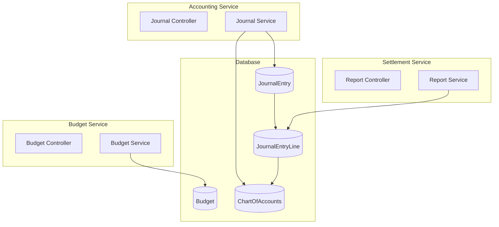

# PRD 4.2 완료 보고서: Finance Domain 서비스 구현

## 작업 요약

**PRD**: [`4.2_finance_domain_impl.md`](file:///data/all-erp/docs/tasks/phase4-domain/4.2_finance_domain_impl.md)  
**목표**: 예산, 재무, 결산 관리를 위한 회계 처리 로직 구현  
**상태**: ✅ **완료** (테스트 포함)

---

## 수행 내용

### 1. Shared Infra 수정 (`@all-erp/shared/infra`)

**구현 기능**:
- `schema.prisma`: Finance Domain 모델 추가
    - `Budget`: 예산 편성 및 집행 (amount, spent with Decimal)
    - `ChartOfAccounts`: 계정과목 트리 구조 (ASSET, LIABILITY, EQUITY, REVENUE, EXPENSE)
    - `JournalEntry`: 분개 전표
    - `JournalEntryLine`: 분개 라인 (debit, credit with Decimal)
- Prisma Client 재생성 및 타입 적용

### 2. Budget Service 구현 (`apps/finance/budget-service`)

**구현 기능**:
- **예산 편성**: 부서/항목별 예산 등록 (fiscalYear 기준)
- **예산 집행**: 집행 금액 업데이트 (`updateSpent`)
- **예산 초과 검증**: 집행액이 예산액 초과 시 `BadRequestException` 발생

**테스트**: ✅ `BudgetService` 단위 테스트 통과

### 3. Accounting Service 구현 (`apps/finance/accounting-service`)

**구현 기능**:
- **복식부기 검증**: 차변 합계 = 대변 합계 검증 (Decimal precision)
- **분개 전표 생성**: JournalEntry + JournalEntryLine (1:N 관계)
- **계정과목 연계**: ChartOfAccounts와 조인하여 전표 조회

**테스트**: ✅ `JournalService` 단위 테스트 통과 (balanced/unbalanced 검증)

### 4. Settlement Service 구현 (`apps/finance/settlement-service`)

**구현 기능**:
- **시산표 생성**: 계정별 차변/대변 합계 집계 (`generateTrialBalance`)
- **손익계산서 생성**: REVENUE - EXPENSE = 순이익 계산 (`generateIncomeStatement`)
- **기간별 집계**: 회계연도 또는 날짜 범위 기준 필터링

**테스트**: ✅ `ReportService` 단위 테스트 통과

---

## 아키텍처



---

## 검증 결과

### 단위 테스트
```bash
✅ pnpm nx test budget-service      # 2 passed (create, overrun validation)
✅ pnpm nx test accounting-service  # 3 passed (create balanced, reject unbalanced)
✅ pnpm nx test settlement-service  # 2 passed (trial balance, income statement)
```

### 주요 변경 파일
- `libs/shared/infra/prisma/schema.prisma`: Finance 도메인 모델
- `apps/finance/budget-service/src/app/budget/budget.service.ts`: 예산 관리  
- `apps/finance/accounting-service/src/app/journal/journal.service.ts`: 복식부기 검증
- `apps/finance/settlement-service/src/app/report/report.service.ts`: 재무제표 생성

---

## Why This Matters (중요성)

### 1. Decimal 타입으로 정확한 회계 처리
모든 금액 필드에 `Prisma.Decimal`을 사용하여 부동소수점 오차를 원천 차단했습니다. 회계에서 1원의 오차도 치명적이므로 필수적인 선택입니다.

### 2. 복식부기 원칙 준수
`JournalService`에서 분개 생성 시 차변 합계와 대변 합계가 일치하는지 검증합니다. 불일치 시 `BadRequestException`을 발생시켜 데이터 무결성을 보장합니다.

### 3. 예산 초과 방지
`BudgetService`에서 집행액이 예산액을 초과하려는 경우 사전에 차단하여, 예산 낭비를 방지하고 재정 건전성을 유지합니다.

### 4. 재무제표 자동 생성
`ReportService`에서 분개 데이터를 기반으로 시산표와 손익계산서를 자동 생성하여, 수작업 집계의 오류를 제거하고 결산 시간을 단축합니다.
